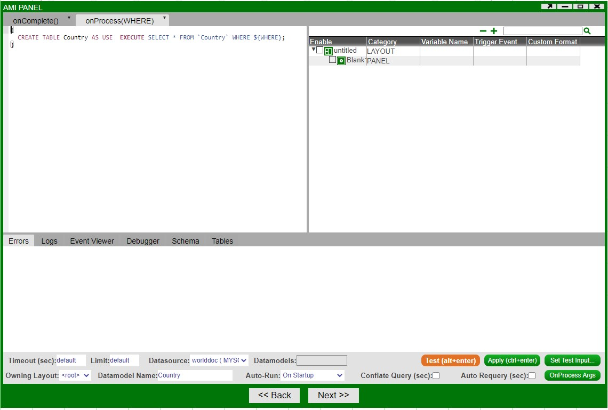
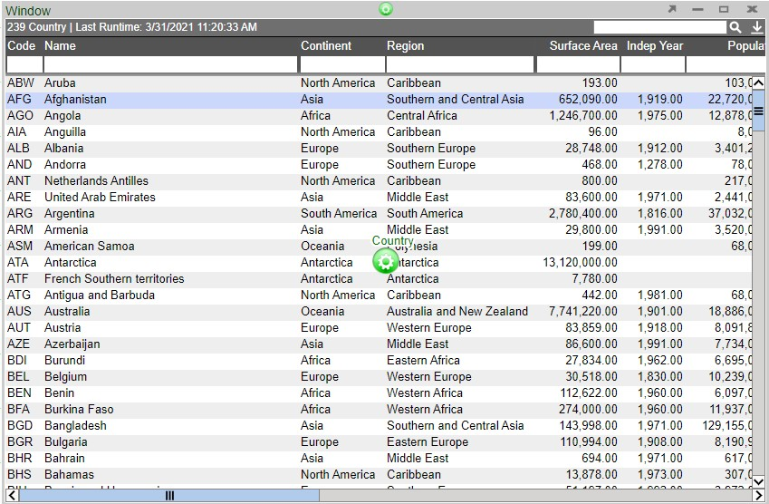

# Your First Layout

## The Dashboard

Log into AMI with the provided user name and password (default user/password is *demo/demo123*)

After logging into AMI, choose a layout style (Default Style is shown)

After selecting a style, you will move onto the new dashboard

On the dashboard you will see 3 key parts:

1. A **Layout Editor** toggle button in the upper right corner (hotkey CTRL+D).

	
	
	The toggle controls which mode the AMI dashboard builder is in. When the Layout Editor is turned on, you have access to tools and functionality for editing the dashboard. In particular you will have:
	
	-   The Windows menu will have an option to add New Windows and to Manage Windows
	-   There will be a new Dashboard menu item for accessing tools
	-   All existing panels will have a green button for accessing that panel's settings
	
	**Note**: *if you do not see the Layout Editor Button, your user account is not entitled for building layouts.*
	

1. A menu bar at the top

	
	
	-   File: manage saving and loading of dashboards
	-   Account: control your personal settings and preferences
	-   Windows: access, manage, and create windows
	-   Help: get AMI version, Runtime settings, and list of available script methods, etc.
	-   Dashboard (in Layout Editor mode): access tools and functionality for building out the dashboard

1. The workbook area below where you add layout components and get to see the dashboard as you build it

## Creating a Visualization

Creating a visualization can be summarized into 3 steps:

1. Create a window to put your visualization in

1. Connect to the data using the Data Modeler

1. Select how you want to visualize your data

Let's demonstrate this by creating a table. Before proceeding,

1. After logging into AMI, enter Layout Editor mode by toggling the Layout Editor mode to ON (found on the upper right corner).

	
	
	

1. The dashboard will now have a grid over the work area and a prompt telling you to click on the **Windows** menu will appear.

	

1. Select New Window from the drop down options in order to create a new window with a blank panel

	

	

1. Click on the green button in order to access the panel's options and select **Create Table/Visualization Form**

	

1. This will open up the visualization wizard. The first step of the wizard is the **Data Modeler**, which is the primary way of connecting to the data you want to visualize.

	

1. At the top of the Data Modeler, click on **Attach Datasource** in order to connect to a database containing your data. This will open up the **Add Datasource** window. In our example, we will be connecting to a MySQL database. Fill out the necessary fields and click on the **Add Datasource** button

	

1. A successful connection will show a similar prompt.

	

1. Next, you will see all of the tables that are accessible in the datasource. Select the table you would like to visualize. You can use the search function in datasources containing many tables.

	

1. You will then be taken to the editing portion of the Data Modeler. Here, you can 'massage' the data in preparation for use in the visualization. If you are ready, click on **Test**. If everything is working and there are no errors, click on **Next**.

	

1. In the final portion of the visualization wizard, you will select the kind of visualization you would like to create in the panel. In our example, we will create a table by selecting the **Table** icon and clicking on **Finish**.

	

1. In place of a blank panel, we now have our table

	

**In summary** - using the visualization wizard, we first created a **Datamodel** based on a table found in the datasource. We then edited the Datamodel in the Datamodel editor before finally using it to create a table. Many of the topics in this tutorial will be covered in greater detail throughout the GUI documentation.

## Relationships Between Visualizations

Continuing from the previous section, we will build a second visualization and establish a relationship between two panels (two visualizations).

1. Click on the panel configuration button of the created table and select **Add Panel** \> **Right** in order to create a empty panel to the right side of the table.

	
	
	
	
	**Note**: use the divider in order to adjust the size of the panels. You can also adjust the size of the window

1. Click on the new panel's configuration button and follow the steps of the previous section up to the final step of the visualization wizard. This time, we will select **2D Chart** in the wizard

	

1. Selecting 2D Chart opens up another set of options - select **Scatter Plot** and then click on **Create Chart** in order to open the chart wizard

	
	
	

1. Under **DATA SERIES**, click on the `+` icon of the X & Y fields in order to see the variables that can be used. After selecting the desired variables, click on **Refresh** in order to preview the chart.

	
	
	

	**Note**: **Scatter** is one of the ready-made chart options - with many of the fields pre-populated and only requiring X & Y values. **Advanced** contains all of the options that can be configured on a chart. Adding **Labels** can be done in the **Advanced** section.
	
	

1. Click Finish in order to return to the dashboard and to view the chart.

	

1. AMI allows you to easily correlate the two visualizations by creating a relationship between the two panels - a **source** and a **target**. In order to create a relationship, click on the configuration button of the **target** panel (**Country2**/chart) and select  **Add Relationship**.

	

1. An arrow will appear from the configuration button. Move to the source panel (**Country**/table) and click on the configuration button in order to establish the relationship.

	
	
	

1. Once established, a relationship menu will appear. Use this menu to select the variables that the relationship will use to correlate between the two visualizations. A variable that is available on both visualizations must be used in order to correctly maintain the relationship. In our example, we will use the Code variable found in both tables.

	
	
	

1. With a relationship between the two visualizations, selecting rows from the table will now display correlated points on the scatter plot.

	

**In summary** - we established a second panel in a single window and created a chart on this new panel. We then created a relationship between the table and the chart in order to show a correlation between the two visualizations.

!!! note

	If you are creating a relationship between two panels whose underlying data models' datasource is non-AMI, you have to manually add `${WHERE}` to the end of your where (or the equivalent in that database's syntax) statement. For example, running a relationship between two Oracle powered data model requires additional input in the format of `where ${WHERE}` or `where CONDITION1 and/or ${where}`, etc...
	
	Moreover, in the relationship field, you must adhere to the syntax of the non-AMI database for the use of quotes for string. For example, AMI database uses double quotes for string, but Oracle DB mandates single quotes.

