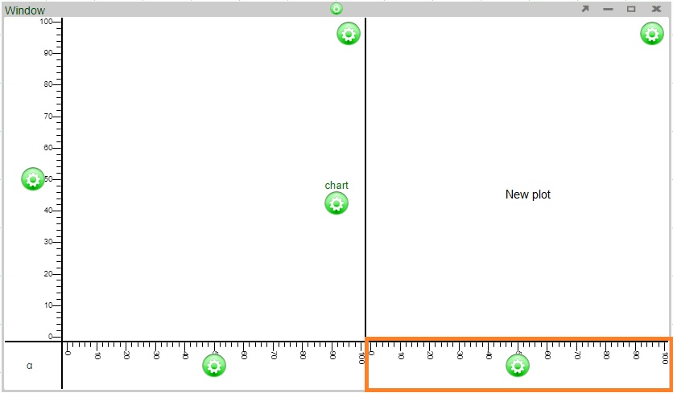
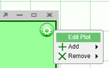

# Charts

## Intro to Charts

In AMI, charts are the graphical representation of data from one or more datamodels. Prior to creating charts, please refer to the **Data Modeler** section of the **GUI Tools** page in order to get a better understanding on the use of the data modeler and the creation of datamodels before creating charts. If you would like to get a quick overview on the process of creating charts, please review the **Creating a Relationship Between Visualizations** section of the **GUI Getting Started** page.

|     |                     |                                                                                                                                                                 |
|-----|---------------------|-----------------------------------------------------------------------------------------------------------------------------------------------------------------|
| 1   | **Datamodel(s)**    | The data that is to be represented in the chart. The data can be from a data source or an object stored within AMI Center. A chart can have multiple datamodels |
| 2   | **Plot**            | Area where the chart will be created                                                                                                                            |
| 3   | **Axis**            | A set of data                                                                                                                                                   |
| 4   | **Rendering layer** | A 'slice' of the chart associated with a specific data model                                                                                                    |
| 5   | **Series**          | Reference lines tied to a series                                                                                                                                |
| 6   | **Legend**          | A key to the series represented in the plot                                                                                                                     |
| 7   | **User Control**    | Controls the transparency of all of the series in the chart                                                                                                     |

*A basic chart*

## Chart Basics

### Plots

One or more plots can be added to a chart, forming a grid of plots. Each plot can contain any number of layers, stacked from front to back such that the front layer will obscure data from layers behind it, depending on the transparency of each layer. Once a chart has been created, additional plots can always be added to existing plots. There are two ways to add (or remove) plots.

1. Click on the chart configuration button (green button) and select one of the options under **Plot > Add** (the options are above, below, to the left, or to the right)

1. Click on the **plot** configuration button (located on the upper right corner of the plot) and select one of the options under **Add**

Axes will be added automatically to the new plots.

#### Examples

Adding a plot above will automatically add an axis to the left of the new plot (the two plots will share the same bottom axis)

Adding a plot to the right will automatically add an axis to the bottom of the new plot (the two plots will share the same left axis)

**Additional points**

-   The size of each plot can be modified by adjusting the lines dividing the plots.
-   When removing plots of 2x2 or larger, the options to remove plots will either be removing a row or plots or column of plots.

### Axes

Any number of horizontal axes can be added to the top or bottom of a column of plots and any number of vertical axes can be added to the left or right of a row of plots. There are two ways to add additional axes to a chart.

1. As seen in the addition of plots, use the plot configuration button menu and select one of the options under **Add** (add to the left, right, above, or below).

2. Add axes directly to existing axes using the axis configuration button.

Axes can be added above using the plot configuration button vs. adding an axis above an existing axis

- Adding an axis above using the plot configuration button will add an axis above the plot:

- Adding an axis above using the axis configuration button (blue circle) added an axis directly above it (orange highlight):

**Additional points**

-   When there are multiple plots used in a chart, new axes are added to the outside edges of the chart. For example, choosing to add an axis above on any of the plots in a column will add an axis to the very top of the chart. Choosing to add an axis to the right of any of the plots in a row will add an axis to the right edge of the chart.

#### Editing the Axis

In order to add or modify a **title** of an axis, click on the axis configuration button and select **Edit Highlighted Axis**. In the Edit Axis window, you will be able to add a title using the **Title** field.

In this same Edit Axis window, you may also modify the **format type** of the axis. By default, the **Auto** setting is used when charts are made. However, you may select another format from the drop down (e.g., Numeric). Selecting a different format will enable the editing of the other fields in the window.

### Layers

In order to render (display) the data model in the chart, a rendering layer must be added to the plot. Rendering layers (layers for short) allow the display of multiple charts on a single plot using the same or multiple data sets:

-   If the data sets are to use the same axes, use a **single** layer with **multiple** series
-   If the data sets are to use **different** axes, use **multiple** layers
-   If two or more data models are used, you **must** use **multiple** layers

#### Adding a new layer manually

When you use the visualization wizard to create a new chart on a blank panel, layers will be automatically added. However, if you are working on a blank chart or you would like to add more layers to an existing chart, use the **Edit Plot** option found in the plot configuration menu. This will bring up the **Edit Rendering Layer** window.

In the **Edit Rendering Layer** window, click on the **Add 2D** button to add a a new 2D chart layer.

-   The Layer tab is divided with the **Style Options** on the left and the **Chart Options** on the right.
-   In addition to the style options, the upper left contains the options to choose a datamodel for the layer and the ability to choose a horizontal/vertical axis (when working with multiple axes).
-   Clicking on the datamodel button will open up the data modeler. When adding layers manually, it is better to have the datamodels prepared in advance.
-   In the Chart Options side on the right, you have the different chart option tiles. These are the same tiles you will find in the visualization wizard when building charts. Switching between the tiles changes the relevant fields below (e.g., switching between the Scatter and Line tiles, you will notice that a **Line Size(px)** field is required.
-   Use the **Advanced** tile in order to have the most control over the chart you would like to create. This tile will make all of the 2D chart fields available.
-   After filling in the required fields, click Apply to create the layer

#### View Underlying/Prepared Data

The **View Underlying Data** and **View Prepared Data** buttons found under the chart tiles can be used to quickly view the data that is to be used. The view underlying data will show the raw data from the datamodel, whereas the view prepared data will show the data after the fields are taken into account.

For example, I will make the Marker Size depend on the formula of `(High \> 11 ? 3 : 1)`. In the prepared data window, you can see that the marker sizes are 1 whenever the value of High (the Y axis) is less than 11.

### Styles

#### Colors

In 2D/3D chart, after you have selected a visualization type, in the dropdown menu for Colors, you will encounter the following options:

No Color: self-explanatory.

Color: choose any color, by sampling or inputting the hex code in the color picker helper.

Formula: input a function that returns a color. ex: `Population \> 4000000? "#955e42":"#5603ad"`

Series: input a function that returns a number. AMI will index it through the default collection of color and determine the color. The default color collection can be changed under Dashboard -\> Style Manager -\> Root -\> Panel -\> Chart -\> Partition Colors, the list must contain valid hex codes and is comma delimited. ex: `SurfaceArea+100`

Gradient: input a variable that is numeric and AMI will vary the color intensity of the markers depending on the value with the default color spectrum. The color spectrum can be changed in Style Manager under Dashboard -\> Style Manager -\> Root -\> Panel -\> Chart -\> Gradient Colors. ex: `Population`

Custom Series: same as Series except user must input a comma delimited list of hex codes in the second field, and input a function that returns a number in the third field. User may hardcode the number and that would mean only one color will be picked. ex: Field 2:`#d78521, #ffa65c, #871303, #fff98a, #c40505, #80e8a6, #8e0073, #7df8ff, #068947, #c49fff` Field 3:`SurfaceArea`

Custom Gradient: user-define color spectrum, otherwise same as Gradient.
