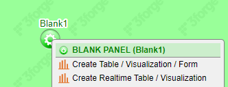

# Datamodel or Realtime?

When adding a new panel, we're prompted with the option of creating a realtime or non-realtime visualization. This guide will explain the difference between the two and what may be best for your case.

AMI has two engines for turning data into visualizations:

1.	**Datamodels**, datamodel visualizations take data from many sources, combine & manipulate them in any way possible, and are designed for total customizability

1.	**Realtime**, realtime visualizations take data from the Center and display them in a way that's optimized for realtime, large data with many users

For most visualizations datamodels are preferred due to their flexibility. Realtime visualizations should generally be used for large tables with realtime data and many users.

!!! note

	While realtime visualizations are optimized for realtime data, datamodels can also be used for realtime visualizations. See [Realtime Datamodels](../web/datamodels.md#realtime-datamodels) for more information on handling realtime data in a datamodel.

The table below presents a deep dive into the tradeoffs between the two:

| Topic | Datamodel | Realtime |
| --- | --- | --- |
| Flexibility | Datamodels can use arbitrary AMIScript to manipulate data in any way | Realtime visualizations can only use data from the Center subject to simple column-based manipulations (e.g. addition, ternary operators) but not more complex manipulations (e.g. joins) |
| Datasources | Datamodels can use data from any source | Realtime visualizations can only use data loaded in the Center |
| Scalability by no. users | Datamodels run on a per-user basis, meaning if there are 10 users logged in, then the datamodel must run 10 times and keep 10 copies of the data | Only one copy of a realtime table is kept in the Web, meaning it can scale to an arbitrary number of users |
| Scalability by data quantity | Datamodels keep a per-user copy of all of tables produced by the datamodel | One copy of a realtime table is kept in the Web |
| Run | Datamodels are run whenever they're explicitly told to run | Realtime tables run whenever a row in the underlying table is inserted, updated, or deleted |
| Queries VS Delta | Datamodels run on queries. Every time a datamodel is run, it must do all of the work described in the datamodel. This means if we pull 1,000,000 records, then re-run the datamodel and pull those same records plus 1 more, we will have done duplicate work on the 1,000,000 records | Realtime tables run on deltas, meaning an incremental change to the data will only require an incremental piece of work. If we have a realtime table with 1,000,000 records and add another, then we'll only need to do work on the 1 new record |