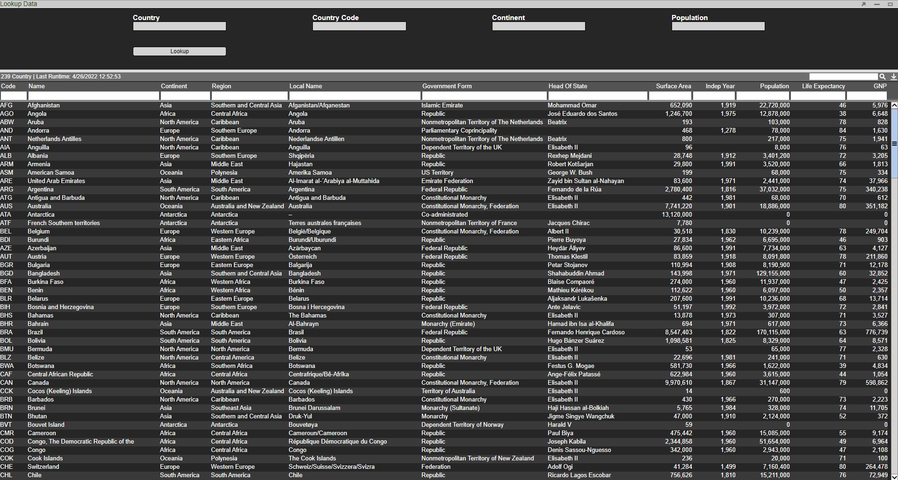

# HTML

## Overview

HTML panels have two main uses:

1. A simple form builder for creating complex forms & workflows that interact with other parts of the layout

1. A panel to use custom HTML within a layout

## Fields

### Autofill

In this example we will show how to use the **Country** field to populate the **Country Code**, **Continent** and **Population** field. We will use the Country table for this example.



First create a HTML Panel and add a 'Text' field attached to the Country Datamodel and choose **Name** (here the Name column contains Country names) as the display value:


Use the same method to add the other fields of interest (ie. **Country Code**, **Continent**, **Population**). Next we will add a button called 'Lookup' with the following script - when this button is clicked the remaining fields will populate based on the chosen **Country**.

``` amiscript
Table dbTable = layout.getDatamodel("Country").getData().get("Country");
string countryName = countryname.getValue();
Table dbTableInfo = dbTable.query("select Continent, Code, Population from this where Name==\"${countryName}\" limit 1");
string Continent = dbTableInfo.getRow(0).get("Continent");
string Code = dbTableInfo.getRow(0).get("Code");
string Population = dbTableInfo.getRow(0).get("Population");

if (strIs(Continent)) {
  continentname.setValue(Continent);
}
else {
  continentname.setValue("");
}

if (strIs(Code)) {
  countrycode.setValue(Code);
}
else {
  countrycode.setValue("");
}

if (strIs(Population)) {
  population.setValue(Population);
}
else {
  population.setValue("");
}
```

This scripts uses a function called **query** to get the values corresponding to the chosen **Country**. When searching for a **Country** we also get a dropdown list of the Countries:


Performing a lookup on Belgium, we can see the other fields are populated:


### Filtering Options

In this example we will use the Country table and create 3 select fields. The output of the first select field will be used in the WHERE clause to give the filtered selection of data which acts as the input of the second select field.


First we will create 3 select fields and call them **Continent**, **Region** and **Country Name**. Then create a blender on the Country datamodel called CountryFiltered and insert the following snippet:

``` amiscript
{
  CREATE TABLE Region AS SELECT Region FROM Country WHERE Continent==continent.getValue();
  CREATE TABLE CountryInRegion AS SELECT Name FROM Country WHERE Region==region.getValue() and Continent==continent.getValue();
}
```


Here the `#!amiscript continent.getValue()` and `#!amiscript region.getValue()` gets the value in the select field named **Continent** and **Region** respectively.

Next we will set up the three fields as shown below. We get the relevant data from the **CountryFiltered** datamodel.


Finally, in order for the select field options to update each time we select a different Continent or Region, we will need to reprocess the datamodel. Thus for the **Continent** and **Region** select field, add the following AMI Script:

``` amiscript
layout.getDatamodel("CountryFiltered").reprocess();
```

