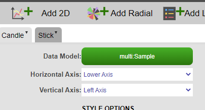
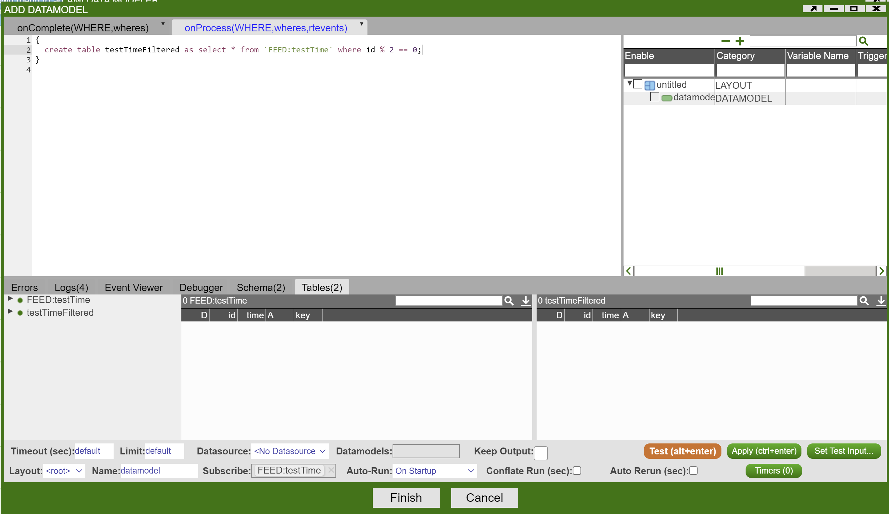

# Other Panels

## Heatmaps

Heat maps allow the user to visualize the data using different colors and sizes; enabling a quick interpretation of large amounts of data. Various colors can be assigned to a range of values. Heatmaps can be either datamodel driven or realtime.

AMI provides 4 options when defining a heatmap:

1. **Top Level Grouping**, determines how blocks will be grouped together e.g. in the example below we see the `NYSE` group of blocks

1. **Grouping**, determines how rows in the underlying data will be grouped within each block e.g. in the example below we see the `ORD-00000068` block

1. **Size**, determines the size of each block e.g. the size of each block is the sum of the Quantity column

1. **Color**, determines the color of each block e.g. the color of each block is the average of the Price column


Once we've set these values the following heatmap is created:


The color gradient can then be set in the panel's Style menu:


!!! note

	Press the spacebar to cancel zoom.

## Filters

Filter panels are simple, automatically built HTML panels that provide a dynamic filter for a datamodel. The can be configured to have different input types and to filter based on different columns.

## Maps

Maps allow for geographic data to be overlayed on a map. Note that maps require a Mapbox API token to be used.

## 3D Charts

This document explains the usage of each field in a 3D chart. The fields are categorized into 3 sections: formulas, axis, styles. The order of the explanation in this document is based on the diagram below.

.png "3DCharts_(11).png")  
Below is all styles:  
.png "3DCharts_(13).png")

.png "3DCharts_(12).png")

.png "3DCharts_(15).png")  

### Formulas

1\. View Underlying data

  
Shows the data where the visualization is going to be based on. Example view below.  

.png "3DCharts_(14).png")  
2. View Prepared data  
Shows the underlying data as well as properties of the marker. Properties include:

-   Marker Shape
-   Marker Color
-   Marker Width
-   Marker Height
-   Marker Depth
-   Axis (coordinates) X/Y/Z

Example view below.

.png "3DCharts_(17).png")

3\. Data model  
Shows the name of the datamodel of which the visualization is based on.

4\. Type  
Indicates whether the graph is a surface plot or a scatter plot.

#### Options

.png "3DCharts_(16).png")

5\. Where  
Filters the data based on user-defined, semicolon delimited conditions. The graph would only show points which satisfies the boolean argument (e.g. suppose x-axis is "Quantity". Inputting `Quantity > 0` would cause the graph to only show points where `Quantity > 0`).

6\. Group By  
Affects the grouping in "View Prepared Data".

7\. Order By  
Affects the ordering in "View Prepared Data".

### Axis

.png "3DCharts_(21).png")

X/Y/Z Axis: required. Indicates what the coordinate values come from. Each axis takes a column's name as input. Column data must be numeric.

.png "3DCharts_(19).png")

### Formulas

#### Labels

.png "3DCharts_(25).png")

8\. User Selectable  
9. Description  
Indicates what to annotate next to each data point on the chart.  

10\. Hover over  
Indicates what to show when hovering over a data point.

#### Markers

.png "3DCharts_(22).png")

11\. Shape  
Indicates the shape of each data point on the chart.  

12\. Color  
Determines the color of each data point.  

13\. Width/Height/Depth (px)  
Determines the size of the data points, in pixel, on the chart.

#### Marker Position Override

.png "3DCharts_(24).png")

14\. Top/Bottom/Left/Right/Front/Back  
Forces each marker stretch to the specific value, relative to the range of X/Y/Z. Ex: if one of your markers has position (1x,2y,3z) and your graph has minimum Y value of -5 and maximum y value of 5, and you set Top as 5, then that marker will now stretch to (1x,5y,3z). The previous marker position is not erased so a line is formed, spanning from 2y to 5y. Setting a value outside of the current range will cause the marker line to go outside of the chart. Setting a negative value for Top is equivalent to setting a positive value for Bottom, vice versa. The same rule applies to Left/Right, Front/Back.

#### Lines

.png "3DCharts_(26).png")

15\. Line Color  
Indicates the line color.  
16. Line Size (px)  
Indicates the line size, in pixel, connecting the data points.

### Styles

.png "3DCharts_(27).png") .png "3DCharts_(28).png") .png "3DCharts_(29).png") .png "3DCharts_(30).png")

1\. Inherit From  
Can be changed in Style Manager under Dashboard. This applies the selected styles from the Style Manager.

#### General

.png "3DCharts_(31).png")

2\. Background Color  
Applies to the background of the visualization.  

3\. Selection Color  
Affects the color you see when you select a data point on the chart.  

4\. Label Color  
Affects the color of the labels on the bottom of the visualization. In the screenshot below I have changed the color of the labels to red.

.png "3DCharts_(32).png")

5\. Control Buttons Color  
Affects the color of the buttons on the bottom left of the visualization as seen below.

.png "3DCharts_(33).png")

#### Scroll Bar Colors

.png "3DCharts_(1).png")

The colors here all refer to the scroll bars on the bottom of visualization, labeled "X", "Y", "Z", "Zoom", "FOV" and such.

.png "3DCharts_(2).png")

#### Scroll Bar Options

.png "3DCharts_(3).png")

The options here all refer to the `<em>`{=html}single`</em>`{=html} scroll bar at the bottom of the visualization.

.png "3DCharts_(4).png")

#### Visualization Title

.png "3DCharts_(5).png")

The options here control the title of the visualization. By default there is no title displayed on the chart. Below is an example usage

.png "3DCharts_(6).png") .png "3DCharts_(7).png")

#### Visualization Padding

.png "3DCharts_(8).png")

The options here control the padding of the visualization as a whole, the padding will cover the chart if set as a high value. Example usage below:

.png "3DCharts_(9).png") .png "3DCharts_(10).png")

#### Visualization Border

.png "3DCharts_(18).png")

The bigger the size, the less space there is for the visualization, the bigger the borders. Color controls the border color. Example usage below

.png "3DCharts_(20).png")
.png "3DCharts_(23).png")

### 3D Charts PDF


## Examples

### Candlestick Chart


A candlestick chart can be built using AMI through the following steps.

1. Create an empty 2D chart visualization on top of your datamodel, in this example, we are using the following Sample datamodel:

1. Using the advanced option, we will create the candle layer first with the following parameters:

	|     |                                     |                                                                               |
	|-----|-------------------------------------|-------------------------------------------------------------------------------|
	| 1   | **AXIS X**                          | date                                                                          |
	| 2   | **MARKERS Shape**                   | "square"                                                                      |
	| 3   | **MARKERS Color - Formula**         | (close \> open ) ? "#00FF00" : "#FF0000" *(Optional - to differentiate bars)* |
	| 4   | **MARKER POSITION OVERRIDE Top**    | open                                                                          |
	| 5   | **MARKER POSITION OVERRIDE Bottom** | close                                                                         |
	| 6   | **MARKER POSITION OVERRIDE Left**   | date - 35000000                                                               |
	| 7   | **MARKER POSITION OVERRIDE Right**  | date + 35000000                                                               |

	
	

1. Add a new layer on top of the chart (stick layer):

	

1. Using the advanced option as well, create the stick layer with the following parameters:

	|     |                                     |          |
	|-----|-------------------------------------|----------|
	| 1   | **AXIS X**                          | date     |
	| 2   | **MARKERS Shape**                   | "square" |
	| 3   | **MARKERS Color - Color**           | \#000000 |
	| 4   | **MARKERS - Width**                 | 1        |
	| 5   | **MARKERS - Height**                | 1        |
	| 6   | **MARKER POSITION OVERRIDE Top**    | high     |
	| 7   | **MARKER POSITION OVERRIDE Bottom** | low      |


### OHLC Chart


OHLC (open-high-low-close) chart consists of:

-   a vertical line that represents the intraday range for the period
-   a horizontal line extending to the left that represents the opening price for the period
-   a horizontal line extending to the right that represents the closing price for the period

It can be built using AMI through the following steps:

1. Create an empty 2D chart visualization on top of your datamodel, in this example, we are using the following Sample datamodel:

	

1. Using the advanced chart option, we will create the intraday range (vertical line) layer first with the following parameters:

	|     |                                     |                                                                      |
	|-----|-------------------------------------|----------------------------------------------------------------------|
	| 1   | **AXIS X**                          | date (or use the parseDate() formula if the date field is a string ) |
	| 2   | **MARKERS Shape**                   | "square"                                                             |
	| 3   | **MARKERS Color - Formula**         | (close \> open ) ?"#ff0000":"#32cd32"                                |
	| 4   | **MARKERS - Width**                 | 1                                                                    |
	| 5   | **MARKERS - Height**                | 1                                                                    |
	| 6   | **MARKER POSITION OVERRIDE Top**    | high                                                                 |
	| 7   | **MARKER POSITION OVERRIDE Bottom** | low                                                                  |

	

1. Click on 'Add 2D' and add a new layer on top of the chart. (Opening Price - Horizontal Left Line layer)

	

1. Using the advanced option as well, create the Opening Price layer with the following parameters:

	|     |                                     |                                                                      |
	|-----|-------------------------------------|----------------------------------------------------------------------|
	| 1   | **AXIS X**                          | date (or use the parseDate() formula if the date field is a string ) |
	| 2   | **MARKERS Shape**                   | "square"                                                             |
	| 3   | **MARKERS Color - Formula**         | (close \> open ) ?"#ff0000":"#32cd32"                                |
	| 4   | **MARKER POSITION OVERRIDE Top**    | open                                                                 |
	| 5   | **MARKER POSITION OVERRIDE Bottom** | open + 0.01                                                          |
	| 6   | **MARKER POSITION OVERRIDE Left**   | date - 35000000                                                      |
	| 7   | **MARKER POSITION OVERRIDE Right**  | date + 100000                                                        |

	

1. Click on 'Add 2D' and add the 3rd layer (Closing Price - Horizontal Right Line layer). Using the advanced option as well, create the Closing Price layer with the following parameters:

	|     |                                     |                                                                      |
	|-----|-------------------------------------|----------------------------------------------------------------------|
	| 1   | **AXIS X**                          | date (or use the parseDate() formula if the date field is a string ) |
	| 2   | **MARKERS Shape**                   | "square"                                                             |
	| 3   | **MARKERS Color - Formula**         | (close \> open ) ?"#ff0000":"#32cd32"                                |
	| 4   | **MARKER POSITION OVERRIDE Top**    | close                                                                |
	| 5   | **MARKER POSITION OVERRIDE Bottom** | close + 0.01                                                         |
	| 6   | **MARKER POSITION OVERRIDE Left**   | date - 100000                                                        |
	| 7   | **MARKER POSITION OVERRIDE Right**  | date + 35000000                                                      |
	
	

1. Click on 'Apply' and 'OK' and you have successfully created an OHLC chart.

### Realtime Chart

If we subscribe our datamodeller with its own feed, we would make it a realtime datamodeller which we can be used to create a realtime chart.  
  
1. Suppose we have a real time table(feed) called "testTime", right click on the feed -> Add Datamodel
	
  
1. Now that the datamodeller subscribes to its own feed, we could configure the datamodeller based on the realtime feed. In this example, we want to get every other id value  
	
  
1. Right click on the Datamodeller icon -\> Add Table/Visualization Form -\> Select a table in your chosen datamodeller  
	
  
1. Choose any chart type of your interest. Here we choose a bar chart.  
  
1. Edit the plot configuration -\> submit. We have a realtime bar chart ready to go.  
	
  
The above chart is redrawn on every update in the feed that the realtime datamodel is based on. Alternatively, if rerunning the datamodel on every update is very expensive, it is possible to have the datamodel conflate its runs. This will make it so that it runs only once in the specified time period. This can be controlled by the Conflate Run (sec) field in the Edit Datamodel window.

### Hollow Pie Chart

Assume we want to create a hollow pie chart out of our sample table **Sample(Symbol String, Quantity Int)**.  
1. Select our datamodel -\> 2D Chart -\> Pie Chart:  
1. Uncheck **Auto Min Value** and **Auto Max Value**  
	  
  
1. Go to Advanced -\> Marker Position Override -\> set your inner/outer radius  
	  
  
1. Final Hollow Pie Chart:  
	

### Moving Average Chart

In this example, we are using some sample stock data to demonstrate the moving average chart.

  

In the table SampleData we have 20 days of stock data and we are going to create a seven-day moving average out of \`Open\`.  

``` amiscript
 int movingAvgWin=7;

//forward Moving Average
  CREATE TABLE ForwardMovingAvgPrice as ANALYZE Date, Open,avg(win.Open) AS avg_price FROM SampleData WINDOW
  win ON win.linenum <= linenum + ${movingAvgWin}-1 && linenum <= win.linenum; 

//backward Moving Average
  CREATE TABLE BackwardMovingAvgPrice as ANALYZE Date, Open,avg(win.Open) AS avg_price FROM SampleData WINDOW
  win ON win.linenum <= linenum  && linenum - ${movingAvgWin}+1 <= win.linenum;
```


### Correlation Heatmap

1. Let's use the data below to create a simple correlation heatmap over the prices of different symbols over 5 days

	``` amiscript
	 create table MktData(Date Long, Symbol String, Price double);
	insert into MktData values(20230901,"AAPL",170.5),(20230901,"GOOG",204.2),(20230901,"TSLA",305.8),(20230901,"IBM",254.6),(20230901,"MSFT",350.2),
	                          (20230902,"AAPL",175.5),(20230902,"GOOG",214.2),(20230902,"TSLA",302.4),(20230902,"IBM",250.6),(20230902,"MSFT",347.6),
	                          (20230903,"AAPL",173.3),(20230903,"GOOG",184.2),(20230903,"TSLA",309.8),(20230903,"IBM",253.6),(20230903,"MSFT",352.2),
	                          (20230904,"AAPL",175.5),(20230904,"GOOG",194.2),(20230904,"TSLA",310.8),(20230904,"IBM",254.1),(20230904,"MSFT",345.2),
	                          (20230905,"AAPL",172.9),(20230905,"GOOG",202.2),(20230905,"TSLA",315.8),(20230905,"IBM",254.5),(20230905,"MSFT",359.2);
	```

	  
  
1. Transpose the table  

	``` amiscript
	list symbols = select Symbol from MktData group by Symbol;
	list dates = select Date from MktData group by Date;
	String columnNameSchema = "Date Long, " + strJoin(" double, ",symbols)+" double";
	
	create table priceBySymbol(${columnNameSchema});
	
	for(int i=0;i<dates.size();i++){
	  string insertval = "";
	  double date = dates.get(i);
	  insertval+="${date}";
	  for(int j=0;j<symbols.size();j++){
	    string sym = symbols.get(j);
	    double px = select Price from MktData where Date==date and Symbol == sym;
	    insertval+=","+"${px}";
	  }
	  insert into priceBySymbol values(${insertval});
	}
	```

	

1. Generate the heatmap schema and initialize  

	``` amiscript
	string MatrixSchema = "Symbol String, "+ strJoin(" double, ",symbols)+ " double";
	create table CorrelationHeatmap(${MatrixSchema});
	
	
	  //3.1. initialize the values
	for(string sym:symbols){
	  insert into CorrelationHeatmap values("${sym}",null,null,null,null,null);
	  //3.2 set the values on the diagonal to 1
	  update CorrelationHeatmap set ${sym}=1.00 where Symbol=="${sym}";
	}
	```

1. Get all pairs of Symbols  

	``` amiscript
	set allPairsOfSyms = new set();
	for(int i=0;i<symbols.size();i++){
	  for(int j=0;j<symbols.size();j++){
	    if(i!=j)
	      allPairsOfSyms.add(new set(symbols.get(i),symbols.get(j)));
	  }
	}
	```

1. Iterate over each pair of Symbols and calculate the correlation index  

	``` amiscript
	for(set pair: allPairsOfSyms){
	  list sortedPair = pair.sort();
	  string sym1 = sortedPair.get(0);
	  string sym2 = sortedPair.get(1);
	  double cov =select covar(${sym1},${sym2}) from priceBySymbol;
	  double stdevProduct = select stdev(${sym1})*stdev(${sym2}) from priceBySymbol;
	  double correlation_coeff=cov/stdevProduct;
	  update CorrelationHeatmap set ${sym1}=correlation_coeff where Symbol=="${sym2}";
	  update CorrelationHeatmap set ${sym2}=correlation_coeff where Symbol=="${sym1}";
	}
	```


