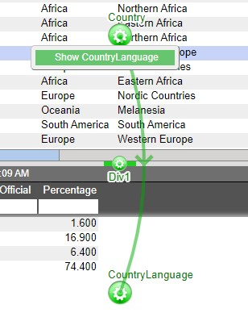

# Relationships

Relationships are used to establish links between the various panels in a layout. Establishing links between panels enables the drilling down of data from one table to another, the querying of static tables, and the rendering of displays in charts. When establishing a relationship, one panel will be considered the **source** panel and the other as the **target** panel.

Please refer to the **Creating a Relationship Between Visualizations** section of the **GUI Getting Started** for the steps in creating a relationship between two panels. This section will discuss the **Behavior** section of the relationship menu.

## Run Relationship

|                                                                    |                                                                                                   |
|--------------------------------------------------------------------|---------------------------------------------------------------------------------------------------|
| **In real-time when user highlights rows causing query to change** | Only runs the relationship if the rows selected will result in a change of the target table       |
| **In real-time when user highlights rows**                         | Will run the relationship whenever a new row is selected                                          |
| **Only when user selects from right-click menu**                   | Creates a right click menu in the source table. Use the right click menu to run the relationship. |
| **Only when user double clicks on the row**                        | Double click to run a relationship                                                                |
| **Only on amiscript**                                              | Will only run when a script telling the relationship to run is executed                           |

*Example of a right-click menu*

## Display Option

**Bring target panel to front**: when a relationship is run, the target panel will appear at the front of the dashboard. This will also work on minimized or hidden panels.

**Leave target as is**: the target panel will remain in place - minimized or hidden panels will stay minimized or hidden.

## When Nothing Selected

|                                  |                                                                                                                     |
|----------------------------------|---------------------------------------------------------------------------------------------------------------------|
| **Do Nothing**                   | Results from the latest query will remain in the target panel                                                       |
| **Clear**                        | The target panel will clear of all results                                                                          |
| **Show everything**              | The target panel will display all of the records that belong to the data set chosen for the target panel            |
| **Same as selecting everything** | The target panel will display all of the records that correspond to the records currently shown in the source panel |

