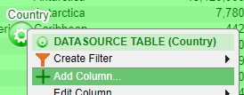
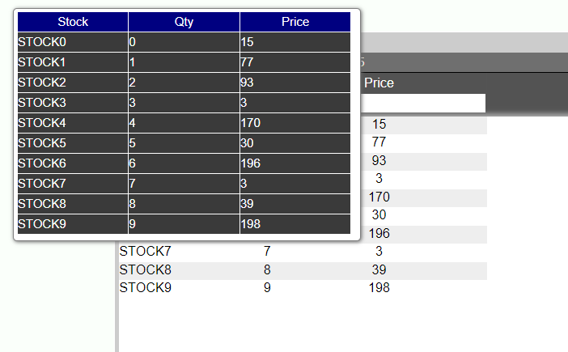
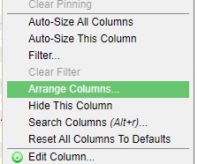

# Tables

### Tables

Real-time tables are useful when it is necessary to get a tabular view of the data that is being pushed to the AMI real-time database or to view the changes that are being made to the existing data. Tables can be modified in order to best present the data (discussed in the **Columns** section).

To create a real-time table, click on the green configuration button on a blank panel and select **Create Realtime Table/Visualization** from the menu. This will open up the real-time visualization wizard.


Expand the AMIDB Tables tree, select the table you would like to build the table and click next. In the last step of the wizard, modify the table if any changes are necessary. Click Finish to build the table.


### Aggregate Tables

Aggregate tables are real-time tables that can be used to obtain a summary of data grouped by certain variables. Aggregate tables will integrate changes to the data in real-time.

To create a real-time table, click on the green configuration button on a blank panel and select **Create Realtime Table/Visualization** from the menu. This will open up the real-time visualization wizard. In the wizard, select the **Aggregate Table** icon and the data you would like to aggregate. Click Next to view the aggregation options.


In the last step of the wizard, choose the variables to **Group By** (or hide) and the variables to perform aggregations on. The types of aggregations available are: **Count**, **Sum**, **Max**, **Min**, & **Average**. Click Finish to create the aggregate table.


The group by columns will be in **bold**.

#### Aggregate Table Settings - Grouping Columns for Aggregation

A unique setting found in aggregate tables is the option to choose how hidden grouping columns affect the aggregation.


When set to **Hidden and Visible**, the table will consider all grouping columns (including hidden columns). When set to **Only Visible**, hidden grouping columns will not affect the aggregation.

This is useful when you would like to temporarily change the aggregate view without deleting any grouping columns.


*The aggregate table when set to Only Visible and CIOrdID is hidden*

## Columns

### Adding, Editing, Copying, & Deleting Columns

#### Adding

(**Note**: these options are only available when in developer mode)

There are three ways to add columns in tables

1\. Click on the green button to bring up the **panel configuration menu** and select **Add Column**



2\. Click on a column to bring up the **column menu**. This method allows you to place the new column in between existing columns. In the menu, select whether to add the new column to the right or left of the selected column


3\. Click on an open area of the header in order to bring up the header menu. In the menu, select **Add Column**.


**Add Column menu**


| Option               | Description                                                                                 |
|----------------------|---------------------------------------------------------------------------------------------|
| **Display**          | Use variables, operators, functions, and icons to create the content for the column         |
| **Sorting**          | Use variables, operators, and functions to apply a sorting to the contents of the column    |
| **Format**           | Choose the format of the column (e.g.: text, numeric, time, date, price, etc.)              |
| **Tooltip**          | Create a tooltip for cells users hover over                                                 |
| **Title**            | Create a title for the new column. Must be unique from existing columns.                    |
| **Header Style**     | Apply different fonts, alignments, style, and colors to the column header                   |
| **Description**      | Add a description/help which can be seen when clicking on the column header                 |
| **Column Position**  | Drop down list of various positions where the new column can be placed (can also be hidden) |
| **Style**            | Apply a style to the contents of the column (including font and alignment)                  |
| **Foreground Color** | Apply a color to the contents of the column                                                 |
| **Background Color** | Apply a background color to the column                                                      |
| **Clickable**        | Makes the contents of the column clickable                                                  |

##### Examples

**Adjusting header and column styles**


**Column Description**


**Tooltip**


You can also render HTML in the tooltip. Below shows a table that can be rendered through html in the tooltip. Make sure that you place your HTML in quotes in the tool tip field. You can place more complicated logic in custom methods to render tables in html such as below in the tooltip.



#### Editing

There are two ways to edit columns

1\. Click on the header of the column to bring up the column menu and select **Edit Column**


2\. Click on the green button to bring up the panel configuration menu. Highlight **Edit Column** to bring up the list of columns and select the column

Both options will open the Edit Column window, which is the same as the Add Column window.

##### Example

**Conditional Formatting**

Formatting can be used to highlight data in specific formats when certain parameters are met. In this example, the Price is set to be in bold red and highlighted if it is greater than \$50.


**The onEdit Callback**

This callback is triggered whenever a value in the table is edited and then saved. This does not trigger if the value is the same as its original state when saved; if the value has been changed and then reverted to it's original state before being saved it will not trigger.

Two tables are returned when triggered, **vals** and **oldVals**.**vals** contains the latest version of the edited cells while **oldVals** contains the original values before being saved.

The values stored inside these tables are defined using the **edit column** menu. The menu can be accessed by left clicking the header of a column and choosing the edit column option from the dropdown box as shown above. Looking at the **cell editing** section of this menu allows the user to define how they want this column's data to be accessible to the user.

##### Example


At the bottom of the menu there is an option labelled **clickable**, when this is set to **On** the user will be able to double click cells in this column and edit them in real-time. The data in the table backing the table visualisation will only be changed if the user has written a specific script to do so.


There are multiple options available, the **readonly** option allows the user to include the value of the cells in the **vals** and **oldVals** tables. The other options define the datatype of the new value that is entered into the edited cell, this datatype must match the original type of the cell.

#### Copying

In order to copy a column, click on the column to be copied and select **Copy Column**. This will bring up the Edit Column menu. Apply a different name and click **Update**.


Note: if the column to be copied has any input in its fields, those fields will also be copied.

#### Deleting

There are two ways to delete a column.

1\. Click on the column header and select Delete Column from the column menu. There will be a confirmation prompt before final deletion.


2\. Click on the green button to bring up the panel configuration menu. Highlight **Remove Column** to open a list of all the columns in the table. Select the column to remove.


### Sorting

Columns can be sorted in multiple ways

#### Primary Sorting

Primary sorting will remain in place until it is cleared. Any new data added to the table will automatically be sorted. There are two ways to add a primary sort to a column.

1\. Click on a column to open the column menu. Select either **Sort Ascending** or **Sort Descending**


2\. Hover over the column header - this will bring up the sorting arrows on the right side of the header. Clicking on the **up** arrow will apply a sort in ascending order & clicking the **down** arrow will apply a sort in descending order


After applying a primary sort, the corresponding arrow indicating the type of sort will appear in the header


*Application of a descending sort*

In order to cancel a primary sort on a single column, use the **Sort Ascending Once** or **Sort Descending Once** options from the column menu. This will perform a sort which will not remain in place and the primary sort will no longer be applied to the column.


#### Secondary Sort

Secondary sort can be used to further sort the data based on multiple columns. The secondary sort option will not be available unless there is a primary sort in place on one of the columns.

##### Example


*Table without any sorting applied*


*Sort Ascending applied to Continent*


*Secondary Sort applied to Region*


*Secondary Sort applied to Name*

In order to clear **all** of the sorts on a table, click on any column and select Clear All Sorts from the column menu.


### Pinning & Sizing

When working with large tables, it may be necessary to keep certain columns pinned. To do this, select the column to be pinned and select **Pin To This Column**. That column and every column to the left will be pinned.


The header of pinned columns will be in bold and a vertical line will appear as you scroll to the right of the table.


Use **Clear Pinning** to clear all pinning.

You may manually resize columns or have it done automatically. To resize any column, hover over either edge of the header, click and drag to the desired size. To have this done automatically, using the width of the longest record(s) in the column(s), select **Auto-Size This(All) Column(s)** from the column menu.


You can also click on an open area of the header in order to bring up the header menu. In the menu, select **Auto-Size All Columns**

### Filters

To apply a filter to a column, click on the column header and select **Filter** from the column menu. This will open the Filter window.


|                           |                                                                                       |
|---------------------------|---------------------------------------------------------------------------------------|
| **Filter By**             | Drop down list to determine whether or not to show/hide based on exact/pattern match  |
| **Match Selected Values** | List of all of the unique records in the column. Select or more records to filter on. |
| **Custom Value**          | Input specific value to filter on (may be a record that is not in the column yet)     |
| **At Least**              | Include or Exclude record in the At Least field                                       |
| **At Least**              | Input specific value to be the minimum                                                |
| **At Most**               | Include or Exclude record in the At Most field                                        |
| **At Most**               | Input specific value to be the maximum                                                |
| **Include null**          | Check to include null                                                                 |

When a filter is applied, the column header will be highlighted in orange.


#### Quick Filters

A faster way to apply filters to a column is to use filter fields (quick filters) in the column headers. Quick filters are on by default but you may disable this in the panel's Style menu (panel configuration menu \> Style \> **Column Filter**). You may adjust the style of the filters using the same menu.


When you click on a quick filter field, a autocomplete list will open. This will be a list of all of the unique records that are in the column. Select a record to apply a filter based on that record.


You can also narrow down the list by typing a few letters/numbers.


When working with number columns, you may use operators to specify ranges (in addition to searching for an exact match)


For advanced users, Quick Filters use the following logic:

-   If your filter contains any of `>` `>=` `<` `<=` `-` it is treated as a range query e.g. `>100` returns all rows with value greater than 100, `10-20` returns all rows with values between 10 and 20.
-   If the filter does not contain any of these characters, then it follows the [Simplified Text Matching](../reference/ami_script.md#simplified-text-matching) with two exceptions:

1.  `.` is not a single character wildcard e.g. `a.c` would hide the value abc
2.  Filters are treated as if they start with `^` and end with `$` e.g. `AP` would hide the value AAPL

There are two ways to clear a quick filter:

1.  Use the **Clear Filter** option in the column menu. Note: this will clear both regular and quick filter for that column.

1.  Press **ESC** when the quick filter is focused.

### Arranging & Hiding

There are 3 ways to access the Arrange Columns window.

1\. Click on the green button to bring up the panel configuration menu and select **Arrange Columns**


2\. Click on a column to bring up the column menu and select **Arrange Columns**



3\. Click on an open area of the header in order to bring up the header menu. In the menu, select **Add Column**.


You can also **click and drag** a column to its desired position.

#### Arrange Columns Window


All of the columns of the table are listed in the **Visible Columns** section in the order they appear. You can use the control buttons on the left side of the box to move the selected column(s).

The **Hidden Columns** section will contain the columns you choose to hide from the table. Use the control buttons in the middle to switch a column from being visible to hidden.

The **Search** field at the top can be used to search for specific columns. As you type, matching columns will be highlighted and the number of columns found will be indicated to the right of the field.


When you are done rearranging, click on the **Apply** button.

#### Hiding a single column

In addition to using arrange columns to hide columns, you can hide a column directly by clicking on a column's header and selecting **Hide This Column**. To make this column visible again, use the arrange column window.


### Searching

When working on a table with many columns, you can use the **Search Columns** window to quickly jump to the column.

Click on any column and select **Search Columns** from the column menu. You can also use <span style="color: red;">**ALT + R**</span> hotkey to bring up the Search Columns window.


#### Search Columns Window


As you start typing in the Search field, the **Results** section will update with the matching columns. After selecting the column from the Results field, you can use the 3 buttons to either move the column to the left/right of the column you clicked on or snap/jump to the column.

### Format

You can customize the formatting of table cells.

#### Custom HTML Formatting in Table Cells:

1. Click "Edit Column"  
1. Under "Cell Contents" choose "HTML" from the format dropdown  
1. In the "Display" field you can put in the HTML logic  
	1. Make sure it is in quotation marks
	1. If you are referencing a variable do this `${varName}`
1. For example, the picture below bolds the names  


#### Custom Image Formatting in Table Cells:

There are three methods where you can upload an image.

  
##### Method 1: Uploading to Database

1. You can put the image in the database.  
1. In the example below, imageT is the image  
	1. `CREATE PUBLIC TABLE images(id Long,filename String,imageT Binary);`
1. Click "Edit Column" on the column where you want to display the image  
1. Under "Cell Contents" choose "Image" from the format dropdown  
1. In "Display" put in the image variable  


  
##### Method 2: Uploading to resource manager

1. It is best to create a custom method. Below is an example of a custom method we created that you can use:  
``` amiscript
Binary uploadImg(String str) {
	Binary bd = readBinaryFile("\${str}");
	String b64 = binaryToStr64Safe(bd);
	return strToBinary("\${b64}",64);
};
```
1. Go to Dashboard -> Resource Manager  
1. Right click and select "Upload File"  
1. Right click on the image you want to upload in the resource manager and click "Get Relative HTTP URL"  
1. Click "Edit Column" on the column you want to display the image.  
1. In "Display" you call the custom method such as uploadImg("relative HTTP URL")  
1. Choose "Image" from the dropdown "Format" menu  
  
##### Method 3: Upload image through file upload

1. Create a HTML panel  
1. Click on "Add Field/Button/Div"  
1. Add "File Upload Field"  
1. Create a custom method. For example, here we created a custom method called insertImage and called it in onChange()
``` amiscript
boolean insertImage(FormPanel fp) {
	FormUploadField ff = fp.getField("upload");
	String filename = ff.getFileName();
	Binary bd = ff.getFileBinaryData();
	String b64 = binaryToStr64(bd);
	use ds=AMI execute insert into images values("\${filename}",
	strToBinary("\${b64}",64));
	return true;
};  
```

1. The image should now be uploaded in the database


#### Number Columns

When working with number columns, you can quickly change the format of the column contents by using the **Format** option in the column menu. When available, hovering over the **Format** option will expand with a list of options available based on the content format.

**Note: the underlying data is not changed**.

##### Examples


*Column where the cell content format is Numeric*


*Column where the cell content format is Date & Time*


''Column where the cell content format is Date & Time w/ nanos"

### Reset all Columns to Defaults

To completely reset and revert any sorting, sizing, filtering, and arranging (**note**: hidden columns will become visible again), use the **Reset All Columns to Defaults** option from the column menu.


