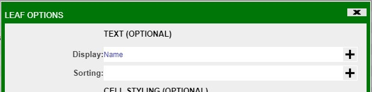

# Trees

## Trees

Static trees provide a tree view of the data from a datamodel. The data is grouped and aggregated by one or more fields.

To create a tree based on a datamodel, select **Tree Grid** in the static visualization selection window of the **Visualization Wizard.**


In the **Create Tree Grid** window, select the columns to **Group By** and the columns to **Aggregate By**. Each column in the Group By section will be used for a level in the tree, which the very top column being used for the highest level. Click on **Create Tree Grid** to finalize the tree creation in the visualization wizard.

To modify any of the groups, use the Grouping tab on the left. In the following example, Grouping 1 will be the highest level of grouping with Grouping 3 the lowest level of grouping.


To add any other level of grouping, click on the **\<Add Grouping Formula\>** button. In the **Grouping Options** window, the position of the grouping can also be modified (also applies to the groupings that have already been created).


Whenever any changes are made in the visualization wizard and you would like to preview it, click on the <span style="color: orange;">Refresh</span> button. Click Finish to create the tree.


The default aggregation is sum; to modify the aggregation, click on the column of the variable to be used and make the necessary changes in the **Display** field of the **Edit Tree Column** window.


## Leafs

The default setting on tree tables is to not show the leafs.


To view the leafs, select **Groupings** from the tree's configuration menu (green button). In the Tree Grid Settings, click on **Show Leafs** and then click on the **Leaf Formatting** button that shows up.


In the **Leaf Options** window, use the **Display** field to select the variable to be used as the leaf. In this example, it will be **Name**. After making the necessary changes, click Submit on the Tree Grid Settings window to implement the changes.




Compared to the tree table before, you are now able to see the *members* of the Government Form level.

## Recursive Groupings

Trees can have nested entries to show recursive relationships. In the example above, these are the expandable nodes in each continent. 

### Basic Example

The below AmiScript is for a simple datamodel showing recursive relationships between rows.

```amiscript
{
  CREATE TABLE companies(parentCompany String, company String, id long);

  INSERT INTO companies Values (null, "Alphabet", 1);
  INSERT INTO companies Values ("Alphabet", "Google UK", 2);
  INSERT INTO companies Values ("Alphabet", "Google US", 3);
  INSERT INTO companies Values (null, "Microsoft", 4);
  INSERT INTO companies Values ("Microsoft", "LinkedIn", 5);
  INSERT INTO companies Values ("LinkedIn", "LinkedIn EMEA", 6);
  INSERT INTO companies Values ("LinkedIn", "LinkedIn NA", 7);
  INSERT INTO companies Values (null, "3forge", 8);
}

```

- `#!amiscript CREATE TABLE companies(parentCompany String, company String, id long);` creates the underlying table structure of this datamodel which has three columns. 

- `#!amiscript INSERT INTO companies Values (null, "Microsoft", 4);` inserts a row with no parent (null is a valid entry).

- `#!amiscript INSERT INTO companies Values ("Microsoft", "LinkedIn", 5);` inserts a row where the entry has the parent "Microsoft."

- `#!amiscript INSERT INTO companies Values ("LinkedIn", "LinkedIn EMEA", 6);` inserts a row where the entry has the parent "LinkedIn" and by extension the ancestor "Microsoft."

### Recursive Tree 

This can be represented in a tree structure. Right-click the datamodel and click "Add Table / Visualization / Form" and select "Tree Grid"

 

From here, define the groupings to show how companies are related to their parent companies:


!!! Tip
    Refreshing the output after each change in the creation wizard will allow you to see how the visualization will look like before submitting.

This results in the following tree:

 

Leaf nodes are recursively linked to their ancestors such that children will be grouped under their parents (see the "LinkedIn EMEA -> LinkedIn -> Microsoft relationship). 

The Ids generated by AMI are sums of the input Ids, but groupings and column formluae can be changed after creation at any point.