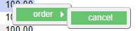
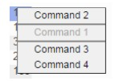
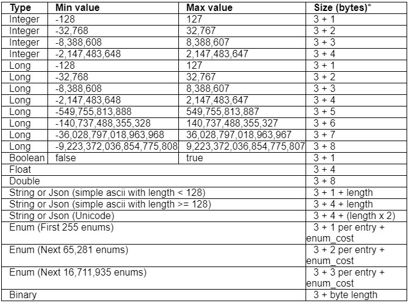
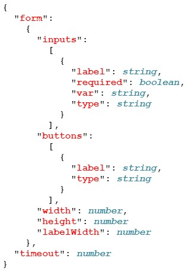
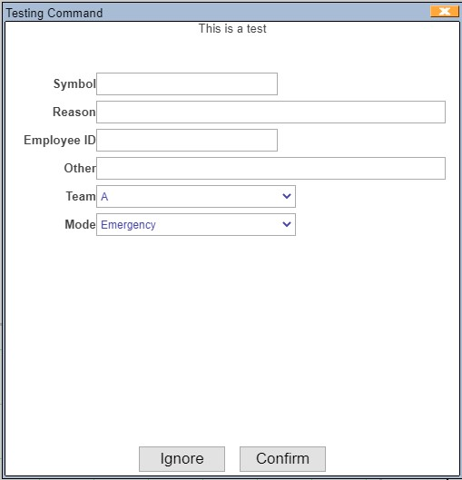

# AMI Realtime Messages

Messages are sent to and from AMI via the relay. Messages need to be formatted appropriately to be parsed and understood by AMI. This document contains conventions and instructions for the types of messages that the AMI relay can receive and interpret.

## AMI Relay Functionality

### Overview

The AMI relay is responsible for sending and receiving messages to and from the AMI center to either AMI web or other external applications. For messages to reach the center, they must be formatted correctly, with the relay acting as an intermediary. Multiple relays can connect to multiple centers and applications; for more information on configuring multiple relays see [here](../configuration_guide/relay.md/#relay-general-properties).

In order to communicate with either a center or a web interface, messages must pass to the relay via a specifed port corresponding to the AMI property `ami.port`. By default this is 3289, but can be configured to any port of your choosing assuming there are no conflicts. 

There are a number of ways to send messages, and 3forge provides several [clients](../data/index.md) for direct interfacing. The types of messages that the relay can receive and send are "instructions:" well-defined, atomic, sequential and transactional messages. 

The first instruction sent to the relay must be a login (`L`), and for a clean logout (`X`). Further detail for formatting instructions is defined [below](#instruction-format).

### Conventions

For the purposes of better understanding this guide, please take note of the following conventions being used: 

-   This document is written from the perspective of the application. "Outbound" is the application *sending* data, and "inbound" is the Application *receiving* data.
-   Trailing text is indicated with an ellipses or "...".
-   Special ASCII chars are qualified inside parenthesis.
-   Brackets [] indicate optionally supplied data.

## Instruction Format

Instructions are the message format that the AMI relay sends and receives. This protocol is designed to be flexible, compact and human readable. Each instruction must have a type and may contain a sequence number and timestamp. The general format for each message is:

```
TYPE|[#SEQNUM]|[@NOW]|[PARAMS...]
```

`TYPE`
: 
    The type of message. Valid *outbound* types are:
	
	-   `L` (login)
	-   `S` (status)
	-   `A` (alert) DEPRECATED
	-   `O` (object)
	-   `C` (command definition)
	-   `R` (response to execute command)
	-   `D` (delete objects)
	-   `X` (exit)
	-   `H` (help)
	-   `P` (pause)
	-   `D` (delete objects)
	
	Valid *inbound* types are:
	
	-   `M` (status message)
	-   `E` (execute command)

`SEQNUM`
:	
    (Optional) The sequence number of the instruction. If supplied, the first instruction (Login) must have a sequence number of 0, the following message must have a sequence number of 1, and so on. This sequence number will be used when AMI is ack-ing.

`NOW`
: 
    (Optional) Current time in milliseconds since the UNIX epoch. This will aid AMI in determining if there is a lag.

`PARAMS`
:	
    (Optional) Should be in the format `key=value|key2=value|...` where entries are pipe (`|`) delimited and keys are unique.

Notes:

-   Backslashes (\\), quotes ("), single quotes ('), (\n,\r,\t,\f,\b)  must be escaped via backslash (\\).
-   Unicode within strings must be expressed in 4 digit hex notation such as: \uFFFF
-   Keys must be alphanumeric.
-   All 1 and 2 letter fully upper case keys are reserved. 
    -   To see a list of the reserved columns in AMI and what they represent, see [here](../center/realtime_tables.md/#reserved-columns).
-   Values that are not numeric must be surrounded in quotes.
-   *\n*: Each instruction must end with a linefeed (0x0A) or linefeed + carriage (0x0A0x0D).
-   The Syntax determines the parameter type, please note some types have multiple syntaxes:

| Type    | Syntax                                                             | Example                                                                   | Notes                                                 |
|---------|--------------------------------------------------------------------|---------------------------------------------------------------------------|-------------------------------------------------------|
| Integer | `nnn`                                                              | `-234`                  | Whole numbers default to integer                      |
| Long    | `nnnL`          | `234L`                  |                                                       |
| Double  | `nnn.nnnD`      | `123.123D`              | Decimal if optional                                   |
| Float   | `nnnF`                                                             | `123F`                  | Decimals in a number default to float                 |
|         | `nnn.nnn`                                                          | `123.123`               | Decimals default to float                             |
| String  | `"sss"`                                                            | `"what"`                | Quotes must be escaped with a backslash (\\           |
| Enum    | `'sss'`                                                            | `'this'`                | Quotes must be escaped with a backslash (\\           |
| UTC     | `nnnT`                                                             | `1422059533454T`        | Unix epoch                                            |
|         | `"sss"T(*fff*)` | `"20140503"T(yyyyMMdd)` | Uses date format (fff) to parse string (sss) to a utc |
| JSON    | `"sss"J`        | `"{this:\\that\\}J`     | Base 64 UU Encoded                                    |
| Binary  | `"ssss"U`       | `"12fs1323"U`           | Base UUEncoded                                        |
| Boolean | `true false`      | `true`                  | Case sensitive                                        |
| Null    | null                                                               | `Null`                  |                                                       |

-   `nnn` represents 0-9. Numbers must be base 10 and can be signed
-   `sss` represents alpha numeric
-   `fff` represents java syntax [SimpleDateFormat](http://docs.oracle.com/javase/7/docs/api/java/text/SimpleDateFormat.html)

## Outbound Instruction Type

### Login (`L`)

Must be the first instruction sent from the application after connecting to the relay. It is used to establish identity and confirm a proper login.

**Required fields supplied by application**

`I`: A universally unique string identifying the process. Multiple runs of the same application should have the same ID (I). If an application were to be shut down and restarted, the ID (`I`) should not change.

**Optional parameters supplied by application**

Optional parameters are used to provide metrics about the application.

`P`: Used to supply a fully qualified java class name to an AMI relay plugin. The class must implement the com.f1.ami.relay.AmiRelayPlugin interface.

`O`: Used to supply options about the current session. The following options are available and can be used in conjunction by comma delimiting:

-   `QUIET` - AMI will not send any information back to the client (statuses, etc). Note execute commands (E) will still be send to the client
-   `LOG` - Force AMI relay  to log data to / from this session (default file = *AmiSession.log*)
-   `UNIX` - Force AMI to not send \r on messages
-   `WINDOWS` - Force AMI to send \r on messages
-   `TTY` - teletype terminal (for UNIX) is for interactively working with AMI backend

**Example**

In the below example, we see the optional attributes APP, MEM and STAT are supplied to shed light on the application name, memory used and status. Note that string values are surrounded in quotes. The options are forcing ami to use UNIX formatting (no \r) and force logging at the ami relay.

```
L|I="12n3f321g19"|APP="SOR"|MEM=12000|STAT="OKAY"|O="UNIX,LOG"
```

### Status (`S`)

This has been deprecated

### Object (`O`)

Used to create an object (row) that gets inserted into AMI DB

**Required fields supplied by application**

`T`: Table name

**Optional parameters supplied by application**

`I`: A unique string ID for the object used for updating the object later. Subsequent messages with the same object ID (`I`) and same running process ID (`I`) provided in the login (`L`) will cause an update.

`E`: Expires on; *negative* for how far into the future from the time of message receipt in AMI center and *positive* numbers are exact dates in the future based on Epoch time. Units are milliseconds

`A`: Associated alert ID (**DEPRECATED**)

**Example**

The below example inserts a record into the Order table. The key-value pair maps value to column, e.g. the first column is qty, and the value is 1223. The last column represents an AMI reserved column, E, that indicates the expiry time of this row.

```
O|I="Order1374"|T="Order"|qty=1223|filled=13222|status="OverFill"|E=-100000L
```

### Command Definition (`C`)

Used to create a command that will allow the user to right click on an application or object, and perform a command it.

**Required fields supplied by application**

`I`: Command ID

`N`: Name that is displayed to user in the right-click context menu. Note: Use periods (.) to create submenus e.g.

```
N="order.cancel"
```

This will place the cancel command under the order menu



**Optional parameters supplied by application**

`L`: Permissions Level of 0 means remove command, and any other number is used for entitlements as part of the AMI entitlement engine.

`A`: Configuration for input form described in JSON format. See [appendix](#description-of-ami-json-form-definition-fields) for JSON Form layout

`W`: An expression that will determine which rows the command will be available at a row/node level.  You may also reference user-specific variables:

-   `__USERNAME` - login name of user that is executing the command
-   `user.xxxxx` - a property, associated with the user's entitlements that are prefixed w/ amivar\_.
-   To use legacy variables names such as `user.username`, set the following property: ami.web.support.legacy.amiscript.varnames=true

For example, if the user has an attribute in the entitlements server `amivar_group=sales` then the variable `user.group` will have the value sales.

`T`: An expression that will determine which rows the command will be available at a panel level.  You may also reference user-specific variables and panel specific variables:

-   `__USERNAME` - login name of user that is executing the command
-   `user.xxxxx` - (see W clause for details)
-   `panel.title` -The title name of the panel
-   `panel.types` - A comma (,) delimited list of types (T) shown in the panel
-   `panel.visualization` - The type of visualization. Visualizations include: `table, form, treemap, chart, chart_3d`
-   `panel.id` - The ID of the panel (shown above the panel configuration button). To edit the panel ID, open the panel's **Settings** menu

`H`: Help, gets displayed in the top of the display box.

`P`: Priority for display in the menu. Commands with a higher priority are listed in the context menu above those with lower priority, 0 = highest priority, 1 = 2^nd^ highest, etc.

`E`: Enabled where (expression) e.g. the command with `E` value below will only be enabled where the Quantity = 300

```
E="Quantity==300"
```

`F`: Fields; returns the values of specified fields.

**Example**

Using a command with the following parameter: `F="Price"` will return:

```
E@1414512334864|C="Test"|I="8vJfyRmzkir7EwkQIpnnrA"|U"david"|V="[{"O":"23","Price":70.0},{"O":"24","Price":95.0},{"O":"25","Price":60.0},{"O":"26","Price":50.0}]"J
```

`M`: Multiple; constrains the number of rows that can be selected when running the command. The syntax is n-m where n is min and m is max. If m is not supplied than there is no upper limit. See below for examples:

-   "0" = available when no records are selected.
-   "1" = available only when a single record is selected (**default**).
-   "0-1" = available when no records or a single record is selected.
-   "1-" = available when one or more records are selected.
-   "3-5" = available when 3, 4, or 5 records are selected.

`S`: Style of the menu item in JSON e.g. to add a separator between the commands

```
s='{"separator":"TOP|BOTTOM|BOTH"}'
```



`C`: Declare what Condition(s) will cause command to be evaluated, comma (,) delimited list. Options include:

-   "now" = Immediately (when the command is declared)
-   "user_click" = when the user clicks on a row (this is the default)
-   "user_close_layout" = when the user closes a layout
-   "user_open_layout" = when the user opens a layout (or logs in w/ a default layout assigned)

e.g. to run the command to be run on all current sessions and any new sessions that are created.

```
C='now,user_open_layout'
```

`X`: Execute AmiScript when the command is evaluated and the various criteria are met. See the reference section of the documentation for details. For example, to alert the user:

```
C|I="alert"|X='session.alert("hi");'|C="now"
```

**Example**

In the below example, a command is created to allow a user to bust all orders for an app and a single order. With the bst2 command the user must supply a comment.

```
C|I="bst"|N="Bust Every Order"|H="this is used to bust all orders"|L=2|W='T=="__CONNECTION"'

C|I="bst2"|N="Bust This Order"|H="this is used to bust an order"|L=1|T='panel.types=="FEED:Orders" || panel.types=="FEED:Executions"'|W='qty>0 && user.canbust=="true"'|A='{"form":{"inputs":[{"label": "Comment","var": "comment","required":true}]},"timeout":10000}'
```

### Response to Execute Command (`R`)

Respond to a request by the relay to execute a command. Please see the section on [Execute Command (E)](#execute-command-e) as these work in conjunction.

**Required fields supplied by application**

`I`: An ID uniquely identifying the command as sent from the relay's execute command (E). This ID is generated by AMI and the application must use this ID when sending a response.

`S`: The status of the command. 0 = Okay, 1 = Close dialog box, 2 = Leave dialog box open, 3 = Close dialog box and modify data

`M` (optional): A string message to send to source that requested command be run

`X` (optional): Execute AmiScript on the user session that requested command be run. See the Reference section of the documentation for details

**Example**

The below example is a potential response to the sample in the execute command example found in the "Inbound Instruction type - Execute Command (`E`)" section.

```
R#13@1374353639915|M="Order missing: OR-11323"|I="ad5462sf55"|S=2
```

The following example is a potential response to a command on an object where the quantity=300 and must be changed to 200:

```
R|I="2yXxPizK5oi02hp7jpgZJ5"|S=3|Quantity=200|M="Quantity Modified"
```

### Delete an Object (`D`)

This is a simple command for deleting objects that have not expired.

**Required fields supplied by application**

`I`: A unique string ID for the object. Each new object must have a unique object ID (I) for scope of the running process ID (I). For deleting an object, the same object ID (I) must be supplied.

`T`: To delete an object, the object type must be supplied.

**Example**

In the below example, an "order" object is deleted:

```
D|I="ad5462sf55"|T="order"
```

### Exit (`X`)

Notify the relay of a clean shutdown. The relay will close the socket after receiving this message.

**Optional parameters supplied by application**

Optional parameters are used to provide metrics about the application at time of shutdown.

**Example**

In the below example, notice not all metrics need be supplied for a particular status update.

```
X#1@1374353639915|STAT="GOODBYE"
```

### Pause (`P`)

Used to create a pause in the connection for a specified period of time. This is used for testing scripts.

**Required fields supplied by application**

`D`: Delay

**Example**

This example pauses the application for 1 second:

```
P|D=1000
```

### Alert (`A`)

**Deprecated but supported, use Object (O) instead**

### Help (`H`)

Prints out general help

## Inbound Instruction Type

### Status Message (`M`)

For each outbound message, the relay will respond with a response instruction which will notify the application of the acceptance of rejection of the message. The message will contain the sequence number of the supplied outbound message. These messages will not contain a timestamp or a sequence number.

**Parameters always supplied by relay**

`S`: The status of the received instruction. A value of 0 indicates it was successfully processed by the relay; a value of 1 to 255 indicates an error.

`Q`: The sequence number of the instruction sent from the relay.

`M`: A human-readable message for the status.

**Examples**

In the following example, the login message was rejected due to a missing ID.

```
M|Q=0|S=1|M="Missing required Fields: I"
```

### Execute Command (`E`)

This will allow users to execute commands on the application. A timestamp and sequence number will always be included.

**Parameters are always supplied by the relay**

`I`: Unique ID as a string. This ID is generated by AMI

`C`: The ID of the command

`U`: User name of the person doing the command.

**Parameters optionally supplied by relay**

`O`: Associated object ID. This will be supplied if the command is executed on an object.

**Examples** In the following example we can see the user is running the command "cancel" with the arguments "OR-11323." The ID (I) of "f123f56a" will be unique for this process and should be included in the applications response.

```
E#872@1374353639915|I="f123f56a"|C="cancel OR-11323"|U="JSmith"
```

## Cheat Sheet

Valid outbound types and parameters (optional in *italics*):

-   `L` (login)
    -   `I` (app ID)
    -   `O` (session options)
    -   *`PL` (plugin options)*

-   `S` (status)
-   `A` (alert) **DEPRECATED**
    -   `I` (alert ID)
    -   `L` (level)
    -   `T` (alert type)
    -   *`E` (expires on)*
    -   *`U` (user assignment)*

-   `O` (object)
    -   `I` (object ID)
    -   `T` (object Type)
    -   *`E` (expires on)*

-   `C` (command definition)
    -   `I` (command ID)
    -   `N` *(name)*
    -   `W` *(where - row level)*
    -   `T` *(where - panel level)*
    -   `L` *(permissions Level)*
    -   `A` *(form definition)*
    -   `H` *(help)*
    -   `P` *(priority)*
    -   `E` *(enabled)*
    -   `F` *(fields)*
    -   `M` *(multiple)*
    -   `S` *(style)*
    -   `C` *(condition)*
    -   `X` *(execute AmiScript)*

-   `R` (response to execute command)  
    -   `I` (Unique ID)
    -   `S` (status)
    -   `M` *(message)*
    -   `X` *(execute AmiScript)*

-   `D` (delete object)
    -   `I` (object ID)
    -   `T` (object Type)

-   `X` (exit)
-   `H` (help)
-   `P` (pause) only to be used in testing
    -   `D` (delay)

Valid inbound types and parameters (optional in *italics*):

-   `M` (status message)
    -   `S` (status)
    -   `Q` (sequence number)
    -   *`M` (message)`*

-   `E` (execute command)
    -   *`I` (unique ID)*
    -   *`C` (a string command)*
    -   *`U` (user name)*
    -   *`O` (associated object ID)*

## Data Storage (Advanced)

**Data sizes Overview.** Each parameter added to an object  and application status message has a **3 byte overhead**, plus additional bytes, depending on the data type. Please see the table below.



**Keys**. The length of a key has virtually no impact on memory.  This is because all key names are indexed. Ami Supports up to 65,536 unique key names plus data types (T=). This is a hard limit per AMI center and going beyond that will result in data loss. For example, the following 2 messages would result in 5 unique keys. Note that when key names and types (T=) are repeated then they do not count as a new unique key.

```
O|T="Order"|quantity=100|symbol='ABC'|I="Ord123"

O|T="Execution"|quantity=50|symbol='XYZ'|price=45.3d|I="exec123"

O|T="Execution"|quantity=150|symbol='DEF'|price=13d|I="exec456"
```

## Enums (Advanced)

**Clarification on Denoting Enums vs. Strings:** Enums are surrounded using single quotes (') while strings are denoted using double quotes ("). For example (note the quote types):

```
O|T="sample"|my_enum='hello'|my_string="Hello there Mr. Jones"
```

**Enum Storage Methodology**: Using enums will dramatically reduce the cost of storing text that is often repeated. Instead of storing the *actual* value, just an index (binary number) is stored and regardless of how many times it is referenced only a single instance of the string is kept in a lookup table. The first 255 unique enum values received by the AMI central server will be indexed using a single byte index. The following 65,281 unique enum values received will be indexed using 2 bytes and the last 16,711,935 unique entries will use a 3 byte index. Be aware that the order in which unique enum values are introduced also determines the storage requirements for repeat entries.

**Enum Scope**: The scope of a particular enum is for an AmiCenter. This means that the same index will be used regardless of application sending the enum, type of message it is in or parameter it is associated with. For example, the following will result in 3 enums (presuming these are the first 3 messages then all 3 of these would be indexed using a single byte):

```
O|T="Order"|symbol='ABC'|I="Ord123"|name='DEF'

O|T="Execution"|name='ABC'|I="exec123"

O|T="Execution"|symbol='DEF'|Orig='ZZZ'|I="exec456"
```

Note: Exceeding 16,777,216 unique enums will cause the Center to treat remaining Enums as Strings.

**Understanding Cost:**

The first instance of an enum has significant overhead verses a String, but following instances will usually have a highly reduced overhead.  

<table>
<tbody>
<tr class="odd">
<td><p>Description</p></td>
<td><p>Enum Cost</p>
<p>(Best case)</p></td>
<td><p>String  Cost</p>
<p>(Best Case)</p></td>
<td><p>Enum Cost</p>
<p>(Worst  case)</p></td>
<td><p>String  Cost</p>
<p>(Worst Case)</p></td>
</tr>
<tr class="even">
<td><p>First entry for a string</p></td>
<td><p>19 + (length x 2)</p></td>
<td><p>4 + length</p></td>
<td><p>21 + (length x 2)</p></td>
<td><p>7 + length * 2</p></td>
</tr>
<tr class="odd">
<td><p>repeat entries for string</p></td>
<td><p><strong>4</strong></p></td>
<td><p>4 + length</p></td>
<td><p><strong>6</strong></p></td>
<td><p>7 + length * 2</p></td>
</tr>
</tbody>
</table>

*Notes: (1) The length variable is the number of characters in the string. (2) Costs are in bytes.*

From the table above you can see there is a large cost for the first entry for an enum, but additional entries have a highly reduced cost which is regardless of string size.

## JSON AMI Command Invocation User Form Definition

### Structure

The below structure demonstrates how to construct a well-formed input user form. Forms have support for input fields which can contain any number of input arguments.  Note that a form definition with neither a `form` stanza nor a `timeout` stanza will result in no dialog and immediate execution of the command when the user selects the command.



**Example**

```
C|I="Test"|N="Testing Command"|L=3|H="This is a test"|W='T=="Test Executions" && __USERNAME=="jsmith" && Quantity>100'|M="0-1"|A='{"form":{"inputs":[{"label":"Symbol","required":true, "var":"symbol","type":"text"},{"label":"Reason","pattern":"[0-9a-z]+","required": true, "var": "reason","type":"textarea"},{"label":"Employee ID","required":true, "var":"ID","type":"text"},{"label":"Other","required": false, "var":"other","type":"textarea"},{"label": "Team","required": true, "var": "team","type":"select", "options":[{"value":"a","text":"A"},{"value":"b","text":"B"},{"value":"c","text":"C"}]},{"label": "Mode","required": true, "var": "mode","type":"select", "options":[{"value":"emergency","text":"Emergency"},{"value":"normal","text":"Normal"},{"value":"urgent","text":"Urgent"}],"enabled":true}],"buttons":[{"type":"cancel","label":"Ignore"},{"type":"submit","label":"Confirm"}],"width":500,"height":500},"timeout":100000}'
```



## Description of AMI JSON Form Definition Fields

| Name                      | Type          | Description                                                                                                                                                                                                                                        | Req. |
|---------------------------|---------------|----------------------------------------------------------------------------------------------------------------------------------------------------------------------------------------------------------------------------------------------------|------|
| `form`                      | object        | Object which identifies the form presented to the user                                                                                                                                                                                             |      |
| `form.inputs`               | array         | Array which lists the input widgets inside the form                                                                                                                                                                                                |      |
| `form.inputs.label`         | string        | Label displayed next to the input                                                                                                                                                                                                                  | X    |
| `form.inputs.var`           | string        | key associate with the value that is sent to the back end                                                                                                                                                                                          | X    |
| `form.inputs.required`      | boolean       | If true, user must supply a non-blank value, default is false                                                                                                                                                                                      |      |
| `form.inputs.pattern`       | string        | The pattern that the user-supplied value must match to                                                                                                                                                                                             |      |
| `form.inputs.type`          | String (enum) | The type of user input, default is text. Permissible values:<br>`text` - regular, single line text input<br>`textarea` - multi-line text input<br>`select` - multi option select field<br>`hidden` - field is hidden from user<br>`password` - hides letters |      |
| `form.inputs.value`         | string        | Reference a variable on selected record                                                                                                                                                                                                            |      |
| `form.inputs.options`       | array         | List of options, required & only applicable if type=select                                                                                                                                                                                         |      |
| `form.inputs.options.value` | string        | Value sent to backend if option is elected.                                                                                                                                                                                                        | X    |
| `form.inputs.options.text`  | string        | Text displayed to user, if not supplied value is used                                                                                                                                                                                              |      |
| `form.buttons`              | Array         | Array which lists the buttons at the bottom of the form                                                                                                                                                                                            |      |
| `form.buttons.type`         | string        | The type of button.  Permissible values: submit - submit the form to backend cancel - cancel and close the form                                                                                                                                    | X    |
| `form.buttons.label`        | string        | The text displayed on the button                                                                                                                                                                                                                   |      |
| `form.width`                | number        | Width of form in pixels                                                                                                                                                                                                                            |      |
| `form.height`               | number        | Height of form in pixels                                                                                                                                                                                                                           |      |
| `form.labelWidth`           | number        | Width of the labels column in pixels                                                                                                                                                                                                               |      |
| `Timeout`                   | number        | Max time the user will wait for a response from the backend after submitting form, in milliseconds                                                                                                                                                 |      |