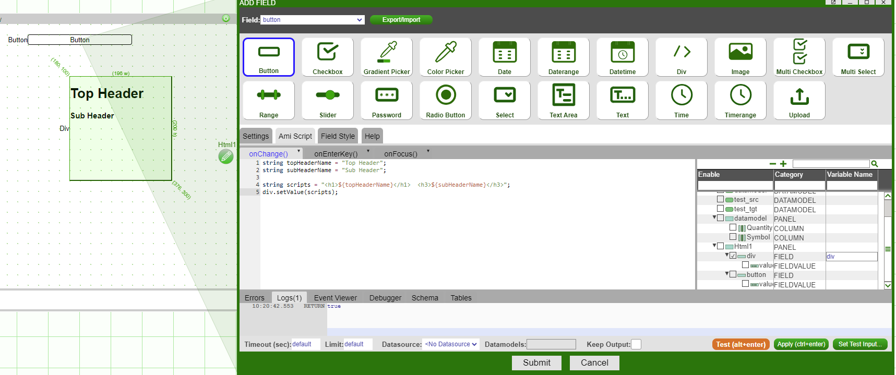
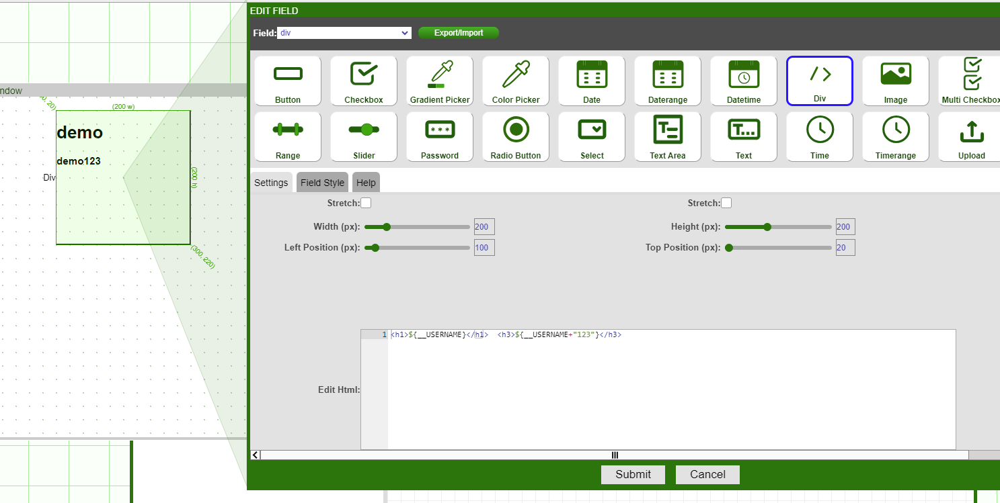
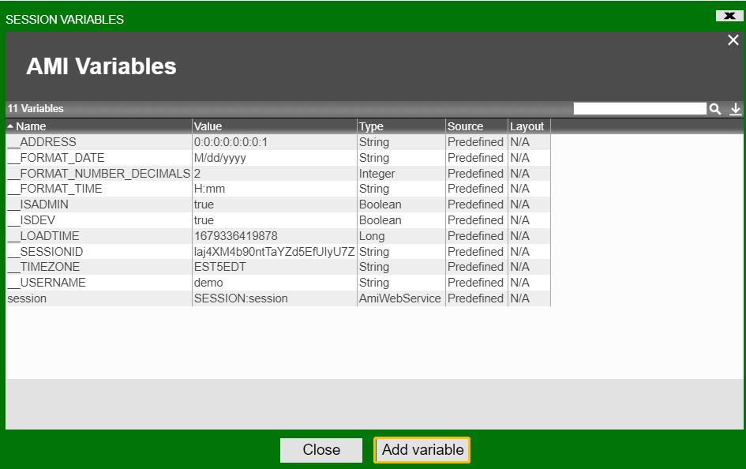
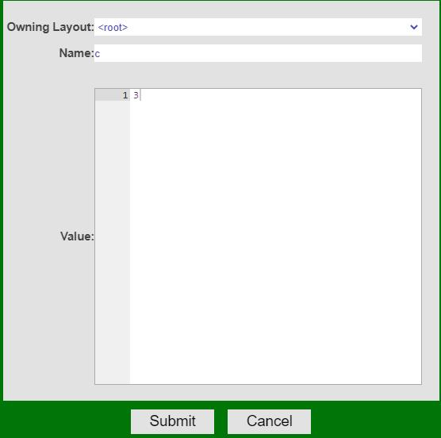
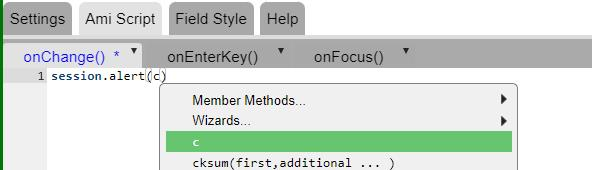
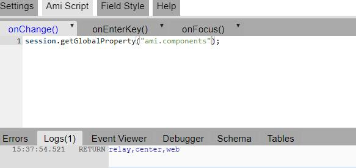
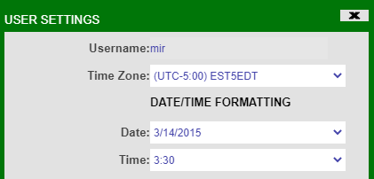
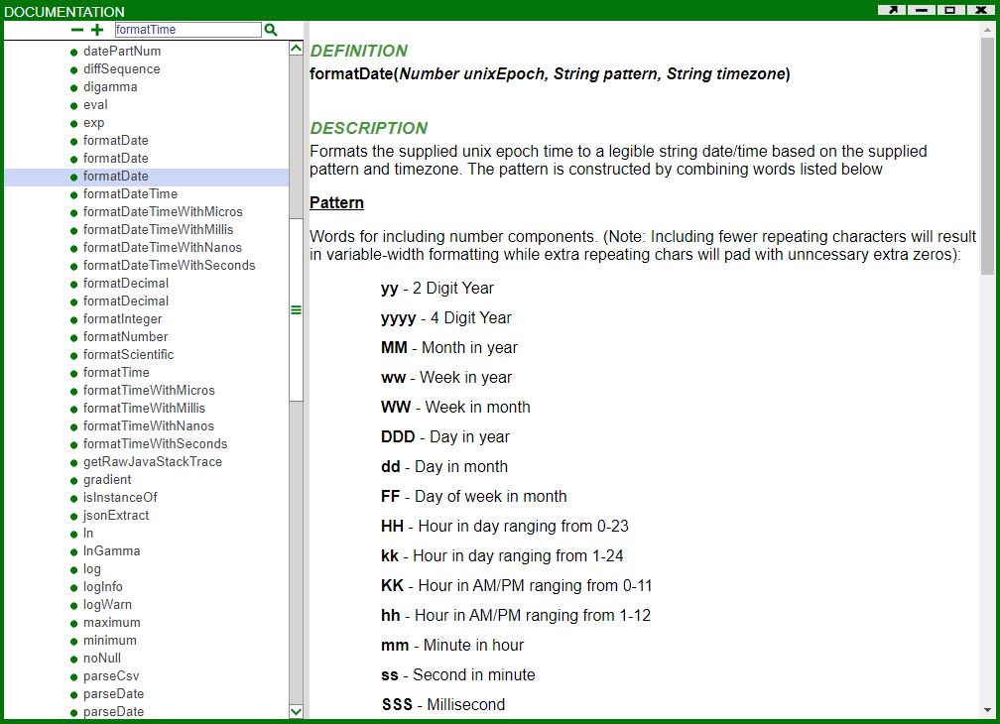
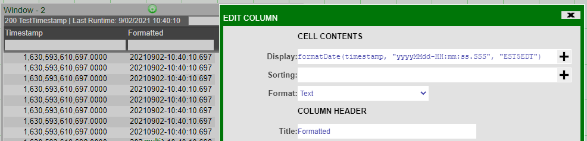

# AmiScript: Scripting

## AmiScript Introduction

### Overview 

AMI has an embedded, versatile scripting language called AmiScript which combines syntax and functionality from Java, SQL, and string templating languages for flexible querying. AmiScript can be called anywhere within AMI, from the shell tool to datamodel creation.

Here is a very quick example of the language performing a cross-database join:

``` amiscript
{
  //Inspect the ACCOUNTS table of two pre-defined databases (qadb & proddb).
  //Two temporary in-memory tables are created (qatemp and prtemp)
  String table = "ACCOUNTS";
  CREATE TABLE qatemp AS USE datasource=qadb   EXECUTE SELECT * FROM ${table};
  CREATE TABLE prtemp AS USE datasource=proddb EXECUTE SELECT * FROM ${table};

  //Gather some statistics, Note that the results of the queries on the in-memory tables are
  //stuffed into the local variables
  int qaCnt = select count(*) from qatemp;
  int prCnt = select count(*) from prtemp;
  int bothCnt = select count(*) from qatemp, prtemp where qatemp.id == prtemp.id;

  //Alert the user with some statistics, including the number of users in both qa and prod
  session.alert("Found ${qaCnt + prCnt} ${table} rows: ${qaCnt} in qa and ${prCnt} in prod. \
                 There are ${bothCnt} ids existing in both");

  //Create a Temporary ProdOnly table that contains all users in prod but not qa.
  //This table can be used in the visualization layer
  Create table ProdOnly as select * from prtemp where !(id in (select id from qatemp));
}
```
Note the interoperability of SQL and procedural style language as well as the dynamic string notation functionality (encased like so`#!amiscript ${...}`).

## Key Features

### AmiScript

AmiScript is a versatile language designed for optimized "on the fly" compilation, meaning expressions can be re-compiled and evaluated in an instant.  

Some key features of the language:

1.   **Type Safe** 
    - All variables have well defined types, e.g: String, Integer, etc.

1.   **Compile Time Binding** 
    - Code is compiled before execution to minimize runtime issues.

1.   **Procedural** 
    - Custom methods (with overloading), along with a set of predefined procedures. 
  
1.   **Object Oriented** 
    - Objects in AMI are represented as such in AmiScript. 

1.   **Event Driven** 
    - Executes based on events, such as running a datamodel or clicking a button. 

1.   **Implicit Casting** 
    - Casting from one type to another can be explicitly or implicitly defined. 

1.   **Embedded SQL** 
    - For accessing external sources and tables directly in the language. 

1.   **String Templating** 
    - Ability to template code for reuse. 

1.   **Task Swapping** 
    - Tasks can be exported runtime for out-of-band execution (separate thread). 

### Embedded SQL

An SQL-style language extension to AmiScript with near-full SQL support along with several enhancements geared towards data preparation for the visualization of data. All of these functions act on an in-memory database. It also supports "calling out" to external datasources. 

Some key features are:

1.   **Query Clauses** 
    - For filtering, joining, and grouping data on the in-memory database. 

1.   **Data Modification** 
    - For adding, updating, and deleting data on the in-memory database. 

1.   **Schema Modification** 
    - For adding, editing, and deleting tables/columns on the in-memory database.

1.   **`Use ... Execute`** 
    - For seamlessly running code on external datasources and storing results to the in-memory database. 

1.   **Advanced Data Preparation and Analysis** 
    - For complex data calculations, not typically available on a standard SQL database. 

1.   **Lambda Support** 
    - The ability to run AMI script code inside SQL. 
    - For example, to run a code snippet per row returned in a table. 

1.   **Nested Queries** 
    - The `in(...)` clause supports full nested queries, and also supports multiple column in-clauses.

1.   **Intelligent Indexing** 
    - As joins, in-clauses, etc. are evaluated, indexes will automatically be spun up depending on data size and cardinality.

### AmiScript Template 

AmiScript templating syntax is an extension of AmiScript with the aim of simplifying dynamic text generation, useful for creating dynamic HTML, dynamic SQL, etc.

1.   **Embed Ami Script** 
    1. Inside text: 
        - Embedding AmiScript inside text allows for easy dynamic text generation. 
    1. Inside SQL: 
        - Embedding AmiScript inside SQL allows for easy dynamic SQL generation. 

1.   **Injection Protection** 
    - Properly escaping control characters, quotes, etc. 

1.   **Conditional Templating** 
    - Ability to do conditional & loop based template construction.

## Examples

### Syntax

Same support as Java for control structures like loops, if/else statements, white space, comments and expressions:

``` amiscript
double n = 0;
for(int i = 0; i < 10; i++){
    if(i < 5)
      n++;  //increment n
}

// same for loop replacing the if logic with the ternary operator, same as java
double n = 0;
for (int i = 0; i < 10; i++) {
    n += (i < 5) ? 1 : 0;   //increment n by 1 if i < 5
}
```

### Data Structures

General purpose list, map, set & table data structures are provided. The constructors can be used to pre-populate data:

``` amiscript
List l = new List(1,2,3,4);
Map m = new Map("fname","Eric","lname","Johnson");
Set s = new Set("a", "b", "c");
Table t = new Table("People", "user String, age int");
```

There is additional Python-like support for some structures such as lists and maps. List elements can be accessed with square brackets like in Python and incremented:

``` amiscript
list l = [0,1,2,3,4]; 
list l2 = [];

// populate new list with the values of l+1
for (int i = 0; i<l.size(); i++) {  
  l2.add(l[i]++); // l2 = [1,2,3,4,5] 
}

```

Access nested elements in Maps using square brackets (previously only accessible via `#!amiscript jsonPath()`)

```amiscript
Map m = {
  "Americas":["New York","Toronto","Florida"], 
  "Europe":"London", 
  "Asia":["Singapore","Tokyo","Hong Kong"]
};

String head_office = m["Americas"][0];
```

### Type Safety & Coercion

Type names are case insensitive, e.g: `#!amiscript double` and `#!amiscript DOUBLE` are the same. 

Other examples:

- int and integer are the same
- char and character are the same

``` amiscript
int n = 5;
Int m = n*n;
INTEGER o = m*m;
```

All types support null value. Dereferencing null, results in null. Expressions with null result in null.

``` amiscript
List l = null;
Integer s = l.size();   //s is null, does not raise null pointer
Double n = 5, m = null;
Double p = n*m;   //p is null because anything times null is null
```

Flexible type coercion. When coercion is not possible, the value is coerced to null.

``` amiscript
Int value = "123";    //value will be 123
Double value2 = new List();     //list can't be cast to double so value2 will be null
String value3 = new List(1,2,3);      //value3 is the string [1, 2, 3]
```

All types extend the AmiScript class Object and casting is not necessary for assignment.

``` amiscript
Object o = new List(1,2,3);
List l = o;   //this works because the value of o is a list.
Map m = 0;  //m will be null because a list can not be cast to a map
```

All types can be thrown/caught and all blocks can have catch clauses (try key word is not necessary).

``` amiscript
{
  throw "error";
} catch(String s) {
  session.alert("caught!"); //or any other logic
}
```

### String Templates

If strings contain a `${...}`, the content of the curly brackets is interpreted.

``` amiscript
String name = "rob";
String message1 = "hello ${name}";  // hello rob
String message2 = "A baker's dozen is {12+1}";  // A baker's dozen is 13
```

#### String Template Example

In this example, we will use string templates to access and evaluate variables from amiscript and pass them to a div field.

``` amiscript
string topHeaderName = "Top Header";
string subHeaderName = "Sub Header";

string scripts = "<h1>${topHeaderName}</h1>  <h3>${subHeaderName}</h3>";
div.setValue(scripts);
```



Alternatively, you could also use string template inside the div field:  

``` amiscript
<h1>${__USERNAME}</h1>  <h3>${__USERNAME+"123"}</h3>
```



You can use triple quotes for literals:

``` amiscript
String m="""hello ${world}"""; // hello ${world}
```

### SQL

There are several reserved words that indicate an SQL statement, including CREATE, SELECT, INSERT, DELETE, etc.

``` amiscript
CREATE TABLE t (username String, id int);
INSERT INTO t values ("rob",111),("dave",222);   //table t has 2 rows
CREATE TABLE t2 as select * from t where id<200;  //table t2 has 1 row
```

Variables and templates can be used inside SQL:

``` amiscript
String name = "eric";
Int id = 333;
INSERT INTO t VALUES (name, id);   //inserts eric, 333
String row = "values (\"mike\", 444)";   //ensure to escape the ""
INSERT INTO t ${row};   //expands to INSERT INTO t values("mike", 444); 
```

Table coercion works for Table cells to Objects, Columns to Lists, and Rows to Maps.

``` amiscript
String s = SELECT username FROM t WHERE id == 111;  //s= rob
List names = SELECT username FROM t;  //names= [rob, dave]
Map user = SELECT * from t WHERE id == 222;  //user= {username=dave, id=222}
```

To query external data sources run the `#!amiscript USE ds= ... EXECUTE` command.

``` amiscript
CREATE TABLE t3 as USE ds = "mydatabase" EXECUTE SELECT * FROM ORDERS;
//ran the "SELECT * FROM ORDERS" SQL command on the mydatabase datasource and created a local table called t3
```

To upload data to external data sources run the `#!amiscript USE ds= ... INSERT` command.

``` amiscript
USE ds = "targetdb" INSERT INTO TargetAccounts FROM USE ds="sourcedb" SELECT * from SourceAccounts;   //query all data from sourcedb's SourceAccounts table and insert into targetdb's TargetAccounts table
```

### Custom Methods

Methods are static and must return a type. If a return is clause is not reached, the function returns null.

``` amiscript
String combine(String s, String t) {

   if (s != null && t != null)

     return s + " " + t;

};

String s=combine("apple","orange");   //s is now apple orange
String t=combine("apple",null);   //t is null
```

## Variable Naming

Variables are named containers for storing data in AMI. Like other object oriented programming languages, variables are typed (but all are derived from Objects) and are unique, case-sensitive combinations of the following characters: 

1. a-z
1. A-Z
1. _ 
1. 0-9 

where the first character must **not** be a number. For example, `#!amiscript int some_int1 = 0;`.

Alternatively, variables can be wrapped in back ticks (\`), in which case all characters are supported, allowing for accessibility with external language references, or for using protected class names. For example:

- ``#!amiscript int `integer` = 0;``
- ``#!amiscript int `#001` = 1;``


Variables are declared with the following syntax (the value will default to null if an expression is not supplied):

```amiscript
Type <variable_name> <= object_value_or_expression>;
Type <variable_name> <= object_value_or_expression>, <another variable_name = another_object_value>, ...;
```

### Literals (Constants)

|                                                                                                                                                                                                                                                   |                                                                                                                                                                                                                                                                                                                                                 |
|---------------------------------------------------------------------------------------------------------------------------------------------------------------------------------------------------------------------------------------------------|-------------------------------------------------------------------------------------------------------------------------------------------------------------------------------------------------------------------------------------------------------------------------------------------------------------------------------------------------|
| <span style="font-family: courier new; color: blue;">digits</span>                                                                                                                                                              | Int constant                                                                                                                                                                                                                                                                                                                                    |
| <span style="font-family: courier new; color: red;">0x</span><span style="font-family: courier new; color: blue;">digits</span>                                                                               | Hex Int constant                                                                                                                                                                                                                                                                                                                                |
| <span style="font-family: courier new; color: red;">0</span><span style="font-family: courier new; color: blue;">digits</span>                                                                                | Octal Int constant                                                                                                                                                                                                                                                                                                                              |
| <span style="font-family: courier new; color: blue;">digits</span><span style="font-family: courier new; color: red;">L</span>                                                                                | Long constant                                                                                                                                                                                                                                                                                                                                   |
| <span style="font-family: courier new; color: red;">0x</span><span style="font-family: courier new; color: blue;">digits</span><span style="font-family: courier new; color: red;">L</span> | Hex long constant                                                                                                                                                                                                                                                                                                                               |
| <span style="font-family: courier new; color: red;">0</span><span style="font-family: courier new; color: blue;">digits</span><span style="font-family: courier new; color: red;">L</span>  | Octal long constant                                                                                                                                                                                                                                                                                                                             |
| <span style="font-family: courier new; color: blue;">digits.digits</span>                                                                                                                                                       | Float constant.  Note, scientific (aka 'E') notation is supported                                                                                                                                                                                                                                                                               |
| <span style="font-family: courier new; color: blue;">digits.digitsD</span>                                                                                                                                                      | Double constant.  Note, scientific (aka 'E') notation is supported                                                                                                                                                                                                                                                                              |
| <span style="font-family: courier new; color: red;">"</span><span style="font-family: courier new; color: blue;">chars</span><span style="font-family: courier new; color: red;">"</span>   | String constant.  Use backslash (\\ to escape quotes, backslash (\\)   and other control chars, ex: \n. A string can be defined over multiple lines using a trailing backslash on all but the last line, note that preceding white space is trimmed out for subsequent lines. Please see [String Templating](#string-templating) for details on \${...} syntax |
| <span style="font-family: courier new; color: red;">\n\r\t<space></span>                                                                                                                                               | White space (token delimiter)                                                                                                                                                                                                                                                                                                                   |

### Reserved Type

All reserved types' values are immutable. Null is a valid value.

|                                                                                       |                                                         |
|---------------------------------------------------------------------------------------|---------------------------------------------------------|
| <span style="font-family: courier new; color: blue;">Long</span>    | 64 bit signed whole number                              |
| <span style="font-family: courier new; color: blue;">Double</span>  | 64 bit signed float                                     |
| <span style="font-family: courier new; color: blue;">String</span>  | Variable length string of UTF 8 characters              |
| <span style="font-family: courier new; color: blue;">Integer</span> | 32 bit signed whole number                              |
| <span style="font-family: courier new; color: blue;">Float</span>   | 32 bit signed float                                     |
| <span style="font-family: courier new; color: blue;">Byte</span>    | 8 bit signed whole number                               |
| <span style="font-family: courier new; color: blue;">Boolean</span> | boolean (true or false)                                 |
| <span style="font-family: courier new; color: blue;">Number</span>  | Base class for Long,Double,Integer,Float,Byte           |
| <span style="font-family: courier new; color: blue;">UTC</span>     | Timestamp with millisecond precision (since unix epoch) |

### Examples

``` amiscript
Integer i = 32;
Double d = 4.3, f = 132.d; //declaring multiple variables
Integer j = 0xaabcc;
String test = "hello world";
String Test = "Hello \
               world";     //Multi line 
Integer lng = 100000000000L;
Boolean flag = true;
Byte some_thing = null;
```

## Casting

Variables are strongly typed, but casting can be explicit or implicit.  If a cast fails, the result evaluates to null. Also, equality operations (==, <=, \>=, \>, <, !=) will also auto-cast when possible as well.

### Examples

``` amiscript
String test1 = 123;    //implicit cast from integer to string 
String test2 = "0x123";//implicit cast from hexadecimal integer to string 
Double val = "123.32"; //implicit case for string to double 
Boolean b = "true";    //implicit cast from string to boolean
String val = (Integer) 123.d; //explicit cast from double to integer, then implicit cast to String
Boolean c = "test";    //Evaluates to null because the implicit cast from string to boolean is invalid
Byte d;                //Evaluates to null by default
```

## Variable Scoping

Scopes are defined using *statement blocks*, which are denoted by curly brackets: `{...}`. Within a statement block, variables are only visible after they are declared. When statement blocks are nested inside other statement blocks, all variables declared in the outer block are visible within the inner block as long as the variable is declared before the inner block. A variable in the same scope cannot be re-declared when another variable with the same name is visible.

### Examples

``` amiscript
{
  Byte a;
  //a is visible;
  Byte b;
  //a & b are visible; 
  {
    Byte c;
    //a, b & c are visible;
    Byte d;
    //a, b, c & d are visible;
    {
      Byte e;
      //a, b, c, d & e are visible;
    }
    //a, b, c & d are visible;   
  }
  //a & b are visible;
  Byte a;   //Compiler error: a already exists and can not be redefined
}
```

## Standard Operators

The operators below are ordered by significance.

### math_expressions

(evaluates to <span style="font-family: 'Courier New';">num_int_expr</span> type)

|                                                                                        |                                                                                 |                                                                                        |                        |
|----------------------------------------------------------------------------------------|---------------------------------------------------------------------------------|----------------------------------------------------------------------------------------|------------------------|
| <span style="font-family: courier new; color: blue;">num_expr</span> | <span style="font-family: courier new; color: red;">\*</span> | <span style="font-family: courier new; color: blue;">num_expr</span> | multiplication       |
| <span style="font-family: courier new; color: blue;">num_expr</span> | <span style="font-family: courier new; color: red;">/</span>  | <span style="font-family: courier new; color: blue;">num_expr</span> | division             |
| <span style="font-family: courier new; color: blue;">num_expr</span> | <span style="font-family: courier new; color: red;">%</span>  | <span style="font-family: courier new; color: blue;">num_expr</span> | modulus (remainder)  |
| <span style="font-family: courier new; color: blue;">num_expr</span> | <span style="font-family: courier new; color: red;">+</span>  | <span style="font-family: courier new; color: blue;">num_expr</span> | addition for numbers |
| <span style="font-family: courier new; color: blue;">num_expr</span> | <span style="font-family: courier new; color: red;">-</span>  | <span style="font-family: courier new; color: blue;">num_expr</span> | subtraction          |

### binary_expressions

(evaluates to <span style="font-family: 'Courier New';">num_int_expr</span> type)

|                                                                                        |                                                                                     |                                                                                        |                            |
|----------------------------------------------------------------------------------------|-------------------------------------------------------------------------------------|----------------------------------------------------------------------------------------|----------------------------|
| <span style="font-family: courier new; color: blue;">int_expr</span> | <span style="font-family: courier new; color: red;">~</span>     | <span style="font-family: courier new; color: blue;">int_expr</span> | bitwise NOT              |
| <span style="font-family: courier new; color: blue;">int_expr</span> | <span style="font-family: courier new; color: red;"><<</span>   | <span style="font-family: courier new; color: blue;">int_expr</span> | signed bit shift left    |
| <span style="font-family: courier new; color: blue;">int_expr</span> | <span style="font-family: courier new; color: red;">\>\></span>   | <span style="font-family: courier new; color: blue;">int_expr</span> | signed bit shift right   |
| <span style="font-family: courier new; color: blue;">int_expr</span> | <span style="font-family: courier new; color: red;">\>\>\></span> | <span style="font-family: courier new; color: blue;">int_expr</span> | unsigned bit shift right |
| <span style="font-family: courier new; color: blue;">int_expr</span> | <span style="font-family: courier new; color: red;">&</span>      | <span style="font-family: courier new; color: blue;">int_expr</span> | bitwise AND              |
| <span style="font-family: courier new; color: blue;">int_expr</span> | <span style="font-family: courier new; color: red;">^</span>     | <span style="font-family: courier new; color: blue;">int_expr</span> | bitwise XOR              |
| <span style="font-family: courier new; color: blue;">int_expr</span> | <span style="font-family: courier new; color: red;">!</span>      | <span style="font-family: courier new; color: blue;">int_expr</span> | bitwise OR        

### boolean_expressions

(evaluates to <span style="font-family: 'Courier New';">boolean</span>)


|                                                                                    |                                                                                          |                                                                                              |                                                                                                           |
|------------------------------------------------------------------------------------|------------------------------------------------------------------------------------------|----------------------------------------------------------------------------------------------|-----------------------------------------------------------------------------------------------------------|
|                                                                                    | <span style="font-family: courier new; color: red;">!</span>           | <span style="font-family: courier new; color: blue;">bool_expr</span>      | boolean (logical) NOT                                                                                   |
| <span style="font-family: courier new; color: blue;">expr</span> | <span style="font-family: courier new; color: red;"><</span>          | <span style="font-family: courier new; color: blue;">expr</span>           | less than (strings are case sensitive)                                                                  |
| <span style="font-family: courier new; color: blue;">expr</span> | <span style="font-family: courier new; color: red;">\></span>          | <span style="font-family: courier new; color: blue;">expr</span>           | greater than (strings are case sensitive)                                                               |
| <span style="font-family: courier new; color: blue;">expr</span> | <span style="font-family: courier new; color: red;"><=</span>         | <span style="font-family: courier new; color: blue;">expr</span>           | less than or equal to (strings are case sensitive)                                                      |
| <span style="font-family: courier new; color: blue;">expr</span> | <span style="font-family: courier new; color: red;">\>=</span>         | <span style="font-family: courier new; color: blue;">expr</span>           | greater than or equal to (strings are case sensitive)                                                   |
| <span style="font-family: courier new; color: blue;">expr</span> | <span style="font-family: courier new; color: red;">==</span>          | <span style="font-family: courier new; color: blue;">expr</span>           | equal to (strings are case sensitive)                                                                   |
| <span style="font-family: courier new; color: blue;">expr</span> | <span style="font-family: courier new; color: red;">!=</span>          | <span style="font-family: courier new; color: blue;">expr</span>           | is not  equal to (strings are case sensitive)                                                           |
| <span style="font-family: courier new; color: blue;">expr</span> | <span style="font-family: courier new; color: red;">=~</span>         | <span style="font-family: courier new; color: blue;">regex</span>          | matches regular expression (see [Java Pattern](https://docs.oracle.com/javase/8/docs/api/java/util/regex/Pattern.html) for details)                                               |
| <span style="font-family: courier new; color: blue;">expr</span> | <span style="font-family: courier new; color: red;">!~</span>         | <span style="font-family: courier new; color: blue;">regex</span>          | does not match regular expression (see [Java Pattern](https://docs.oracle.com/javase/8/docs/api/java/util/regex/Pattern.html) for details)                                        |
| <span style="font-family: courier new; color: blue;">expr</span> | <span style="font-family: courier new; color: red;">~~</span>        | <span style="font-family: courier new; color: blue;">simple_pattern</span> | simplified text matching. See [Simplified Text Matching](#simplified-text-matching) section.                                         |
| <span style="font-family: courier new; color: blue;">expr</span> | <span style="font-family: courier new; color: red;">&&</span>          | <span style="font-family: courier new; color: blue;">expr</span>           | logical and. Short circuits if left expr returns false. Short circuits if right expr is const and false |
| <span style="font-family: courier new; color: blue;">expr</span> | <span style="font-family: courier new; color: red;">\|\|</span>                                                                                      | <span style="font-family: courier new; color: blue;">expr</span>           | logical or. Short circuits if left expr returns true. Short circuits if right expr is const and true    |


### string_expressions

(evaluates to <span style="font-family: 'Courier New';">boolean</span>)

|                                                                                                 |                                                                  |
|-------------------------------------------------------------------------------------------------|------------------------------------------------------------------|
| <span style="font-family: courier new; color: blue;">string_expr + expr</span> | String concatenation.  Null values equate to empty string ("") |

### special_expressions

|                                                                                                 |                                                                                                                                                                                  |
|-------------------------------------------------------------------------------------------------|----------------------------------------------------------------------------------------------------------------------------------------------------------------------------------|
| <span style="font-family: courier new; ">(expression)</span>                  | Force Order of operations</span>                                                                                      |
| <span style="font-family: courier new; ">(type)statement</span>               | Explicit cast to type. Note that a failed cast returns null. Also, casting is automatic, so it's not necessary |
| <span style="font-family: courier new; ">bool_expr ? tr_expr : fl_expr</span> | If <span style="font-family: courier new; ">bool_expr</span> returns true, then evaluates to <span style="font-family: courier new; ">tr_expr</span>, otherwise evaluates to <span style="font-family: courier new; ">fl_expr.</span>                            |

#### Examples

``` amiscript
Long n = (10 + 5) * 2;  //n is 30 
n += 5;                 //n is 35 
n = n/2;                //n is 17 
Boolean b = n>10;       //b is true (n is still 17)
b =! b;                 //b is false 
b = (b || true) && true;//b is true         
String test = "hello" + "world"; //test is helloworld
```

## Assignment & Declaration

### special 

(evaluates to <span style="font-family: 'Courier New';">type</span>)

|                                                                                                       |                                                                                                                     |
|-------------------------------------------------------------------------------------------------------|---------------------------------------------------------------------------------------------------------------------|
| <span style="font-family: courier new; ">new type(param*\[, param ...\]*)</span>    | Object Creation                               |
| <span style="font-family: courier new; ">type var_name</span>                       | Variable declaration (Value is defaulted to null) |
| <span style="font-family: courier new; ">type var_name = expression</span>          | Variable declaration and assignment              |
| <span style="font-family: courier new; ">Variable declaration and assignment</span> | Variable declaration and assignment             |

### assignment (evaluates to num_var type)

|                                                                                       |                                                                                  |                                                                                        |                                                                                                           |
|---------------------------------------------------------------------------------------|----------------------------------------------------------------------------------|----------------------------------------------------------------------------------------|-----------------------------------------------------------------------------------------------------------|
| <span style="font-family: courier new; color: blue;">num_var</span> | <span style="font-family: courier new; color: red;">++</span>  |                                                                                        | combined post-increment assignment     |
|                                                                                       | <span style="font-family: courier new; color: red;">++</span>  | <span style="font-family: courier new; color: blue;">num_var</span>  | combined pre-increment assignment     |
| <span style="font-family: courier new; color: blue;">num_var</span> | <span style="font-family: courier new; color: red;">--</span>  |                                                                                        | combined post-decrement assignment     |
|                                                                                       | <span style="font-family: courier new; color: red;">--</span>  | <span style="font-family: courier new; color: blue;">num_var</span>  | combined pre-decrement assignment      |
| <span style="font-family: courier new; color: blue;">num_var</span> | <span style="font-family: courier new; color: red;">\*=</span> | <span style="font-family: courier new; color: blue;">num_expr</span> | combined multiplication assignment    |
| <span style="font-family: courier new; color: blue;">num_var</span> | <span style="font-family: courier new; color: red;">/=</span>  | <span style="font-family: courier new; color: blue;">num_expr</span> | combined division assignment         |
| <span style="font-family: courier new; color: blue;">num_var</span> | <span style="font-family: courier new; color: red;">%=</span>  | <span style="font-family: courier new; color: blue;">num_expr</span> | combined modulus assignment (remainder) |
| <span style="font-family: courier new; color: blue;">num_var</span> | <span style="font-family: courier new; color: red;">+=</span>  | <span style="font-family: courier new; color: blue;">num_expr</span> | combined addition assignment         |
| <span style="font-family: courier new; color: blue;">num_var</span> | <span style="font-family: courier new; color: red;">-=</span>  | <span style="font-family: courier new; color: blue;">num_expr</span> | combined subtraction assignment         |

## Flow Control

Complex AMI scripts can be achieved by combining multiple statements into statement blocks. A statement block is wrapped in curly brackets {...} and each statement is separated with a semi-colon;. Then, the execution of statement blocks can be determined using a variety of flow control statements including if, if/else, for, while, and for-each-loops. Note that for and while loops can use the continue and break directives as well. 

**Examples**

``` amiscript
{
  Integer count = 10;
  Integer value = 1;
  for(Integer i = 0; i < count; i++){
    value *= 2;
  }
  if(value < 2000) {
    session.alert(value); //alert shows 1024
  } else   
    session.alert("High value"); // this is never hit. Also note: single statements don't need to be in {...} statement blocks
  while(true){
    value -= 10;
    if(value < 1000)
      break;
  }
  //value is now 994 
}
```

### statement block

``` amiscript
{ statement [;statement ...] [;]}
```

Evaluates to return value if a return_statement exists, otherwise it evaluates to the last statement's evaluation. If no statements, evaluates to Void

### for loop

``` amiscript
for(initialization;termination_expression;increment) statement
```

`initialization`
:	statement that is called first, used to declare variables with local scope

`termination_expression`
:	statement that must evaluate to boolean, false terminates

`increment`
:	statement called after each completion of the loop's statements

`statement`
:	called once per loop. Note:

	- `continue_statement` will exit the statement and proceed to increment statement
	- `break_statement` will exit the for loop entirely

Evaluates to Void

### for each loop

``` amiscript
for(type_expr  varname:iterable_or_array) statement
```
`iterable_or_array`
:	values to iterate over in order

`statement`
:	called once per loop. Note:

	- `continue_statement` will exit the statement and proceed to increment statement
	- `break_statement` will exit the for loop entirely

Evaluates to Void

### while loop

``` amiscript
while(bool_expression) statement
```

Same as `for(;bool_expression;) statement`

Evaluates to Void

### if statement

``` amiscript
if(bool_expression) statement
```

if `bool_expression` evaluates to true then execute `statement`

Evaluates to Void

### if else statement

``` amiscript
if(bool_expression) statement else statement2
```

if `bool_expression` evaluates to true then execute `statement` otherwise execute `statement2`

Evaluates to Void

### return statement

``` amiscript
return statement
```

Evaluates to `statement`'s value. Will cause call stack to be popped out to caller function.

### break statement

``` amiscript
break
```

See for_loop, for_each_loop and while_loop.

### continue statement

``` amiscript
continue
```

See for_loop, for_each_loop and while_loop.

### function call

``` amiscript
function(param[, param ...])
```

Evaluates to `return_type` value

### member method call

``` amiscript
target_object.function(param[, param ...])
```

Evaluates to `return_type` value

## Objects

There is a predefined set of object types (classes). 

These are used to facilitate the interaction between AMI Script and various backend components, user inputs, dashboards, etc. Additionally, data structures are represented as objects and can be instantiated using the new operator.  

Objects can only be accessed via methods (not member variables). 

### The Session Object

`session` - each user that is logged in has a session object (which is of type Session). This is the "starting point" for access to the user's information, along with various dashboard components.

### Attributes and Class Methods for a Session Object

1. Session values: A hash map that stores user defined variables in the format of `Variable_name_key=variable_value`. Initially, it is an empty map.  

	- `#!amiscript session.setValue(string key, object value)` 
  - `#!amiscript session.getValue(string key)` 
  - `#!amiscript session.getValues()` 

	``` amiscript
	int a = 3;
	session.setValue("sessionVal_a",a); //setting a to the session value
	session.getValue("sessionVal_a"); //getting the session value by the key
	
	int b = 4;
	session.setValue("sessionVal_b",b); //setting b to the session value
	
	session.getValues(); //{sessionVal_a=3, sessionVal_b=4}
	```

1. Session variables: A list of variables that are predefined by dashboard and webserver. They can be viewed from *Dashboard -> Session Variables*. 

	The dashboard editor can also define custom session variables by clicking *Add Variable*. These are saved as part of the dashboard layout file  
	
	
	
	
	
	
	
	Now this variable that we just defined is accessible everywhere in the current session.  

1. Session global properties: these are server properties defined in the `default.properties`, `local.properties` and all other properties files. 

	- session.getGlobalProperty(string propertyKey)  
	
	``` amiscript
	session.getGlobalProperty("ami.components");
	```

	

1. session Properties: another way to access session variables  

	``` amiscript
	//Suppose there is a session variable called "a", the two ways below for accessing "a" are equivalent
	session.log(session.getProperty("a")); 
	session.log(a);
	```

### Common Data Structures

`List`: A zero-indexed ArrayList implementation

`Set`: A set of unique values

`Map`: A Linked Hash Map implementation

`Table`: A 2-dimensional table with the same characteristics as a SQL style table. Tables have a title.  Columns are named and strongly typed.

`Tableset`: A map of tables. Can be loosely thought of as a mini database.

**Examples**

``` amiscript
session.alert("this is a test");
session.log("something worth logging);
List l = new List("apple", "orange", "berry", "banana");
l.splice(1, 2, "strawberry");
String s = l;                                //s is now apple, strawberry, banana
Map m = new Map(1, "one", 2, "two", 3, "three");  //map contains three key/value pairs, ex: 2 = "two"
```

## Commenting

Commenting is identical to the commenting syntax in Java & C++.  

There are two types of comments: single-line and multi-line. 

### Single-line syntax
: 

    ```amiscript
    //comments<linefeed>
    ```

### Multi-line syntax
: 

    ```amiscript
    /*comments*/
    ```

!!! Tip 
  
    To comment/uncomment out blocks of code for debugging or other purposes, select the code-block and use the keyboard shortcut `CTRL + /`.

## AmiScript Constants

AmiScript can reference constants just like other variables. Note the constant's values **cannot** be changed using AmiScript. 

The standard naming convention for global variables is 2 under bars (\_\_) followed by an all uppercase name. 

Constants can be defined in three ways:

1.   At the server level (via a config file loaded at startup, typically `local.properties`)

	- Typically the syntax is: `amiscript.variable.varname=value`
	
	- If the value is a string, is must be surrounded in double quotes, see [literals](#literals-constants) for details.
	
	- For example, this could reside in your `local.properties`: 
    ```
    #My custom variables
    amiscript.variable.__COMPANY_NAME="3forge LTD"
    amiscript.variable.__COPYRIGHT=2017
    ```


1.   At the user level  (using an authentication plugin, or the `access.txt` file)

	- Typically the syntax is: `{=html}amiscript.variable.varname=value`
	
	- If the value is a string, is must be surrounded in double quotes, see [literals](#literals-constants) for details.
	
	- For example, this could reside in your `access.txt` file for user "demo" (with password demo123): 
    ```
    demo|demo123|amiscript.variable.__GROUP="infosec"|amiscript.variable.__SECURITY_LEVEL=12
    ```

1.   There are also pre-determined variables defined by the AMI Web system:
    -   `__USERNAME`: (String)  the username of the logged in user
    -   ` __SESSIONID`: (String) a unique id for the web session
    -   `__TIMEZONE`: (String) the timezone of the user's session
    -   `__ADDRESS`: (String) the ip address of the user's browser
    -   `__LOADTIME`: (Long) the time in milliseconds that the user started the session
    -   `session`: (Session) the session object representing the user's session

!!! Tip 
    
    Through the front end in editor mode you can view all declared constants via: *Menu Bar -> Dashboard -> Session Variables*

## Simplified Text Matching

**Overview**

The simplified text matching finds text entries using a simple pattern.  When included in AMI script, it takes the form: `var ~~ "my pattern"`

**Rule 1, the general case**: the pattern supplied will match any text that contains the pattern, case insensitive.  For example, assuming word is a variable let's consider the expression: `word ~~ "AB"`. This will return true if word is cab or ABC or tabs but will return false if word is *apple*.

**Rule 2, special symbols**: If you need to look for symbols besides letters, numbers or white space, prefix with a back slash.  For example, to look for the word *P&L*, the expression is `word ~~ "P\\&L"`. Remember, we are in a string so a double back slash evaluates to a single backslash. Note this includes the following list of symbols: `*^$.[]()\\|&!?:`

**Rule 3, Additional syntax**: There are many special symbols that can be used for more advanced searches, for example the star (\*) means anything, so  `"f*r"` will match any thing that has an f followed by r, such as  *3FORGE*.  *See the following sections for more advanced syntax*.

**Syntax** The following syntaxes are used to do "basic" matching against expressions with some text.

1. Simple Matching Expression

	Matches any text that contains the supplied pattern regardless of case. The following characters are reserved and may be embedded in the expression:
	
	-   `*` - **Anything**: Can be expanded to include any text.
	-   `^` - **Starts With**: Symbolizes the "start" of the text. In other words, if an expression starts with `^`, then the text must start with the following expression. Please note that carets (`^`) not at the start of the expression will be treated as literals. (When used in conjunction with the tilde (`~`), the hat should follow the tilde.)
	-   `$` - **Ends With**: Symbolizes the "end" of the text. In other words, if an expression ends with a dollar sign(`$`) then the text must end with the preceding expression. Please note that dollar signs not at the end of the expression will be treated as literals.
	-   `.` - **Any single char.**: each dot will disregard one character and checks for the target character(s) in the remaining string, case INsensitive.
	
	**Examples:**
	
	1.  `.s` disregards the first character, checks for "s" OR "S" in the remaining string;
	1.  `s.` attempts to find "s" OR "S" in the string. If found, disregards the next character and returns a match. If not found, returns empty;
	1.  `..s` disregards the first TWO characters, checks for "s" OR "S" in the remaining string. Return a match if "s" OR "S" is found, empty otherwise;
	1.  `ss..` attempts to find "ss" OR either one of ("sS", "SS", "Ss") (must be consecutive "s") in the string. When found, disregards the next two characters and returns a match;
	1.  `..s.S..` disregards the first TWO characters, attempts to find one "s" OR "S", if found, disregard the next character, then attempts to find another "s" OR "S" in the remaining string, if found, disregards the next two characters and returns a match. If "s" was not found in either one of the two scenarios, return empty.
	1.  Note that the evaluation order is always from left to right. Each character is checked at most once.
	1.  `[charlist]` **Any of Chars.**: Match any one of the characters enclosed within the brackets.
	1.  `~`: **Case Sensitive**. Apply it before the first character. It indicates case sensitivity when matching the string.
	1.  **Escaped chars**: When referencing the following characters literally, they must be escaped with a back slash (`\`): `\*\^\$.\[\]()\~\|&!?:`
	1.   **Literals**: These are simply letter-for-letter matches to the expression

1. `'Exact Expression'`

	Matches the exact expression supplied in quotes (other than an escaped quote using \\ ). This would be similar to using an equals ( == )

1. `/regex/<options>/`

	This will use the java.util.regex package to match against regular expressions (see the [java.util.regex.Pattern](https://docs.oracle.com/javase/8/docs/api/java/util/regex/Pattern.html) for details on building regular expressions). The `<options>` allow you to control behavior of how the regular expression operates. Simply supply the options you would like to apply in a continuous string between the 2nd and last forward slash (/). The following options are supported:
	
	-   **q - Canonical Equivalence**: When this flag is specified, two characters will be considered to match if and only if their full canonical decompositions match. The expression "a\u030A", for example, will match the string "?" when this flag is specified. By default, matching does not take canonical equivalence into account.
	-   **f - Full Line**: When this flag is specified, the text must fully match the regular expression. If this option is not specified, any portion of the text matching the expression will be considered a match.
	-   **i - Case Insensitive**: By default, case-insensitive matching assumes that only characters in the US-ASCII charset are being matched. Unicode-aware case-insensitive matching can be enabled by specifying the **u** (Unicode case) flag in conjunction with this flag.
	-   **c - Comments**: White space is ignored, and embedded comments starting with # are ignored until the end of a line.
	-   **l - Literal**: White space is ignored, and embedded comments starting with # are ignored until the end of a line.
	-   **d - Disable Dot All**: If the disable dot all flag is set then the dot expression (.) will match any character except a line terminator. By default, the dot expression only matches line terminators.
	-   **m - Multiline**: In multiline mode the expressions ^ and $ match just after or just before, respectively, a line terminator or the end of the input sequence. By default, these expressions only match at the beginning and the end of the entire input sequence.
	-   **u - unicode Case**: When this flag is specified, case-insensitive matching, enabled by the i (case insensitive) flag, is done in a manner consistent with the Unicode Standard. By default, case-insensitive matching assumes that only characters in the US-ASCII charset are being matched.
	-   **x - Unix Lines**: In this mode, only the '\n' line terminator is recognized in the behavior of ., ^, and $.
	-   **v - Not Matching**: Reverses the matching result. Expressions that normally would match will not match and expressions that would not normally match will match.
	-   **n - No Error**: If the regular expression is invalid do not throw an exception, instead just always return false, unless the v flag is also set, in which case always return true.

1. `<null>`

	Null String - providing null will result in a matcher which matches nothing.

1. `<Empty String>`

	Providing an empty (zero length) string to the Matcher method will result in a matcher which matches only the empty string.

**Conjugated Syntaxes**

The following syntaxes allow for more complicated pattern matching. Nested syntaxes may also be conjugated syntaxes. For nested syntaxes which are basic syntaxes open parenthesis \[ ( \] and close parenthesis \[ ) \] must be escaped with a backslash \[ \\ \].

1. `(Expression)`: The parenthesis can be used to force order of operations, important when mixing or \[ \| \]  and and \[ & \] clauses.

1. `Expression1\|Expression2`: If either of the nested expressions match this expression will return true.

1. `Expression1&Expression2`: If both of the nested expressions match this expression will return true.

1. `!Expression`: Inverts the result of the expression.

1. `(Expression) ? (ExpressionTrue) : (ExpressionFalse)`: If the Expression matches, return result of ExpressionTrue  Otherwise return result of ExpressionFalse.

*Sample Expressions*

| Expression      | Examples Match | Examples Mismatch | Comments                                          |
| --- | --- | --- | --- |
| `FORG`        | `3Forge`     | `Frg`           | *Partial text, Case insensitive match*            |
| `~FORG`      | `FORGE`      | `forge`         | *Partial text, Case sensitive match*              |
| `^FORG$`    | `FORG`       | `FORGE`         | *Exact text, Case insensitive match*              |
| `~^Forge$` | `Forge`      | `forge`         | *Exact text, Case sensitive match*                |
| `!FORG`       | `3FOR`       | `3FORGE`        | *Escape partial text, case insensitive*           |
| `!^FORG$`   | `FORGE`      | `FORG`          | *Escape exact text, case insensitive*             |
| `[RB]ob`    | `Bobby`      | `lob`           | *Using char list*                                 |
| `[A-Z]ob`   | `mob`        | `7ob`           | *Char list range*                                 |
| `3F*ge`      | `3Forge llc` | `Forge llc`     | *Wild chars*                                      |
| `3f.ge`       | `3Frge`      | `3Forge llc`    | *Match single char*                               |
| `Acme llc.` | `Acme llc.`  | `Acme llcc`     | *Escaping special chars*                          |
| `Rob|bob|dan`               | `robert`     | `ted`           | *Or clause partial match*                         |
| `^Rob$|^Dan$`               | `rob`        | `robert`        | *Or clause, exact match*                          |
| `bob&rob`     | `robob`      | `bobob`         | *And clause partial*                              |
| `'Exact'`   | `Exact`      | `exact`         | *Exact case sensitive text match*                 |
|                 |                | `a`             | *Empty string, only matches empty string*         |
| `a?bb:s`      | `Abba`       | `acca`          | ''If contains 'a', must contain 'bb'        |
| `a?bb:s`      | `test`       | `tent`          | ''If doesn't contain 'a', must contain 's' |
| `(a|b)&(e|f)`               | `af`         | `ab`            | Must contain a or b. Also must contain e or f     |
| `'abc'|'def'`               | `def`        | `DEF`           | Must be exactly 'abc' or 'def'                |
| `/reg/`       | `regular`    | `Regular`       | *By default, regex must be case sensitive*        |
| `/reg/i/`     | `Regular`    | `whatever`      | *I option makes case insensitive*                 |
| `/req//|3F`               | `3F`         | `3Forge`        | *Mixing regex and non regex*                      |
| `/req//|3F`                | `reg`        | `Regular`       |  *Mixing regex and non regex*                       |


## String Templating

**Goals**

String templating is used to ease the dynamic creation of strings.  Some key places that benefit from string templating:

-   HTML generation
-   SQL generation
-   Content-rich messages for the end user
-   Debugging / Logging

**Basic Usage**

As usual, strings are denoted using double quotes at the beginning and end, ex: "...".  Within a string, ${...} is recognized as a special operator.  The text between the curly braces is interpreted as code to be executed.  For example, the code can be a simple variable name, or a complex set of expressions.

```amiscript
"text${code}text${code}..."
```

If you wish to include a literal dollar sign followed by a curly bracket, the dollar sign must be escaped with a backslash.

```amiscript
"test\${stilltext}text" // evaluates to: test${stilltext}text
```

To prevent against SQL (and other forms) of injections, ${...} wrapped with quotes ('), double quotes (") or back ticks (\`) will cause the evaluated text to be escaped with a backslash (\\) accordingly:

```amiscript
"text '${code}'"      // result is ' escaped to \'
"text \"${code}\""    // result is " escaped to \"
"text `${code}`"      // result is ` escaped to \`
```

For example:

```amiscript
String foo = "Eric's";
String bar = "NAME LIKE '${foo}'";   // result is: NAME LIKE 'Eric\'s'
```

Finally, `null` will evaluate to an empty string `""`. 

**Examples**

``` amiscript
Integer age = 20;
String name = "Sue";
String message2 = "${name} is ${age} year(s) old";     // Simple Case: Sue is 20 year(s) old
String t = "Four times four is ${4 * 4}";              // Complex Expression: Four times four is 16
String t2 = "40/9 is ${formatNumber(40/9d, "#.###")}"; // Calling functions: 40/9 is 4.444
String t2 = "don't replace \${name}";                  // Avoid Template: don't replace ${name}

String d = "ain't";                 
String m1 = "escaping '${d}' easy";                    // Evaluates to: escaping 'ain\'t' easy 
```

### Templated Flow Control

The `${...}` syntax can also be used to dictate if/how text should be included.  This includes all flow control statements, including if-statements, for-loops, for-each-loops, and while-loops. All flow control statements are closed by the `${}` token (empty curly brackets).

**Flow Control Statement**

``` amiscript
"[text]\
  ${flow_control(...)}\ 
    [text inside flow control]\
  ${}\
[text]"
```

Note: Definition is a multiline string for clarity

**Single Line Flow Control Statement**

``` amiscript
"[text]${flow_control(...)}[text inside flow control]${}[text]"
```

**Examples:**

```amiscript
"Count the apples: ${for(int i = 1; i <= 5; i++)} ${i} apple ${} There are 5 apples."
"Count the apples: ${int i = 1; while(i++ < 6)} ${i} apple ${} There are 5 apples."
"Count the apples: ${if(5 > 3)} apple apple apple apple apple ${} There are 5 apples."
```

**For if/else use the reserved ${else} token:**

**If/else Statements**

``` amiscript
"[text]\
  ${if(...)}\
    [text inside if statement]\
  ${else}\
    [text inside else statement]\
  ${}\
[text]"
```

Note: Definition is a multiline string for clarity.

**Single Line If/else Statements**

``` amiscript
"[text]${if(...)}[text inside if statement]${else}[text inside else statement]${}[text]"
```

**Example:**

`"Count the apples: ${if(5 < 3)} apple ${else} orange ${} There is one orange."`

**Flow control statements can be nested:**

**Nested Flow Control Statements**

``` amiscript
"[text]\
  ${flow_control_outer(...)}\
    [text inside outer flow_control]\
    ${flow_control_inner(...)}\
      [text inside inner flow_control]\
    ${}\
    [text inside outer flow_control]\
  ${}\
[text]"   
```

Note: Definition is a multiline string for clarity.

**Single Line Nested Flow Control Statements**

``` amiscript
"[text]${flow_control_outer(...)}[text inside outer flow_control]${flow_control_inner(...)}[text inside inner flow_control]${}[text inside outer flow_control]${}[text]"
```

**Example:**

``` amiscript
"Courses:\n \
    ${for(int i = 120; i < 122; i++)} \
      Course: Math${i}\n \
      ${for(int j = 1000; j < 1009; j++) } \
        Students${j}\n \
      ${} \
      Professor For Math${i}:Stern\n \
    ${}\
  ====End===="
```

**Examples**

``` amiscript
List letters = new List("A", "B", "C");
  String s = "Easy as ${for(int i = 1; i <= 3; i++)} the number ${i} ${}";//Easy as 1 2 3
  String s2 = "${for(String i:letters)} ${i}${},
Easy as ${for(int i = 1; i <= 3; i++)} ${i} ${}";
  //s2 evaluates to: A B C, Easy as 1 2 3 

{
  Map messages = new Map();
  for(int num = 1; num <= 3; num++)
     messages.put(num,"=is ${if(num == 2)}exactly${else}not${} two");
  session.alert(messages); // Evaluates to: {1=is not two,2=is exactly two,3=is not two} 
}
```

## Syntax for Embedding External Languages

**Goals**

-   Allow users familiar with other languages to embed familiar code into existing data models.
-   Enable users  to take advantage of existing libraries found in other languages

**Syntax**

``` amiscript
extern language {{
       ...
       embedded_code_in_other_language
       ...
}};
```

Rules on Prefixing and terminating  the custom code segment:

-   The prefix must be at least 2 consecutive  opening curly brackets ({). 
-   The termination must have the same number of closing curly brackets (}) as the prefix has.
-   You can not include the suffix inside the embedded code. So for example, let's say you have a }} inside the embedded code, then you should wrap  the embedded code in three curly brackets, ex: {{{custom_code_witha_double_curlys}}}
-   The embedded code is evaluated literally, ex: all escapes, etc. are sent directly to the sub-language engine

Currently, python is supported out of the box.

**Example**

``` amiscript
{
  int n=5;

  extern python {{
    for i in xrange(2,5):
      n=n*i;
  }};

  session.log(n);// will log 120
}
```

## Formatting Timestamps

3forge provides two ways of handling timestamps when it comes to formatting:

-   **User Settings**: If you like to maintain a unified date/time format across the dashboard, the formatting can be configured via user settings. Simply navigate to Account -\> My Settings



-   **AMI Script Methods**: If you like to have different formats in different places in the dashboard, AMI Script provides a handful of methods that can be utilized. To know more about their usage you can navigate to Help -\> AMI Script Doc and the relevant methods will be available under AMI-Script Functions.



An example is provided below where an AMI Script Method has been used to format a table column.



Additionally, You can set the default timezone for all users by setting the property in local.properties:

```
ami.default.user.timeZone=EST5EDT
```

## AMI Reserved WORDS (alphabetical)

`ADD ALTER ANALYZE AND AS ASC BEFORE BINARY BOOLEAN BREAK BY CALL CASE CATCH CREATE CONCURRENT CONTINUE DEFAULT DELETE DESC DESCRIBE DISABLE DO DOUBLE DROP ELSE ENABLE EXECUTE EXTERN FLOAT FOR FROM GROUP HAVING IF IN INDEX INSERT INT INTEGER INTO JOIN LEFT LIMIT LONG MODIFY NEAREST NEW OFTYPE ON ONLY OR ORDER PARTITION PREPARE PRIORITY PROCEDURE PUBLIC RENAME RETURN RIGHT SELECT SET SHOW STEP STRING SWITCH SYNC TABLE TABLES TIMER TRIGGER TO TRUNCATE UNION UNPACK UPDATE USE UTC UTCN VALUES WHERE WHILE WINDOW`

*Reserved words are case insensitive*