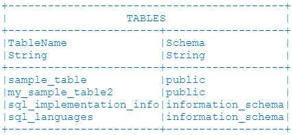

# AmiScript: SQL

## AMI SQL Introduction

AMI SQL is part of AMI's embedded scripting language [AmiScript](./ami_script.md) and provides SQL-like syntax for manipulating data from tables and other databases. 

AMI SQL contains familiar syntax and instructions, providing a comprehensive instruction set for working with table(s) of data. Key features include: 

-   **Retrieval** - Accessing and Normalizing data from external sources
-   **Blending** - Perform Joins and Unions on tables
-   **Modifying** - Inserting, Updating, and Deleting rows
-   **Analyzing** - Grouping, Sorting, and Filtering
-   **Schema Definition** - Creating, Updating, and Dropping tables

Broadly speaking, the logic steps involved in data-visualization are:

1. Running a query, or set of queries, on external datasources and/or the AMI-Realtime database.

	-   Each datasource is predefined and uniquely named.
	-   The results of queries on datasources will result in temporary, in-memory tables.
	-   The queries can be constructed using user-input/user-selected/user-associated data.
	-   In more advanced cases, the queries can be sequential, meaning the results from one query are then fed into a subsequent query (allowing for reactionary data blending).

1. Blending the results from **Step 1**, resulting in new temporary in-memory tables 3. Building visualizations on the tables from **Step 1** and/or **Step 2**

## AMI SQL and Standard SQL Differences

For those familiar with standard SQL, there are a few key differences:

1. Equality is done with `==`

	-   AMI SQL: `#!amiscript SELECT * FROM Users WHERE userid == 15;`
	-   MYSQL: `#!sql SELECT * FROM Users WHERE userid = 15;`

1. Checking for null is done with equality, ex. `== null`

	-   AMI SQL: `#!amiscript SELECT * FROM Users WHERE status == null;`
	-   MYSQL: `#!sql SELECT * FROM Users WHERE status IS NULL;`

1. Strings are surrounded in double quotes

	-   AMI SQL: `#!amiscript SELECT * FROM Users WHERE name == "David";`
	-   MYSQL: `#!sql SELECT * FROM Users WHERE name = 'David';`

1. "Matches" (`~~`) instead of LIKE

	-   AMI SQL: `#!amiscript SELECT * FROM Users WHERE name ~~ "^Dav";`
	-   MYSQL: `#!sql SELECT * FROM Users WHERE name LIKE 'Dav%';`

	(See [Simplified Text Matching](./ami_script.md#simplified-text-matching) for pattern matching rules/expressions)

1. Boolean expressions `&&` works same as AND.  `||` works same as OR

	-   AMI SQL: `#!amiscript SELECT * FROM Users WHERE userid == 15 AND status == null && name == "David";`
	-   MYSQL: `#!sql SELECT * FROM Users WHERE userid = 15 AND status IS NULL AND name = 'David';`

1. By default all tables are `TEMPORARY`, use the `PUBLIC` key word to make non-temporary tables: 

	-   AMI SQL: `#!amiscript CREATE TABLE MyTemporaryTable(id String);`
	-   MYSQL: `#!sql CREATE PUBLIC TABLE MyPermanantTable(id String);`

1. To return distinct values, equivalent to SQL `SELECT DISTINCT`, use `GROUP BY` instead 

    -   AMI SQL: `#!amiscript SELECT name FROM User GROUP BY name`
    -   MYSQL: `#!sql SELECT DISTINCT name FROM User`

1. To return the number of distinct column values, use the AmiScript method `countUnique()`

    -   AMI SQL: `#!amiscript SELECT countUnique(name) AS unique_name_count FROM User`
    -   MYSQL: `#!sql SELECT COUNT(DISTINCT name) AS unique_name_count FROM User`

## Data Source Access Clauses

### `USE...EXECUTE`

**Overview**

This command enables you to "execute" code on an external datasource and process/store the results locally.

-   `#!amiscript USE`: While datamodels have default options, you can override them for a particular query. The general format is: `#!amiscript USE use_option=some_option`. For example:

    ```amiscript 

    USE ds="AMI" 
    ```

    See the table below for a list of the different `#!amiscript USE` options available. 

    | Option                                        | Description                                                                                                                             |
    |-----------------------------------------------|-----------------------------------------------------------------------------------------------------------------------------------------|
    | `#!amiscript ds` or `#!amiscript datasource=` | <ul><li>The name of the datasource to execute this script on</li></ul>                                                                  |
    | `#!amiscript timeout`                         | <ul><li>The number of milliseconds before the execute command times out</li></ul>                                                       |
    | `#!amiscript limit`                           | <ul><li>The max number of records returned</li></ul>                                                                                    |
    | `#!amiscript ds_url`                          | <ul><li>Overrides the url of the datasource</li><li>When used in conjunction with `ds="datasource_name",` the supplied datasource must contain *URL* in the *PermittedOverrides* field</li></ul>                                                                                                                                         |
    | `#!amiscript ds_username`                     | <ul><li>Overrides the username of the datasource</li><li>When used in conjunction with `ds="datasource_name"`, supplied datasource must contain *USERNAME* in the *PermittedOverrides* field</li></ul>                                                                                                                            |
    | `#!amiscript ds_password`                     | <ul><li>Overrides the password of the datasource using a plain text password</li><li>When used in conjunction with `ds="datasource_name"`, supplied datasource must contain *PASSWORD* in the *PermittedOverrides* field</li><li>Use the more secure `ds_password_enc` option instead if supplying an encrypted password</li></ul>   |
    | `#!amiscript ds_password_enc`                 | <ul><li>Overrides the password of the datasource using an encrypted password. Use `#!amiscript strEncrypt(...)` to create an encrypted password</li><li>When used in conjunction with `ds="datasource_name"`, supplied datasource must contain *PASSWORD* in the *PermittedOverrides* field</li><li>Use instead of `#!amiscript ds_password`</li></ul>                                                                                                                                                                    |
    | `#!amiscript ds_options`                      | <ul><li>Override the options of the datasource</li><li>When used in conjunction with `ds="datasource_name"`, supplied datasource must contain *OPTIONS* in the *PermittedOverrides* field</li></ul>                                                                                                                                     |
    | `#!amiscript ds_relay`                        | <ul><li>Override the relay of the datasource</li><li>Run the `SHOW RELAYS` command in the AMI shell tool to inspect *RelayId* for available relays</li><li>When used in conjunction with `ds="datasource_name"`, supplied datasource must contain *RELAY* in the *PermittedOverrides* field</li></ul>                                 |
    | `#!amiscript ds_adapter`                      | <ul><li>Use an "anonymous" datasource of the specified adapter type</li><li>Run the `SHOW DATASOURCE_TYPES` command in the AMI shell tool and inspect the *I* column for available adapters</li><li>Use as an alternative to the `#!amiscript ds` option, cannot be used in conjunction with one another</li><li>See the `ami.db.anonymous.datasources.enabled` [option](../configuration_guide/center.md) for permission details</li></ul>                                                                                          |
    | `#!amiscript _custom`                         | <ul><li>Some custom user-supplied directive<\li><li>Prefixing with an underbar (`_`) passes the option through to the datasource's adapter</li></ul>                                                                                                                                                                                  |


-   `#!amiscript EXECUTE` The literal text to execute. The text will be sent directly to the datasource for execution. Therefore, variables cannot be referenced. Instead, substitution can be used. See [String Templating](./ami_script.md#string-templating).

**Syntax**

``` amiscript
[USE option = value  [  option = value  ...]]  EXECUTE code_to_execute
```

**Example**

``` amiscript
CREATE TABLE
 final_table AS
USE
 ds="mydb"
 timeout=10000
 limit=100
EXECUTE
 select * from mytable;
```

#### Query Parameters

For more complex queries, it is possible to declare parameters after the initial query using AmiScript `?` notation. 

The general format of using placeholder parameters uses the following syntax:

```amiscript
String query = "SQL_Query... ? ...";
[USE option = value] _p1=? ... EXECUTE ${query}
``` 

Parameters can either be passed individually in the order of being called: 

  - `#!amiscript _p1=param1 _p2=param2 ... _pn=paramn` 

```amiscript
String query = "SELECT * FROM `myTable` WHERE Name = ? || id = ? || Species = ? || Owner = ? || Age = ? group by ID";

String name = "Crouton";
int id = 1;
String species = "dog";
String owner = "Rob";
int age = 8;

CREATE TABLE City AS use ds="pets" _p01=name _p02=id _p03=species _p04=owner _p05 =age EXECUTE ${query};
```

or as a list of parameters: 

  - `#!amiscript _paramList` 

```amiscript
String query = "SELECT * FROM `myTable` WHERE Name = ? || id = ? || Species = ? || Owner = ? || Age = ? group by ID";

String name = "Crouton";
int id = 1;
String species = "dog";
String owner = "Rob";
int age = 8;
list pList = new list (name,id,species,owner,age);

CREATE TABLE City AS use ds="pets" _paramsList=pList EXECUTE ${query};
```

### `USE...SHOW TABLES`

**Overview**

This command enables you to see what tables are available on a given datasource (similar to what the AMI gui wizard shows you when selecting a table).

-   `USE`: While datamodels have default options, you can override them for a particular query.  Valid options include
    -   `ds = "datasource_name"` The name of the datasource to execute the script on

The resulting table will be called `TABLE` and contain two String columns: `TableName` and `Schema`.

**Syntax**                                                                                                  

``` amiscript
USE ds="mydb" SHOW TABLES;
```

**Example**

This example will return a table displaying all tables available in the *mydb* datasource. If the datasource supports schema names, that will be populated as well.

```
USE ds="mydb" SHOW TABLES;
```

Returns:



### `USE...INSERT`

**Overview**

This command uploads data from AMI into a datasource.

-   `USE`: While datamodels have default options, you can override them for a particular query.  Valid options include
    -   `ds = "datasource_name"` The name of the datasource to execute the script on

The resulting table will be called `TABLE` and contain two String columns: `TableName` and `Schema`

**Syntax**

``` amiscript
USE ds="datasource_name"  INSERT [INTO] datasource_table  [(col1[, col2 ...])] select_clause
USE ds="datasource_name"  INSERT [INTO] datasource_table  [(col1[, col2 ...])] analyze_clause 
USE ds="datasource_name"  INSERT [INTO] datasource_table  [(col1[, col2 ...])] prepare_clause 
USE ds="datasource_name"  INSERT [INTO] datasource_table  [(col1[, col2 ...])] execute_clause
USE ds="datasource_name"  INSERT [INTO] datasource_table  [(col1[, col2 ...])] VALUES values_expr[, values_expr ...]
USE ds="datasource_name"  INSERT [INTO] datasource_table  [(col1[, col2 ...])] Use_execute_clause
```

`datasource_name` - string name of the datasource containing the table to insert values into

`datasource_table` - name of the table to insert values into

**Examples**

This example will insert two rows into the *mydb* datasource's *users* table:

``` amiscript
USE ds="mydb" INSERT INTO users(name,city,state) values ("Rob","NYC","NY"),("Sara","OC","CA");
```

This example copy all rows from AMI's *my_users* table into the "mydb" datasource's *users* table:

``` amiscript
USE ds="mydb" INSERT INTO users(name,city,state) SELECT Name,Local,Region FROM my_users;
```

This example copy all rows from the *old_users* table in the *otherds* datasource to the *users* table in the *mydb* datasource.

``` amiscript
USE ds="mydb" INSERT INTO users(name,city,state) USE ds="otherds" EXECUTE SELECT * FROM old_users
```

### `CONCURRENT{}` Block (advanced)

**Overview**

When running analysis that needs to query many datasources, there can be large performance gains by executing these queries simultaneously. The `CONCURRENT{...}` key word causes all `EXECUTE` clauses within the block to be run in parallel (instead of sequentially).

In both of the examples below, we are going to execute three queries on three separate datasources (mydb1, mydb2, mydb3). The first example executes the queries sequentially and the second example executes the queries concurrently.

Assuming each query takes 2 seconds for a database to process, the first example will complete in about 6 seconds (2+2+2), while the second, concurrent, example will complete in only 2 seconds:

#### Example of Sequential Execution (Default)

``` amiscript
{
  CREATE TABLE mytable1 AS USE ds="mydb1" EXECUTE select * from mytable;
  CREATE TABLE mytable2 AS USE ds="mydb2" EXECUTE select * from mytable;
  CREATE TABLE mytable3 AS USE ds="mydb3" EXECUTE select * from mytable;
}
```

Here is the sequence of events:

- 00:00:00 -  EXECUTE clause is sent to mydb1

- 00:00:00 -  *AMI Script sleeps until there is a response from mydb1...*

- 00:00:02 - mytable1 is created (from result of query to mydb1)

- 00:00:02 -  EXECUTE clause is sent to mydb2

- 00:00:02 -  *AMI Script sleeps until there is a response from mydb2...*

- 00:00:04 - mytable2 is created (from result of query to mydb2)

- 00:00:04 -  EXECUTE clause is sent to mydb3

- 00:00:04 -  *AMI Script sleeps until there is a response from mydb3...*

- 00:00:06 - mytable3 is created (from result of query to mydb3)

- 00:00:06 -  Block is complete after 6 seconds (code after the block will be executed)

#### Example of Concurrent Execution

So now let's add the CONCURRENT keyword before the block.  In this case, all 3 executes will be initiated at the same time.

``` amiscript
CONCURRENT{
  CREATE TABLE mytable1 AS USE ds="mydb1" EXECUTE select * from mytable;
  CREATE TABLE mytable2 AS USE ds="mydb2" EXECUTE select * from mytable;
  CREATE TABLE mytable3 AS USE ds="mydb3" EXECUTE select * from mytable;
}
```

Here is the sequence of events:

- 00:00:00 - EXECUTE clause is sent to mydb1

- 00:00:00 - EXECUTE clause is sent to mydb2

- 00:00:00 - EXECUTE clause is sent to mydb3

- 00:00:00 - *AMI Script sleeps until there is a response from all 3 queries...*

- 00:00:02 - mytable1 is created (from result of query to mydb1)

- 00:00:02 - mytable2 is created (from result of query to mydb2)

- 00:00:02 - mytable3 is created (from result of query to mydb3)

- 00:00:02 -  Block is complete after 2 seconds (code after the block will be executed)

## Query Clauses

### `SELECT`

**Overview**

The `#!amiscript SELECT` clause is used to retrieve data from some underlying datasource, much like all standard SQL `SELECT` clauses.

In AmiScript, it can be used with a combination of the following options:

- `#!amiscript WHERE`: filtering
- `#!amiscript ORDER BY`: sorting 
- `#!amiscript GROUP BY`: aggregating 
- `#!amiscript LIMIT`: cropping 

To tune results for individual tables. 


Results can then be combined via Unions (`#!amiscript UNION`) and/or Joins (`#!amiscript FROM ... JOIN ON`). Complex Strings containing delimited data can be split into distinct rows via the `#!amiscript UNPACK` operation. Finally, see the [`CREATE TABLE AS` clause](#create-table-as) for storing the final result of a select clause into another table.

-   To aggregate data, use the `#!amiscript GROUP BY` clause to identify any number of columns or derived values that should be used to group rows. Provide an alias (`#!amiscript AS`) for derived values to be used within the select clause. The select columns can only use aggregate functions (min, max, count, sum) on underlying rows and columns declared in the group-by clause
-   To filter data, provide a `#!amiscript WHERE` clause which evaluates to a Boolean.  True indicates don't filter. When filtering in conjunction with aggregating (`#!amiscript GROUP BY`), those records filtered out will not be considered for aggregation.  To filter rows after aggregation, use the `#!amiscript HAVING` clause.
-   For projecting, supply columns to include in the `#!amiscript SELECT` clause.  Derived values may be provided. Provide an alias (`#!amiscript AS`) for derived values or to rename a column.  Use star (\*) to include all columns or tblname.\* to include only those columns from a particular table provided in the `#!amiscript FROM` clause.
-   To crop out rows, use the `#!amiscript LIMIT` clause. You may provide a number of rows to skip (`#!amiscript offset`) and a number of maximum rows to return (`#!amiscript rowcount`).
-   To sort, use the `#!amiscript ORDER BY` clause. If multiple expressions are given the left-most takes priority.
-   To union (concatenate) the results from multiple select clauses, use the `#!amiscript UNION` clause. The column names and types from the first select clause will provide the result set schema definition.  If BYNAME is specified, then target columns and source columns are mapped by column name. If BYNAME is not specified all select clauses participating in a union must define the same number of columns. Note: this operates like a *union all* in many databases.
-   To join (blend) tables, supply all tables together in the `#!amiscript FROM` clause and a Cartesian product will be provided. For more advanced Joins, you can use a combination of the LEFT, RIGHT, OUTER, JOIN, ON and NEAREST clauses. See [Joining Data](#joining-data) section for details
-   To process String columns containing multi-value delimited data, use the `#!amiscript UNPACK col ON delimeter` expression. This will split the string such that each entry will result in a new row.

**Syntax**

``` amiscript
SELECT column_expr|lambda_expr  [,  column_expr|lambda_expr  ...] FROM table_expr|nested_select_expr  [, table_expr|nested_select_expr  ...]|
    [[LEFT|RIGHT|OUTER] [ONLY] JOIN [table_expr|nested_select_expr] [ON expr] [NEAREST nearest_expr]]
    [WHERE where_expr ]
    [GROUP BY column_expr [, column_expr ...] [HAVING expr ]]
    [ORDER BY expr [ASC|DESC] [, expr [ASC|DESC] ...]]
    [UNPACK col_to_unpack ON unpack_delimiter [,col_to_unpack ON unpack_delimiter]]
    [LIMIT [offset,] rowcount]
[UNION [BYNAME] select_clause] 
```

`offset` - integer number of rows to skip

`rowcount` - integer number of maximum rows that will be returned

#### Joining Data

##### Simple Cartesian Joins

Any number of tables can be joined by simply listing them after the `#!amiscript FROM` clause which will produce a Cartesian product, such that a row will be returned for each possible combination of rows from the source table.  For example, the Cartesian product of a table with 5 rows and another table with 3 rows will produce 15 rows (5x3=15). Of course, the WHERE clause can be used to limit results to only the interesting combinations.

##### Handling Rows that don't match rows in other tables

For more granular control when joining two tables, use the `#!amiscript JOIN` syntax.  There are 7 types of statements, let's assume two tables a and b:

-   **JOIN:** `#!amiscript FROM a JOIN b ON expr`  - This is the same as *FROM* a,b *WHERE* `#!amiscript expr`
-   **LEFT JOIN:** `#!amiscript FROM a LEFT JOIN b ON expr` - A JOIN plus all records from table a that would otherwise be omitted (due to the expr).
-   **LEFT ONLY JOIN:** `#!amiscript FROM a LEFT ONLY JOIN b ON expr` - Includes only records from table a that would otherwise be omitted (due to the expr).
-   **RIGHT JOIN:** `#!amiscript FROM a RIGHT JOIN b ON expr` - A JOIN plus all records from table b that would otherwise be omitted (due to the expr). (similar to LEFT JOIN, swapping a and b)
-   **RIGHT ONLY JOIN:** `#!amiscript FROM a RIGHT ONLY JOIN b ON expr` - Includes only records from table b that would otherwise be omitted (due to the expr). (similar to LEFT ONLY JOIN, swapping a and b)
-   **OUTER JOIN**: A JOIN plus all records from table `#!amiscript a` and from table `#!amiscript b` that would otherwise be omitted (due to the expr)
-   **OUTER ONLY JOIN**: Includes only records from table a and from table b that would otherwise be omitted (due to the expr).

##### Joining to a nearest match

Use the `#!amiscript NEAREST` clause in conjunction with one of the above 7 JOIN clauses to match two records where there may not be an exact match, such as doing an "as-of" join with timestamps. After the `#!amiscript ON` clause, include a `#!amiscript NEAREST fuzzy_clause`.

Consider: `#!amiscript a JOIN b ON on_expr NEAREST fuzzy_clause`, where the fuzzy clause is one of the 5 syntaxes:

-   `#!amiscript a.cola == b.colb` - For each row in table `#!amiscript a`, join with the row in table `#!amiscript b` that satisfies `#!amiscript on_expr` and has the smallest delta between `#!amiscript cola` and `#!amiscript colb`.
-   `#!amiscript a.cola <= b.colb` - For each row in table `#!amiscript a`, join with the row in table `#!amiscript b` that satisfies `#!amiscript on_expr` and `#!amiscript cola` is less than or equal to `#!amiscript colb` and has the smallest delta between `#!amiscript cola` and `#!amiscript colb`.
-   `#!amiscript a.cola >= b.colb` - For each row in table `#!amiscript a`, join with the row in table `#!amiscript b` that satisfies `#!amiscript on_expr` and `#!amiscript cola` is greater than or equal to `#!amiscript colb` and has the smallest delta between `#!amiscript cola` and `#!amiscript colb`.
-   `#!amiscript a.cola < b.colb` - For each row in table `#!amiscript a`, join with the row in table `#!amiscript b` that satisfies `#!amiscript on_expr` and `#!amiscript cola` is less than colb and has the smallest delta between `#!amiscript cola` and `#!amiscript colb`.
-   `#!amiscript a.cola > b.colb` - For each row in table `#!amiscript a`, join with the row in table `#!amiscript b` that satisfies `#!amiscript on_expr` and `#!amiscript cola` is greater than colb and has the smallest delta between `#!amiscript cola` and `#!amiscript colb`.

Note the ordering of table `#!amiscript a` vs `#!amiscript b` in the `#!amiscript fuzzy_clause` does not matter. For example  `#!amiscript b.colb >= a.cola` is the same as `#!amiscript a.cola <= b.colb`

##### General Examples

``` amiscript
SELECT age, dob, weight, name FROM Patients
SELECT age, dob, weight, name FROM Patients WHERE name =~ "mr"
SELECT count(*) as cnt, age, avg(dob), stdev(weight) FROM Patients GROUP BY age ORDER BY age
SELECT * FROM Patients, Accounts WHERE Patients.id == Accounts.patient_id
SELECT * FROM Orders JOIN MarketData ON Orders.symbol==MarketData.symbol NEAREST marketData.time<=Orders.time
SELECT * EXCEPT (OrderID, Quantity) from Orders; //return all Orders data except the OrderID and Quantity Columns
SELECT * FROM Orders where OrderId in ("a1","a2","b1");
SELECT * FROM Orders where OrderId in (select origOrderId from AnotherTable);
SELECT * FROM Orders where (OrderId, account) in (("a1","account1"),("a2","account1"),("b1","account2"));
SELECT * FROM Orders where (OrderId, account) in (select origOrderId, origAccount from AnotherTable);
SELECT symbol FROM MarketData GROUP BY symbol; //Get unique symbols from the MarketData table.
```

##### Nearest Join Examples

Assume two existing tables: Orders and MarketData

``` amiscript
SELECT * FROM Orders;
```


``` amiscript
SELECT * FROM MarketData;
```


A JOIN will only include orders that have a satisfactory market data event. Note, we're also calculating the price delta from the order vs the market

``` amiscript
select *,Orders.Price-MarketData.Price as delta from Orders JOIN MarketData ON Orders.sym==MarketData.sym NEAREST Orders.time>=MarketData.time ORDER by Orders.time;
```


A LEFT JOIN will include all orders, event those without a market data event (using null as a place holder)

``` amiscript
select *,Orders.Price-MarketData.Price as delta from Orders LEFT JOIN MarketData ON Orders.sym==MarketData.sym NEAREST Orders.time>=MarketData.time ORDER by Orders.time;
```


##### Join Examples

Let's assume we have two tables A and B, each with 1 column:


We can see that the value **1** only exists in the **A** table, the value **3** exists only in the **B** table and the value **2** existing in both tables.  When comparing the data between them there are, exhaustively speaking, 7 different ways you could want to see what matches and what doesn't.

|                                    | JOIN { width="30" } | OUTER JOIN { width="30" } | OUTER ONLY JOIN { width="30" } | LEFT JOIN { width="30" } | LEFT ONLY JOIN { width="30" } | RIGHT JOIN { width="30" } | RIGHT ONLY JOIN { width="30" } |
|------------------------------------|-----------------------------------------------------------------------|---------------------------------------------------------------------------------------|----------------------------------------------------------------------------------------------------|------------------------------------------------------------------------------------|-------------------------------------------------------------------------------------------------|---------------------------------------------------------------------------------------|----------------------------------------------------------------------------------------------------|
| Include Matches?                   | YES | YES |     | YES |    | YES |     |
| Includes Left W/O a Match on Right |     | YES | YES | YES |YES |     |     |
| Includes Right W/O a Match on Left |     | YES | YES |     |    | YES | YES | 

{ width="30" }**JOIN Syntax** - Return only those rows with values that coexist in both tables.  (Note, this is the same as the natural join select \* from a,b where a.aid==b.bid)

``` amiscript
SELECT * FROM a JOIN b on a.aid==b.bid
```


{ width="30" }**OUTER JOIN Syntax** - Return all rows from both tables.

``` amiscript
SELECT * FROM a OUTER JOIN b on a.aid==b.bid
```


{ width="30" }**OUTER ONLY JOIN Syntax** - Return rows in the left table that don't have matching rows in the right table and rows in the right table that don't have matching rows in the left table.

``` amiscript
SELECT * FROM a OUTER ONLY JOIN b on a.aid==b.bid
```


{ width="30" }**LEFT JOIN Syntax** - Return all rows from the left table and only the rows in the right table matching rows in the left table.

``` amiscript
SELECT * FROM a LEFT JOIN b on a.aid==b.bid 
```


{ width="30" }**LEFT ONLY JOIN Syntax** - Return only rows in the left table that don't have matching rows in the right table.

``` amiscript
SELECT * FROM a LEFT ONLY JOIN b on a.aid==b.bid 
```


{ width="30" }**RIGHT JOIN Syntax** - Return all rows from the right table and only the rows in the left table matching rows in the right table.  (Note, this is equivalent to ... FROM b LEFT JOIN a ...)

``` amiscript
SELECT * FROM a RIGHT JOIN b on a.aid==b.bid 
```


{ width="30" }**RIGHT ONLY JOIN Syntax** - Return only rows in the right table that don't have matching rows in the left table.  (Note, this is equivalent to ... FROM b LEFT ONLY JOIN a ...)

``` amiscript
SELECT * FROM a RIGHT ONLY JOIN b on a.aid==b.bid 
```


**MULTIPLE TABLES INNER JOIN Syntax** - Return rows that are joined based on columns from multiple tables. (Note, we only support inner join for mutliple table joins)

``` amiscript
CREATE PUBLIC TABLE Orders(Id Int,Symbol String,SideId Int, StatusId Int);
INSERT INTO Orders VALUES(1,"AAPL",1,3),(2,"IBM",2,1),(3,"MSFT",2,2),(4,"TSLA",1,4);
CREATE PUBLIC TABLE Side(SideId Int, Side String);
INSERT INTO Side VALUES(1,"Buy"),(2,"Sell");
CREATE PUBLIC TABLE Status(StatusId Int, Status String);
INSERT INTO Status VALUES(1,"New"),(2,"Partial"),(3,"Filled"),(4,"Cancelled");
//Join Three Tables
SELECT o.Id,o.Symbol,a.Side,b.Status FROM Orders AS o, Side AS a, Status AS b WHERE a.SideId==o.SideId AND b.StatusId==o.StatusId;
```

  


**TABLE UNPACKING Syntax** - Return the result unpacked by a specific delimiter based on a specific column

``` amiscript
CREATE TABLE Orders (orderId String,accounts String);
INSERT INTO Orders VALUES("ord1","a1,a2,a3"),("ord2","b4,b5"),("ord3","");
SELECT * FROM Orders UNPACK accounts ON ",";
```


### `ANALYZE`

#### Overview

For cases where users want to perform rolling calculations and do **not** want to collapse rows of datas (which `#!amiscript GROUP BY` does), instead the AmiScript `#!amiscript ANALYZE` clause can be used to perform row-based calculations on a given table. This is loosely similar to SQL window functions. 

In AMI, `#!amiscript ANALYZE` is used in conjunction with `#!amiscript WINDOW` to perform analysis (using AmiScript aggregate methods) on rows contained in a defined window, similar to a self-join. 

Each window can define an order-by to allow for finer control over the order in which an aggregate is applied.  Multiple windows may be defined. See [window_expr](#window_expr) for details.

When adding columns, the new cells will default to null. The column will be added to the end (right-most) of the table.

``` amiscript
ANALYZE agg_expr [, agg_expr ...]  FROM tblname  window_expr  [,  window_expr  ...]
```

`tblname` - string name of the table to alter the schema of

**Example**

``` amiscript
{
  CREATE TABLE data(sym string, price double, hours int);
  INSERT INTO data VALUES
  ("AAPL",180.40,0),
  ("AAPL",175.78,1),
  ("AAPL",173.20,2),
  ("AAPL",169.98,3),
  ("AAPL",176.62,4),
  ("GOOG",150.01,2),
  ("GOOG",148.65,3),
  ("GOOG",149.97,4),
  ("GOOG",152.56,5),
  ("GOOG",157.91,6);
}

// ANALYZE statement to evaluate the minimum, maximum, and average price of a stock in a given period of time.

{
CREATE TABLE AnalyzePrice AS ANALYZE 
sym, price, avg(win.price) AS avgPrice, min(win.price) AS minPrice, max(win.price) AS maxPrice, hours as hours
FROM data
WINDOW win ON hours > 1 && hours < 3 
PARTITION BY sym;
};
```

### `PREPARE`

**Overview**

This command allows the user to "prepare" additional columns whose values are calculated as aggregates across multiple rows. This is useful for calculations that require information from previous rows, for example a cumulative total.

There are a number of AmiScript Prepare functions that can be used inside the `#!amiscript PREPARE` clause to create columns with useful calculations. For example, for rolling totals, the `#!amiscript STACK()` can be used(see below).

Other useful options for a `#!amiscript PREPARE` clause include: 

-   `#!amiscript ORDER BY`: In many cases, the ordering of rows in the input table is important, especially for running sums. The `#!amiscript ORDER BY` clause is useful to guarantee the correct ordering.
-   `#!amiscript PARTITION BY`: Used to perform many aggregates on a single table, each aggregate considering only a subset of the table's rows based on some grouping criteria.

The general syntax is as follows:

``` amiscript
PREPARE prep_expr [, prep_expr ...]  FROM tblname   
  [ORDER BY expr [ASC|DESC] [, expr [ASC|DESC] ...]]
  [PARTITION BY column_expr [, column_expr ...]]
```

`tblname` - string name of the table to alter the schema of

**Example** This example will produce the running total of stocks bought/sold and the amount spent.

``` amiscript
{
  CREATE TABLE data(sym string, amount int, price double);
  INSERT INTO data VALUES
  ("AAPL",10,140.23),
  ("GOOG",100,189.59),
  ("ORCL",20,120.93),
  ("MSFT",50,99.12),
  ("GOOG",10,201.23),
  ("AAPL", 100,120.16),
  ("GOOG",15,198.89),
  ("MSFT",5,108.27),
  ("AAPL", 20,118.12),
  ("GOOG",-120,204.36),
  ("MSFT",-50,110.66);
}

// PREPARE statement 

{
  CREATE TABLE TotalSpend AS PREPARE 
  sym, amount, price, stack(amount) as runningTot, stack(price*amount) as totSpent 
  FROM data 
  ORDER BY price ASC 
  PARTITION BY sym;
}
```

## Data Modification

### `INSERT...VALUES`

**Overview**

This clause enables the insertion of raw values into an existing table.  Many rows may be inserted in a single call. Each values_expr represents a single row of data to be inserted. To insert multiple rows append additional values_expr

In order to specify columns in which to insert values, provide an ordered list of column names after the table name.  The same number of values must be supplied in the values_expr and in the same order.  All other columns will default to null.

If a list of column names is not provided, all columns will be populated. Each values_expr should contain one value for each column in the target table. Values should be in the same natural order as the columns in the target table.

The forloop_expr allows for the insertion of values_expr to be repeated for each cycle of the for loop. The values can reference the for loop's declared variable. Multiple for loops can be nested inside one another.

**Syntax**

``` amiscript
INSERT [INTO] tblname [(col1[, col2 ...])] [forloop_expr ...] VALUES values_expr[, values_expr ...] [LIMIT maxinsert]
```

`tblname` - string name of the table to insert into

`colN` - string name of the column to contain the Nth value from values_expr

**Examples**

``` amiscript
INSERT INTO rectangles (area, perimeter) VALUES (20,18);
int length=10,width=5;
INSERT INTO rectangles (area, perimeter) VALUES ((length * width), (2 * length + 2 * width));
```

### `INSERT...FROM`

**Overview**

This clause causes the insertion of the result of a *projecting-clause* (select_clause, analyze_clause, prepare_clause, execute_clause) into an existing table.  Each row from the result set of the select_clause will result in the insertion of a new record into the target table. Please note, multiple tables may be inserted in a single call using the `#!amiscript UNION` clause.

In order to specify columns in which to insert values, provide an ordered list of column names after the table name.  The result set from the preceding select\_clause must have the same number of columns. The columns should be in the same order.  All other columns will default to null.

If a list of column names is not provided, all columns will be populated. Each values_expr should contain one value for each column in the target table. Values should be in the same natural order as the columns in the target table.

If the BYNAME keyword is included, then source and target columns are aligned based on column name. Column Names in the target table that do not existing in the query clause will be populated with null

**Syntax**

``` amiscript
INSERT [INTO]  tblname [(col1[, col2 ...])] [BYNAME] [FROM]  select_clause
INSERT [INTO]  tblname [(col1[, col2 ...])] [BYNAME] [FROM]  analyze_clause
INSERT [INTO]  tblname [(col1[, col2 ...])] [BYNAME] [FROM]  prepare_clause
INSERT [INTO]  tblname [(col1[, col2 ...])] [BYNAME] [FROM]  execute_clause
INSERT [INTO]  tblname [(col1[, col2 ...])] [BYNAME] [FROM]  describe_clause
INSERT [INTO]  tblname [(col1[, col2 ...])] [BYNAME] [FROM]  show_clause
INSERT [INTO]  tblname [(col1[, col2 ...])] [BYNAME] [FROM]  call_clause
```

`tblname` - string name of the table to insert into

`colN` - string name of the column to contain the Nth value from results of select clause*

**Example**

``` amiscript
INSERT INTO employee_summary (age, birthplace) FROM SELECT age, birthplace FROM employee
```

### `SYNC`

**Overview**

This clause causes the *target* *table* to reflect the result of a *projecting-clause* (select_clause, analyze_clause, prepare_clause, execute_clause), meaning that rows will be *inserted*, *deleted* and *updated* accordingly on the target table such that the target table will properly mirror the result of the *projecting-clause*.

In otherwords, the two examples will result in the same final state for the my_target table, but from a trigger stand point they are significantly different:

``` amiscript
//Example 1: using a traditional clear-and-rebuild technique:
 TRUNCATE my_target; INSERT INTO my_target FROM SELECT * from my_source;
//Example 2: using the sync method:
 SYNC my_target FROM SELECT * from my_source;
```

In the first example, the truncate instruction will cause a *delete trigger* to be fired for every row originally in the my_target table and then the subsequent insert instruction will cause an *insert trigger* to be fired for every row inserted into the my_target table.  

The following rules apply for how the target table is mutated:

-   Records in the *projecting-clause* that do not have a matching record in the *target* table are **inserted** into the target table
-   Records in the *target* table that do not have a matching record in the *projecting-clause* are **deleted** from the target table
-   Records in the *target* table that have a "perfect" matching record in the *projecting-clause* remain **untouched**. (no triggers fired
-   Records in the *target* table that have a "non-perfect" matching record in the *projecting-clause* are **updated**.

An `#!amiscript ON` clause can be used to tell the sync tool how to determine if a source and target row are considered equivalent.  When an equivalent row between the target table and projecting-clause is identified, this will result in an update.  Rows that don't have a match will result in a delete and/or insert.

Matching Rules:

-   If  all cells between two rows are equivalent, that is considered a "Perfect match"
-   If an `#!amiscript ON` clause is specified: Two row are considered a "non-perfect" match if all of the cells specified in the ON clause are a match, but other cells are not.  (If an `#!amiscript ON` clause is not specified then there can not be non-perfect matches)

In order to specify columns in which to sync values, provide an ordered list of column names after the table name (note that only these columns will be considered for the perfect-matching criteria).  The result set from the preceding select_clause must have the same number of columns. The columns should be in the same order.  All other columns will default to null for inserts and will be left unaltered for updates.

If a list of column names is not provided, all columns will be populated. Each values_expr should contain one value for each column in the target table. Values should be in the same natural order as the columns in the target table.

**Syntax**

``` amiscript
SYNC [INTO]  tblname [(col1[, col2 ...])] [ON(onCol1,[,onCol2])] [FROM]  select_clause
SYNC [INTO]  tblname [(col1[, col2 ...])] [ON(onCol1,[,onCol2])] [FROM]  analyze_clause
SYNC [INTO]  tblname [(col1[, col2 ...])] [ON(onCol1,[,onCol2])] [FROM]  prepare_clause
SYNC [INTO]  tblname [(col1[, col2 ...])] [ON(onCol1,[,onCol2])] [FROM]  execute_clause
```

`tblname` - string name of the table to insert into

`colN` - string name of the column to contain the Nth value from results of select clause

onColN - string name of the column to be used in determining if two records are equivalent

**Examples**

``` amiscript
SYNC accounts USE ds=my_datasource EXECUTE select * from Accounts;
SYNC new_employees SELECT * FROM old_employees;
```

### `DELETE FROM`

**Overview**

This clause enables the deletion of specific rows or all rows from a table and also calls the onDelete triggers if applicable.  
When it comes to deleting all rows from the table, this is similar to using truncate clause but consumes more memory.  
To delete only specific rows, provide a `#!amiscript WHERE` clause which must evaluate to a Boolean value where true indicates that the row should be deleted. Otherwise, to delete all rows, do not provide a `#!amiscript WHERE` clause.

You can specify the maximum number of rows to delete using the `#!amiscript LIMIT` clause (maxdelete). Additionally, you may provide a number of rows to skip when deleting (skipdelete). Note the limit is applied after the  where clause, meaning that the skipdelete indicates how many records to skip deleting that would otherwise be deleted based on the where clause.

The `#!amiscript JOIN .. ON` clause allows you to use the values from another table to determine which rows to delete from the target table. The `#!amiscript JOIN` operates similar to the `#!amiscript SELECT`'s `#!amiscript JOIN` clause. Note that `#!amiscript LEFT JOIN` and `#!amiscript LEFT ONLY` are also supported. Keep in mind that you can only delete rows from the left table.

**Syntax**

``` amiscript
DELETE FROM tblname [WHERE where_expr] [LIMIT [skipdelete,] maxdelete]
DELETE FROM tblname [LEFT [ONLY] JOIN table_expr ON expr ]  [WHERE where_expr] [LIMIT [skipdelete,] maxdelete]
DELETE FROM tblname [LEFT [ONLY] JOIN table_expr ON expr ]  [WHERE where_expr] [LIMIT [skipdelete,] maxdelete]
```

`tblname` - string name of the table to delete from

**Examples**

``` amiscript
//deletes all records from names table
DELETE FROM names;

//deletes all records where name is Dave
DELETE FROM names WHERE first_name == "Dave";

//delete 1st & 2nd record where name is Dave
DELETE FROM names WHERE first_name == "Dave" LIMIT 2;

//deletes 3rd record where name is Dave
DELETE FROM names WHERE first_name == "Dave" LIMIT 2,1;

//deletes all records from names where the first_name has a match with the user's table
DELETE FROM names JOIN users ON first_name == users.name; 

//deletes all records from names where the first_name does NOT have a match with the user's table
DELETE FROM names LEFT ONLY JOIN users ON first_name == users;
```

### `TRUNCATE`

**Overview**

This command deletes all rows from a table. You can specify multiple tables, separated by commas.

**Syntax**

``` amiscript
TRUNCATE [TABLE]  tblname [, tblname ...] 
```

**Examples**

``` amiscript
TRUNCATE TABLE Accounts;
TRUNCATE TABLE Orders, Executions, Alerts;
```

### `UPDATE`

**Overview**

This clause can be used to update specific rows or all rows in a table. Following the `#!amiscript SET` statement, provide an assignment (`#!amiscript target=expr`) clause for each column to be updated, where target is the name of an existing column.

To update only specific rows, provide a `#!amiscript WHERE` clause which evaluates to a Boolean value, where true indicates that the row should be updated. Otherwise, to update all rows, do not provide a `#!amiscript WHERE` clause.

You can specify the maximum number of rows to update using the `#!amiscript LIMIT` clause (`#!amiscript maxupdate`). Additionally, you may provide a number of rows to skip when updating (`#!amiscript skipupdate`). Note the limit is applied after the  where clause, meaning that the skipupdate indicates how many records to skip updating that would otherwise be updated based on the where clause.

The `#!amiscript JOIN .. ON` clause allows you to use the values from another table to update values in the target table. The `#!amiscript JOIN` operates similar to the `#!amiscript SELECT`'s `#!amiscript JOIN` clause. Note that `#!amiscript LEFT JOIN` and `#!amiscript LEFT ONLY` are also supported. Keep in mind that you can only update values on the left table.

**Syntax**

``` amiscript
UPDATE tblname  SET col1=expr [, col2=expr...] [WHERE where_expr] [LIMIT [skipupdate,] maxupdate]
UPDATE tblname [LEFT [ONLY] JOIN table_expr ON expr ] SET col1=expr [, col2=expr...] [WHERE where_expr] [LIMIT [skipupdate,] maxupdate]
UPDATE tblname [LEFT [ONLY] JOIN table_expr ON expr ] SET col1=expr [, col2=expr...][WHERE where_expr] [LIMIT [skipupdate,] maxupdate]
```

`tblname` - string name of the table to update

`colN` - string name of the column to assign value from expression

``` amiscript
UPDATE groceries SET price = 10, status=null; //update all records setting price to 10 and status  to null
UPDATE groceries SET price = price + 1 WHERE type == "dairy" //increment price for all records where type is dairy
UPDATE groceries SET price = price + 1 WHERE type == "dairy" LIMIT 10; //increments the price for the first 10 records where type is dairy 
UPDATE groceries SET price = price + 1 WHERE type == "dairy" LIMIT 3,2 ; //increments the price for the 4th and 5th  record where type is dairy 
UPDATE flags set a1=a2,a2=a1 where a1<a2; //Swap the values in the a1 and a2 columns where a1 is less than a2
UPDATE groceries JOIN products ON groceries.id==products.grocery_id SET
price=products.price WHERE type == "dairy"; // Sets the price from the
products table onto the groceries table where the ids match.
```

## Schema Modification

### `CREATE TABLE`

**Overview**

This command is used to create a new, empty (no rows) table with a specified set of columns (names and types).  If another table already exists with the `#!amiscript tblname`, the existing table will be implicitly dropped and replaced with the newly created table.  

At least one column must be specified, and each column must have a unique name. 

**Syntax**

``` amiscript
CREATE TABLE [IF NOT EXISTS] tblname (col1 type_expr  [, col2 type_expr ...])
```

`tblname` - string name of the table to create

`colN` - string name of the Nth column to create

**Example**

``` amiscript
CREATE TABLE countries (country String, language String, GDP Double)
```

### `CREATE TABLE AS`

**Overview**

This command is used to create a new table which has the same schema definition as the result set of a select_clause.  If another table already exists with the `#!amiscript tblname`, the existing table will be implicitly dropped and replaced with the newly created table.

All rows from the select_clause's result set will be inserted into the table.     

**Syntax**

``` amiscript
CREATE TABLE [IF NOT EXISTS] tblname[(col1 column_type  [, col2 column_type ...])] AS select_clause
CREATE TABLE [IF NOT EXISTS] tblname[(col1 column_type  [, col2 column_type ...])] AS analyze_clause
CREATE TABLE [IF NOT EXISTS] tblname[(col1 column_type  [, col2 column_type ...])] AS prepare_clause
CREATE TABLE [IF NOT EXISTS] tblname[, tblname ...]  AS execute_clause
CREATE TABLE [IF NOT EXISTS] tblname[(col1 column_type  [, col2 column_type ...])] AS describe_clause
CREATE TABLE [IF NOT EXISTS] tblname[(col1 column_type  [, col2 column_type ...])] AS show_clause
CREATE TABLE [IF NOT EXISTS] tblname[(col1 column_type  [, col2 column_type ...])] AS call_clause
```

`tblname` - string name of the table to create

**Example**

``` amiscript
CREATE TABLE names AS SELECT first_name, last_name FROM employees
```

### `ALTER_TABLE`

**Overview**

This command alters the schema (column names and types) of an existing table. There are 4 alter commands:

- `#!amiscript ADD` 

  - Add columns

- `#!amiscript RENAME ... TO` 

  - Rename columns 

- `#!amiscript DROP` 

  - Delete columns 

- `#!amiscript MODIFY` 

  - Change column type 
  - A best effort cast will be applied. If no appropriate casting exists, the values will become null.


When multiple alterations are supplied, they are evaluated left to right. New columns will be added to the end (right-most) of the table.

**Syntax**

``` amiscript
ALTER TABLE tblname alter_col_expr [, alter_col_expr  ...]
```

`tblname` - string name of the table to alter

**Examples**

``` amiscript
ALTER TABLE AccountHoldings ADD UserId long, RENAME AccountId TO Account_Id, DROP UserInfo
ALTER TABLE AccountHoldings MODIFY UserId AS UserId INT
ALTER TABLE AccountHoldings RENAME UserId TO UserIds, ADD UserId STRING
```

By default, values in newly added columns will be null. To specify a non-null default value, use the equal operator followed by any additional logic. 

**Examples**
```amiscript
ALTER TABLE AccountHoldings ADD TotalPrice Double = Price*Quantity;
ALTER TABLE AccountHoldings ADD CustomerFullname String = strLower(Forename+Surname);
```

### `RENAME TABLE`

**Overview**

This command renames an existing table. If another table already exists with the newname, the existing table will be implicitly dropped and replaced with the renamed table.

**Syntax**

``` amiscript
RENAME TABLE tblname  TO newname
```

`tblname` - string name of the table to rename

`newname` - string name of the new name for the table

**Example**

``` amiscript
RENAME TABLE AccountHoldings TO Accounts
```

### `DROP TABLE`

**Overview**

This command drops an existing table, along with its schema and all rows. You can specify multiple tables, separated by commas.

**Syntax**

``` amiscript
DROP TABLE [IF EXISTS] tblname [, tblname ...] 
```

`tblname` - string name of the table to drop

**Example**

``` amiscript
DROP TABLE Accounts
```

## AMIDB Scope Options

**TEMPORARY**

A table visible only to the user. It exists as long as the user session is active.

**VARIABLE**

A table created as an AMI Script Table object. It has the same scope and lifetime as a TEMPORARY table.

```amiscript
Table vt = SELECT * FROM Tablename;
```

**PUBLIC**

A table which is visible to all users. Its definition (but not the content) persists. For persistent content see [PersistEngine](../center/realtime_tables.md#create-public-table) options.

If the scope is not specified, AMI will first check `TEMPORARY` tables, then `VARIABLE` tables, and lastly `PUBLIC` tables. Tables with different scopes but the same name can exist. However, if a PUBLIC table already exists, then it cannot be created again.

You may look at the **DefinedBy** column to see if a column is a variable or temporary.

**Note**: Argument `TEMP` can also be used instead of `TEMPORARY` with the same effect

### Display

``` amiscript
SHOW [TEMPORARY|PUBLIC|VARIABLE] TABLES;
```

*shows scoped tables*

``` amiscript
SHOW [TEMPORARY|PUBLIC|VARIABLE] COLUMNS;
```

*shows columns of scoped tables*

``` amiscript
SHOW [TEMPORARY|PUBLIC|VARIABLE] TABLE TableName; 
```

*shows column details of a scoped table*

``` amiscript
DESCRIBE [TEMPORARY|PUBLIC|VARIABLE] Tablename;
```

*provides the command which can be used to create the scoped table*

### Schema Modification

#### CREATE

``` amiscript
CREATE [TEMPORARY|PUBLIC] TABLE Tablename ...;
```

*creates a scoped table*

**Examples**

``` amiscript
CREATE TABLE TempTable1 (a int);
CREATE TEMP TABLE TempTable2 (a int);
CREATE TEMPORARY TABLE TempTable3 (a int);
CREATE PUBLIC TABLE PubTable1 (x int);
CREATE PUBLIC TABLE PubTable2 (x int, y double);
```

#### ALTER

``` amiscript
ALTER [TEMPORARY|PUBLIC|VARIABLE] TABLE Tablename ...;
```

*modifies a scoped table*

**Examples**

``` amiscript
ALTER TEMPORARY TABLE TempTable1 ADD id String;
ALTER TEMPORARY TABLE TempTable2 MODIFY a as a BigInteger;
ALTER TEMPORARY TABLE TempTable3 RENAME a to b;
ALTER PUBLIC TABLE PubTable2 DROP y;
```

#### DROP

``` amiscript
DROP [TEMPORARY|PUBLIC|VARIABLE] TABLE Tablename;
```

*deletes a scoped table*

**Examples**

``` amiscript
DROP TEMPORARY TABLE TempTable3;

DROP PUBLIC TABLE PubTable2;
```

#### RENAME

``` amiscript
RENAME  [TEMPORARY|PUBLIC|VARIABLE] TABLE Tablename TO NewTablename;
```

*renames a scoped table*

**Examples**

``` amiscript
RENAME TEMPORARY TABLE TempTable2 TO TempTableTwo;
RENAME PUBLIC TABLE PubTable1 TO PubTable;
```

(All schema modification syntax options apply as in Schema Modification)

### Data Modification

#### INSERT

``` amiscript
INSERT INTO [TEMPORARY|PUBLIC|VARIABLE] Tablename ...;
```

*inserts row into scoped table*

**Examples**

``` amiscript
INSERT INTO TEMPORARY TempTable1 VALUES (1, "ID1"), (2, "ID2"), (3, "ID3");
INSERT INTO PUBLIC PubTable VALUES (4), (5);
```

#### PREPARE

``` amiscript
PREPARE ... FROM  [TEMPORARY|PUBLIC|VARIABLE] ... Tablename ...;
```

*prepares additional columns on scoped table*

#### ANALYZE

``` amiscript
ANALYZE ... FROM  [TEMPORARY|PUBLIC|VARIABLE] ... Tablename;
```

*runs analysis on scoped table*

**Examples**

``` amiscript
ANALYZE COUNT(win.a) as Count FROM TEMPORARY TempTable1 WINDOW win ON true;
ANALYZE SUM(win.x) as Sum FROM PUBLIC PubTable WINDOW win ON true;
```

#### SYNC

``` amiscript
SYNC [TEMPORARY|PUBLIC|VARIABLE] Tablename FROM ... ProjectingClause;
```

*syncs scoped table to ProjectingClause result*

**Example**

``` amiscript
SYNC TEMPORARY TempTableTwo FROM select * from PubTable;
```

#### TRUNCATE

``` amiscript
TRUNCATE[TEMPORARY|PUBLIC|VARIABLE][TABLE] Tablename;
```

*deletes all rows from scoped table*

(All data modification syntax options apply as in **Data Modification**)

### Query Clauses

#### SELECT

``` amiscript
SELECT ... FROM  [TEMPORARY|PUBLIC|VARIABLE] Tablename ...[AS Asname]  ...
```

*queries scoped table*

**Examples**

``` amiscript
SELECT * FROM TEMPORARY TempTable1 WHERE id == "ID2";
SELECT * FROM PUBLIC PubTable;
```

#### UPDATE

``` amiscript
UPDATE [TEMPORARY|PUBLIC|VARIABLE] Tablename [AS Asname] ...[JOIN_CLAUSE   [TEMPORARY|PUBLIC|VARIABLE] Tablename 2 [AS Asname2] ] ...
```

*updates scoped table*

**Examples**

``` amiscript
UPDATE TEMPORARY TempTable1 set id = "NewID";
UPDATE PUBLIC PubTable set x = -1;
```

#### DELETE FROM

``` amiscript
DELETE FROM [TEMPORARY|PUBLIC|VARIABLE] Tablename [AS Asname] [JOIN_CLAUSE  [TEMPORARY|PUBLIC|VARIABLE]  Tablename2 [AS Asname2] ] ...
```

*deletes data from scoped table*

**Examples**

``` amiscript
DELETE FROM TEMPORARY TempTable1 WHERE a == 3;
DELETE FROM PUBLIC PubTable;
```

(All query clauses syntax options apply as in **Query Clauses**)

## Assigning query results to local variables

AMI Script supports the ability to execute queries and store the results into local variables. There are various ways the query results can be stored, beyond just Table objects, see type Coercion rules below.

This is the general form:

`#!amiscript type var_name = query;`

`type`: the type of local variable to store the query result.

`var_name`: Name of the local

`query`: a valid sql query. Either select_clause, analyze_clause, or prepare_clause

Valid Type Coercion rules are listed below.  Please note that an attempt to coerce the query result to an invalid type, will result in null.

```
Table mytable = SELECT * from SampleTable;
```

**List**:  Query results that have a single column can be stored to a List. Each value in the query result will be inserted into the list in order.

``` amiscript
List myvals = select SampleColumn from SampleTable;
```

**Set**: Query results that have a single column can be stored to a Set. Each value in the query result will be inserted into the set in order, ignoring duplicate values (as per set's contract).   

``` amiscript
Set myvals = select SampleColumn from SampleTable;
```

**Map**: Query results that have a single row can be stored to a map. The map's keys will be the columns' names, and the map's values will be the values of the first (and only) row.

``` amiscript
Map myvals = select * from SampleTable limit 1;
```

**Primitives**: Queries that result in a single value (one row and one column) can be stored to a primitive variable.  The value of the single cell is what will be stored.

``` amiscript
Long myCount = select count(\*) from SampleTable;
```

``` amiscript
String myName = select max(name) from SampleTable;
```

## Nested Expressions

#### alter_col_expr

``` amiscript
MODIFY colname AS newname type_expr|ADD newname type_expr [BEFORE beforecol]|DROP colname|RENAME colname TO newname
```

`colname` String name of the column to alter

`newname` String name of the column to create

`beforecol` String name of the existing column to add the new column before

#### column_expr

``` amiscript
expr [AS colname]|[tablename.]* [EXCEPT (colname [,colname,...])]
```

`colname` name of the column that will contain results of expression

`*` expands to available columns for all tables or specified table

#### expr

See [Standard Operators](./ami_script.md#standard-operators) section.

#### forloop_expr

``` amiscript
FOR varname = start_const TO end_const [STEP step]
```

`varname` variable that can be referenced by expresions within the for loop

`start_const` initial value of varname, inclusive

`end_const` last number to loop over, inclusive unless the step would cause it to be skipped.

`step` positive number dictating size to increment or decrement varname by in each loop cycle.

A negative or zero step will cause an error. If start_const \<= end_const then step is used to increment, otherwise decrement.

#### in_expr

When only a single column will participate in the in clause: 

``` amiscript
expr IN  (select_clause)
//(select must return a single column)
expr IN  values_expr
//(each entry must be a single value)
```

When two or more columns will participate in the in clause:

``` amiscript
(expr,[,expr2 ...]) [NOT] IN (select_clause)
//(select must return same number of columns)
(expr,[,expr2 ...]) [NOT] IN (values_expr[,values_expr...])
//(values_expr entry count must match expr count)
```

The IN clause evaluates to true for a given row if the result of expr from the left hand expression exists in the right hand expression.  If using multiple columns, the combination of the expr must match the combination of the values_expr or select_clause for a given row.

#### lambda_expr

``` amiscript
{statements} [AS colname]
```

The lambda expression allows for contained AMI Script to be executed once per row returned by the containing select statement. colname is the name of the column that the return value of this lambda will be placed in.

#### nested_select_expr

``` amiscript
(select_clause) [AS aliasname]
```

`select_clause` inner query to execute

`aliasname` name of alias for use in column_expr and expr

#### table_expr

``` amiscript
tlbname [AS aliasname]
```

`*tblname` name of table to include in select

`*aliasname` name of alias for use in column_expr and expr

#### type_expr

```
LONG|INT|CHAR|BYTE|SHORT|DOUBLE|FLOAT|UTC|UTCN|BOOLEAN|STRING
```

#### values_expr

``` amiscript
(val [,val2...])
```

#### where_expr

``` amiscript
expr|in_expr [AND|OR where_expr]
```

Expressions with the added IN clause (in_expr) funtionality

#### window_expr

``` amiscript
WINDOW window_name ON windowing_expr [ORDER BY order_expr]  [PARTITION BY partitioning_expr]
```

`window_name` The name of this window which is used in the preceding col_expr (in the analyze clause). For example, if the name of a window is "dates" then max(dates.open) would give you the max value of the open column for that window.

`windowing_expr` The boolean expression that defines (for each row) the other rows that belong to the same window.

`order_expr` Optional expression which determines the natural order of rows for the window.  This is important for order dependent aggregates such as first(...) and last(...)

`partitioning_expr` Optional expression which determines how the table is broken up before windowing is considered. In other words, two rows that evaluate to a different partitioning_expr will never belong to the same window.

#### prep_expr

|                                                   |                                                                                                                                                                                                                                                                                                                                                                                                                                         |
|---------------------------------------------------|-----------------------------------------------------------------------------------------------------------------------------------------------------------------------------------------------------------------------------------------------------------------------------------------------------------------------------------------------------------------------------------------------------------------------------------------|
| `stack(expr)`                                   | *running sum of expr from first to row n, inclusive*                                                                                                                                                                                                                                                                                                                                                                                    |
| `count(expr)`                                   | *running count where expr!=null to the current row, inclusive*                                                                                                                                                                                                                                                                                                                                                                          |
| `norm(expr)`                                    | *similar to stack, but scaled so that the max value is one. Short hand for: stack(expr)/sum(expr). See dnorm(...)*                                                                                                                                                                                                                                                                                                                      |
| `dnorm(expr)`                                   | *similar to stack, but scaled so that the min value is zero. Short hand for: (stack(expr) - expr)/sum(expr). This, in conjunction with norm(...) can used for preparing area charts that should fill an area, such as a pie chart.*                                                                                                                                                                                                     |
| `rank(expr)`                                    | *will evaluate expr for all rows and the lowest value will get 1, 2^nd^ will get 2, etc. If multiple rows expr evaluate to the same value, they will get the same ranking.*                                                                                                                                                                                                                                                             |
| `urank(expr)`                                   | *will evaluate expr for all rows and the lowest value will get 1, 2^nd^ will get 2, etc. If multiple rows expr evaluate to the same value, the first occurrence gets the lower value.*                                                                                                                                                                                                                                                  |
| `unique(expr)`                                  | *each unique evaluation of expr will return a unique integer, starting at 1. Repeat occurrences of expr will return the same integer value.*                                                                                                                                                                                                                                                                                            |
| `offset(expr,offset)`                           | *Will grab the value offset from the current row. If offset==0 use current row, negative number is nth prior row, positive number is nth future row. Evaluates to null if offset is out of bounds for current table.* *Ex: offset(price,-1) for first row returns null, for second row returns first row's price and for nth row returns (n-1)ths row's price*                                                                          |
| `kmeansCluster(expr1,expr2,...,nClusters,seed)` | *Clusters data using the k-means clustering algorithm. Takes one or more expressions, followed by int nClusters specifying the number of clusters and long seed specifying the random seed for initializing the model parameters. The seed argument may be set to null if no specific seed is desired. Returns a column of integers labeling each record according to its learned cluster. Input expressions must evaluate to numbers.* |
| `emGmmCluster(expr1,expr2,...,nClusters,seed)`  | *Same functionality as kmeansCluster(), but instead uses the expectation-maximization algorithm to train a Gaussian mixture model.*                                                                                                                                                                                                                                                                                                     |
| `viGmmCluster(expr1,expr2,...,nClusters,seed)`  | *Same functionality as kmeansCluster(), but instead uses the variational inference algorithm to train a Gaussian mixture model.*                                                                                                                                                                                                                                                                                                        |

#### agg_expr

|                               |                                                                                                                                                                                     |
|-------------------------------|-------------------------------------------------------------------------------------------------------------------------------------------------------------------------------------|
| `sum(expr)`                 | *Summation of all values, skips nulls*                                                                                                                                              |
| `min(expr)`                 | *Minimum value, skips nulls*                                                                                                                                                        |
| `max(expr)`                 | *Maximum value, skips nulls*                                                                                                                                                        |
| `count(expr)`               | *Count of non-null values*                                                                                                                                                          |
| `countUnique(expr)`         | *Count of unique non-null values*                                                                                                                                                   |
| `cat(expr, delim, limit)`   | *Concatenates the first limit non-null values to a string with delim. Ex: cat(a,'/',2) selects the first 2 non-null values from column a and appends '/' at the end of each value.* |
| `avg(expr)`                 | *Average of all non-null values*                                                                                                                                                    |
| `var(expr)`                 | *Population Variance of all non-null values*                                                                                                                                        |
| `varS(expr)`                | *Sample Variance of all non-null values*                                                                                                                                            |
| `stdev(expr)`               | *Population Standard Deviation of all non-null values*                                                                                                                              |
| `stdevS(expr)`              | *Sample Standard Deviation of all non-null values*                                                                                                                                  |
| `first(expr)`               | *First value, may be null if first value is null*                                                                                                                                   |
| `last(expr)`                | *Last value, may be null if last value is null*                                                                                                                                     |
| `covar(expr1, expr2)`       | *Population Covariance of 1st expr and 2nd expr where both aren't null.*                                                                                                     |
| `covarS(expr1, expr2)`      | *Sample Covariance of 1st expr and 2nd expr where both aren't null.*                                                                                                         |
| `cor(expr1, expr2)`         | Correlation *of 1st expr and 2nd expr where both aren't null. Returns 0 - 1*                                                                                                        |
| `beta(expr1, expr2)`        | *Beta of 1st expr and 2nd expr where both are not null. The beta function is defined as beta(x, y) = covar(x, y) / var(y). If stdev(y) = 0, the expression returns NaN.*            |
| `avgExp(expr, decay, desc)` | The exponentially weighted average of non-null values with a specified decay rate. Desc of true/false means first/last row are highest weighted.                                    |
| `avgGauss(expr, variance)`  | The Gaussian weighted average of non-null values, such that the middle value has highest weight.                                                                                    |
| `median(expr)`              | The median of all non-null values.                                                                                                                                                  |
| `percentileCont(expr)`      | eturns the value at the percentile provided. Is interpolated and might not be equal to any value within the supplied dataset                                                        |
| `percentileDisc(expr)`      | Returns the value nearest to the percentile provided                                                                                                                                |

## AMI-SQL Escaping Rules

If you want to use a reserve keyword as your table name, such as **order**,**limit**, you need to use backtick **\`** to escape it.  

``` amiscript
CREATE PUBLIC TABLE order(id int, sym string, price double,qty int);
INSERT INTO `order` VALUES(123,"aapl",20.5,100);
SELECT * FROM `order`;
```