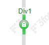

# Dividers

As a layout is made of a window or multiple windows, a window is made of a panel or multiple panels. Dividers allow you to take a single window and subdivide it as you see fit to best visualize your information.

##  Creating Dividers

There are two ways to create dividers/divide a window into panels:

The first way to divide a window is using the **Split Vertically** and **Split Horizontally** found in the panel configuration menu (also known as the Green Button).


The second way to divide a window is to actually create panels using the **Add Panel** option also found in the panel configuration menu.


Both options lead to the creation of dividers with their own set of options. Dividers, by default, can be dragged by the user to adjust the real-estate of the two panels they divide. In order to further modify the window, use the divider configuration button found on the divider itself. Opening the configuration menu will highlight the associated panels and numbers will be assigned to each panel.


| Option | Outcome |
|---------------------------------------|------------------------------------------------------------------------------------------------------------------------|
| **Settings**                          | Includes the option to change Panel ID, User Preferences ID, and Default Offset                                        |
| **Style**                             | Includes both styling and behavior options for the dividers                                                            |
| **Set Current Offset as Default**     | Sets the offset of the divider as the default. Reopening/rebuilding the layout will place the divider at this position |
| **Clear Default Offset**              | Clears the divider position set                                                                                        |
| **Flip Panels**                       | Flips the position of the panels                                                                                       |
| **Rotate Panels Clockwise**           | Rotates the selected panels in a clockwise direction                                                                   |
| **Rotate Panels Counterclockwise**    | Rotates the selected panels in a counterclockwise direction                                                            |
| **Change to 2 Tabs**                  | Removes the divider and places each of the panels in a tab                                                             |
| **Distribute Dividers**               | Evenly distributes the dividers                                                                                        |
| **Replace With...**                   | Replaces the panels with a different visualization or blank panel                                                      |
| **Add Panel**                         | Add a blank panel left, right, above, or below                                                                         |
| **Place Highlighted in Scroll Panel** | Places the selected panels in a scroll panel                                                                           |
| **Place Highlighted in Tab**          | Places the panels in tabs                                                                                              |
| **Place Highlighted in Window**       | Places the panels in a new window, leaving behind a blank panel in their place                                         |
| **Move to Different Layout File...**  | When working with multiple layouts - moves selected panels to a different layout                                       |
| **Cut Highlighted Panels**            | Cut the panels for pasting to a different panel                                                                        |
| **Copy Highlighted Panels**           | Copies the panels for pasting to a different panel                                                                     |
| **Delete Highlighted Panels**         | Deletes the selected panels                                                                                            |
| **Hide Highlighted Panels**           | Hides the selected panels. To unhide, use the **Unhide Panel** option in the panel configuration menu                  |
| **Export Highlighted Panels**         | Export the highlighted panels, as text, for use in another dashboard                                                   |
| **Paste**                             | Paste the cut/copied panel(s)                                                                                          |

### Example

**Adding panels**

Adding a panel **above** using the <span style="color: blue;">right panel configuration button</span> adds a panel **only** above the right panel:


Adding a panel **above** using the <span style="color: orange;">divider configuration button</span> adds a panel above both panels:


The options to modify dividers are all found in the divider's **Style** setting.


## Styling

Under the Style section of the Divider Style menu, you can adjust the thickness of the divider, the color of the divider, and the color of the divider when the mouse is hovering over it. Note: To make a divider invisible, change the thickness to 0(px).


## Settings


### Locking Dividers

Dividers may be **locked** in order to prevent it from moving when not in developer mode. A small lock will appear over the divider configuration button



### Alignment

The **Align** options keeps the size of the panels consistent when resizing the windows. For example, when set to the **Ratio** option, resizing a window consisting of two panels will keep their sizes relatively similar to their original sizes.

### Snapping

When enabled, the **Snap Setting** allows you to collapse a divider by double clicking on it. Depending on the setting used, the panel to the left, right, top, or bottom will be collapsed.

**Note**: when a panel is snapped away, it is considered hidden. This will affect the behavior of the panel when it is a real-time table. The real-time table will have a **On-Hidden Behavior** setting.

**Unsnap minimum(%)**: when set, the divider will return to at least that % position of the window. For example: if the unsnap minimum is set to 60%, and the the divider was dragged to 40%; snapping and then unsnapping the divider will return the divider to the 60% location

#### Example: Snapping with AMIScript

In this example we discuss how to get different charts popping up depending on the data filtering. We will again use the Country table to showcase the example.

First lets create a window with 4 panels as such:


The left panel contains two **Text** field - one for **Continent** and other for **Region**. The **Continent** text field will display the values in the Continent column in the Country table from the Country datamodel:


Next, let's create a blender on the Country Datamodel called **CountryFiltered** which will contain the following script:

``` amiscript
{
  CREATE TABLE RegionInContinent AS SELECT Region, sum(Population) as TotalPopulation FROM Country WHERE Continent==continent.getValue() group by Region;
  CREATE TABLE CountryInContinentRegion AS SELECT Name, Population FROM Country WHERE Continent==continent.getValue() and Region==region.getValue();
}
```

where `#!amsicript continent.getValue()` and `#!amsicript region.getValue()` get the values from the Continent and Region text fields respectively.

Then the **Region** text field will display the values in the Region column in the RegionInContinent table in the CountryFiltered datamodel:


Now that the left panel is done, we will split the right panel into three and create three **V Bar** charts. The top most bar chart will plot **Continent vs. Population** from the Country table:


The middle bar chart will plot **Region vs. TotalPopulation** from the RegionInContinent table:


Similarly, the bottom bar chart will plot **Name vs. Population** from the CountryInContinentRegion table.

Now that we have the panels completed, we will show how to maximise the different bar charts depending on the filtering of the text fields. We want the logic as follows:

-   if the **Continent** text field is empty we should have the **Continent vs. Population** plot
-   if the **Continent** text field has a value (and **Region** text field is empty) we should have the **Region vs. TotalPopulation** plot where the Regions are in the chosen Continent
-   if the **Region** text field has a value we should have the **Country Name vs. Population** plot

To get this we need to add the following script to the **Continent** text field:

``` amiscript
if (continent.getValue() == "") {
  SummaryDivider.unsnap();
  SummaryDivider.setSnapDirection("Bottom");
  SummaryDivider.snap();
}
else {
  SummaryDivider.unsnap();
  SummaryDivider.setSnapDirection("Top");
  SummaryDivider.snap();
  RegionDivider.setSnapDirection("Bottom");
  RegionDivider.snap();
}

layout.getDatamodel("CountryFiltered").reprocess();
```

and the following script to the **Region** text field:

``` amiscript
if (region.getValue() == "") {
  RegionDivider.unsnap();
  RegionDivider.setSnapDirection("Bottom");
  RegionDivider.snap();
}
else {
  RegionDivider.unsnap();
  RegionDivider.setSnapDirection("Top");
  RegionDivider.snap();
}

layout.getDatamodel("CountryFiltered").reprocess();
```

where the **SummaryDivider** is the divider between **Continent vs. Population** plot and **Region vs. TotalPopulation** plot, and **RegionDivider** is the divider between **Region vs. TotalPopulation** plot and **Name vs. Population** plot.


