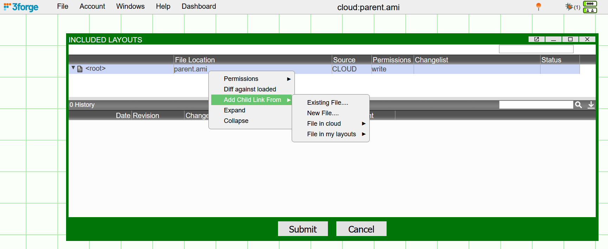
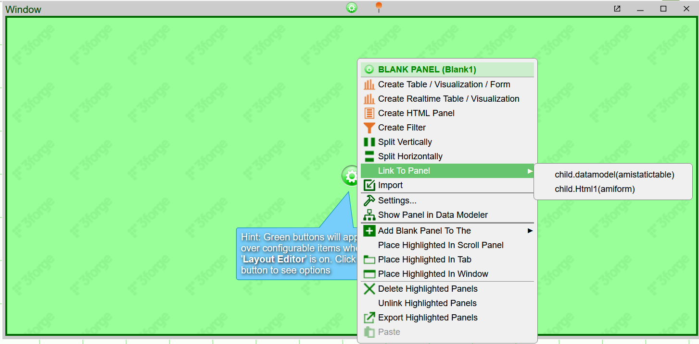

# Multiple Layouts

AMI supports the use of multiple layouts within a single dashboard (also known as the 'root layout') which can be helpful for modularization or abstraction. Layouts are saved as JSON files with the extension `.ami` and are easily reused across different AMI instances. 

## Overview

Currently, AMI supports two ways of importing multiple layouts from a single dashboard:

1. Included layouts

1. Importing layout JSON

We generally recommend using included layouts, but you can also paste the JSON of a layout directly into the popup from *File -> Import*. This will overwrite your current working layout though, so if you wish to use multiple files, it is recommended to use the first option.

## Included Layouts

To access multiple layouts and their data in your dashboard, you can "include" additional .ami layout files in your current layout, turning your current instance of AMI into the "root layout." Doing so will establish a parent-child relatioship from the root layout to any included layout. 

To add new layouts, click on *Dashboard -> Included Layouts*

1.	To add an existing file: 
: 
	- Right click on the project -> *Add Child Link from ->* 
	- Select from your local, cloud, or absolute file layouts.
	- Give the file an alias with which the root layout will use when calling data from the child layout.

2.	To add a new file: 
: 
	- Right click on the project -> *Add Child Link From -> New File* -> 
	- Enter the name of the new, blank file to create (absolte file).

!!!Note
	Relative paths must be consistent -- a cloud stored parent can only have a relative path to a cloud stored child layout.

## Nested Inheritance 

Panels and datamodels defined in a child layout can be accessed within the parent but not vice-versa. It is possible to establish nested layout relationships such that a child layout can have a grandchild layout etc. 

Currently, AMI supports 4 layers of included layout nesting.

Datamodels of the child and grandchild layout can be viewed in the Data Modeler. Nested relationships and methods are structured such that calling data from a child layout is done via dotconcatenation, e.g: `child.grandchild.datamodel`.

A child layout's datamodels will be visible within the Data Modeler of the parent layout but **not** its panels -- you can still call these panels, but they're done via linkage when creating new panels in the parent layout.

## Linking Child Panels 

To use a panel from the child layout, create a new window in the current/parent layout, select the green cog and press *Link To Panel*. 

You can then view the selected child panel with the alias specified when you included the layout. 

To remove the panel, select the cog again to unlink it. 

!!!Note
	If you have write permissions enabled for the child layout, any deletions you make of child layout objects within the parent layout will **delete the corresponding information in the child layout**. Use unlink if you want to **keep** underlying panels. 

	Alternatively, keep the child and grandchild layouts **read only** so you can **only** unlink panels, not delete them.

Any changes you make in the child layouts will be carried over into the parent layout. If you wish to entirely remove the child layout, navigate to the *Included Layouts* menu, and right-click the layout you no longer want to unlink it.

