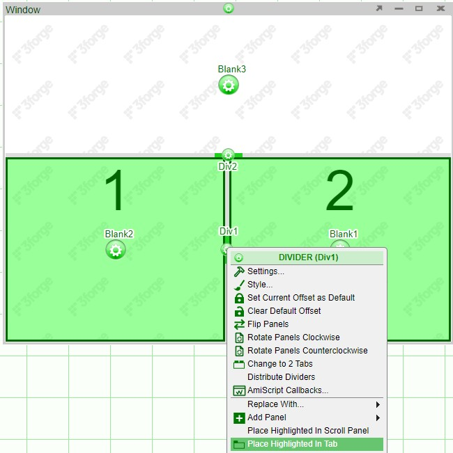
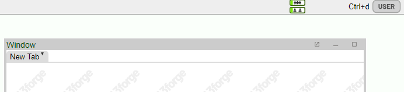

# Tabs

Tabs can be used to organize and increase the real-estate of dashboards. Through the use of tabs, you may be able to break down a layout into multiple components or even build entire layouts in a single tab. The creation of tabs differs depending on which panel or divider configuration button is used.

## Creating Tabs

In order to place a single panel into a tab, click on the configuration button of the panel and select **Place Highlighted in Tab**

If the window consists of 2 or more panels, they can be separated into 2 tabs or can be placed into one tab.

To place the panels into 2 separate tabs, select **Change to 2 Tabs** from the divider configuration menu

Note: even if a panel is subdivided into multiple panels (such as the panel labeled **2**below), it will still place the panel into one tab; it will not become 3 tabs.

To place multiple panels or the entire window into a single tab, choose the divider configuration button which **highlights** the desired panels and select **Place Highlighted in Tab** from the menu.

## Manipulating Tabs

### Tab Dropdown Menu

The **Tab Dropdown Menu** is available on each tab and is opened by clicking on the downward pointing green triangle. This menu contains all of the ways of modifying tabs - renaming, deleting, adding, and moving. This menu allows the addition of tabs to either the left or the right of the selected tab. There are several other ways to interact with tabs detailed below

### Adding Tabs

To add additional tabs, click on the **tab configuration button** and select **Add Tab**. You can also enable the **Show Add Button** option in the Style menu.

**Export to Spreadsheet**: downloads the tables within a tab as a spreadsheet. If you have multiple table panels, these panels will be shown as separate tabs in the spreadsheet. You can disable this option by using the tab configuration menu (**Hide Export Spreadsheet Menu Item**)

### Moving Tabs

To move tabs, either drag & drop or use the **Tab Dropdown Menu** and click on the Arrange Tabs option. 

The tabs can be moved by selecting the tab and moving it with the buttons on the left.

- Move to Top
- Move Up
- Move Down
- Move to Bottom

### Show/Hide Tabs

To hide tabs, open the **Tab Dropdown Menu** and click on "Rename/Settings".

Check the Hide Tab option to set the tab to hidden.

Hidden tab will not show up in User mode.

### Renaming Tabs

Click the **Tab Dropdown Menu** and select "Rename/Settings"

### Deleting Tabs

Tabs can also be deleted by deleting all of the panels within a tab. If there are multiple panels, select the divider that will highlight all of the panels.

When you are left with a single tab, you can also use the **Remove Tab, Keep Panel** open in the tab configuration menu in order to revert the panel to a regular window

### Setting Defaults Tabs

If you would like a specific tab to be the primary tab that is seen when a layout is opened, use the **Set as Default** option from the tab dropdown menu. This tab will then be opened regardless of which tab is last opened when the layout is closed.

## User Interactions

When making complex layouts, you may end up with so many tabs that it won't be able to fit on the list of tabs. When the number of tabs exceed the space, control arrows will appear at the rightmost edge. You can use these control arrows to scroll through the tabs.

To quickly get to a tab, hover over the tabs and use the mouse scroll to scroll the tab space (much like scrolling down a webpage) and select the desired tab.

## Settings

### Blinking Tabs

When particular attention has to be drawn to a certain tab, blinking can be used. The option to choose a blinking color and period are found in the tab settings (double click on the tab or tab dropdown menu \> Rename/Settings)

## Undocking & Popping Out

Tabs can be undocked (panels remain on the layout) or popped out (panels are opened in a new browser window). In order to allow undocking and popping out, the **Allow Undocking** option must be enabled (tab configuration menu \> Style \> General). The option to hide a tab when it is popped out can also be found in the same menu (tab is hidden in non-developer mode)

Note: closing a popped out window does not delete it - it is returned to the tab (or undocked window if it was undocked prior to popping out)
