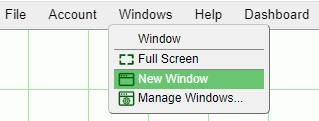
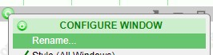

# Windows

In AMI, windows are the building blocks of layouts. Windows are highly customizable and entire complex layouts can be built within one window. This section will discuss the various options you have when starting out with a window.

## Creating Windows

The Windows option can be found on the top menu bar. Developers have the option of creating and managing windows whereas end-users are still able to use the menu to view a list of windows that are in the layout.

## User Interactions

### Window Buttons

Using the buttons found on the right side of the window header, you can pop out a window (into its own window), minimize, maximize, or delete a window.

: pops out the window its own window. When you close a popped out window, it will return the window onto the dashboard (it will not be deleted). The status of the window will be shown as \[popped out\] in the Windows menu.

: minimizes the window. Minimized windows can be accessed by selecting them from the Windows menu.

: maximizes the window or restores a maximized window to its original size.

: deletes the window. Windows in use will require confirmation before being deleted.

**Note**: in order to delete individual panels within windows, use the configuration button menu of the panel and select **Delete Highlighted Panels**. If the window does not have any panels, selecting this option will delete the window.

### Resizing and Moving Windows

In order to resize a window, click and hold any part of the edges or corners of the window. While holding the mouse button, drag the cursor to resize the window

In order to move a window around the dashboard, click and hold the window header. While holding the mouse button, move the window to any area of the dashboard.

## Settings

The **Configure Window** menu found in the window header contains a lot of options to be used for the windows.

### Rename

Once created, Windows can be renamed by double clicking on the Window name or by using the Configure Window found in the middle of the Window header.

### Type

There are 3 types of windows:

- **Maximized, no Header**: maximizes the size of the window and removes the window header. The Configure Window button will still be visible when in developer mode.

- **Regular**: the default state of windows with all window header buttons available.

- **Hidden**: hides the name of the window from the Windows drop down menu when not in developer mode. When in developer mode, the name of the window will be visible with a \[hidden\] label. This is useful when creating windows that will be kept minimized or behind other windows and only available when taking a certain action.

	

You can also use the **Manage Windows** option in the Windows menu in order to get an overview of all of the windows in the layout and apply a configuration to each.

### Location in Menu Bar

If you would like to place a window under its own menu item in the menu bar, use the **Location in Menu Bar** option to assign a Menu Name. The menu item will then appear when not in developer mode (and the window is not hidden):

The window will list appear in the Windows menu:

