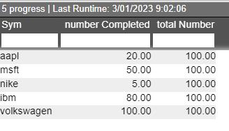
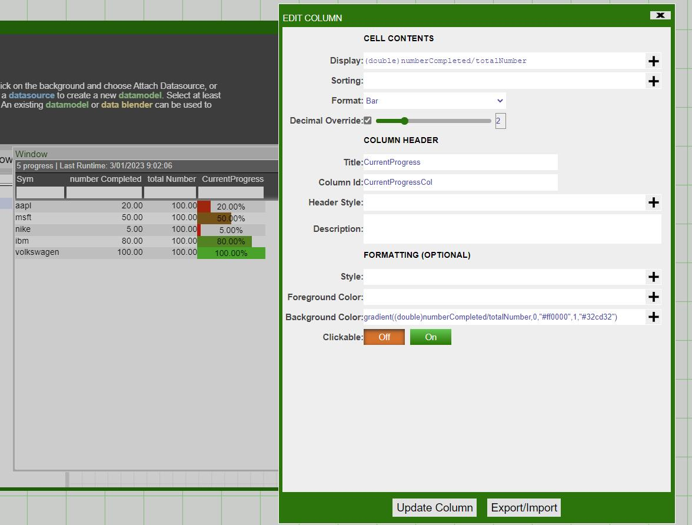
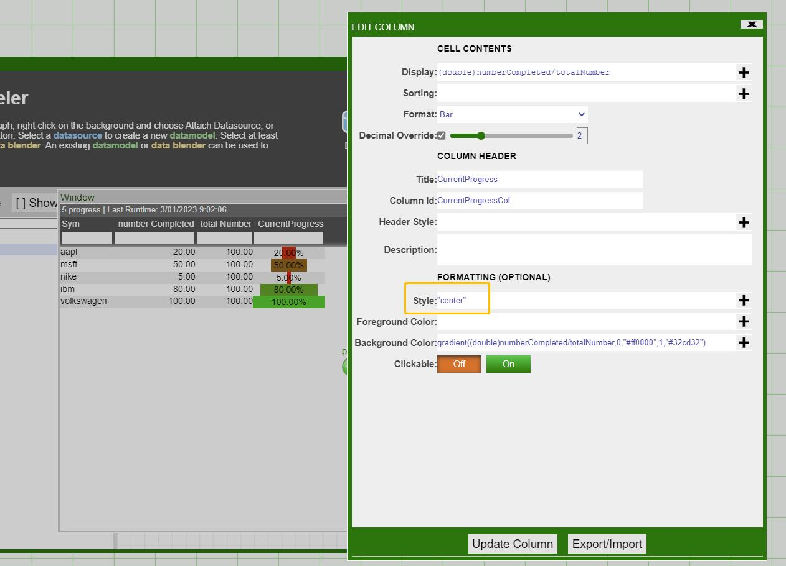

# Columns

## Progress Bar in Column Formatting

On the frontend table GUI, we can add and configure additional columns to make it look like a progress bar.

Suppose we have a GUI table **progress** like the following:

 
We can configure an additional column that displays the ratio of the number of Completed and the total number and shows the current progress

Additionally, we can also configure the style of the progress bar. For example:

