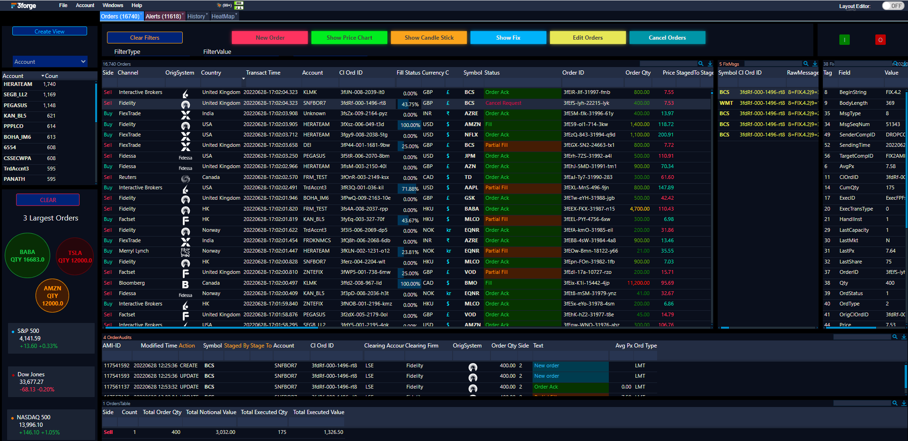
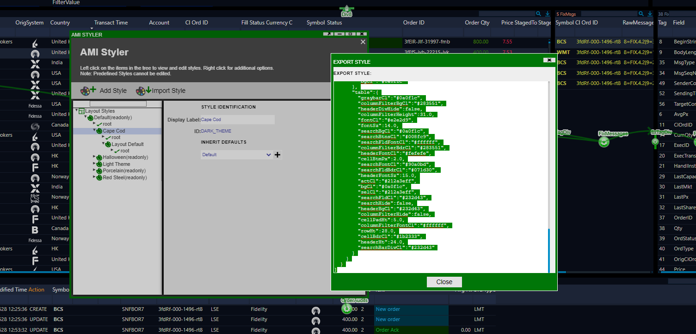
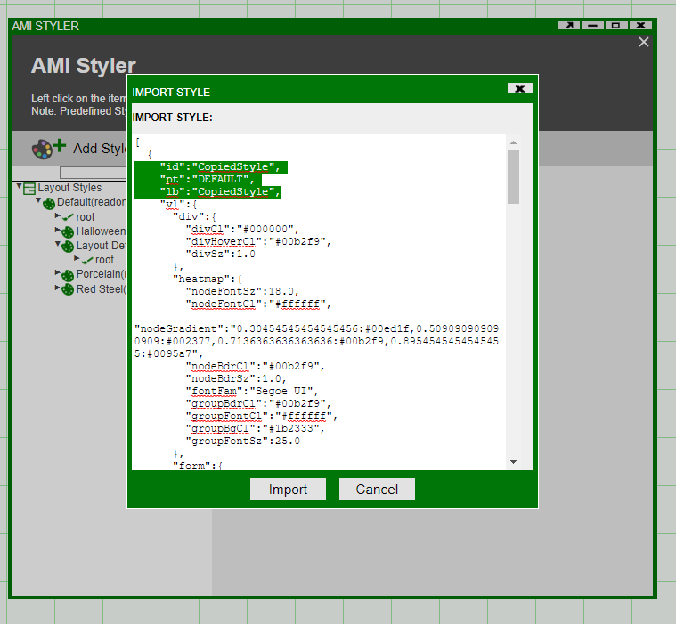
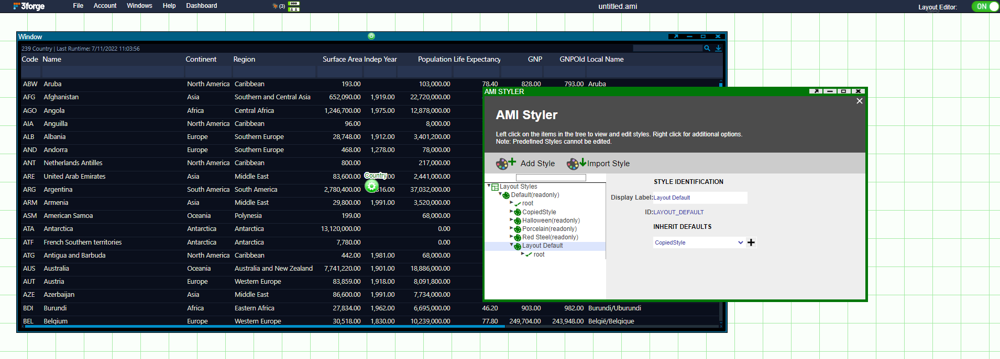
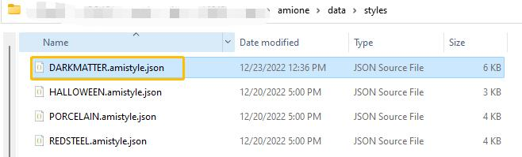
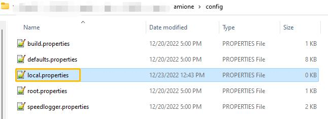
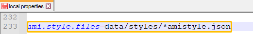
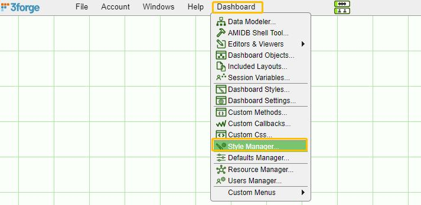
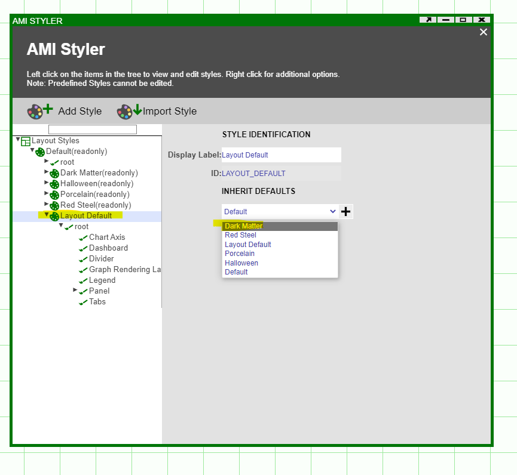
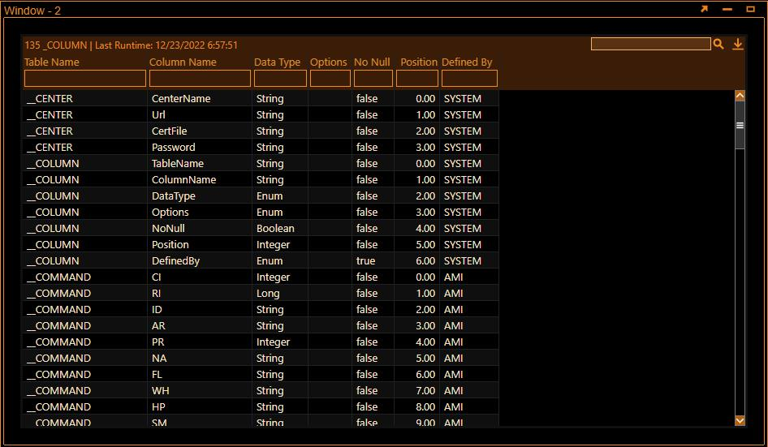

# Managing Styles

## Copying Styles

To copy a dashboard style from one dashboard to another we can use the Import/Export Style function in Style Manager. Let's take a pre-styled dashboard as such:



To copy this style, enter Development mode and under *Dashboard* select *Style Manager*. Select the style to copy, right click to *Export Style* and copy:



Next, open the dashboard in which you would like to import this style. Under *Style Manager* select *Import Style*. Paste the copied text - you can rename the *id* and *lb* to your preferred names (here we have named both to **CopiedStyle**):



Finally, under **Layout Default**, select CopiedStyle to inherit from. This will update the style of the entire dashboard to this style.



## Readonly Styles

AMI has several layout styles you could choose from. These layout styles are encoded in JSON format files and are placed in amione/data/styles directory. In this example, we have a stylesheet called **DARKMATTER.amistyle.json** and show how to include it in AMI.

1. Navigate to the AMI installation path and place the attached JSON file inside the styles directory (amione/data/styles)  

	

1. Navigate to /amione/config and add the following inside local.properties file
	
	```
    ami.style.files=data/styles/*amistyle.json
	```

	 

1. Restart AMI shut down the current AMI instance and restart  

1. Log in and open Dashboard \> Style Manager  

	  

5. Select Layout Default from tree and Dark Matter from the dropdown list Your dashboard should now pick up the styles from the Dark Matter stylesheet.  

	 

