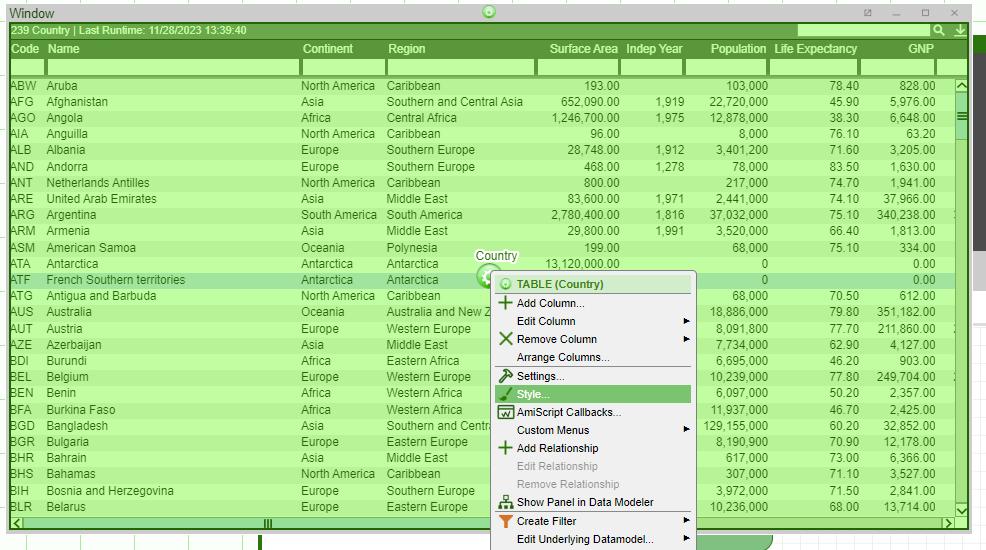

# Tables

## Cell Flashing

To make table cell flash in response to cell value changing, right click on the table -\> style

In the CELL FLASH section, you can configure the *Flash Up/Down Color* and *Flash Duration*.

!!! Tip

    To turn cell flashing off, set the flash duration to 0 milliseconds. 

Note: 

-	Flash duration is in milliseconds. 
-   "Flash Up Color" is the color the cell changes to when the cell value goes up/increases.
-   "Flash Down Color" is the color the cell changes to when the cell value goes down/decreases.

