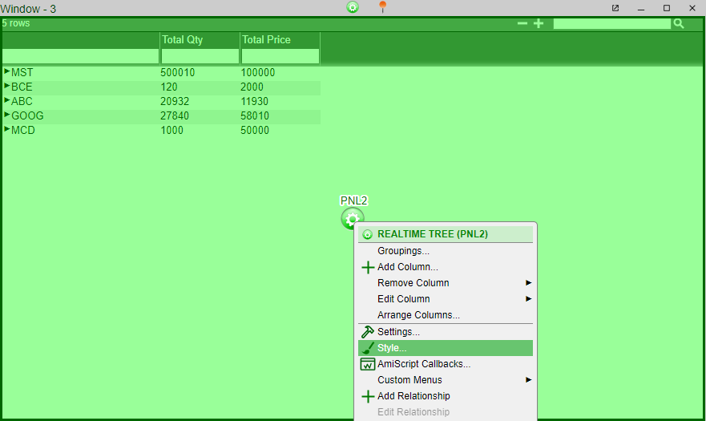
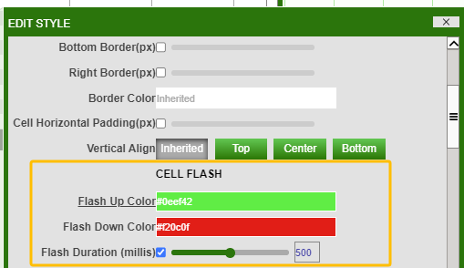

# Trees

## Cell Flashing

To make tree cell flash in response to cell value changing, right click on the tree -\> style

In the CELL FLASH section, you can configure the *flash up/down color* and *flash Duration*.

Note:  
-	The flash Duration is in the unit of milliseconds.
-   Flash up color is the color the cell changes to when the cell value goes up.
-   Flash down color is the color the cell changes to when the cell value goes down.

