# Supported Software

## Platforms

|                                        |                                        |                                  |                                  |
|:--------------------------------------:|:--------------------------------------:|:--------------------------------:|:--------------------------------:|
| { width="100" }  Windows | { width="100" }  Android | { width="100" }  Linux | { width="100" }  Apple |

## Datasources

|                                                       |                                                  |                                                                        |                                              |                                                              |                                              |
|:-----------------------------------------------------:|:------------------------------------------------:|:----------------------------------------------------------------------:|:--------------------------------------------:|:------------------------------------------------------------:|:--------------------------------------------:|
| 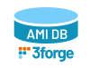{ width="100" }  AMI Database               | { width="100" }  Flat File       | 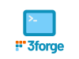{ width="100" }  AMI Shell                                   | { width="100" }  Excel         | { width="100" }  Fred                                | { width="100" }  Quandl          |
| { width="100" }  Oracle                   | { width="100" }  Microsoft SQL | { width="100" }  MySQL                                       | 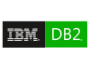{ width="100" }  IBM DB2       | { width="100" }  SAP                                   | { width="100" }  SybaseIQ          |
| { width="100" }  KX                             | { width="100" }  Hadoop              | { width="100" }  Mongo DB                                | { width="100" }  Apache Spark      | { width="100" }  R                                         | { width="100" }  Impala          |
| { width="100" }  PostgreSQL           | { width="100" }  Phoenix           | { width="100" }  Greenplum                           | { width="100" }  Netezza       | 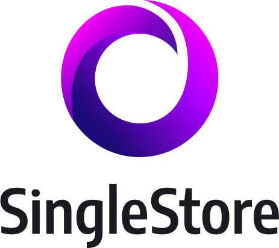{ width="100" }  MemSQL                | { width="100" }  Couchbase |
| { width="100" }  Chronicle Software | { width="100" }  SQLite              | 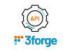{ width="100" }  Web API                                 | { width="100" }  Snowflake | { width="100" }  Hazelcast | { width="100" }  Apache Ignite   |
| { width="100" }  HP Vertica             | { width="100" }  Hive    | { width="100" }  Deephaven | { .bloomberg-logo width="100" }  Bloomberg |                                                 |                                                              |                                              |

## Messaging Feed Handlers

|                                                              |                                            |                                                    |                                                                        |                                           |                                           |
|:------------------------------------------------------------:|:------------------------------------------:|:--------------------------------------------------:|:----------------------------------------------------------------------:|:-----------------------------------------:|:-----------------------------------------:|
| { width="100" }  Solace Systems                  | { width="100" }  60 East-Amps    | { width="100" }  Tibco                   | { width="100" }  ActiveMQ                              | { width="100" }  RabbitMQ | { width="100" }  KX Streaming       |
| { width="100" }  Kafka                             | { width="100" }  OneTick | { width="100" }  Chronicle Queue | { width="100" }  Deephaven | { .fix-logo width="100" }  FIX        | 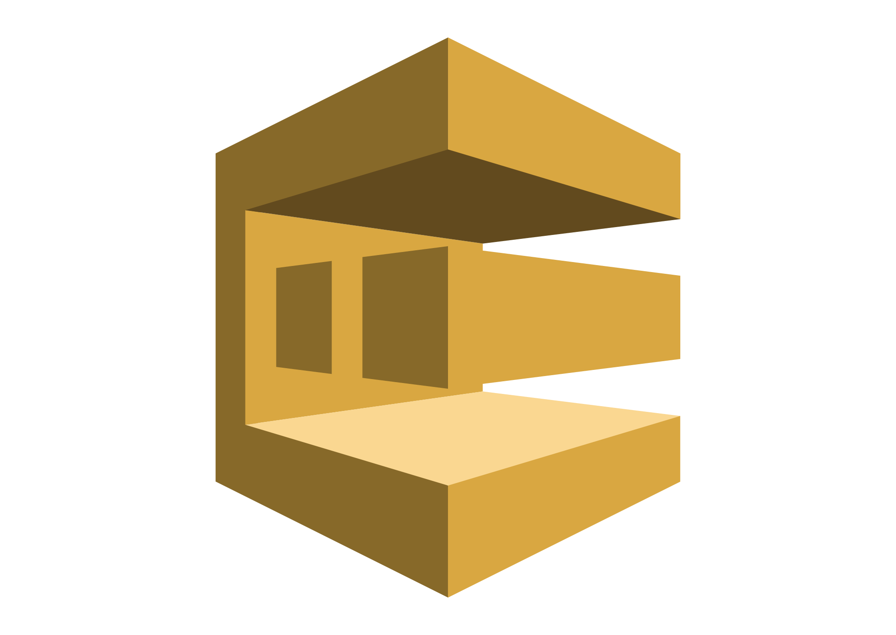{ width="100" }  Amazon SQS |
| { width="100" }  Hazelcast | 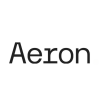{ .aeron-logo width="100"" }  Aeron |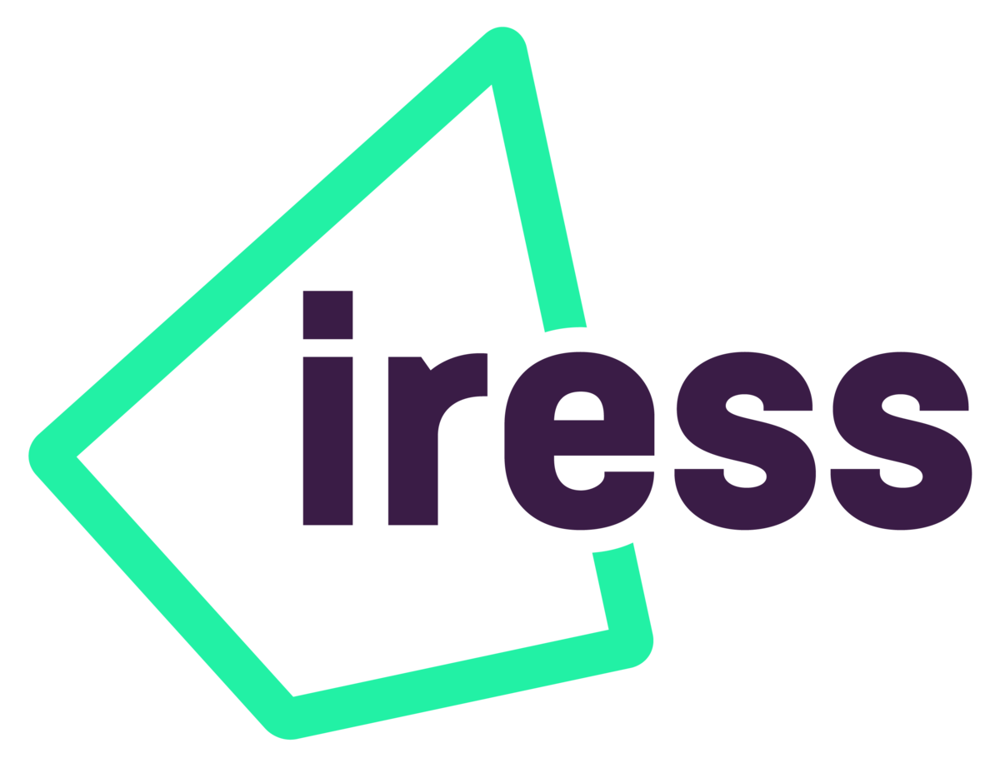{ .iress-logo width="100"" }  Iress|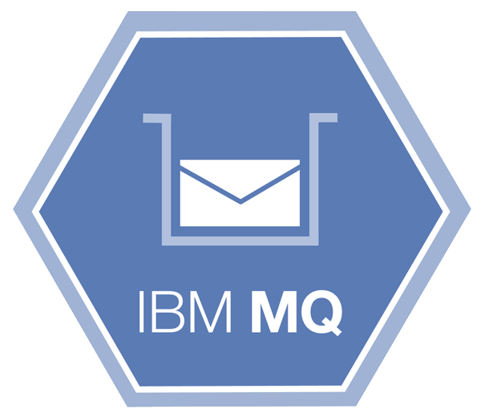{ .ibmmq-logo width="100"" }  IBM MQ |                                                    |                                                                        |                                           |                                           |

## Browsers

|                                     |                                        |                                       |                                                                      |                                     |
|:-----------------------------------:|:--------------------------------------:|:-------------------------------------:|:--------------------------------------------------------------------:|:-----------------------------------:|
| { width="100" }  Chrome | { width="100" }  Firefox | .svg "Edge_(2).svg"){ width="100" }  Edge | { width="100" }  Internet Explorer | { width="100" }  Safari |

## Source Control

|                                           |                            |
|:-----------------------------------------:|:--------------------------:|
| { width="100" }  Perforce | { width="100" }  Git |

## Desktop Containers

|                                                  |                                        |
|:------------------------------------------------:|:--------------------------------------:|
| 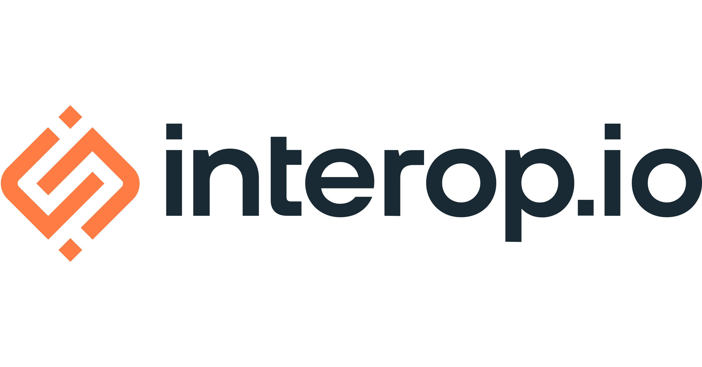{ width="188" }  interop.io (Finsemble) | { width="100" }  Here (Openfin) |

## Cloud Providers

|                            |                                         |                                                 |                                              |                                  |
|:--------------------------:|:---------------------------------------:|:-----------------------------------------------:|:--------------------------------------------:|:--------------------------------:|
| 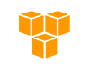{ width="100" }  AWS | { width="100" }  Oracle | { width="100" }  Google | { width="100" }  Rackspace | { width="100" }  Azure | { width="100" }  IBM Cloud |

## Containers

|                                     |                                                           |
|:-----------------------------------:|:---------------------------------------------------------:|
| { width="100" }  Docker | { width="100" }  Kubernetes |

## Authentication / Entitlements

|                                          |                               |                                                                   |                                           |
|:----------------------------------------:|:-----------------------------:|:-----------------------------------------------------------------:|:-----------------------------------------:|
| { width="100" }  OAuth 2.0 | { width="100" }  SAML | { width="100" }  Active Directory | { width="100" }  Kerberos |

## Certifications / Partners / Industry Organizations

|                                                                                                |                                                                                            |                                                                                                |                                                                          |                                                                                       |
|:----------------------------------------------------------------------------------------------:|:------------------------------------------------------------------------------------------:|:----------------------------------------------------------------------------------------------:|:------------------------------------------------------------------------:|:-------------------------------------------------------------------------------------:|
|          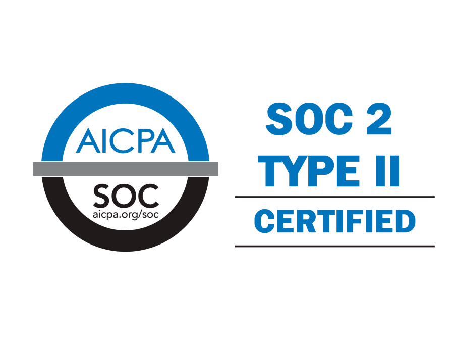{ width="100" }  Soc2         |         { width="100" }  FDC3        |    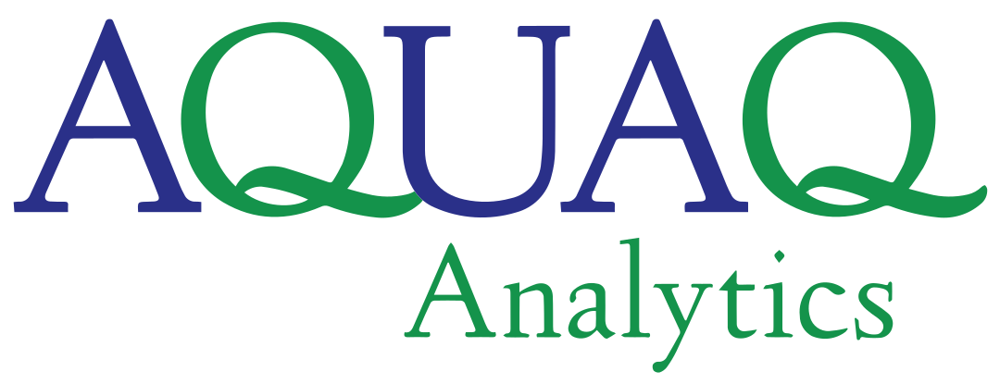{ .aquaq-logo width="100" }  AquaQ    | { width="100" }  AWS | { width="100" }  Oracle |
| { width="100" }  EDM Council | { width="100" }  Chronicle |{ width="140" }  interop.io (Finsemble) |                                                                          |                                                                                       |

## Secure Key Management

|                                     |                                                           |
|:-----------------------------------:|:---------------------------------------------------------:|
| 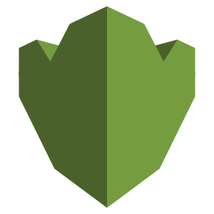{ width="100" }  AWS KMS | { width="100" }  Microsoft Azure Vault |
