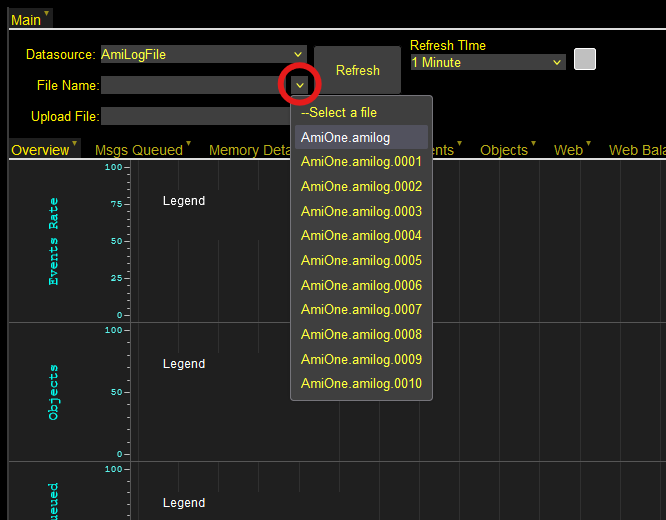
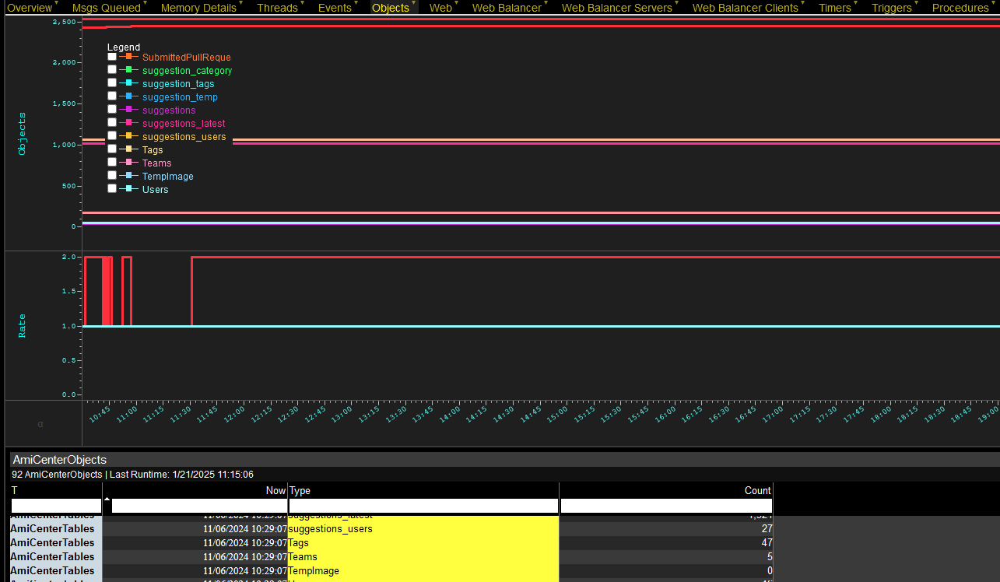

# Logs 

When AMI runs, 3 different log file types are being generated. The detail and verbosity of these logs can be [configured](../configuration_guide/common.md/#log-properties) in your `local.properties` file. 

This page contains information on how to interpret and visualize the log files to troubleshoot performance issues in AMI.

## Overview 

AMI generates 3 different log files in each session:

1. `AmiOne.log`
2. `AmiOne.amilog`
3. `AmiMessages.log`

By default, these are stored in the `amione/log` directory of the AMI installation being run, but this location can be changed in `local.properties` by setting the property `f1.logs.dir`. 

`AmiOne.log` contains human readable output log while `AmiOne.amilog` contain machine readable statistics. `AmiOne.log` is generally useful for identifying exceptions, for example an incorrectly configured Feed Handler would throw an exception in this log. `AmiOne.amilog` is generally useful for diagnosing performance, for example understanding why an instance is running out of memory or running slow.

The level of detail and information recorded in the log files can be tuned in your `local.properties`. See [this](../configuration_guide/common.md/#log-levels) section in the common properties to configure the level of detail you require from the logs. 

`AmiOne.amilog` files can be used in conjunction with the [AMI log viewer](#ami-log-viewer-file) to visualize information about the sesion. If you are experiencing performance issues, these files can be used to troubleshoot by providing insight into memory usage, messages, run time, etc. 

 

The log viewer provides charts detailing the following areas: 

- Memory
- Messages
- Threads 
- Events 
- Objects 
- Web 
- Web Balancer 
- Timers 
- Triggers
- Procedures

To understand individual charts and graphs, please see [this](#interpreting-the-logs) section of the document. Otherwise, to read and interpret the information contained in the file directly, see [here](#interpreting-log-files).

## AMI Log Viewer File 

Download the layout [here](../resources/legacy_mediawiki/LogViewer_V4-2.txt), or contact [support@3forge.com](mailto:support@3forge.com). 

### Setup 

Launch an AMI instance and import the layout to AMI by going to *File -> Import* and pasting the layout Json into the window. 

 

The log files will be the datasource that the log viewer builds its visualizations on. 

To add them, navigate to the Data Modeler under *Dashboard -> Data Modeler*. You will see an undefined datasource titled "AmiLogFile."


Right click on this datasource and click "Edit Datamodel."

Then navigate to the "Flat File Reader" datasource adapter option and input the path to some directory containing log files of interest (by default this is `/amione/log`).


### Choose Log File

For general diagnostics, use `AmiOne.amilog` files. 

Under Datasource, select "AmiLogFile" and from the dropdown menu of "File Name", select the log file to analyze. You may need to click the "Refresh" button if you see no entries. 



#### AmiOne.log 

You can also use the viewer to load and view `Messages.log` files for evaluating query performance in AMI.

1. Go to Windows -\> AmiQueriesPerformance.

1. Search for a `.log` file, e.g. `Messages.log`.

1. Click on "Run Analytics" on the right side of the field.

1. Go to the "Performance Charts" tab.

1. You can change the Legends' grouping in the top left panel; filter the chart dots with the bottom left panel. Feel free to sort the table on the bottom panel to suit your needs.


## Interpreting the Log Viewer

For most users, the log viewer is primarily intended for identifying potential memory (crashes) and performance (sluggishness) issues. 

Below are some of the common graphs and information on how to interpret them. 

### Memory Details 

The memory graph in the log viewer contains 3 key pieces of information:

1. How much memory is being used (the green area)
1. The OS-allocated memory to AMI (the blue line)
1. The maximum memory that AMI can request (the red line)


This shows how the JVM requests and allocates memory for AMI. The JVM will continually perform garbage collection, but may periodically do large garbage cleans (see 8:36 in the image) if the memory use approaches the allocated threshold. At this point, the JVM will then request more memory from the OS assuming the maximum memory threshold has not been exceeded. 

The JVM allocates and requests memory from the OS automatically. In cases where the JVM requires more memory but the OS cannot release that memory to the JVM, this can cause crashes. 

To avoid dynamic JVM behavior, you can change the minimum memory to match the maximum allocated memory. Add the following options to your Java VM Properties, replacing `<VALUE>` with the amount of memory you wish to allocate:

```
-Xms<VALUE> 
-Xmx<VALUE> 
```

!!! Note
    Peaks in AMI memory usage where memory used is close to the allocated memory is not inherently cause for concern, provided that levels reduce post-garbage collection. However, if memory use is *consistently* high, it may be necessary to increase memory capacity and/or allocation. 

#### OOM Killer (Linux)

For Linux machines, as memory reaches capacity, the Linux OOM killer may kill non-essential processes to free up memory for the OS. This prioritizes the largest (most memory consuming) non-vital process. In AMI, this is logged in `AmiOne.log` with a process ID denoting that AMI was killed by the OOM killer. 

The dynamic behavior of the JVM can trigger this behavior, so we suggest setting the minimum memory value to maximum to prevent the OS over-committing memory. These are the same Java options as above:

```
-Xms<VALUE> 
-Xmx<VALUE>
```

!!! Warning 
    For sensitive use-cases, you may want to consider changing the OOM score of AMI, or disabling the OOM killer entirely (though this is potentially risky). 

### Objects 

Gives the row counts for tables in the center and when new rows are added.



### Msgs Queued  

Graph showing messages being sent to and from AMI Center when actions are performed.


#### Msgs Queued 

This graph shows how many messages are being queued in AMI. If these values are high, this is not an immediate cause for concern provided the messages are being cleared (a steady stream of messages being processed).

If the number of these messages increases over time (a sharp gradient), then messages aren't being cleared fast enough as new ones arrive. This could indicate issues with timers and triggers and may result in AMI behaving slowly. 

#### Msgs Per Second 

Messages per second offers insight into the level of activity of messages being received, which can be helpful in identifying trends such as peak data influx times. 

#### Msgs Processed

This is a cumulative graph how many messages have been processed over time and is rarely a point of concern. 

### Events

Event graphs are useful for identifying issues unrelated to AMI. 


Observing peaks here usually means the external feeds that your application subscribes to is experiencing a high volume of data traffic or issues on their end.

### Web 

Graphs related to the web server and HTTP connection to the web session.


#### Active 

The number of users connected to a session.

#### HTTP Services

The number of messages being sent between the server and a user's browser/session.

#### Rows 

This graph is particularly important for understanding memory usage. Generally speaking, the more rows, the more memory is consumed.

1. Cached rows (green legend) 
    - For datamodels that run on subscription.
    - As new rows are fetched from the datasource, they are sent to a cache in the web.

2. User rows (red legend) 
    - Rows in static datamodels.

3. User hidden rows (mustard legend)
    - Rows hidden in web but present in datamodels.

These charts can be used to identify redundant or data-intensive rows.

### Timers, Triggers, and Procedures

If your AMI session is sluggish and slow to respond, these are typically the primary culprits. 

A steep gradient on either timers, triggers, or procedures indicates that there may be issues with logic or implementation. This is especially the case if you have one trigger that is drastically more expensive than the others.

The run time charts can help to determine what each individual trigger, timer, or procedure is exhibiting sub-optimal behavior. 

### Additional Help

The log viewer is a useful tool to help diagnose issues with your AMI runtime. If you require more help to interpret your logs, or advice on how to implement solutions, please do not hesitate to contact us at <support@3forge.com> 


## Interpreting Log Files

For quick diagnostics, it is still helpful to read through the `AmiOne.amilog` files. For further detail, it is generally better to read through the `AmiOne.log` files. 

Below is a guide on how to interpret the different message types in the AMI log files without necessarily using the log viewer. 

### Overview 

Information about the state of an AMI instance is recorded in the AMI `AmiOne.log` files. Broadly, logs can be defined as either web logs, or center/relay logs. AMI instances that use all three components will contain all three log types.

These are the primary log types in the `AmiOne.log` files:

1. Memory 
1. Partition
1. Topic
1. AmiCenterEvents

See the relevant sections below for a guide on interpreting the log type and the information conveyed.  

### Memory 

Memory messages can be broken down into primarily two types of message: `Memory` and `Process`.

Below is an excerpt of what these messages might look like.

```
O|T="Memory"|now=1737465733823L|name="Code Cache"|commited=18022400L|initial=2555904L|max=251658240L|used=17843200L
O|T="Memory"|now=1737465733823L|name="Metaspace"|commited=54829056L|initial=0L|max=-1L|used=53940392L
O|T="Memory"|now=1737465733823L|name="Compressed Class Space"|commited=6836224L|initial=0L|max=1073741824L|used=6613368L
O|T="Memory"|now=1737465733823L|name="Par Eden Space"|commited=69337088L|initial=69337088L|max=767754240L|used=69337088L
O|T="Memory"|now=1737465733823L|name="Par Survivor Space"|commited=8650752L|initial=8650752L|max=95944704L|used=8650752L
O|T="Memory"|now=1737465733823L|name="CMS Old Gen"|commited=173408256L|initial=173408256L|max=3190620160L|used=84963360L
O|T="Process"|now=1737465733823L|freeMem=102649624L|maxMem=4054319104L|totMem=251396096L|popsGcMem=106525960L|gcCount=22L|threadBlocked="0"|threadsNew="0"|threadsRunnable="28"|threadsTimedWaiting="21"|threadsWaiting="37"

```

This block shows a series of individual memory messages and their respective garbage collectors (the messages with `T="Memory"`). 

Following a series of memory messages, AMI will also log a process message which provides a snapshot of the overall memory state at that current point in time. 

For understanding memory usage of the system, you will generally only need to interpret the process messages:

- `now`: The time the message was logged (in UTC format)
- `freeMem`: The amount of free/available memory in the system
- `maxMem`: The maximum memory AMI can use (set by the user in their Java Options)
- `totMem`: The total memory available to use (assigned by JVM)

You can then calculate the used memory from the process messages:

- Used memory = `totMem` - `freeMem` 

The [memory graph](#memory-details) in the log viewer is built on the process messages and can be used to view the total memory usage and consumption by AMI. 

### Partition  

In AMI, tasks are broken down into a series of "partitions" where each partition can be accessed by at most one thread at a given time. There are two message types: `Partition` and `Dispatcher`. 

In the logs, partition messages look like the following: 

```
O|T="Partition"|now=1736267212318L|added=11L|processed=11L|queued=0L|totExecTime=1353L|execs=6L|inThreadPool=false|name="JfP4txXI5xGiO8LTnmcp"|startTime=1736267204712L
O|T="Partition"|now=1736267212318L|added=19L|processed=19L|queued=0L|totExecTime=16L|execs=16L|inThreadPool=false|name="SNAPSHOT_PARTITION"|startTime=1736267199504L
O|T="Partition"|now=1736267212318L|added=1L|processed=1L|queued=0L|totExecTime=22L|execs=1L|inThreadPool=false|name="USERLOGIN"|startTime=1736267203811L
O|T="Partition"|now=1736267212318L|added=9L|processed=9L|queued=0L|totExecTime=0L|execs=9L|inThreadPool=false|name="PORTLET_BACKEND"|startTime=1736267199499L
O|T="Partition"|now=1736267212318L|added=17L|processed=17L|queued=0L|totExecTime=47L|execs=17L|inThreadPool=false|name="AMI_CENTER_CLIENT_1"|startTime=1736267198649L
O|T="Dispatcher"|now=1736267212318L|added=57L|processed=57L|totExecTime=1438L|execs=49L|inThreadPoolCount=0L|partitionsCount=5
```

A partition is created for a series of different processes, for example: 

- for each historical table
- for each user session 
- for each datasource added 

And more. Each partition message gives a snapshot of that specific partition. Note the ‘inThreadPool’ message which denotes whether that partition is being worked on in that particular snapshot.

Similarly to memory and process messages, dispatcher messages are logged after the partitions. The dispatcher messages provide an overall snapshot of the *total* partitions and how many partitions are being processed in that given moment. It is essentially the partition manager.

### Topic 

Topics are essentially bidirectional subscriptions/feeds from one portion of AMI to the other. For example: 

```
O|T="Topic"|now=1727376260112L|dir="in"|name="center.to.web"|msgCount=285L|connections=1
```

This message is a source-to-target topic such that messages are going “in” the direction of the web from the center. Conversely, there is an outward (dir = “out”) message acting as the corresponding recipient. 

This is particularly useful in identifying if messages are being received promptly, or if they are being queued up (100 messages out but 1 received means 99 are hovering somewhere in a processing queue).

### AMI Center Objects

These are a group of log messages that represent the state of different objects in the center:

- `AmiCenterTables`
- `AmiCenterTriggers` 
- `AmiCenterStoredProcs` 

There is an additional message type, `AmiCenterEvents`, which provide an overall insight into all the objects and events in the center at the time. For more information on AmiCenterEvents, see [this](#amicenterevents) section of the document.

Issues in the different center variables like triggers can cause lags in performance. To interpret each individual message type, see the list below. 

#### AmiCenterTables 

Each AmiCenterTables message gives the current state of a named table in AMI Center. These can be system tables, prefaced with two underbars (`__`), and also user-created tables. 

Here is an example of what this looks like:

```
O|T="AmiCenterTables"|now=1736267200106L|type="__CENTER"|count=2
O|T="AmiCenterTables"|now=1736267200107L|type="__COLUMN"|count=142
O|T="AmiCenterTables"|now=1736267200107L|type="__COMMAND"|count=0
O|T="AmiCenterTables"|now=1736267200107L|type="__CONNECTION"|count=0
O|T="AmiCenterTables"|now=1736267200107L|type="__DATASOURCE"|count=7
O|T="AmiCenterTables"|now=1736267200107L|type="__DATASOURCE_TYPE"|count=18
O|T="AmiCenterTables"|now=1736267200107L|type="__INDEX"|count=17
O|T="AmiCenterTables"|now=1736267200107L|type="__PLUGIN"|count=31
O|T="AmiCenterTables"|now=1736267200107L|type="__PROCEDURE"|count=13
O|T="AmiCenterTables"|now=1736267200107L|type="__PROPERTY"|count=0
O|T="AmiCenterTables"|now=1736267200107L|type="__RELAY"|count=0
O|T="AmiCenterTables"|now=1736267200107L|type="__REPLICATION"|count=0
O|T="AmiCenterTables"|now=1736267200107L|type="__RESOURCE"|count=0
O|T="AmiCenterTables"|now=1736267200107L|type="__STATS"|count=0
O|T="AmiCenterTables"|now=1736267200107L|type="__TABLE"|count=21
O|T="AmiCenterTables"|now=1736267200107L|type="__TIMER"|count=0
O|T="AmiCenterTables"|now=1736267200107L|type="__TRIGGER"|count=0
O|T="AmiCenterTables"|now=1736267200107L|type="accounts"|count=0
O|T="AmiCenterTables"|now=1736267200107L|type="countries"|count=0
O|T="AmiCenterTables"|now=1736267200107L|type="Order"|count=0
```

The information contained in these messages are:

- `type`: Name of the table (corresponds to AmiCenterObjects in the log viewer) 
- `count`: Number of rows

#### AmiCenterTriggers

User-created [triggers](../center/triggers.md) that live in the center and are activated when executed. 
In the log files, they might look something like this: 

```
O|T="AmiCenterTriggers"|now=1727375768869L|name="myTrigger"|count=814129L|millis=9676L|errors=0L
O|T="AmiCenterTriggers"|now=1727375768869L|name="someOtherTrigger"|count=143L|millis=19L|errors=0L
O|T="AmiCenterTriggers"|now=1727375768869L|name="mutatedTrigger"|count=35059L|millis=2230L|errors=0L
O|T="AmiCenterTriggers"|now=1727375768869L|name="aggregationTrigger"|count=19832L|millis=42L|errors=0L
O|T="AmiCenterTriggers"|now=1727375768869L|name="someRelayTrigger"|count=458L|millis=180L|errors=0L
``` 

Where: 

- `name`: Trigger name assigned by user 
- `count`: How many times the trigger has run (cumulatively) by that point 
- `millis`: How long the trigger took in ms
- `errors`: Number of errors thrown during the trigger. Typically occurs on AmiScript triggers due to a user error.

#### AmiCenterStoredProcs 

Procedures stored in AMI, both created by the user and those from the center. Center procedures are listed first and prefaced by double underbars (`__AMI_PROCEDURE`).

```
O|T="AmiCenterStoredProcs"|now=1727375670232L|name="__ADD_CENTER"|count=0L|millis=0L|errors=0L
O|T="AmiCenterStoredProcs"|now=1727375670232L|name="__ADD_DATASOURCE"|count=0L|millis=0L|errors=0L
O|T="AmiCenterStoredProcs"|now=1727375670232L|name="__ADD_REPLICATION"|count=0L|millis=0L|errors=0L
O|T="AmiCenterStoredProcs"|now=1727375670232L|name="__MARK_HISTORICAL_PARTITION_FOR_APPEND"|count=0L|millis=0L|errors=0L
O|T="AmiCenterStoredProcs"|now=1727375670232L|name="__OPTIMIZE_HISTORICAL_TABLE"|count=0L|millis=0L|errors=0L
O|T="AmiCenterStoredProcs"|now=1727375670232L|name="__REMOVE_CENTER"|count=0L|millis=0L|errors=0L
O|T="AmiCenterStoredProcs"|now=1727375670232L|name="__REMOVE_DATASOURCE"|count=0L|millis=0L|errors=0L
O|T="AmiCenterStoredProcs"|now=1727375670232L|name="__REMOVE_REPLICATION"|count=0L|millis=0L|errors=0L
O|T="AmiCenterStoredProcs"|now=1727375670232L|name="__RESET_TIMER_STATS"|count=0L|millis=0L|errors=0L
O|T="AmiCenterStoredProcs"|now=1727375670232L|name="__RESET_TRIGGER_STATS"|count=0L|millis=0L|errors=0L
O|T="AmiCenterStoredProcs"|now=1727375670232L|name="__SCHEDULE_TIMER"|count=0L|millis=0L|errors=0L
O|T="AmiCenterStoredProcs"|now=1727375670232L|name="__SHOW_TIMER_ERROR"|count=0L|millis=0L|errors=0L
O|T="AmiCenterStoredProcs"|now=1727375670232L|name="__SHOW_TRIGGER_ERROR"|count=0L|millis=0L|errors=0L
O|T="AmiCenterStoredProcs"|now=1727375670232L|name="myProcedure"|count=0L|millis=0L|errors=0L
```

Message format and meaning are as follows:

- `name`: Name of the procedure
- `count`: Number of times the procedure has run
- `millis`: Amount of time in ms that the procedure took to run 
- `errors`: Number of errors thrown during a procedure.

### AmiCenterEvents

AmiCenterEvents messages are logged after the various center objects have been recorded and provide an overall snapshot of the general state of the center and the events that have occurred by that point. 

AmiCenterEvents messages follow this format: 

```
O|T="AmiCenterEvents"|now=1727376175751L|rowsCount=0L|strPoolSize=513|valPoolSize=29|logins=2L|logouts=0L|events=24195827L|relayEvents=148760L|dsQueries=0L|snapshots=1L|objExpires=0L
```

Both information on relay and center events are contained in these messages. Visually, this is represented in the "[Events](#events)" graph in the log viewer. 

These messages are also intrinsically linked to "Topics" messages, since the topic will give an indication of the direction of messages being received and processed. 

There are two "events" terms in the messages: `events` and `relayEvents`:

- `relayEvents` 

    - Relay events can be thought of as packets or bundles of incoming events from a relay. For example:

        - 5 incoming messages coming at a given time will be packed as *1* relay event. 
        - This individual relay event then gets routed where it needs to go, e.g: center.

- `events`

    - Total number of events being processed in the center.

A big difference between relay events and events likely indicates a lot of incoming data (a lot of data being packaged before arriving at the center).

### Web Server Logs 

The overall status of the web component in AMI is stored in a `AmiWebHttpServer` message in the logs. This will *only* be logged if "web" is in the list of included components in `local.properties`. 

An example of an AmiWebHttpServer message:

```
O|T="AmiWebHttpServer"|now=1737464015679L|activeSessions=1|httpServices=193L|activeConnections=5L|userRows=255L|userHiddenRows=0L|userHiddenAlwaysRows=0L|cachedRows=255|centersConnected=1|openedConnections=8L
```

This message contains information on the connection state of users to a web session at a given time. It also provides information on the rows (tables) that are visible and accessible by users.

#### Rows 

The information of the rows themselves determines which rows are visible: 

- `userRows`: Total number of rows visible across **all** users 
- `userHiddenRows`: Rows hidden by a data filter (where the `HIDE` option is enabled)
- `userHiddenAlwaysRows`: Rows permanently hidden by a data filter 
- `cachedRows`: How many rows are cached on web-server end (visualization) relative to the data sources.

Cached rows are a realtime feature **only**. 

Essentially, when any user starts a realtime visualization, that datasource gets cached such that a snapshot of that instance lives on the web for fast loading. This will be shared across all sessions for one dashboard. 


It is up to individual user discretion to determine how much data should be loaded onto the front-end, but AMI automatically caches tables when web servers spin up. This can be configured in `local.properties`.
