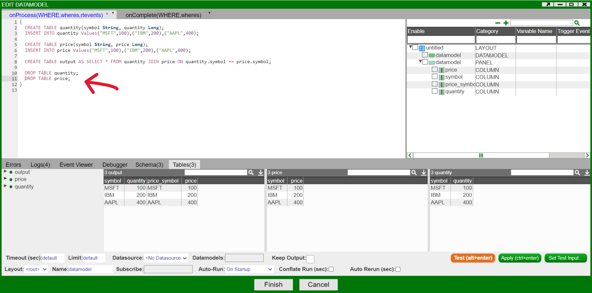

# Memory Overload

## Overview

There are several places in AMI from where memory consumption info can be collected. Then a few steps can be taken to optimize the consumption.

## Understanding Memory Consumption

There are several ways to asses how much memory AMI is using

1. The AMI Data Statistics bar will turn red indicating AMI slowdown

	  

1. Chart irregularity in the AMI Data Statistics Window

	

	1. Upper Graph - memory footprint of the webserver  
	1. Bottom Graph - memory footprint of the center  
	1. This graph is designed so that the top of the graph is the maximum memory capacity. **If the line gets near the top, AMI is closer to memory overload.**
	
	!!! note
		
		Keep in mind that the memory usage is shown as troughs (dips) in the chart. E.g. Tip of the chart = AMI memory usage + unused references (garbage). In other words, for a more accurate assessment of memory usage, look at the memory usage after the garbage collection finishes

1. AMI Log Viewer

	Setup of Log Viewer can be found in 3forge documentation -\> [Log Viewer Layout](./logs.md#log-viewer-layout)

	Upload the file AMIOne.amilog in the filename bar and open the *Memory Details* tab

	

  
	1. The red line is the maximum memory capacity of AMI. If the Used Memory and Allocated Memory reaches to the max, it suggests AMI will face performance issues.

	2. The table in the panel below gives insightful details of the AMI like

	-   Percentage of free memory
	-   Values of maximum, allocated, and used memory.

	

	1. We can use these values to better understand how much memory AMI used up and would need to let go.

## Troubleshooting

Data lives both in the webserver and the center. The most important step is to identify where the memory issue lies. 

### Web Server

Open the *Data Model Tables* tab from the *AMI Data Statistics* Window in the upper right corner of AMI


This tab contains information of the tables created in the current webserver the user is in.

-   The Cells column should be looked at as it shows which table has the most data.
-   You can also view the count of rows and columns.

Looking at the count of cells, we can recognize the most populated table from the web server to modify.

#### SOLUTION - Dropping a Table from the Web Server

Data models often use intermediary tables which aren't used in any visualizations. These tables can be dropped at the end of the data model to reduce memory footprint.



-   In this example, the tables that are joined (price,quantity) are no longer needed in the data model as the joined table output will be used for visualizations.
-   Hence, tables price and quantity can be dropped.

### Center

1. Open the AMI DB Shell Tool from Dashboard

	We can view all the tables in the center through the command line by writing

	``` amiscript
	SHOW TABLES;
	```

	

	We can view the row count of every table and find the most populated table in order to reduce memory footprint.

2. Diagnose a Table

	For deeper analysis, we can diagnose a table through the AMI shell tool by writing

	``` amiscript
	DIAGNOSE TABLE table_name;
	```

	

	The DIAGNOSE table will show all the necessary information about each column related to memory consumption (ignore TABLE_OVERHEAD)

	-   EST_MEMORY shows the memory for each column.
	-   COMMENT shows the datatypes and the byte size of each column.

#### SOLUTION - Datatype Conversion

If a string column exists in the table, it is recommended for the column to be stored as a **STRING BITMAP** or **STRING ONDISK** to reduce the high memory usage of a regular string column.

More info on efficient column types for a string can be found in the [Realtime Tables page](../center/realtime_tables.md#choosing-the-best-column-type-for-string).

If data type conversion cannot be done then dropping a table from the center would be the last option.

