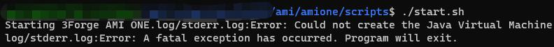
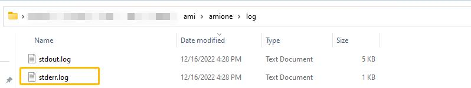
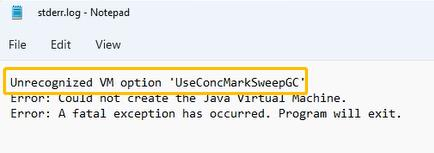
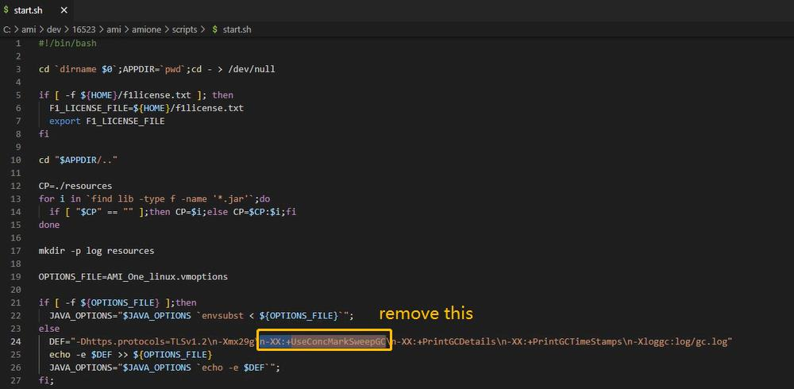

# Startup Failure

## General

=== "Windows"

	When diagnosing startup failures there are 3 places to look:

	1. Logs that appear in your terminal when running AMI

	1. `ami/log/stderr.log` where errors are logged

	1. `ami/log/AmiOne.log` where non-terminating errors are logged

=== "Linux"

	When diagnosing startup failures there are 3 places to look:

	1. Logs that appear in your terminal when running AMI

	1. `ami/error.log` where errors are logged

	1. `ami/log/AmiOne.log` where non-terminating errors are logged

## Common errors

#### Error: Could not open port

=== "Windows"

	The most common error when starting AMI is that it couldn't, often because it is already running. To fix, make sure AMI is not running by pressing `CTRL+SHIFT+ESC` to open the Task Manager then checking if `AmiOne.exe` is running under "Background Processes". If AMI is definitely not running, then check the ports in your configuration to ensure they do not clash with any other program.
	
=== "Linux"

	The most common error when starting AMI is that it couldn't, often because it is already running. To fix, make sure AMI is not running by searching for the AmiOne process. If AMI is definitely not running, then check the ports in your configuration to ensure they do not clash with any other program.

#### Error: Could not create the Java Virtual Machine

Side note: When launching AMI on Linux operating system, if you ever run into errors on the terminal upon running `./start.sh`, saying `Starting 3Forge AMI ONE.log/stderr.log:Error: Could not create the Java Virtual Machine.`
  

We could go to the **/ami/log/stderr.log** and see the detailed error message. In this case, it might be something like this: where this command is not recognized by JVM  
  
   
The solution will be: go to **/amione/scripts/start.sh** , get rid of **"-XX:+UseConcMarkSweepCG"** in the **start.sh** and launch again.  

