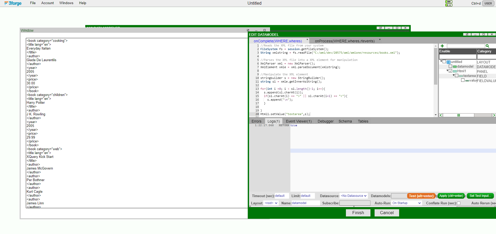

## Overview
AMI supports building and/or modification of XML files. This section will discuss the various ways to work with XML files in AMI.


**Contents:**

- AMI XML Classes
<!-- - Downloading XML from AMI -->
- Example Workflows


## AMI XML Classes


### XmlParser

| Method                                                  | Return Type    | Description                                                     |
| ------------------------------------------------------- | -------------- | --------------------------------------------------------------- |
| [`constructor`](#xmlparser-constructor)                 | XmlParser      | Creates a XML parser.                                           |
| [`getClassName()`](#xmlparser-getclassname)             | String         | Returns the string name of this object's class type.            |
| [`parseDocument(String xml)`](#xmlparser-parsedocument) | XmlElement     | Parses an XML string and returns an XmlElement object.          |
| [`toJson()`](#xmlparser-tojson)                         | String         | Returns a JSON representation of this object.                   |


<a id="xmlparser-constructor"></a>

!!! quote "Constructor" 
    Creates an XML parser.

    === "Script"
    
        ```amiscript
        XmlParser parser = new XmlParser();
        ```

    === "Output"
    
        ```amiscript
        com.f1.utils.xml.XmlParser@663982b4
        ```
<br>

<a id="xmlparser-getclassname"></a>

!!! quote "getClassName()"

    Creates a xml parser.
    
    === "Script"
    
        ```amiscript
        XmlParser parser = new XmlParser();
        parser.getClassName();
        ```

    === "Output"
    
        ```amiscript
        XmlParser
        ```

<br>

<a id="xmlparser-parsedocument"></a>
!!! quote "parseDocument(string xml)"

    Parses an xml string and returns an XmlElement object.
    
    === "Script"
    
        ```amiscript
        FileSystem fs = session.getFileSystem();
        String xmlstring = fs.readFile("/path/to/file/.../note.xml");
        XmlParser parser = new XmlParser();
        XmlElement element = parser.parseDocument(xmlstring);
        ```

    === "Output"
    
        ```amiscript
        <note date="20240612"><to>Adam</to><from>Bob</from><heading>Reminder</heading><body>Don't forget the milk!</body></note>
        ```

    === "note.xml"
    
        ```amiscript
        <note date="20240612">
            <to>Adam</to>
            <from>Bob</from>
            <heading>Reminder</heading>
            <body>Don't forget the milk!</body>
        </note>
        ```

<br>

<a id="xmlparser-tojson"></a>
!!! quote "toJson()"

    Returns a json representation of this object.
    
    === "Script"
    
        ```amiscript
        XmlParser parser = new XmlParser();
        parser.toJson();
        ```

    === "Output"
    
        ```amiscript
        "com.f1.utils.xml.XmlParser@319b3f3d"
        ```

<br>


### XmlText

| Method                                                  | Return Type    | Description                                                     |
| ------------------------------------------------------- | -------------- | --------------------------------------------------------------- |
| [`constructor(string string)`](#xmltext-constructor)    | XmlParser      | Creates an XmlText node based on the given string.              |
| [`getClassName()`](#xmltext-getclassname)               | String         | Returns the string name of this object's class type.            |
| [`toJson()`](#xmltext-tojson)                           | String         | Returns a JSON representation of this object.                   |
| [`toLegibleString()`](#xmltext-tolegiblestring)         | String         | Returns the XmlText node as a legible string.                   |
| [`toString()`](#xmltext-tostring)                       | String         | Returns the XmlText node as a string.                           |


<a id="xmltext-constructor"></a>

!!! quote "Constructor" 
    Creates an XmlText node based on the given string.

    === "Script"
    
        ```amiscript
        XmlText textnode = new xmltext("Hello, World!");
        ```

    === "Output"
    
        ```amiscript
        Hello, World!
        ```
<br>

<a id="xmltext-getclassname"></a>

!!! quote "getClassName()"

    Creates a xml parser.
    
    === "Script"
    
        ```amiscript
        XmlText textnode = new xmltext("Hello, World!");
        textnode.getClassName();
        ```

    === "Output"
    
        ```amiscript
        XmlText
        ```

<br>

<a id="xmltext-tojson"></a>
!!! quote "toJson()"

    Returns a json representation of this object.
    
    === "Script"
    
        ```amiscript
        XmlText textnode = new xmltext("Hello, World!");
        textnode.toJson();
        ```

    === "Output"
    
        ```amiscript
        "Hello, World!"
        ```

<br>

<a id="xmltext-tolegiblestring"></a>
!!! quote "toLegibleString()"

    Returns the XmlText node as a legible string.
    
    === "Script"
    
        ```amiscript
        XmlText textnode = new xmltext("Hello, World!");
        textnode.toLegibleString();
        ```

    === "Output"
    
        ```amiscript
        Hello, World!
        ```

<br>

<a id="xmltext-tostring"></a>
!!! quote "toString()"

    Returns the XmlText node as a string.
    
    === "Script"
    
        ```amiscript
        XmlText textnode = new xmltext("Hello, World!");
        textnode.toString();
        ```

    === "Output"
    
        ```amiscript
        Hello, World!
        ```

<br>


### XmlElement

| Method                                                              | Return Type    | Description                                                                  |
| ------------------------------------------------------------------- | -------------- | ---------------------------------------------------------------------------  |
| [`constructor(String xmlString)`](#xmlelement-constructor)          | XmlElement     | Creates an XML Element from an XML String                                    |
| [`addAttribute(String key, String value)`](#xmlelement-addattribute-string) | XmlElement     | Add an attribute to the XmlElement corresponding to the key-value pair.      |
| [`addAttribute(String key, Long value)`](#xmlelement-addattribute-long)   | XmlElement     | Add an attribute to the XmlElement corresponding to the key-value pair.      |
| [`addAttribute(String key, Double value)`](#xmlelement-addattribute-double) | XmlElement     | Add an attribute to the XmlElement corresponding to the key-value pair.      |
| [`addNode(XmlText xmlText)`](#xmlelement-addnode)       | XmlElement     | Add an existing XmlText node to the XmlElement.                              |
| [`getAttribute(String name)`](#xmlelement-getattribute)             | String         | Gets the attribute specified by a name.                                      |
| [`getAttributes()`](#xmlelement-getattributes)                      | Map            | Returns any attributes of the current element.                               |
| [`getChildren()`](#xmlelement-getchildren)                          | List           | Returns a list of the XmlElement's children.                                 |
| [`getClassName()`](#xmlelement-getclassname)                        | String         | Returns the string name of this object's class type.                         |
| [`getElements()`](#xmlelement-getelements)                          | List           | Returns any elements within the current element.                             |
| [`getElements(String name)`](#xmlelement-getelements-name)          | String         | Returns any elements within the current element based on the name specified. |
| [`getFirstElement(String name)`](#xmlelement-getfirstelement)       | XmlElement     | Returns the first element with the specified name.                           |
| [`getInnerAsString()`](#xmlelement-getinnerasstring)                | String         | Returns inner value of element as string.                                    |
| [`getName()`](#xmlelement-getname)                                  | String         | Returns tag name of current element.                                         |
| [`hasAttribute(String key)`](#xmlelement-hasattribute)              | String         | Returns tag name of current element.                                         |
| [`removeAttribute(String name)`](#xmlelement-removeattribute)       | XmlElement     | Remove an attribute based on the attribute name entered.                     |
| [`toJson()`](#xmlelement-tojson)                                    | String         | Returns a JSON representation of this object.                                |
| [`toLegibleString()`](#xmlelement-tolegiblestring)                  | String         | Returns the XmlElement as a legible string.                                  |
| [`toString()`](#xmlelement-tostring)                                | String         | Returns the XmlElement as a string.                                          |


<a id="xmlelement-constructor"></a>
!!! quote "Constructor(string xmlString)" 
    Creates an XML Element from an XML String.

    === "Script"
    
        ```amiscript
        XmlElement element = new XmlElement("person");
        ```

    === "Output"
    
        ```amiscript
        <person/>
        ```
<br>

<a id="xmlelement-addattribute-string"></a>
!!! quote "addAttribute(String key, String value)" 
    Add an attribute to the XmlElement corresponding to the key-value pair.

    === "Script"
    
        ```amiscript
        XmlElement element = new XmlElement("person");
        element.addAttribute("name", "John");
        ```

    === "Output"
    
        ```amiscript
        <person name="John"/>
        ```
<br>

<a id="xmlelement-addattribute-long"></a>
!!! quote "addAttribute(String key, Long value)" 
    Add an attribute to the XmlElement corresponding to the key-value pair.

    === "Script"
    
        ```amiscript
        XmlElement element = new XmlElement("person");
        element.addAttribute("age", 35L);
        ```

    === "Output"
    
        ```amiscript
        <person age="35"/>
        ```
<br>

<a id="xmlelement-addattribute-double"></a>
!!! quote "addAttribute(String key, Double value)" 
    Add an attribute to the XmlElement corresponding to the key-value pair.

    === "Script"
    
        ```amiscript
        XmlElement element = new XmlElement("person");
        element.addAttribute("height", 1.75);
        ```

    === "Output"
    
        ```amiscript
        <person height=1.75/>
        ```
<br>

<a id="xmlelement-addnode"></a>
!!! quote "addNode(XmlText xmltext)" 
    Add an existing XmlText node to the XmlElement.

    === "Script"
    
        ```amiscript
        XmlElement element = new XmlElement("person");
        element.addAttribute("name", "John");
        element.addNode(new xmltext("John loves to travel."));
        ```

    === "Output"
    
        ```amiscript
        <person name="John">John loves to travel.</person>
        ```
<br>

<a id="xmlelement-getattribute"></a>
!!! quote "getAttribute(String name)" 
    Gets the attribute specified by a name.

    === "Script"
    
        ```amiscript
        FileSystem fs = session.getFileSystem();
        String xmlstring = fs.readFile("/path/to/file/.../people.xml");
        XmlParser parser = new XmlParser();
        XmlElement element = parser.parseDocument(xmlstring);
        element.getAttribute("totalCount");
        ```

    === "Output"
    
        ```amiscript
        2
        ```

    === "people.xml"
    
        ```amiscript
        <people totalCount="2" version="1.0">
            <person name="John Doe" age="30" height="1.75" weight="75kg">
                <contact>
                    <email>john.doe@example.com</email>
                    <phone>123-456-7890</phone>
                </contact>
                <hobbies>
                    <hobby>Hiking</hobby>
                    <hobby>Photography</hobby>
                    <hobby>Reading</hobby>
                </hobbies>
            </person>
            <person name="Jane Smith" age="28" height="1.65" weight="60kg">
                <contact>
                    <email>jane.smith@example.com</email>
                    <phone>234-567-8901</phone>
                </contact>
                <hobbies>
                    <hobby>Traveling</hobby>
                    <hobby>Cooking</hobby>
                </hobbies>
            </person>
        </people>
        ```
<br>

<a id="xmlelement-getattributes"></a>
!!! quote "getAttributes()" 
    Returns any attributes of the current element.

    === "Script"
    
        ```amiscript
        FileSystem fs = session.getFileSystem();
        String xmlstring = fs.readFile("/path/to/file/.../people.xml");
        XmlParser parser = new XmlParser();
        XmlElement element = parser.parseDocument(xmlstring);
        element.getAttributes(); 
        ```

    === "Output"
    
        ```amiscript
        {"totalCount":"2", "version":"1.0"}
        ```

    === "people.xml"
    
        ```amiscript
        <people totalCount="2" version="1.0">
            <person name="John Doe" age="30" height="1.75" weight="75kg">
                <contact>
                    <email>john.doe@example.com</email>
                    <phone>123-456-7890</phone>
                </contact>
                <hobbies>
                    <hobby>Hiking</hobby>
                    <hobby>Photography</hobby>
                    <hobby>Reading</hobby>
                </hobbies>
            </person>
            <person name="Jane Smith" age="28" height="1.65" weight="60kg">
                <contact>
                    <email>jane.smith@example.com</email>
                    <phone>234-567-8901</phone>
                </contact>
                <hobbies>
                    <hobby>Traveling</hobby>
                    <hobby>Cooking</hobby>
                </hobbies>
            </person>
        </people>
        ```
<br>


<a id="xmlelement-getchildren"></a>
!!! quote "getChildren()" 
    Returns a list of the XmlElement's children.

    === "Script"
    
        ```amiscript
        FileSystem fs = session.getFileSystem();
        String xmlstring = fs.readFile("/path/to/file/.../note.xml");
        XmlParser parser = new XmlParser();
        XmlElement element = parser.parseDocument(xmlstring);
        element.getChildren(); 
        ```

    === "Output"
    
        ```amiscript
        [<to>Adam</to>, <from>Bob</from>, <heading>Reminder</heading>, <body>Don't forget the milk!</body>]
        ```

    === "note.xml"
    
        ```amiscript
        <note date="20240612">
            <to>Adam</to>
            <from>Bob</from>
            <heading>Reminder</heading>
            <body>Don't forget the milk!</body>
        </note>
        ```
<br>


<a id="xmlelement-getclassname"></a>
!!! quote "getClassName()" 
    Returns the string name of this object's class type.

    === "Script"
    
        ```amiscript
        XmlElement element = new XmlElement("person");
        element.getClassName();
        ```

    === "Output"
    
        ```amiscript
        XmlElement
        ```
<br>


<a id="xmlelement-getelements"></a>
!!! quote "getElements()" 
    Returns any elements within the current element.

    === "Script"
    
        ```amiscript
        FileSystem fs = session.getFileSystem();
        String xmlstring = fs.readFile("/path/to/file/.../note.xml");
        XmlParser parser = new XmlParser();
        XmlElement element = parser.parseDocument(xmlstring);
        element.getElements();
        ```

    === "Output"
    
        ```amiscript
        [<to>Adam</to>, <from>Bob</from>, <heading>Reminder</heading>, <body>Don't forget the milk!</body>]
        ```

    === "note.xml"
    
        ```amiscript
        <note date="20240612">
            <to>Adam</to>
            <from>Bob</from>
            <heading>Reminder</heading>
            <body>Don't forget the milk!</body>
        </note>
        ```
<br>

<a id="xmlelement-getelements-name"></a>
!!! quote "getElements(String name)" 
    Returns any elements within the current element based on the name specified.

    === "Script"
    
        ```amiscript
        FileSystem fs = session.getFileSystem();
        String xmlstring = fs.readFile("/path/to/file/.../note.xml");
        XmlParser parser = new XmlParser();
        XmlElement element = parser.parseDocument(xmlstring);
        element.getElements("body");
        ```

    === "Output"
    
        ```amiscript
        [<body>Don't forget the milk!</body>]
        ```

    === "note.xml"
    
        ```amiscript
        <note date="20240612">
            <to>Adam</to>
            <from>Bob</from>
            <heading>Reminder</heading>
            <body>Don't forget the milk!</body>
        </note>
        ```
<br>

<a id="xmlelement-getfirstelement"></a>
!!! quote "getFirstElement(String name)" 
    Returns the first element with the specified name.

    === "Script"
    
        ```amiscript
        FileSystem fs = session.getFileSystem();
        String xmlstring = fs.readFile("/path/to/file/.../people.xml");
        XmlParser parser = new XmlParser();
        XmlElement element = parser.parseDocument(xmlstring);
        element.getFirstElements("person");
        ```

    === "Output"
    
        ```amiscript
        <person name="John Doe" age="30" height="1.75" weight="75kg"><contact><email>john.doe@example.com</email><phone>123-456-7890</phone></contact><hobbies><hobby>Hiking</hobby><hobby>Photography</hobby><hobby>Reading</hobby></hobbies></person>

        ```

    === "people.xml"
    
        ```amiscript
        <people totalCount="2" version="1.0">
            <person name="John Doe" age="30" height="1.75" weight="75kg">
                <contact>
                    <email>john.doe@example.com</email>
                    <phone>123-456-7890</phone>
                </contact>
                <hobbies>
                    <hobby>Hiking</hobby>
                    <hobby>Photography</hobby>
                    <hobby>Reading</hobby>
                </hobbies>
            </person>
            <person name="Jane Smith" age="28" height="1.65" weight="60kg">
                <contact>
                    <email>jane.smith@example.com</email>
                    <phone>234-567-8901</phone>
                </contact>
                <hobbies>
                    <hobby>Traveling</hobby>
                    <hobby>Cooking</hobby>
                </hobbies>
            </person>
        </people>
        ```
<br>

<a id="xmlelement-getinnerasstring"></a>
!!! quote "getInnerAsString()" 
    Returns inner value of element as string.

    === "Script"
    
        ```amiscript
        FileSystem fs = session.getFileSystem();
        String xmlstring = fs.readFile("/path/to/file/.../note.xml");
        XmlParser parser = new XmlParser();
        XmlElement element = parser.parseDocument(xmlstring);
        element.getInnerAsString();
        ```

    === "Output"
    
        ```amiscript
        <to>Adam</to><from>Bob</from><heading>Reminder</heading><body>Don't forget the milk!</body>
        ```

    === "note.xml"
    
        ```amiscript
        <note date="20240612">
            <to>Adam</to>
            <from>Bob</from>
            <heading>Reminder</heading>
            <body>Don't forget the milk!</body>
        </note>
        ```
<br>

<a id="xmlelement-getname"></a>
!!! quote "getName()" 
    Returns tag name of current element.

    === "Script"
    
        ```amiscript
        FileSystem fs = session.getFileSystem();
        String xmlstring = fs.readFile("/path/to/file/.../note.xml");
        XmlParser parser = new XmlParser();
        XmlElement element = parser.parseDocument(xmlstring);
        element.getName();
        ```

    === "Output"
    
        ```amiscript
        note
        ```

    === "note.xml"
    
        ```amiscript
        <note date="20240612">
            <to>Adam</to>
            <from>Bob</from>
            <heading>Reminder</heading>
            <body>Don't forget the milk!</body>
        </note>
        ```
<br>


<a id="xmlelement-hasattribute"></a>
!!! quote "hasAttribute(String key)" 
    Check if the XmlElement contains an attribute based on the entered key.

    === "Script"
    
        ```amiscript
        FileSystem fs = session.getFileSystem();
        String xmlstring = fs.readFile("/path/to/file/.../note.xml");
        XmlParser parser = new XmlParser();
        XmlElement element = parser.parseDocument(xmlstring);
        element.hasAttribute("date");
        ```

    === "Output"
    
        ```amiscript
        true
        ```

    === "note.xml"
    
        ```amiscript
        <note date="20240612">
            <to>Adam</to>
            <from>Bob</from>
            <heading>Reminder</heading>
            <body>Don't forget the milk!</body>
        </note>
        ```
<br>

<a id="xmlelement-removeattribute"></a>
!!! quote "removeAttribute(String name)" 
    Remove an attribute based on the attribute name entered.

    === "Script"
    
        ```amiscript
        FileSystem fs = session.getFileSystem();
        String xmlstring = fs.readFile("/path/to/file/.../note.xml");
        XmlParser parser = new XmlParser();
        XmlElement element = parser.parseDocument(xmlstring);
        element.hasAttribute("date");
        element;
        ```

    === "Output"
    
        ```amiscript
        <note><to>Adam</to><from>Bob</from><heading>Reminder</heading><body>Don't forget the milk!</body></note>
        ```

    === "note.xml"
    
        ```amiscript
        <note date="20240612">
            <to>Adam</to>
            <from>Bob</from>
            <heading>Reminder</heading>
            <body>Don't forget the milk!</body>
        </note>
        ```
<br>

<a id="xmlelement-tojson"></a>
!!! quote "toJson()" 
    Returns a JSON representation of this object..

    === "Script"
    
        ```amiscript
        FileSystem fs = session.getFileSystem();
        String xmlstring = fs.readFile("/path/to/file/.../note.xml");
        XmlParser parser = new XmlParser();
        XmlElement element = parser.parseDocument(xmlstring);
        element.toJson();
        ```

    === "Output"
    
        ```amiscript
        "<note date=\"20240612\"><to>Adam</to><from>Bob</from><heading>Reminder</heading><body>Don't forget the milk!</body></note>"
        ```
    === "note.xml"
    
        ```amiscript
        <note date="20240612">
            <to>Adam</to>
            <from>Bob</from>
            <heading>Reminder</heading>
            <body>Don't forget the milk!</body>
        </note>
        ```
<br>

<a id="xmlelement-tolegiblestring"></a>
!!! quote "toLegibleString()" 
    Returns the XmlElement as a legible string.

    === "Script"
    
        ```amiscript
        FileSystem fs = session.getFileSystem();
        String xmlstring = fs.readFile("/path/to/file/.../note.xml");
        XmlParser parser = new XmlParser();
        XmlElement element = parser.parseDocument(xmlstring);
        element.toLegibleString();
        ```

    === "Output"
    
        ```amiscript
        <note date="20240612">
          <to>
            Adam
          </to>
          <from>
            Bob
          </from>
          <heading>
            Reminder
          </heading>
          <body>
            Don't forget the milk!
          </body>
        </note>
        ```

    === "note.xml"
    
        ```amiscript
        <note date="20240612">
            <to>Adam</to>
            <from>Bob</from>
            <heading>Reminder</heading>
            <body>Don't forget the milk!</body>
        </note>
        ```
<br>

<a id="xmlelement-tostring"></a>
!!! quote "toString()" 
    Returns the XmlElement as a legible string.

    === "Script"
    
        ```amiscript
        FileSystem fs = session.getFileSystem();
        String xmlstring = fs.readFile("/path/to/file/.../note.xml");
        XmlParser parser = new XmlParser();
        XmlElement element = parser.parseDocument(xmlstring);
        element.toString();
        ```

    === "Output"
    
        ```amiscript
        <note date="20240612"><to>Adam</to><from>Bob</from><heading>Reminder</heading><body>Don't forget the milk!</body></note>
        ```

    === "note.xml"
    
        ```amiscript
        <note date="20240612">
            <to>Adam</to>
            <from>Bob</from>
            <heading>Reminder</heading>
            <body>Don't forget the milk!</body>
        </note>
        ```
<br>

<!-- 
### XmlBuilder

| Method                                                              | Return Type    | Description                                                                  |
| ------------------------------------------------------------------- | -------------- | ---------------------------------------------------------------------------  |
| [`constructor()`](#xmlbuilder-constructor)          | XmlBuilder     | Creates a XmlBuilder.                                    |
| [`constructor(Object xmlElement)`](#xmlbuilder-constructor-xmlelement)          | XmlBuilder     | Creates a XmlBuilder.                                    |
| [`addAttribute(Map attributes)`](#xmlbuilder-addattribute-map) | XmlBuilder     | Add an attribute to the XmlElement corresponding to the key-value pair.      |
| [`addAttribute(String key, String value)`](#xmlbuilder-addattribute-string)   | XmlBuilder     | Add an attribute to the XmlElement corresponding to the key-value pair.      |
| [`addAttribute(String key, Long value)`](#xmlbuilder-addattribute-long) | XmlBuilder     | Add an attribute to the XmlElement corresponding to the key-value pair.    
| [`addAttribute(String key, Double value)`](#xmlbuilder-addattribute-double) | XmlBuilder     | Add an attribute to the XmlElement corresponding to the key-value pair.      |
| [`addElement(XmlElement xmlElement)`](#xmlbuilder-addelement-xmlelement) | XmlBuilder     | Adds XmlElement in XmlBuilder.      |
| [`addElement(String elementName)`](#xmlbuilder-addelement-string) | XmlBuilder     | Adds element in XmlBuilder.      |
| [`addNode(Object nodeName)`](#xmlbuilder-addnode)       | XmlBuilder     | Adds a new node with provided name.                              |
| [`addText(String text)`](#xmlbuilder-addtext)             | XmlBuilder         | Adds text to XmlBuilder.     |
| [`addTextElement(String text)`](#xmlbuilder-addtextelement)             | XmlBuilder         | Adds text to element in XmlBuilder.   |
| [`build()`](#xmlbuilder-build)             | Object         | Builds the XML.     |
| [`buildAndClear()`](#xmlbuilder-buildandclear)             | Object         | Builds and clears the XML.     |
| [`clear()`](#xmlbuilder-clear)             | XmlBuilder         | Clears the XmlBuilder.     |
| [`csize()`](#xmlbuilder-csize)             | Integer         | Returns the current element's size in XmlBuilder. Returns -1 if XmlBuilder is not a list.     |
| [`ctype()`](#xmlbuilder-ctype)             | Object         | Returns the current element's type in XmlBuilder.     |
| [`current()`](#xmlbuilder-current)             | Object         | Returns current element.     |
| [`elements()`](#xmlbuilder-elements)             | XmlBuilder         | Walk Elements.     |
| [`elements(String name)`](#xmlbuilder-elements-string)             | XmlBuilder         | Walk Elements with provided name.     |
| [`enter()`](#xmlbuilder-enter)             | XmlBuilder         | Enter into the element that was last added.     |
| [`first()`](#xmlbuilder-first)             | XmlBuilder         | Returns the first elements.     |
| [`getClassName()`](#xmlbuilder-getclassname)                        | String         | Returns the string name of this object's class type.                         |
| [`init()`](#xmlbuilder-init)             | XmlBuilder         | Initializes the XmlBuilder with an existing XML node.     |
| [`lastAdd()`](#xmlbuilder-lastadd)             | Object         | Returns last added xml node.     |
| [`nodes()`](#xmlbuilder-nodes)             | XmlBuilder         | Walk Nodes.     |
| [`pop()`](#xmlbuilder-pop)             | XmlBuilder         | Pops a XML element from the builder.     |
| [`popNode()`](#xmlbuilder-popnode)             | XmlBuilder         | Pops the latest node from the XmlBuilder.     |
| [`reset()`](#xmlbuilder-reset)             | XmlBuilder         | Resets the XmlBuilder.     |
| [`toJson()`](#xmlbuilder-tojson)                         | String         | Returns a JSON representation of this object.                   |
| [`toString(Object xmlElement)`](#xmlbuilder-tostring)                         | XmlBuilder         | Stringifies xmlElement.                   |
| [`toString(Stringbuilder stringbuilder, Object xmlElement)`](#xmlbuilder-tostring-stringbuilder)                         | XmlBuilder         | Stringifies xmlElement.                   |
| [`walk(String name)`](#xmlbuilder-walk-string)       | XmlBuilder         | Walk Elements.                   |
| [`walk(Object stop)`](#xmlbuilder-walk-object)       | XmlBuilder         | Walk Elements.                   |
| [`walk(Integer pos)`](#xmlbuilder-walk-integer)       | XmlBuilder         | Walk Elements.                   |

<a id="xmlbuilder-constructor"></a>
!!! quote "Constructor()" 
    Creates a XmlBuilder.

    === "Script"
    
        ```amiscript
        XmlBuilder builder = new XmlBuilder();
        ```

    === "Output"
    
        ```amiscript
        com.f1.utils.xml.XmlBuilder@699c2740
        ```
<br>

<a id="xmlbuilder-constructor-xmlelement"></a>
!!! quote "Constructor(Object XmlElement)" 
    Creates a XmlBuilder.

    === "Script"
    
        ```amiscript
        XmlElement element = new XmlElement("person");
        XmlBuilder builder = new XmlBuilder(element);
        ```

    === "Output"
    
        ```amiscript
        com.f1.utils.xml.XmlBuilder@7de4f6ca
        ```
<br>

<a id="xmlbuilder-addattribute-map"></a>
!!! quote "addAttribute(String key, Map attributes)"  
    Adds attributes to XmlBuilder based on provided map.
    THIS DOESNT WORK! IT ONLY ALLOWS STRINGS IN MAP!

    === "Script"
    
        ```amiscript
        XmlElement element = new XmlElement("person");
        XmlBuilder builder = new XmlBuilder(element);
        map m = new map("name", "John", "age", 35L, "height", 1.75);
        builder.addAttribute(m);
        string out = builder.build();     
        fileSystem fs = session.getFileSystem();
        fs.writeFile("/path/to/file/.../person.xml", out, false);
        ```

    === "Output"
        ```amiscript
        true
        ```

    === "person.xml"
        ```amiscript
        <person name="John" age="35" height="1.75"/>
        ```
<br>

<a id="xmlbuilder-addattribute-string"></a>
!!! quote "addAttribute(String key, String value)" 
    Adds attributes to XmlBuilder based on key, value provided.

    === "Script"
        ```amiscript
        XmlElement element = new XmlElement("person");
        XmlBuilder builder = new XmlBuilder(element);
        builder.addAttribute("name", "John");
        string out = builder.build();     
        session.getFileSystem().writeFile("/path/to/file/.../person.xml", out, false);
        ```

    === "Output"
        ```amiscript
        true
        ```

    === "person.xml"
        ```amiscript
        <person name="John"/>
        ```
<br>

<a id="xmlbuilder-addattribute-long"></a>
!!! quote "addAttribute(String key, Long value)" 
    Adds attributes to XmlBuilder based on key, value provided.

    === "Script"
        ```amiscript
        XmlElement element = new XmlElement("person");
        XmlBuilder builder = new XmlBuilder(element);
        builder.addAttribute("age", 35L);
        string out = builder.build();     
        session.getFileSystem().writeFile("/path/to/file/.../person.xml", out, false);
        ```

    === "Output"
        ```amiscript
        true
        ```

    === "person.xml"
        ```amiscript
        <person age="35"/>
        ```
<br>

<a id="xmlbuilder-addattribute-double"></a>
!!! quote "addAttribute(String key, Double value)" 
    Adds attributes to XmlBuilder based on key, value provided.

    === "Script"
    
        ```amiscript
        XmlElement element = new XmlElement("person");
        XmlBuilder builder = new XmlBuilder(element);
        builder.addAttribute("height", 1.75);
        string out = builder.build();     
        session.getFileSystem().writeFile("/path/to/file/.../person.xml", out, false);
        ```

    === "Output"
        ```amiscript
        true
        ```

    === "person.xml"
        ```amiscript
        <person height="1.75"/>
        ```
<br>

<a id="xmlbuilder-addelement-xmlelement"></a>
!!! quote "addElement(XmlElement xmlElement)" 
    Adds XmlElement in XmlBuilder.

    === "Script"
    
        ```amiscript
        XmlBuilder builder = new XmlBuilder(new XmlElement("person"));
        builder.addElement(new XmlElement("hobby"));
        fileSystem fs = session.getFileSystem();
        string out = builder.build();  
        session.getFileSystem().writeFile("/path/to/file/.../person.xml", out, false);
        ```

    === "Output"
        ```amiscript
        true
        ```

    === "person.xml"
        ```amiscript
        <person><hobby/></person>
        ```
<br>

<a id="xmlbuilder-addelement-string"></a>
!!! quote "addElement(String elementName)" 
    Adds element in XmlBuilder.

    === "Script"
    
        ```amiscript
        XmlBuilder builder = new XmlBuilder(new XmlElement("person"));
        builder.addElement("hobby");
        fileSystem fs = session.getFileSystem();
        string out = builder.build();  
        session.getFileSystem().writeFile("/path/to/file/.../person.xml", out, false);
        ```

    === "Output"
        ```amiscript
        true
        ```

    === "person.xml"
        ```amiscript
        <person><hobby/></person>
        ```
<br>


<a id="xmlbuilder-addnode"></a>
!!! quote "addNode(Object nodeName)" 
    Adds a new node with provided name.

    === "Script"
    
        ```amiscript
        XmlBuilder builder = new XmlBuilder(new XmlElement("person"));
        builder.addElement("hobby");
        builder.elements().walk(0);
        builder.addNode(new xmltext("sleeping"));
        string out = builder.build();  
        session.getFileSystem().writeFile("/path/to/file/.../person.xml", out, false);
        ```

    === "Output"
        ```amiscript
        true
        ```

    === "person.xml"
        ```amiscript
        <person><hobby>sleeping</hobby></person>
        ```
<br>

<a id="xmlbuilder-addtext"></a>
!!! quote "addText(String text)" 
    Adds text to XmlBuilder.

    === "Script"
    
        ```amiscript
        XmlBuilder builder = new XmlBuilder(new XmlElement("person"));
        builder.addText("This person has 1 hobby:");
        builder.addElement("hobby");
        builder.elements().walk(0);
        builder.addNode(new xmltext("sleeping"));
        string out = builder.build();  
        session.getFileSystem().writeFile("/path/to/file/.../person.xml", out, false);
        ```

    === "Output"
        ```amiscript
        true
        ```

    === "person.xml"
        ```amiscript
        <person>This person has 1 hobby:<hobby>sleeping</hobby></person>
        ```
<br>

<a id="xmlbuilder-addtextelement"></a>
!!! quote "addTextElement(String name, String text)" 
    Adds text to element in XmlBuilder.

    === "Script"
    
        ```amiscript
        XmlBuilder builder = new XmlBuilder(new XmlElement("person"));
        builder.addText("This person has 1 hobby:");
        builder.addTextElement("hobby", "sleeping");
        string out = builder.build();  
        session.getFileSystem().writeFile("/path/to/file/.../person.xml", out, false);
        ```

    === "Output"
        ```amiscript
        true
        ```

    === "person.xml"
        ```amiscript
        <person>This person has 1 hobby:<hobby>sleeping</hobby></person>
        ```
<br>

<a id="xmlbuilder-build"></a>
!!! quote "build()" 
    Builds the XML.

    === "Script"
    
        ```amiscript
        XmlBuilder builder = new XmlBuilder(new XmlElement("person"));
        builder.build();
        ```

    === "Output"
        ```amiscript
        <person/>
        ```
<br>

<a id="xmlbuilder-buildandclear"></a>
!!! quote "buildAndClear()" 
    Builds and clears XML.

    === "Script"
    
        ```amiscript
        XmlBuilder builder = new XmlBuilder(new XmlElement("person"));
        builder.buildAndClear();
        ```

    === "Output"
        ```amiscript
        <person/>
        ```
<br>

<a id="xmlbuilder-clear"></a>
!!! quote "clear()" 
    Clears the XmlBuilder.

    === "Script"
    
        ```amiscript
        XmlBuilder builder = new XmlBuilder(new XmlElement("person"));
        builder.clear();
        ```

    === "Output"
        ```amiscript
        com.f1.utils.xml.XmlBuilder@4973b1f4
        ```
<br>

<a id="xmlbuilder-csize"></a>
!!! quote "csize()" 
    Returns the current element's size in XmlBuilder. Returns -1 if XmlBuilder is not a list.

    === "Script"
    
        ```amiscript
        String xmlstring = session.getFileSystem().readFile("/path/to/file/.../people.xml");
        XmlParser parser = new XmlParser();
        XmlElement element = parser.parseDocument(xmlstring);
        XmlBuilder builder = new XmlBuilder(element);
        builder.elements().csize();
        ```

    === "Output"
        ```amiscript
        2
        ```

    === "people.xml"
    
        ```amiscript
        <people totalCount="2" version="1.0">
            <person name="John Doe" age="30" height="1.75" weight="75kg">
                <contact>
                    <email>john.doe@example.com</email>
                    <phone>123-456-7890</phone>
                </contact>
                <hobbies>
                    <hobby>Hiking</hobby>
                    <hobby>Photography</hobby>
                    <hobby>Reading</hobby>
                </hobbies>
            </person>
            <person name="Jane Smith" age="28" height="1.65" weight="60kg">
                <contact>
                    <email>jane.smith@example.com</email>
                    <phone>234-567-8901</phone>
                </contact>
                <hobbies>
                    <hobby>Traveling</hobby>
                    <hobby>Cooking</hobby>
                </hobbies>
            </person>
        </people>
        ```
<br>

<a id="xmlbuilder-ctype"></a>
!!! quote "ctype()" 
    Returns the current element's type in XmlBuilder.

    === "Script"
    
        ```amiscript
        String xmlstring = session.getFileSystem().readFile("/path/to/file/.../people.xml");
        XmlParser parser = new XmlParser();
        XmlElement element = parser.parseDocument(xmlstring);
        XmlBuilder builder = new XmlBuilder(element);
        session.log("builder.elements().ctype(): " +  builder.elements().ctype());
        session.log("builder.walk(0).ctype(): " + builder.walk(0).ctype());
        ```

    === "Output"
        ```amiscript
        log: builder.elements().ctype(): class java.util.ArrayList
        log: builder.walk(0).ctype(): class com.f1.utils.xml.XmlElement
        ```

    === "people.xml"
    
        ```amiscript
        <people totalCount="2" version="1.0">
            <person name="John Doe" age="30" height="1.75" weight="75kg">
                <contact>
                    <email>john.doe@example.com</email>
                    <phone>123-456-7890</phone>
                </contact>
                <hobbies>
                    <hobby>Hiking</hobby>
                    <hobby>Photography</hobby>
                    <hobby>Reading</hobby>
                </hobbies>
            </person>
            <person name="Jane Smith" age="28" height="1.65" weight="60kg">
                <contact>
                    <email>jane.smith@example.com</email>
                    <phone>234-567-8901</phone>
                </contact>
                <hobbies>
                    <hobby>Traveling</hobby>
                    <hobby>Cooking</hobby>
                </hobbies>
            </person>
        </people>
        ```
<br>

<a id="xmlbuilder-current"></a>
!!! quote "current()" 
    Returns the current element.

    === "Script"
    
        ```amiscript
        String xmlstring = session.getFileSystem().readFile("/path/to/file/.../note.xml");
        XmlParser parser = new XmlParser();
        XmlElement element = parser.parseDocument(xmlstring);
        XmlBuilder builder = new XmlBuilder(element);
        builder.elements().walk(1).elements().walk(0).current();
        ```

    === "Output"
        ```amiscript
        <contact><email>jane.smith@example.com</email><phone>234-567-8901</phone></contact>
        ```

    === "people.xml"
    
        ```amiscript
        <people totalCount="2" version="1.0">
            <person name="John Doe" age="30" height="1.75" weight="75kg">
                <contact>
                    <email>john.doe@example.com</email>
                    <phone>123-456-7890</phone>
                </contact>
                <hobbies>
                    <hobby>Hiking</hobby>
                    <hobby>Photography</hobby>
                    <hobby>Reading</hobby>
                </hobbies>
            </person>
            <person name="Jane Smith" age="28" height="1.65" weight="60kg">
                <contact>
                    <email>jane.smith@example.com</email>
                    <phone>234-567-8901</phone>
                </contact>
                <hobbies>
                    <hobby>Traveling</hobby>
                    <hobby>Cooking</hobby>
                </hobbies>
            </person>
        </people>
        ```
<br>


<a id="xmlbuilder-elements"></a>
!!! quote "elements()" 
    Walk Elements.

    === "Script"
    
        ```amiscript
        String xmlstring = session.getFileSystem().readFile("/path/to/file/.../note.xml");
        XmlParser parser = new XmlParser();
        XmlElement element = parser.parseDocument(xmlstring);
        XmlBuilder builder = new XmlBuilder(element);
        builder.elements().current();
        ```

    === "Output"
        ```amiscript
        [<person name="John Doe" age="30" height="1.75" weight="75kg"><contact><email>john.doe@example.com</email><phone>123-456-7890</phone></contact><hobbies><hobby>Hiking</hobby><hobby>Photography</hobby><hobby>Reading</hobby></hobbies></person>, <person name="Jane Smith" age="28" height="1.65" weight="60kg"><contact><email>jane.smith@example.com</email><phone>234-567-8901</phone></contact><hobbies><hobby>Traveling</hobby><hobby>Cooking</hobby></hobbies></person>]
        ```

    === "people.xml"
    
        ```amiscript
        <people totalCount="2" version="1.0">
            <person name="John Doe" age="30" height="1.75" weight="75kg">
                <contact>
                    <email>john.doe@example.com</email>
                    <phone>123-456-7890</phone>
                </contact>
                <hobbies>
                    <hobby>Hiking</hobby>
                    <hobby>Photography</hobby>
                    <hobby>Reading</hobby>
                </hobbies>
            </person>
            <person name="Jane Smith" age="28" height="1.65" weight="60kg">
                <contact>
                    <email>jane.smith@example.com</email>
                    <phone>234-567-8901</phone>
                </contact>
                <hobbies>
                    <hobby>Traveling</hobby>
                    <hobby>Cooking</hobby>
                </hobbies>
            </person>
        </people>
        ```
<br>

<a id="xmlbuilder-elements-string"></a>
!!! quote "elements(String name)" 
    Walk Elements with provided name.

    === "Script"
    
        ```amiscript
        String xmlstring = session.getFileSystem().readFile("/path/to/file/.../people.xml");
        XmlParser parser = new XmlParser();
        XmlElement element = parser.parseDocument(xmlstring);
        XmlBuilder builder = new XmlBuilder(element);
        builder.elements("person").walk(1).elements("contact").walk(0).current();
        ```

    === "Output"
        ```amiscript
        <contact><email>john.doe@example.com</email><phone>123-456-7890</phone></contact>
        ```

    === "people.xml"
    
        ```amiscript
        <people totalCount="2" version="1.0">
            <person name="John Doe" age="30" height="1.75" weight="75kg">
                <contact>
                    <email>john.doe@example.com</email>
                    <phone>123-456-7890</phone>
                </contact>
                <hobbies>
                    <hobby>Hiking</hobby>
                    <hobby>Photography</hobby>
                    <hobby>Reading</hobby>
                </hobbies>
            </person>
            <person name="Jane Smith" age="28" height="1.65" weight="60kg">
                <contact>
                    <email>jane.smith@example.com</email>
                    <phone>234-567-8901</phone>
                </contact>
                <hobbies>
                    <hobby>Traveling</hobby>
                    <hobby>Cooking</hobby>
                </hobbies>
            </person>
        </people>
        ```
<br>


<a id="xmlbuilder-enter"></a>
!!! quote "enter()" 
    Enter into the element that was last added.

    === "Script"
    
        ```amiscript
        XmlBuilder builder = new XmlBuilder(new XmlElement("person"));
        builder.addTextElement("hobby","sleeping");
        builder.enter().current();
        ```

    === "Output"
        ```amiscript
        sleeping
        ```
<br>

<a id="xmlbuilder-first"></a>
!!! quote "first()" 
    Returns the first elements.

    === "Script"
    
        ```amiscript

        ```

    === "Output"
        ```amiscript
        
        ```

<br>

<a id="xmlbuilder-getclassname"></a>
!!! quote "getClassName()" 
    Returns the string name of this object's class type.

    === "Script"
    
        ```amiscript
        XmlBuilder builder = new XmlBuilder();
        builder.getClassName();
        ```

    === "Output"
        ```amiscript
        XmlBuilder
        ```
<br>

<a id="xmlbuilder-init"></a>
!!! quote "init(Object XmlElement)" 
    Initializes the XmlBuilder with an existing XML node.

    === "Script"
    
        ```amiscript
        XmlBuilder builder = new XmlBuilder(new XmlElement("person"));
        builder.init(new XmlElement("countries"));
        builder.current();
        ```

    === "Output"
        ```amiscript
        <countries/>
        ```
<br>

<a id="xmlbuilder-lastadd"></a>
!!! quote "lastAdd()" 
    Returns the last added XML node.

    === "Script"
    
        ```amiscript
        XmlBuilder builder = new XmlBuilder(new XmlElement("person"));
        builder.addElement(new XmlElement("hobby"));
        builder.lastAdd();
        ```

    === "Output"
        ```amiscript
        <hobby/>
        ```
<br>

<a id="xmlbuilder-nodes"></a>
!!! quote "nodes()" 
    Walk nodes.

    === "Script"
    
        ```amiscript
        XmlBuilder builder = new XmlBuilder(new XmlElement("person"));
        builder.addElement(new XmlElement("email"));
        builder.addElement(new XmlElement("contact"));
        builder.nodes().current();;
        ```

    === "Output"
        ```amiscript
        [<email/>, <contact/>]
        ```
<br>

<a id="xmlbuilder-pop"></a>
!!! quote "pop()" 
    Pops a XML element from the builder.
    TO CLARIFY DIFFERENCE BETWEEN THIS AND POPNODE()

    === "Script"
    
        ```amiscript
        String xmlstring = session.getFileSystem().readFile("/path/to/file/.../people.xml");
        XmlParser parser = new XmlParser();
        XmlElement element = parser.parseDocument(xmlstring);
        XmlBuilder builder = new XmlBuilder(element);
        builder.elements().walk(1).elements().walk(0).elements().walk(0).current();
        session.log("output 1: " + builder.current());
        session.log("output 2: " + builder.pop().current());
        ```

    === "Output"
        ```amiscript
        log: output 1: <email>jane.smith@example.com</email>
        log: output 2: [<email>jane.smith@example.com</email>,<phone>234-567-8901</phone>]
        ```

    === "people.xml"
    
        ```amiscript
        <people totalCount="2" version="1.0">
            <person name="John Doe" age="30" height="1.75" weight="75kg">
                <contact>
                    <email>john.doe@example.com</email>
                    <phone>123-456-7890</phone>
                </contact>
                <hobbies>
                    <hobby>Hiking</hobby>
                    <hobby>Photography</hobby>
                    <hobby>Reading</hobby>
                </hobbies>
            </person>
            <person name="Jane Smith" age="28" height="1.65" weight="60kg">
                <contact>
                    <email>jane.smith@example.com</email>
                    <phone>234-567-8901</phone>
                </contact>
                <hobbies>
                    <hobby>Traveling</hobby>
                    <hobby>Cooking</hobby>
                </hobbies>
            </person>
        </people>
        ```
<br>

<a id="xmlbuilder-popnode"></a>
!!! quote "popNode()" 
    Pops the latest node from the XmlBuilder.
    TO CLARIFY DIFFERENCE BETWEEN THIS AND POPNODE()

    === "Script"
    
        ```amiscript
        String xmlstring = session.getFileSystem().readFile("/path/to/file/.../people.xml");
        XmlParser parser = new XmlParser();
        XmlElement element = parser.parseDocument(xmlstring);
        XmlBuilder builder = new XmlBuilder(element);
        builder.elements().walk(1).elements().walk(0).elements().walk(0).current();
        session.log("output 1: " + builder.current());
        session.log("output 2: " + builder.popNode().current());
        ```

    === "Output"
        ```amiscript
        log: output 1: <email>jane.smith@example.com</email>
        log: output 2: [<email>jane.smith@example.com</email>,<phone>234-567-8901</phone>]
        ```

    === "people.xml"
    
        ```amiscript
        <people totalCount="2" version="1.0">
            <person name="John Doe" age="30" height="1.75" weight="75kg">
                <contact>
                    <email>john.doe@example.com</email>
                    <phone>123-456-7890</phone>
                </contact>
                <hobbies>
                    <hobby>Hiking</hobby>
                    <hobby>Photography</hobby>
                    <hobby>Reading</hobby>
                </hobbies>
            </person>
            <person name="Jane Smith" age="28" height="1.65" weight="60kg">
                <contact>
                    <email>jane.smith@example.com</email>
                    <phone>234-567-8901</phone>
                </contact>
                <hobbies>
                    <hobby>Traveling</hobby>
                    <hobby>Cooking</hobby>
                </hobbies>
            </person>
        </people>
        ```
<br>

<a id="xmlbuilder-reset"></a>
!!! quote "reset()" 
    Resets the XmlBuilder.

    === "Script"
    
        ```amiscript
        XmlBuilder builder = new XmlBuilder(new XmlElement("person"));
        builder.addElement("hobbies").enter();
        builder.addTextElement("hobby", "sleeping");
        builder.addTextElement("hobby", "travelling");
        session.log("log1: "+ builder.enter().current());
        session.log("log2: "+ builder.reset().current()); 
        ```

    === "Output"
        ```amiscript
        log: log1: travelling
        log: log2: <person><hobbies><hobby>sleeping</hobby><hobby>travelling</hobby></hobbies></person>
        ```
<br>

<a id="xmlbuilder-tojson"></a>
!!! quote "toJson()" 
    Returns a JSON representation of this object.

    === "Script"
    
        ```amiscript
        XmlBuilder builder = new XmlBuilder(new XmlElement("person"));
        builder.addElement("hobbies").enter();
        builder.addTextElement("hobby", "sleeping");
        builder.addTextElement("hobby", "travelling");
        builder.popNode().current().toJson();
        ```

    === "Output"
        ```amiscript
        "<person><hobbies><hobby>sleeping</hobby><hobby>travelling</hobby></hobbies></person>"
        ```
<br>

<a id="xmlbuilder-tostring"></a>
!!! quote "toString(Object xmlElement)" 
    Stringifies xmlElement.

    === "Script"
    
        ```amiscript
        XmlBuilder builder = new XmlBuilder(new XmlElement("person"));
        builder.addElement("hobbies").enter();
        builder.addTextElement("hobby", "sleeping");
        builder.addTextElement("hobby", "travelling");
        builder.toString(builder.popNode().current());
        ```

    === "Output"
        ```amiscript
        <person>
          <hobbies>
            <hobby>
              sleeping
            </hobby>
            <hobby>
              travelling
            </hobby>
          </hobbies>
        </person>
        ```
<br>

<a id="xmlbuilder-tostring-stringbuilder"></a>
!!! quote "toString(StringBuilder stringBuilder, Object xmlElement)" 
    Stringifies xmlElement.

    === "Script"
    
        ```amiscript

        ```

    === "Output"
        ```amiscript

        ```
<br>

<a id="xmlbuilder-walk-string"></a>
!!! quote "walk(String name)" 
    Walk Elements.

    === "Script"
    
        ```amiscript

        ```

    === "Output"
        ```amiscript

        ```

    === "people.xml"
    
        ```amiscript
        <people totalCount="2" version="1.0">
            <person name="John Doe" age="30" height="1.75" weight="75kg">
                <contact>
                    <email>john.doe@example.com</email>
                    <phone>123-456-7890</phone>
                </contact>
                <hobbies>
                    <hobby>Hiking</hobby>
                    <hobby>Photography</hobby>
                    <hobby>Reading</hobby>
                </hobbies>
            </person>
            <person name="Jane Smith" age="28" height="1.65" weight="60kg">
                <contact>
                    <email>jane.smith@example.com</email>
                    <phone>234-567-8901</phone>
                </contact>
                <hobbies>
                    <hobby>Traveling</hobby>
                    <hobby>Cooking</hobby>
                </hobbies>
            </person>
        </people>
        ```
<br>

<a id="xmlbuilder-walk-object"></a>
!!! quote "walk(Object stop)" 
    Walk Elements.

    === "Script"
    
        ```amiscript

        ```

    === "Output"
        ```amiscript
        <email>jane.smith@example.com</email>
        ```

    === "people.xml"
    
        ```amiscript
        <people totalCount="2" version="1.0">
            <person name="John Doe" age="30" height="1.75" weight="75kg">
                <contact>
                    <email>john.doe@example.com</email>
                    <phone>123-456-7890</phone>
                </contact>
                <hobbies>
                    <hobby>Hiking</hobby>
                    <hobby>Photography</hobby>
                    <hobby>Reading</hobby>
                </hobbies>
            </person>
            <person name="Jane Smith" age="28" height="1.65" weight="60kg">
                <contact>
                    <email>jane.smith@example.com</email>
                    <phone>234-567-8901</phone>
                </contact>
                <hobbies>
                    <hobby>Traveling</hobby>
                    <hobby>Cooking</hobby>
                </hobbies>
            </person>
        </people>
        ```
<br>

<a id="xmlbuilder-walk-integer"></a>
!!! quote "walk(Integer pos)" 
    Walk Elements.

    === "Script"
    
        ```amiscript
        String xmlstring = session.getFileSystem().readFile("/path/to/file/.../people.xml");
        XmlParser parser = new XmlParser();
        XmlElement element = parser.parseDocument(xmlstring);
        XmlBuilder builder = new XmlBuilder(element);
        builder.elements().walk(1).elements().walk(0).elements().walk(0).current();
        ```

    === "Output"
        ```amiscript
        <email>jane.smith@example.com</email>
        ```

    === "people.xml"
    
        ```amiscript
        <people totalCount="2" version="1.0">
            <person name="John Doe" age="30" height="1.75" weight="75kg">
                <contact>
                    <email>john.doe@example.com</email>
                    <phone>123-456-7890</phone>
                </contact>
                <hobbies>
                    <hobby>Hiking</hobby>
                    <hobby>Photography</hobby>
                    <hobby>Reading</hobby>
                </hobbies>
            </person>
            <person name="Jane Smith" age="28" height="1.65" weight="60kg">
                <contact>
                    <email>jane.smith@example.com</email>
                    <phone>234-567-8901</phone>
                </contact>
                <hobbies>
                    <hobby>Traveling</hobby>
                    <hobby>Cooking</hobby>
                </hobbies>
            </person>
        </people>
        ```
<br>

## Downloading of XML

To download XML files, use either of the following AMIScripts:


!!! quote "Session.downloadToBrowser(String fileName, String fileData)" 

    === "Script"
        ```amiscript
        XmlElement element = new XmlElement("person");
        XmlBuilder builder = new XmlBuilder(element);
        builder.addAttribute("name", "John");
        string out  = builder.build();
        session.downloadToBrowser("person.xml", out);
        ```

    === "person.xml"
        ```amiscript
        <person name="John"/>
        ```


!!! quote "FileSystem.writeFile(String file, String data, Boolean shouldAppend)" 

    === "Script"
        ```amiscript
        XmlElement element = new XmlElement("person");
        XmlBuilder builder = new XmlBuilder(element);
        builder.addAttribute("name", "John");
        string out = builder.build();     
        session.getFileSystem().writeFile("/path/to/file/.../person.xml", out, false);
        ```

    === "person.xml"
        ```amiscript
        <person name="John"/>
        ```
 -->

## Sample Use Case

### Displaying XML in HTML panel

#### Steps to display the parsed XML inside a HTML textarea field.

The sample code below will display the parsed XML inside a HTML text area.

=== "Script"

    ``` amiscript
    //Reads the XML file from your system
    FileSystem fs = session.getFileSystem();
    String xmlstring = fs.readFile("/path/to/file/.../books.xml");

    //Parses the XML file into a XML element for manipulation
    XmlParser parser = new XmlParser();
    XmlElement xml = parser.parseDocument(xmlstring);

    //Manipulate the XML element
    stringbuilder s = new StringBuilder();
    string s1 = xml.getInnerAsString();

    for(int i =0; i < s1.length()-1; i++){
      s.append(s1.charAt(i));
      if(s1.charAt(i) == ">" || s1.charAt(i+1) == "<"){
        s.append("\n");
      }
      
    }
    Html1.setValue("textarea",s);
    ```
=== "Output"
    


<!-- ### Building XML with the XmlBuilder 
#### Steps to build a new XML using the XmlBuilder Class.

The Amiscript below constructs an XML file programmatically using the XmlBuilder class, and then writes the resulting XML to a file on the file system.

=== "Script"
      ``` amiscript
      // XmlBuilder Initialization
      XmlBuilder builder = new XmlBuilder();

      // Add Root Element <bookstore>
      builder.addElement("bookstore");

      // Adding the First Book Entry:
      builder.addElement("book"); 
      builder.elements().walk(0);  // Navigates to the first child element of <bookstore>.

      //// Adding the Title for the First Book:
      builder.addElement("title");
      builder.elements().walk(0);  // Walk into the <title> element (index 0 of <book>)
      builder.addText("To Kill a Mockingbird");
      builder.addAttribute("lang", "en");

      //// Adding other Elements for the First Book:
      builder.elements().popNode().popNode();  // Pop back to the <book> element.
      builder.addTextElement("author", "Harper Lee");
      builder.addTextElement("year", "1960");
      builder.addTextElement("price", "24.99");

      //// Moving Back to <bookstore>:
      builder.popNode();

      // Adding the Second Book Entry:
      builder.addElement("book");
      builder.elements().walk(1);
      builder.addElement("title");
      builder.elements().walk(0);
      builder.addText("Le Petit Prince");
      builder.addAttribute("lang","fr");
      builder.elements().popNode().popNode();
      builder.addTextElement("author", "Antoine de Saint-Exupéry");
      builder.addTextElement("year", "1943");
      builder.addTextElement("price", "19.99");
      builder.popNode();

      // Converting XML to String
      String xml_string = builder.toString(builder.current());

      // Exporting the XML 
      FileSystem fs = session.getFileSystem();
      fs.writeFile("/path/to/file/.../test.xml", xml_string, false);

      ```
=== "Output"
     -->