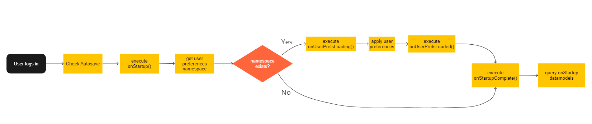

## Callbacks

## Overview

Callbacks run code on a process performing a defined action.

## Layout Callbacks

### Definitions

`onAsyncCommandResponse(response)`
:	This callback triggers when 3forge receives a response to an execution of a registered command.

`onKey(keyEvent)`

:	This callback is triggered on most keystrokes from the keyboard, however there are some keys that this does not apply too, shift, ctrl, and esc for example. It is overridden by any field that has its own onKey callback. For example, the text field in a html field panel will not trigger this callback when the user types in this field however the filter box for a table will trigger this callback as there are no callbacks on a filter field as standard.

`keyEvent`

:	The key event is an object that contains the key object. This object holds the key that was pressed.

`onMouse(event)`

:	This callback is triggered by mouse all events. The event specifies the type of click (left, middle, right) and the event type (e.g. mouse down). Clicks on the AMI toolbar will not trigger this event.

`event`

:	The mouse event is an object that contains the mouse click type, event type, and additional information e.g. position.

`onNotificationHandled(id,status,attachment)`

:	This callback triggers when user clicks on a notification.

`onStartup()`

:	The script of this callback is executed once when layout finishes loading but before the query-on-startup-datamodel runs (e.g. on user login, rebuild etc.)  

`onStartupComplete()`

:	This callback is executed when the layout has loaded, query-on-startup-datamodels have run, and user preferences have been loaded or ignored.

`onUrlParams()`

:	This callback is executed when a page is refreshed and there are parameters present in the URL e.g. host:33332/portal/portal.jsp?a=b

:	These params are passed to the callback in a map.

`onUserPrefsLoaded(userPrefs)`

:	This is triggered when user preferences are successfully loaded.

`onUserPrefsLoading(userPrefs)`

:	This is triggered when user preferences are in the process of being loaded, this could be when the user first presses the save button to begin the update of their default timezone.

`onUserPrefsSaved(userPrefs)`

:	This is triggered when user preferences are successfully saved.

`onUserPrefsSaving(userPrefs)`

:	This is triggered when user preferences are in the process of being saved, this could be the user updating their default connection timeout.

`userPrefs`

:	This object contains a list of all user preferences.

### User Login Diagram

The diagram below describes the execution process of different callbacks and loading process of different components.



### Example: `onUrlParams`

The `onUrlParams(Map params)` callback can be used to control a dashboard based on the URL parameters. For this example we'll be assuming the base URL for accessing AMI is `localhost:33332`. First, create a new window, click on the green icon, then select **Place Highlighted In Tab**:


Select the green icon for the Tabs and select **Add Tab**:


Click on the dropdown arrow for the first tab to access the tab's settings then Change both the title and id for the first tab. Repeat this for the second tab:


Now that we have two tabs, navigate to **Dashboard** > **Custom Callbacks** then navigate to the `onUrlParams(Map params)` callback. Note that you may have to use the arrows on the right hand side to scroll to the `onUrlParams(Map params)` callback.

Finally, we can import the tabs using the right hand menu and add the following AMIScript to select tabs based on the URL parameters:

``` amiscript
String selectedTab = params.get("tab");

if (selectedTab == "first") {
  Tabs1.setSelectedTab(first_tab);
} else if (selectedTab == "second") {
  Tabs1.setSelectedTab(second_tab);
}
```

The final callback should appear as shown below:


Finally, we can test the URL by accessing [`http://localhost:33332/3forge?tab=first`](http://localhost:33332/3forge?tab=first) and [`http://localhost:33332/3forge?tab=second`](http://localhost:33332/3forge?tab=second).

## Divider Callbacks

`onDividerMoved(offsetPct, offsetPx)`

:	This callback is triggered when a divider is clicked, moved, and dropped in a new location by the user. This does not trigger if the user clicks the divider but doesn't move it.

	**Example**
	
	1. Let's create a window with two panels separated by a divider, Div1  
	  
	1. Right click on the divider, go to AmiScript Callbacks -\> OnDividerMoving and enter the following amiScripts  
	  
	1. Hit Submit. Now as you drag the divider, the OnDividerMoved callback gets fired.  
	


`onDividerMoving(offsetPct, offsetPx)`

:	This callback is triggerd as soon as the divider is moved regardless of whether the user drops the divider, this is repeatedly triggered on every move the divider makes.

`offsetPct`

:	This gives a percentage for the offset value for the divider in relation to the divider to its left in vertical dividers and the divider above it in horizontal dividers.

`offsetPx`

:	This gives the offset value for the divider in pixels in relation to the divider to its left in vertical dividers and the divider above it in horizontal dividers.


## HTML Field Callbacks

`onChange()`

:	This is triggered when the state of the field is changed, this could be pressing a button or pressing a key in a text box.

`onFocus()`

:	This callback will run the provided script when the current element becomes active, this could be for example 'tabbing' or clicking into a text box.

`onAmiJsCallback()`

:	This callback is executed when javascript invocations of the same function name are executed within the browser.

	**Example**
	
	1. Create a HTML Panel and select Edit HTML  
	1. Create a simple button as such: `<button onclick='amiJsCallback(this,"action",1, {b:2}, "3")'> Button </button>`
	1. When the button is clicked, the onAmiJsCallback function is fired from the HTML Panel
		-   The 2nd param is passed to the *action* parameter as a string
		-   The 3rd param is passed to the *param* parameter as a list of all remaining items. In our example, this would result in `List(1, Map("b",2), "3")`

## Table Callbacks

`onCellClicked(column, val, rowvals)`

:	This callback gives the user the flexibility to add personalized options when a cell is clicked. For example, the following three commands will give you a pop-up message box stating the column name, cell value or all the row values with their corresponding column names:

	**session.alert(column);**
	
	
	
	**session.alert(val);**
	
	
	
	**session.alert(rowvals);**
	
	
	
	Make sure you turn "Clickable" on under edit column.
	
	

`onColumnsArranged()`

:	This callback gives the user the option to add personalized features when columns are rearranged.

`onEdit(vals, oldVals)`

:	This callback is triggered whenever a value in the table is edited and then saved. This does not trigger if the value is the same as its original state when saved; if the value has been changed and then reverted to it's original state before being saved it will not trigger.

	Two tables are returned when triggered, **vals** and **oldVals**.**vals** contains the latest version of the edited cells while **oldVals** contains the original values before being saved.

	The values stored inside these tables are defined using the **edit column** menu. The menu can be accessed by left clicking the header of a column and choosing the edit column option from the dropdown box as shown above. Looking at the **cell editing** section of this menu allows the user to define how they want this column's data to be accessible to the user.
	
	**Example**

	

	At the bottom of the menu there is an option labelled **clickable**, when this is set to **On** the user will be able to double click cells in this column and edit them in real-time. The data in the table backing the table visualisation will only be changed if the user has written a specific script to do so.

	

	There are multiple options available, the **readonly** option allows the user to include the value of the cells in the **vals** and **oldVals** tables. The other options define the datatype of the new value that is entered into the edited cell, this datatype must match the original type of the cell.

`onFilterChanging()`

:	This callback gives the user the option to add personalized features when any filters are added, changed or removed.

`onSelected()`

:	This callback gives the user the option to add personalized features for selecting a cell/row.

`onSize(width, height)`

:	This callback gives the user the option to add personalized features when the size of the selected panel is changed.

`onVisible(visible)`

:	This callback gives the user the option to add personalized features when the selected panel is visible or not visible(minimized).

## Data Model Callbacks

OnProcess and OnComplete are two Datamodel callbacks that are executed sequentially. Every time the data model is being run, it first runs the code in OnProcess() and caches the result in the data model cache. Next, it runs the code inside OnComplete and updates the changes in the UI. Now we set up a simple test case to demonstrate the usage of these two callbacks.

`OnProcess(WHERE,wheres,rtevents)`

:	First let's create a datamodel on the table "City" from mySQL database, in the **OnProcess** section, we select everything from the "City" table.  

	 

`OnComplete(WHERE,wheres)`

:	Then, we go to the **OnComplete** section and enter the following code to set up a filter and bring the panel to the front.  

	
	
	Now, once we click finish, the data model is going to first run the code OnProcess(), which instantiates the table, and then runs the code in OnComplete(), which filters out the cities whose population is less than 200000 and brings the panel to the front.
	
	