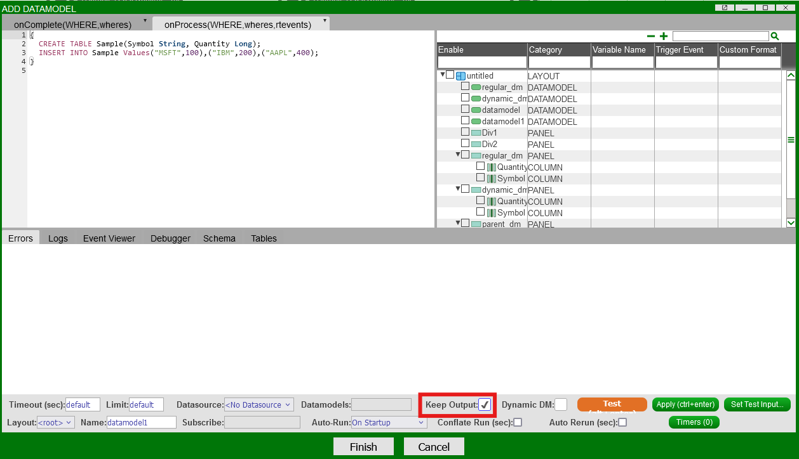
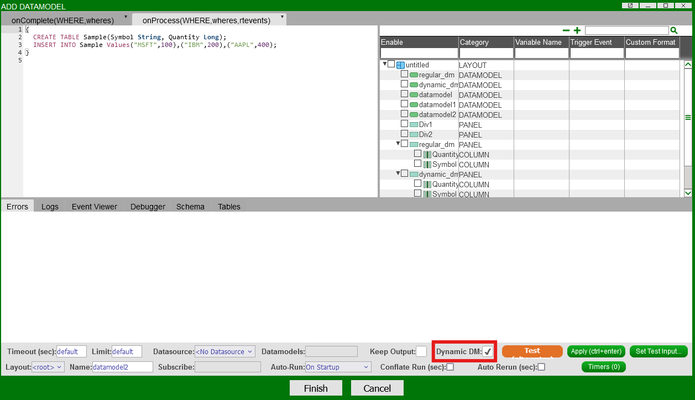

# Datamodels 

Datamodels are the core data processing units of AMI; they are static, tabular representations of some underlying data from a data source, such as an SQL database, real-time feed, etc. 

Accessed in the data modeler, datamodels are your main source of visualizations and blending across multiple data source types.  

## Overview 

Datamodels are created via the data modeler, which can be accessed either directly from a panel or through the top menu in *Dashboard -> Data Modeler*. 
Datamodels are built when AMI is initialized, or each time the creation wizard is run, and sit in AMI web receiving information from the center, datasources, or feeds.  

Generally speaking, datamodels are static representations of underlying data , but AMI does have ["realtime datamodels"](#realtime-datamodels) which emulate real-time behaviors by periodically updating. These settings can all be established in the data modeler creation wizard.


## Creating Datamodels

To create a datamodel, either right-click on a blank portion of the data modeler, or navigate to a datasource and right-click on the datasource and click *Add Datamodel*.


Within the datamodel creation tool, you can input any valid AmiScript to determine the logic behind your datamodel, including calculations and other data analytics. 

To specify a given data source manually, use the command `#!amiscript USE ds=some.datasource` to select the data source from which to build your data model from. 

Alternatively, you can manually select the data source in the field at the bottom of the datamodel creation wizard:


### Datamodel Threading

The order of execution of datamodels and their creation is managed by the AMI session. Each instance of AMI is composed of three threads:

1. Front end UI callbacks/ GUI
2. Datamodel processing
3. Backend and real-time data processing

All datamodels in a given AMI instance are managed by a single thread. Running a datamodel means any other pending datamodels are added to a queue. If the thread encounters an `EXECUTE` statement, AMI will pause the current datamodel and check the next datamodel in the queue, while periodically re-checking the original datamodel for a response to the `EXECUTE` statement. 

### Keep Output 


Toggling the *Keep Output* option causes the datamodel to carry over the result from its last run. 

For example, for the above datamodel, without *Keep Output* checked, each time the datamodel runs, it will create a new table called "Sample" and insert 3 rows. 
With *Keep Output* selected, the datamodel will **not** create a new table and instead will keep inserting the same 3 rows.  

### Dynamic DM (Developer)

 

Toggling the *Dynamic DM* option will propagate schema changes from the parent datamodel to its children. If not checked, the blender will remain unchanged schema-wise, however will update when new data is added to the parent datamodel. 

You will also need to enable auto-update columns to ensure changes are propogated in the visualizers. 


!!!Note
	Dynamic DM is not available in all versions of AMI. Please contact us at <support@3forge.com> if this is a requirement. 

#### Example

Consider the following datamodel:

```amiscript
{
  CREATE TABLE Sample(Symbol String, Quantity Long);
  INSERT INTO Sample Values("MSFT",100),("IBM",200),("AAPL",400);
}

```

It is possible to create datamodels from other datamodels, known in AMI as "blenders." These can be treated like any other datamodel, including visualizations, and are useful for blending data from multiple sources into the same datamodel. 


Here, each datamodel contains the same data but the children datamodels `regular_dm` and `dynamic_dm` are blenders of the `parent_dm`. The underlying architecture for these panels and visualizations can be seen here:


The panel `dynamic_dm` contains a visualization built on a datamodel which has **Dynamic DM** checked. Updating the schema of the parent datamodel will also update the dynamic datamodel's schema, but not the regular one.


## Inserting From Datamodels

In this example, we will show how to insert data from one datasource to another by using the Datamodel. Here the Country table exists in a datasource called WORLD. We want to take this table and create a copy of it in AMI datasource. To create a copy of the Country table, we need the schema which we get using the DESCRIBE clause.

```amiscript
{
  CREATE TABLE Country AS USE  EXECUTE SELECT * FROM `Country` WHERE ${WHERE};
  string s = SELECT SQL from DESCRIBE TABLE Country;
  s = strReplace(s, "CREATE TABLE", "CREATE PUBLIC TABLE IF NOT EXISTS");
  // session.log(s);
  USE ds="AMI" LIMIT = -1 EXECUTE ${s};
  // USE ds="AMI" EXECUTE DELETE FROM Country;
  USE ds="AMI" INSERT INTO Country FROM SELECT * FROM Country;
}
```

Firstly, create a Datamodel that is attached to the WORLD Datasource. Copy and paste the above script and run.


This will now give you the Country table in the AMI datasource.


## Realtime Datamodels

Datamodels can be run to update in pseudo-real-time, referred to as "realtime datamodels." 

The primary difference between realtime and regular datamodels is how information is passed to the datamodel. Realtime datamodels subscribe to a feed and are re-run either when changes are pushed to that feed, or after a specified time slot. This functionality mimics true real-time behavior and can be useful for certain types of visualizations.

To create realtime datamodels, you will need to have them subscribe to realtime feeds.  

Let's say we have a real time feed **transaction(TransactionID Long,sym String,price Double)**  

1. Create a data model called **realtimeDM** and subscribe to realtime feed **transaction**  

	  

2. You could also configure queries to construct derived tables  

	In this example, we created another table showing the top3 symbol with the most total price.  
	
	  
	
	To control how frequently the datamodel should re-run and refresh, set the **conflate time** parameter.  
	
	In this example, it is set to 10 seconds, which means the datamodel will rerun 10 seconds per time.  
	
	  

3. Create a realtime visualization panel off of the realtime datamodel that we just created  

	In this example, we created a real time heatmap off of the **top3sym** table.  
	
	  
	
	  

4. Final Heatmap  

	

**Note that you can press space on the heatmap to zoom in/out.**

