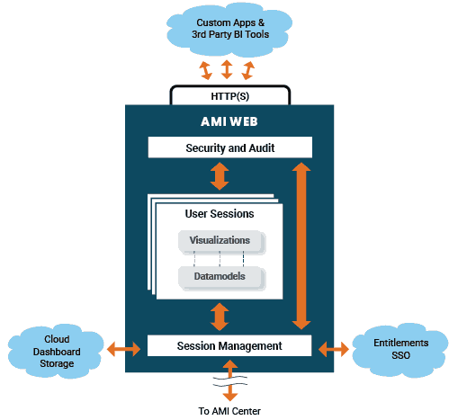

# What is the Web?

The Web is a server for transforming data into visualizations, it can manipulate data from the Center or any other database to display in high speed & high volume tables, trees, charts, and heatmaps. The Web also allows for custom workflows, from custom forms to building & emailing PDFs.

The main file on the web is the layout, a layout describes a set of visualizations and the necessary AMIScript for transforming data to be shown on the visualizations. A layout is structured by windows, tabs, and dividers. Inside of these structures we place panels such as tables, graphs, forms, and custom html. We use objects called datamodels to transform data from the format it lives in to the format needed for visualization.

The Web is also where user entitlement and authentication are managed, where AMI can interoperate with other applications, and where workflows can be built.

