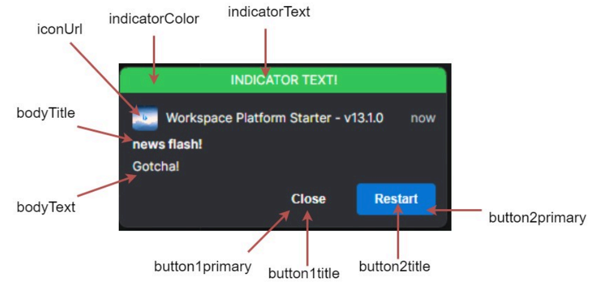
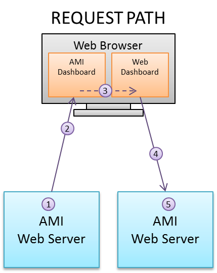
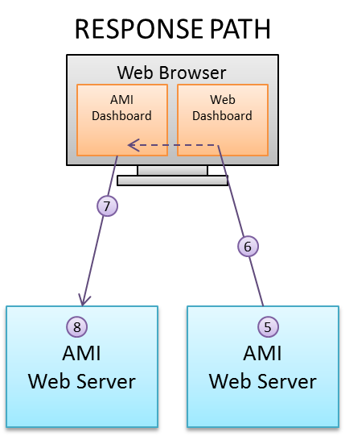
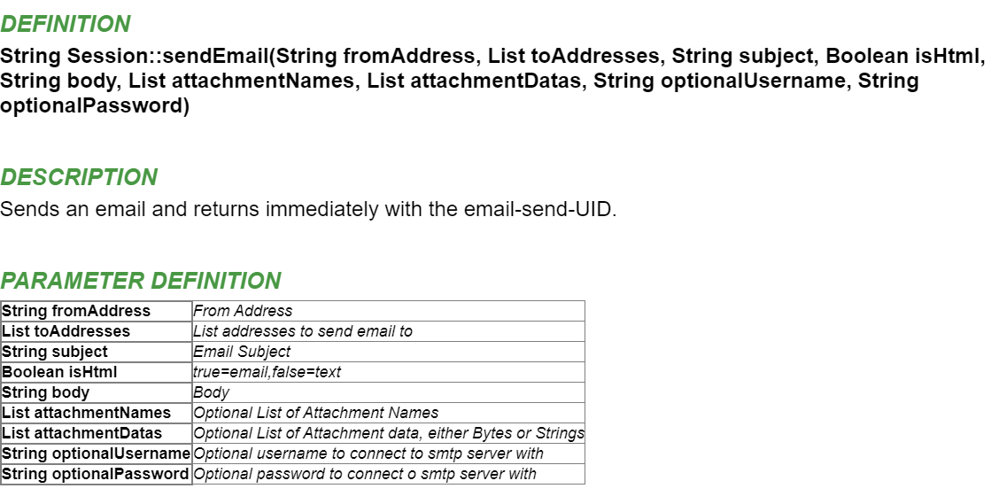

# Interoperability

## OpenFin Documentation

To start utilizing the integration features, you need to run this in the Openfin workspace and include this in your `local.properties` file:

```
ami.guiservice.plugins=com.f1.ami.web.guiplugin.AmiWebGuiServicePlugin_OpenFin
```

### Variables

`__OpenFin`: You can see this in **Dashboard** > **Session Variables**.

### Methods

`raiseIntent(String intent, Map context)`

-   Raises the specified intent with context, to be handled by another app.

	```amiscript
	String context= "{ type: 'fdc3.instrument', id: { ticker: 'AAPL}' } }";
	map m = parseJson(context);
	__OpenFin.raiseIntent("ViewChart", m);
	```

`broadcast(Map context)`

-   Broadcasts context to all the other apps in workspace that are in the same color channel.

	```amiscript
	String context= "{ type: 'fdc3.instrument', id: { ticker: 'AAPL}' } }";
	map m = parseJson(context);
	__OpenFin.broadcast(m);
	```

`addIntentListener(String intentType)`

-   This method adds an intent handler for the specified intent. You will need to have a corresponding entry in the intent section of the apps.json as well to indicate AMI can handle the specified intent.

	```amiscript
	__OpenFin.addIntentListener("ViewChart");
	```

`addContextListener(String context type)`

-   This method qualifies AMI to receive the specified context from a broadcast. Both the broadcaster and the receiver need to be in the same color channel.

	```amiscript
	__OpenFin.addContextListener("fdc3.instrument");
	```

`bringToFront()`

-   This method brings the current AMI window to the front of the OpenFin stack. This is different from AMI\'s own bringToFront method.

`setAsForeground()`

-   This method brings the AMI window to the front.

`sendNotification(Map options)`

-   Sends a notification to the Openfin workspace, available keys in the map are:

    -   `bodyTitle` (required)
    -   `bodyText` (required)
    -   `iconUrl`
    -   `customData`, you may specify the data for each notification, to be used when user clicks on a button
    -   `indicatorColor`, must be of the following: red, green, yellow, blue, purple, gray
    -   `indicatorText`
    -   `button1title` (required if adding buttons, see below for explanation)
    -   `button1primary`
    -   `button1data`

-	For adding button, use the format `button + number + title/data/primary/iconUrl` where:

    -   `number`: corresponds to the ordering of the button. The lower the value, the more left the button appears e.g. if you have 3 buttons, the ordering will be 1 2 3.
    -   `primary`: indicates whether it will have the blue background color, this color cannot be changed.
    -   `title`: title of the button, required.
    -   `iconUrl`: image url for the button icon.
    -   `data`: custom data for each button.

-   Note that the maximum number of buttons is 8, per OpenFin.
-   Example configuration below creates 2 buttons:

	```amiscript
	Map config= new Map();
	config.put("customData",new map("myData", "data1"));
	config.put("indicatorColor","green");
	config.put("indicatorText","indicator Text!");
	config.put("bodyTitle","news flash!");
	config.put("bodyText","Gotcha!");
	config.put("button1title","Close");
	config.put("button1data","some data here");
	config.put("button1primary","false");
	config.put("button2title","Shut Down");
	config.put("button2data","some data there");
	config.put("button2title","Restart");
	```



### Callbacks

1. `onRaiseIntent(Object intentResolution)`: triggered when AMI receives an intentResolution or its result from raising the intent.

	- On fdc3 ver 2.0, if AMI is able to get the result of the intentResolution, then you will receive the result, otherwise the intentResolution is returned.
	- On fdc3 ver 1.2, it always returns the intentResolution.

1. `onContext(Object context, Object metadata)`: triggered when AMI receives a broadcast of a specific context.

	- You will need to set up a listener first to receive the specific context. See Supported AMI script methods for an example.

1. `onReceiveIntent(Object context)`: triggered when AMI receives an intent from another app.

	- You will need to set up an intent listener first to trigger this. See Supported AMI script methods for an example.

1. `onNotificationAction(Object event)`: triggered when the user clicks on a button in the notification.

	- You can use the following to parse the json into a map for ease of access
		
		```amiscript
		Map m= parseJson((String) event);
		```

	- Below is a sample json structure that you will receive from the callback once the user clicks on the button:

		``` json
		{
			"type": "notification-action",
			"trigger": "control",
			"notification": {
				"form": null,
				"body": "Gotcha!",
				"buttons": [
					{
						"submit": false,
						"onClick": {
						"data": "some data here"
					},
						"index": 0,
						"iconUrl": "",
						"cta": false,
						"title": "Close",
						"type": "button"
					},
					{
						"submit": false,
						"onClick": {
						"data": "some data there"
					},
						"index": 1,
						"iconUrl": "",
						"cta": true,
						"title": "Restart",
						"type": "button"
					}
				],
				"onExpire": null,
				"onClose": null,
				"onSelect": null,
				"stream": null,
				"expires": null,
				"date": "2023-09-21T18:09:04.481Z",
				"toast": "transient",
				"customData": {
					"myData": "data1"
				},
				"priority": 1,
				"icon":
				"http://www.bing.com/sa/simg/facebook_sharing_5.png",
				"indicator": {
					"color": "green",
					"text": "indicator Text!"
				},
				"allowReminder": true,
				"category": "default",
				"title": "news flash!",
				"template": "markdown",
				"id": "a938f456-ef36-4f21-8062-7dd556bf093d"
			},
			"source": {
				"type": "desktop",
				"identity": {
					"uuid": "workspace-platform-starter",
					"name": "f3amione"
				}
			},
			"result": {
				"data": "some data here"
			},
			"control": {
				"submit": false,
				"onClick": {
					"data": "some data here"
				},
				"index": 0,
				"iconUrl": "",
				"cta": false,
				"title": "Close",
				"type": "button"
			}
		}
		```

## Remote Procedure Calling

### Overview

AMI RPC leverages the HTTP CORS (Cross Origin Resource Sharing) standard to provide a mechanism for separate AMI dashboards within the same domain to communicate with each other.  As such, different teams working on distinct dashboards/use cases can easily integrate them.  For example, there are two teams, one building a dashboard for viewing orders and a second team building an order analytics dashboard. The first team could configure the order-dashboard such that when the user clicks on an order, an RPC instruction is sent to the other team's dashboard, which in turn  displays analytics about the selected order. This paradigm promotes seamless integration across any number of dashboards at scale, providing users with a simple workflow accordingly.

### End user experience

If a user is logged into two or more dashboards built on the AMI platform, then it's possible for the dashboards to call ami script across those dashboards.

Dashboards must be opened in the same *browser space*. For example, if one dashboard is opened in Chrome then the other dashboard must be opened in Chrome as well. Additionally, if one dashboard is opened in non-cognito mode then the other must also be opened in non-cognito mode.

Although it is not necessary for both dashboards to be logged in with same user ID, it can be enforced if necessary.

### Configuration

This is done by way of configuring custom AmiScript methods such that one dashboard can execute a custom AmiScript Method on another dashboard.  Communication supports full round trip, meaning the calling dashboard sends arguments to the receiving dashboard and then the receiving dashboard can respond to the call with data as well.

The target of such a call is identified using a host and method name combination.  It is common for the builder of the target dashboard to properly determine the host(s), method(s) and structure of the request and response payloads, which in aggregate is considered an API. This "API" is then communicated to those teams wishing to use the API.

For further reading on the general usage of CORS see the [Mozilla specification](https://developer.mozilla.org/en-US/docs/Web/HTTP/CORS).

Please note that both dashboards must be hosted within the same domain, ex: analytics.acme.com and orders.acme.com are both in the acme.com so they can communicate via CORS, despite having different subdomains.  It's important that the all references to the domains use the fully qualified domain.

### Creating Methods

Create a custom method with a predetermined "well-known" name that returns a Map, and takes an RpcRequest object as a single Argument of the form:

``` amiscript
Map myMethod (RpcRequest request){
    Map requestArgs = request.getArguments();
    //Do something here
    Map responseArgs = new Map("key","someReturnValue");
    return responseArgs;
}
```

Important: Please note that the return type of Map and argument type of RpcRequest is required and specifically indicates that the method can be called remotely.

### Calling Methods

Use the `#!amsicript callRpcSnyc(RpcRequest)` method on the session object. The RpcRequest constructor takes these 3 arguments.

`target` URL of the host that you wish to call the method on.

`methodName` Name of the method to call (in the example above, it's *myMethod*).

`Arguments` Key/value pair of data to send. Note that the data will be transported using JSON, so complex objects, such as panels, cannot be referenced.

For Example, let's say the example above is running on a dashboard at *some.host.com:33332*. This would call that method:

``` amiscript
Map requestArgs=new Map("key","someRequestValue");

String host="http://some.host.com:33332/";

RpcRequest request=new RpcRequest(host,"myMethod",requestArgs);

RpcResponse response = session.callRpcSync(request);

Map responseArgs=response.getReturnValues();
```

### Transport

Below is a step-by-step explanation of how RPC Transport works:

1.  The Source dashboard calls `#!amiscript session.callRpcSync(...)`

1.  The Source dashboard creates a JSON request that is sent to the dashboard via websockets

1.  AMI's javascript forwards the JSON to the target Server (the browser will do CORS authentication against the target web server, which AMI is compatible with)

1.  The target webserver will receive the JSON, confirm headers and create an RpcRequest object for processing

1.  The target dashboard's amiscript custom method will process the request and produce a response

1.  The reply from the target server is sent back to the web browser in the http response as JSON

1.  The response is forwarded back to the source webserver via web sockets

1.  AMI converts the JSON to an RpcResponse which is passed back to the dashboard for processing





### Error Condition Handling

The `#!amiscript session.callRpcSync(...)` method will always return an `#!amiscript RpcResponse` object. You can inspect the Error for the success or failure status.

Here are the possible return values of **getError**:

| Return Value                             | Description                                                                                                                                                               |
|------------------------------------------|---------------------------------------------------------------------------------------------------------------------------------------------------------------------------|
| `null`                                    | The rpc call executed successfully                                                                                                                                        |
| `NO_RESPONSE`                            | The server failed to respond, this is generally caused if the user refreshes the webpage while the rpc request is inflight, which will reset the connection.              |
| `CONNECTION_FAILED`                      | The CORS could not successfully establish a connection. This may be because the target url does not point to an existing AMI instance.                                    |
| `INVALID_URL`                            | The format of the target url is not valid.                                                                                                                                |
| `ERROR_FROM_SERVER`                      | The server responded with an error.                                                                                                                                       |
| `ERROR_FROM_SERVER_ORIGIN_NOT_PERMITTED` | The origin was not permitted (based on the ami.web.permitted.cors.origins option)                                                                                         |
| `ERROR_FROM_SERVER_USER_NOT_LOGGED_IN`   | The user does not have a browser open which is logged into the server                                                                                                     |
| `ERROR_FROM_SERVER_NO_SUCH_METHOD`       | The dashboard does not have a custom method of the supplied name. Or the method does not return a Map, or the method does not take an RpcRequest as it's single argument. |
| `ERROR_FROM_SERVER_METHOD_EXCEPTION`     | The method was executed but threw an unhandled exception.                                                                                                                 |
| `ERROR_FROM_SERVER_USERNAME_MISMATCH`    | The RpcRequest constructor was supplied a requiredUserName, which did not match the username currently logged in on the target dashboard.                                 |
| `ERROR_FROM_SERVER_LAYOUT_NAME_MISMATCH` | The RpcRequest constructor was supplied a requiredLayoutName, which did not match the name of the layout on the target dashboard.                                         |
| `ERROR_FROM_SERVER_LAYOUT_NAME_MISMATCH` | The RpcRequest constructor was supplied a requiredSessionId, which did not match the sessionId of the layout on the target dashboard.                                     |

Please Note, you can look at `RpcResponse::getErrorMessage` for further details.

### Security

The `ami.web.permitted.cors.origins` option can be supplied (in the ami web's properties) to control which origins are accepted. See the [Access-Control-Allow-Origin](https://developer.mozilla.org/en-US/docs/Web/HTTP/Headers/Access-Control-Allow-Origin) header for further information on how CORS origins works. Here are 3 separate examples:

```
# Disable CORS, no origins will be allowed to remotely call functions
ami.web.permitted.cors.origins=

# All origins are allowed
ami.web.permitted.cors.origins=*

# Allow a specific host
ami.web.permitted.cors.origins=http://myhost.com|http://thathost.com
```


## Sending Emails

Emails can be sent from within an AMI session using the SMTP protocol. To enable and configure AMI for email, add the following properties in your `local.properties` file:

```
email.client.host=smtp-mail.office365.com
email.client.port=587
email.client.username=your.email@outlook.com
email.client.password=your.password
```

Change the host and port properties accordingly for your email's SMTP server. More email configuration properties can be found in the [configuration guide](../configuration_guide/center.md#email).  

!!! Note
	AMI **only** supports SMTP for sending emails. If you require alternative methods, please reach out to us at support@3forge.com to find you another solution.


### AMIScript Methods

There are two methods in AMIscript for sending emails which can be called from the web session:

- `#!amiscript session.sendEmail(...)` 
: 
	Sends an email and returns immediately with the email-send-UID.

- `#!amiscript session.sendEmailSync(...)` 
:  
	Sends an email and returns with the email result.

[//]:# (Method description:)
[//]:# ()
  
For more detail on these methods, see the documentation [here](https://doc.3forge.com/javadoc/classes/Session/#sendemailfromaddresstoaddressessubjectishtmlbodyattachmentnamesattachmentdatasoptionalusernameoptionalpassword). 

### Example Email 

In some field accepting AmiScript: 

```amiscript 
session.sendEmailSync("support@3forge.com",new List("recipient@some_host.com"),"Hello Recipient", false, "Hello! How are you?", null, null, null, null);
```

This sends an email titled "Hello Recipient" with the text contents "Hello! How are you?"

### Supported Attachment File Formats

Application
:	atom, json, jar, js, ogg, ogv, pdf, ps, woff, xhtml, xht, xml, dtd, zip, gz, xlsx

Audio
:	au, snd, mid, rmi, mp3, aif, aifc, aiff, m3u, ra, ram, wav

Image
:	bmp, cod, gif, ief, jpe, jpeg, jpg, jfif, png, svg, tif, tiff, ras, cmx, ico, pnm, pbm, pgm, ppm, rgb, xbm, xpm, xwd

Message
:	mht, mhtml, nws

Text
:	css, 323, htm, html, stm, uls, bas, c, h, txt, ami, rtx, sct, tsv, htt, htc, etc, vcf, ics

Video
:	mp2, mpa, mpe, mpeg, mpg, mpv2, mov, qt, lsf, lsx, asf, asr, asx, avi, movie

X-world
:	flr, vrml, wrl, wrz, xaf, xof

### CC and BCC 
To CC or BCC someone, prefix the email with "cc:" or "bcc:"
:   "cc:target_email_address@..." 

!!! Note 
	If using a Google Workspace account, you will need to set up app passwords as Google's long-time Less Secure Apps (LSA) functionality is being [deprecated in January 2025](https://support.google.com/accounts/answer/6010255?hl=en).

## ICalendar

ICalendar format (`.ics`) invitations can be created and sent via email directly from 3forge. Ensure that your AMI instance is configured with a working email as shown in the [Sending Emails](#sending-emails) section to send the invitations from. 


Generating an ICalendar can be broken down into three steps, all of which can be done within AMI:

1. Creating the ICalendar object in AMI 
1. Populating the ICalendar with organizers, attendees, and the event
1. Sending the `.ics` invite via email 

For a full description and list of methods associated to the ICalendar object in AMIScript, see the documentation [here](https://doc.3forge.com/javadoc/classes/ICalendar/). 

### AMIScript Methods 

This is a basic overview of the methods needed to make an ICalendar object and populating it.

- `#!amiscript ICalendar calendar = new ICalendar()` 
: 
	Construct a new ICalendar object called "calendar".

- `#!amiscript calendar.addEvent(...)` 
:  
	Add an event with some parameters ([example](#example) shown below).

- `#!amiscript calendar.addOrganizer(...)` 
: 
	Add organizer(s) to the event with some parameters, such as their name.

- `#!amiscript calendar.addAttendee(...)` 
: 
	Add attendee(s) to the event with some parameters, such as their role.

- `#!amiscript calendar.build()` 
: 
	Builds a string of the `.ics` file content of the ICalendar object.

### Example ICalendar Event 

```amiscript 

ICalendar calendar = new ICalendar();
calendar.addEvent(
  "An Important Event", 
  "EST5EDT", 
  parseDate("08 Nov 2024 16:00", "dd MMM yyyy hh:mm", "America/New_York"),
  parseDate("08 Nov 2024 17:00", "dd MMM yyyy hh:mm", "America/New_York"),
  "New York",
  "An important event with 3forge and our guest",
  "English",
  "OPAQUE",
  "PUBLIC"
  ); 
calendar.addOrganizer(0, "support@3forge.com", "3forge Support", "3forge", "", "");
calendar.addAttendee(0, "guest@some_host.com", "", "Guest");
``` 

This uses three ICalendar methods to create and populate an event. 

The `#!amiscript addEvent()` method takes the following comma-delimited parameters:

1. Summary 
	- Example: `#!amiscript "An Important Event"`
	- String title for the event

1. Timezone 
	- Example: `#!amiscript "EST5EDT"`
	- String Java TimeZone ID (you can find the [full list](https://docs.oracle.com/cd/E84527_01/wcs/tag-ref/MISC/TimeZones.html) on the Oracle website) 

1. Start time
	- Example: `#!amiscript parseDate("08 Nov 2024 16:00", "dd MMM yyyy hh:mm", "America/New_York")` 
	- Time in UTC the event starts (you can use the AmiScript `#!amiscript parseDate()` function as in the example) 
	- To specify an all-day event, do not supply times
		- E.g, `#!amiscript parseDate("08 Nov 2024", "dd MMM yyyy", "America/New_York")`

1. End time 
	- Example: `#!amiscript parseDate("08 Nov 2024 15:00", "dd MMM yyyy hh:mm", "America/New_York")` 
	- Time in UTC the event ends (you can use the AmiScript `#!amiscript parseDate()` method as in the example) 
	- To specify an all-day event, do not supply times 
		- E.g, `#!amiscript parseDate("08 Nov 2024", "dd MMM yyyy", "America/New_York")`

1. Location 
	- Example: `#!amiscript "New York"`
	- String location of the event 

1. Description 
	- Example: `#!amiscript "An important event with 3forge and our guest"`
	- String description of the event

1. Language 
	- Example: `#!amiscript "English"`
	- (Optional) string description of the language of the event. For any optional string parameters, simply pass the empty string.

1. Transparency 
	- Example: `#!amiscript "OPAQUE"` 
	- String transparency of the event 
	- Can be `#!amiscript "OPAQUE"` or `#!amiscript "TRANSPARENT"` 

1. Visibility 
	- Example: `#!amiscript "PUBLIC"` 
	- String visibility of the event 
	- Can be `#!amiscript "PUBLIC"`, `#!amiscript "PRIVATE"`, or `#!amiscript "CONFIDENTIAL"`


### Send Event Invite via Email

In the same AmiScript block, to send a `.ics` invitation over email of the ICalendar contents:

```amiscript
String calendar_string = calendar.build();

session.sendEmailSync(
  "support@3forge.com", 
  new List("guest@some_host.com"),
  "Event Invitation", false,
  "You are invited to the following event. We hope to see you there.",
  new List("invite.ics"), new List(calendar_string), null, null
  );
```

This uses the `#!amiscript build()` method to convert the ICalendar object into a string output which is then passed as the attachment contents of the `#!amiscript sendEmailSync()` method. 