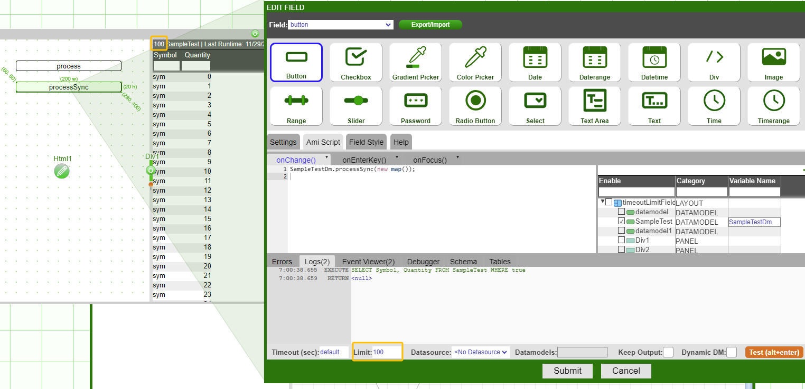

# Tools

## Data Modeler

### Datamodels

Datamodels are essentially layers that are created with data obtained from databases. All static tables and visualizations will be based on a datamodel. The **data modeler** will contain all of the datamodels being used in the current layout.

Datamodels are created in two main ways:

-   Creation of a new static table/visualization/form using the panel configuration menu (green button)
-   Right clicking on a database (or empty space) in the data modeler and selecting **Add Datamodel** from the menu

Datamodels work by sending a query to one or many datasources and processing the results to generate output tables used within visualizations. Datamodels also cache the resulting output from the most recent run. If filters are attached, datamodels caches a copy of the original unfiltered data along with a filtered set of the data. Note that when the filter(s) are adjusted, only the filtered set of data is changed.

Each datamodel has a block of AmiScript code which is executed when the datamodel is run. Inputs to the script include 1) variables passed in from relationships, 2) values from form fields that are enabled for use by the datamodel, and 3) any dashboard variables and Global Variables. All datamodels are configured to interact with a default datasource but can be overridden using the **USE ds=clause** There are several fields the user can configure to change the way the datamodel behaves.

### Keep Output


Toggling the **Keep Output** option, as shown in the above screenshot, will cause the datamodel to carry over the result from its last run. For example, if you have the following code in your datamodel:

```amiscript
 CREATE TABLE IF NOT EXISTS Sample(Symbol String, Quantity Long);
 INSERT INTO Sample Values("MSFT",100),("IBM",200),("AAPL",400);
```

without Keep Output, each time the datamodel runs it will create a new table called Sample and insert 3 rows. with Keep Output, the datamodel will NOT create a new table and instead will keep inserting the same 3 rows.  

### Dynamic DM

Toggling the **Dynamic DM** option, will propagate schema changes from the parent datamodel to its children. If not checked, the blender gets schema-mapped result from underlying datamodel(s)

### Limit and Timeout

Each datamodel callback has a timeout and limit tied to it, which can be configured in limit and timeout field. Usually, when the datamodel kicks off, the timeout and limit are obtained from the caller (whoever calls the datamodel, can be datamodel itself or the button calling datamodel.processSync()).However, there are some exceptions.For example, When executing the datamodel from a button onChange() callback, depending on whether the datamodel process is called synchronously (**processSync()**) or asynchronously(**process()**), the timeout and limit would come from **DIFFERENT** places.  

Consider the following scenarios:

Context: The table "SampleTest" that the datamodel is based on has 10000 rows.  

- Case1: when the datamodel calls itself. The limit and timeout comes from the datamodel onProcess() callback. When running Test on the datamodel, it only shows 1000 rows.


- Case2: when the datamodel is invoked from elsewhere (e.g button click)

	- Case2.1: calling from processSync(). When calling SampleTestDm.processSync(), the timeout and limit come from the button, which is the caller for the SampleTestDm.processSync(). The button onChange() has a 100 rows limit, so the table will only show 100 rows.
	

	- Case2.2: calling from prcoess(). When calling SampleTestDm.process(), the timeout and limit come from the datamodel. The datamodel onProcess() callback has a 1000 rows limit, so the table will only show 1000 rows.  
	

### Conflate and Rerun
 
Conflate time and rerun time are two important parameters that dictate how often the data modeler is allowed to rerun. Conflate run time is the shortest time the data modeler is allowed to rerun, meaning that the data modeler cannot run more frequently than once per conflation time.  
Conversely, auto rerun time is quite the opposite. It dictates the maximum time the data modeler is allowed to stay idle. We use the following example to demonstrate what these parameters mean and best practices to use them properly.  
2. Example setup: Create a relationship between two Data models  
  
#### Create a relationship between two visualization panels  
We start by creating 2 Data modelers based on the "City" table from the Mysql "world" data source. The Datamodel on the left is the source Datamodel and on the right is the target Datamodel.  
  
Next, we create two panels: one source panel on the left, which is our selection panel, and the other panel on the right, which is the visualization panel showing the scatter plot on the rows we selected from the source panel. Then we can create a relationship on the target panel, linking to the source panel. Please refer to the previous section for more details on how to create a relationship between two visualization panels.

  

#### Setup Conflate Run time  

Click on the target data modeler. By default, neither Conflate Run time nor Auto Rerun time is enabled, which means every time you select a row on the source panel, the query will get fired and run the underlying data modeler. To avoid this, we can configure Conflate Run time, highlighted in the yellow box below.  

  

If we set Conflate Run time to be 5 seconds, this means if you have two real time events(say a query): event A and event B on the queue. Event A gets executed immediately, getting popped from the queue and triggers the Conflation mechanism. The next event, which is event B, will not get executed until 5 seconds later. In other words, as soon as the first event gets executed, the next event will get stalled by the conflation rerun time so that the data modeler does not rerun more frequently than 5 seconds per time.  

  

First selection:  
The user first selects only Argentina, this event gets triggered right away.  

  

The next time the user makes a selection, the event gets stalled so that the target visualization panel does not update.  

  

After 5 seconds, Event B gets fired and the target visualization panel gets updated.  

  

#### Setup Auto Rerun time  

Conversely, if you set Auto Rerun time to be 5 seconds, this means the query will get fired no less than once per 5 seconds. In other words, the data modeler cannot stay idle for more than 5 seconds.  


### Datasources

A datasource represents the configuration necessary to connect to an external service. These include databases, files, and executables. 

The configuration of the datasource does not reside in the dashboard, it is stored in the AMIDB. The configuration includes the type of datasource, URL, and credentials along with any custom configuration.

Each datasource has a unique datasource name and only a reference by this name is stored in the dashboard. This means that multiple dashboards can access a datasource or be moved across environments without needing to reconfigure specific datasource configurations.

Note, dashboards can create anonymous datasources for direct access to databases, bypassing the need to have a datasource stored in the __DATASOURCES table.

### Data Modeler

There are two ways of accessing the data modeler.

1\. Click on **Dashboard** in the menu bar and select **Data Modeler**.


2\. Click on the green panel configuration button and select **Create Table/Visualizations/Form** from the menu. The first step in the wizard is the data modeler (if accessed this way, click on the **Allow Edit** checkbox to make changes in the data modeler).


The data modeler will contain all of the accessible databases, created/included datamodels, and the static panels of the layout.

#### Datasources

To add a new datasource, click on the **Attach Datasource** icon or right click and select **Attach Datasource** from the menu. This will bring up the attach datasource window.


Select the appropriate adapter and supply the necessary information in the fields in order to make a connection to the database. If done properly, a new datasource (blue) icon will appear.

#### Included Layouts

If you are working with included layouts, a list of included layouts will appear on the left. Checking/unchecking controls which included layout components appear in the data modeler.


#### Select, Search, and Rearrange

As a layout gets increasingly complex, the data modeler may become saturated; making it difficult to find the component you're looking for.

If you are looking for a certain type of component in a section of the data modeler, select all of the icons and use the right click menu to **Select** just the icons you are looking for (Panels, Datamodels, or Datasources).

If you want to figure out which datamodels are being used by a certain visualization, right click on the visualization and use the **Select Underlying Datamodel(s)**. This will highlight the datamodel(s) being used. **Note**: visualizations can be built on multiple datamodels.

When looking for something specific, use the search box at the top right. The search will highlight all of the matching component with an indication of how many matches were found.

The **Rearrange** option is a good way to keep a growing data modeler organized. Select all of the components, right click and use the various options in the **Rearrange** menu in order to better lay out the data modeler. Note: datamodel and panel icons can be resized.

#### Export/Import

The data modeler is used to export and import datamodels. To import a datamodel, use the right click menu to select the **Import Datamodel** option. To export a datamodel, right click on the datamodel and select **Import/Export Datamodel**. Both options will bring up the import/export datamodel window where you copy (or paste) the JSON.

#### Pause/Play

When datamodels are set to rerun, you pause or resume the rerun by right clicking on a datamodel and selecting Play/Pause. If there are multiple datamodels with a rerun enabled, use the **Pause All** button at the top (next to the **Attach Datasource** button) to stop all the datamodels. The current state of the rerun option of a datamodel is indicated either by a pause or play icon.


Note: the not-visible icon indicates a visualization based on the datamodel is not visible (there is either no visualization based on the datamodel or it is minimized). The same icon can be seen on the visualization icons. Double clicking on such panels will bring it to the front - making it visible. The rocket icon indicates that the datamodel has a run on startup (auto-run) enabled.

### Adding Datamodels

To create a datamodel, right click on a datasource (or an open area of the data modeler) and select **Add Datamodel to *datasource name*** (or **Add Datamodel** if a datasource isn't used). Note: You can also double click on a datasource to create a datamodel.

The next step in the wizard will display all of the tables available in the datasource. Clicking on a datasource will provide a preview of the table on the bottom. When using a large database, you can use the search bar in order to narrow down your selection. Once a table is selected, click on Next to view the datamodel editor.


**Note**: creating and editing datamodels use the same datamodel editor. To edit datamodels, double click (or right click) on an existing datamodel to view the datamodel editor.

The top left half of the datamodel editor consists of the query area where you create a query to send to the database. The right half is the variable tree. This tree lists all of the panels, datamodels, fields, and relationships in the layout and is updated in real time. This variable tree can be used as inputs in the query. To use a variable, select the variable (adjust the options if necessary), and use the <span style="color: orange;">**Test**</span> button to ensure it is being properly used in the query.

The bottom half of the datamodel editor will be filled in once the <span style="color: orange;">**Test**</span> is clicked. The **Table** tab will show you the results of the query. If there are any errors or you would like to view the breakdown of the query, refer to the other tabs.

|                                                                         |                                                                                                                                 |
|-------------------------------------------------------------------------|---------------------------------------------------------------------------------------------------------------------------------|
| **Timeout (sec)**                                                       | Change allowed time for a query to run                                                                                          |
| **Limit**                                                               | Modify the maximum number of data returned in response to a query                                                               |
| **Datasource**                                                          | Drop down menu listing all of the datasources that are currently connected to AMI                                               |
| **Datamodels**                                                          | Drop down checkbox menu listing all of the datamodels currently available in the layout                                         |
| **Owning Layout**                                                       | Choose the layout that the datamodel will belong to. If a datamodel is owned by a parent, the child will not have access to it. |
| **Datamodel Name**                                                      | The name of the datamodel                                                                                                       |
| **Auto-Run**                                                            | Choose the auto-run behavior of the datamodel. Default: On Startup (the datamodel will run when you open the layout)            |
| **Conflate Query (sec)**                                                | Specify the amount of time that must pass before another query can be made                                                      |
| '''Auto Requery (sec):                                                  | Change the frequency of automatic re-queries.                                                                                   |
| <span style="color: orange;">**Test**</span>          | Runs the query and returns the results                                                                                          |
| <span style="color: green;">**Apply**</span>          | Makes the changes to the datamodel                                                                                              |
| <span style="color: green;">**Set Test Input**</span> | Allows you to set variables                                                                                                     |
| <span style="color: green;">**OnProcess Args**</span> | Defines what variables the datamodel is expecting                                                                               |

Once a datamodel is created, it can be found on the data modeler. The creation and use of a datamodel is the first step in creating static tables and charts. Please refer to GUI Tables and GUI Charts to view the steps required to create tables and charts using the datamodels.

### Navigation

With the Smart Datamodeler, we are now able to quickly switch between different perspectives to get a clear and focused view based on what we are currently working on for a better adaptation of the growing number of panels, windows, datamodelers and etc.

#### Overview

All of the categories of Dashboard Resources Objects, including Datasources, Datamodels, Dashboard, Relationships and Realtime Feeds can be directly accessible in the AMI Data Modeler UI.


#### Change Of Perspectives

This allow us to easily drill down to a particular Dashboard Resource Object of our interest and access/edit the relevant field without having to change perspectives back and forth.

1. Example 1: Edit Datamodel onProcess() Callback:  
If we collapse **Datamodels-\> Country** and select **AmiScript** tab, we will see two Datamodel callback blocks show up at the right. From there we can easily edit our datamodel without ever going back to the datamodel GUI

  
1. Example 2: Edit Table Panel Callback:  
We could also drill down to a particular table panel by going to **Datamodels** -\> **<Your_Datamodel_Name\>** -\> **<Your_Table_Panel_Name\>** -\> **AmiScript**, and edit the AmiScript callbacks from there easily

  
1. Example 3: Edit Relationship:  
Similar to edit table panel callback, the relationships can also be edited easily from the Smart Datamodel GUI:

  
1. Example 3: Highlight relationship chart only associated with a particular Relationship  
Imagine that you have zillion relationships intermingling with each other in your dashboard, it would be insane to show all of them in the relationship chart. Smart Datamodels allow you to narrow down to one(or a few) particular relationship(s) and highlight a much focused and clear view of the chart of your interest. Go to **Relationships** -\> Select **<Your_Relationship(s)\>** -\> **Datamodels**:

  
1. Example 4: Edit table panel column inside a particular window  
One could also drill down to a particular window and edit the columns of a table panel. Go to **Dashbaord** -\> **Window** -\> **`<Your_Window_Name>`{=html}** -\> **`<Your_Table_Name>`{=html}** -\> **AmiScript** -\> **`<Your_Column_Name>`{=html}**


## Dashboard Objects

A great tool to keep track of all the different components while building a layout is the **Dashboard Objects** tool. As a layout grows, it may become difficult to keep track of all of the panels, relationships, and datamodels that are being used. 

To use this tool, select **Dashboard Objects** under the Dashboard menu (you must be in developer mode). This will bring up the dashboard objects window


The dashboard objects tool consists of 3 tabs: **Relationships**, **Datamodels**, and **Panels**

Layouts included with the Read Only option will have its components (relationships, datamodels, and panels) show up as Read under the Permissions column in the dashboard objects window

Note: new objects show up in real time in the dashboard objects window (adding a new panel with the window open will show a new entry for the added panel)

**Relationships**

|                         |                                                                                                                                                                    |
|-------------------------|--------------------------------------------------------------------------------------------------------------------------------------------------------------------|
| Owning Layout           | Name of the original owner of the relationship                                                                                                                     |
| Relationship Id         | Unique ID given to relationships. Found in the Relationship ID field of Relationship windows. Relationship ID's may be reused if they belong to differing layouts. |
| Source Panel Id         | Panel ID of the source panel of the relationship                                                                                                                   |
| Target Panel Id         | Panel ID of the target panel of the relationship                                                                                                                   |
| Permissions             | Writable or read only                                                                                                                                              |
| Source Panel Visibility | Is the source panel hidden or visible                                                                                                                              |
| Target Panel Visibility | Is the target panel hidden or visible                                                                                                                              |
| Relationship            | Description of the relationship (Source --\> Panel)                                                                                                                |

When in the Relationships tab, **double clicking** on a relationship will bring up that relationship's window. This makes it easier to edit the relationship without having to find the target panel in order to use the panel menu's **Edit Relationship** option.

**Datamodels**

|                      |                                                                                                                                                                                  |
|----------------------|----------------------------------------------------------------------------------------------------------------------------------------------------------------------------------|
| Owning Layout        | Name of the original owner of the datamodel                                                                                                                                      |
| Datamodel Id         | Name of the datamodel. Child datamodels are named with the layout name followed by the datamodel ID (ex: Child.City - Child is the name of the layout, City is the Datamodel ID) |
| Permissions          | Writable or read only                                                                                                                                                            |
| Type                 | Type of object                                                                                                                                                                   |
| Auto Run             | The auto-run behavior of the datamodel. Default: On Startup (the datamodel will run when you open the layout)                                                                    |
| Auto Requery (sec)   | The frequency of automatic re-queries                                                                                                                                            |
| Conflate Query (sec) | The amount of time that must pass before another query can be made                                                                                                               |
| Limit                | The maximum number of data returned in response to a query                                                                                                                       |
| Timeout (sec)        | The amount of time allowed for a query to run                                                                                                                                    |
| Datasource           | The name of the datasource from which the datamodel was created                                                                                                                  |
| Datamodels           | The names of the datamodel(s) included in the datamodel                                                                                                                          |

Double clicking on a datamodel will bring up the datamodel editor for editing.

**Panels**

|               |                                                                                                                                                                                                                                                     |
|---------------|-----------------------------------------------------------------------------------------------------------------------------------------------------------------------------------------------------------------------------------------------------|
| Owning Layout | Name of the original owner of the datamodel                                                                                                                                                                                                         |
| Panel Id      | Name of the panel. Child panels are named with the layout name followed by the panel ID (ex: Child.Country - Child is the name of the layout, Country is the Panel ID)                                                                              |
| Type          | Type of panel - Realtime Table, Datasource Table, Form, Chart, etc.                                                                                                                                                                                 |
| Visibility    | Visible or Hidden. Panels belonging to included layouts are hidden by default. Panels can also be hidden using the panel menu option - Hide Highlighted Panel. Note: this is not the same as making a window hidden (Window menu \> Type \> Hidden) |
| Permissions   | Writable or read only                                                                                                                                                                                                                               |

The search bar found at the top of the dashboard object window can be used to find anything that matches the name across all three tabs. The number of matches will be reflected in the name of the tab. For example, searching for City will return 1 result under the Datamodels tab (this is reflected in the tab)


Right clicking on a component and selecting **Show Configuration** will open up the JSON with the search term highlighted. Show configuration can be used outside of a search in order to view the JSON of any object in the layout.

## Dashboard Resources

All items within a dashboard (ex: Panels, Columns, Datmodels, Menu Items) are referred to as Dashboard Resources (DR). Dashboard Resources have several features:

-	They follow a parent/child relationship. Each DR has exactly one parent (aka owning) DR and potentially many child Drs.
-   They have an associated type (ex: PANEL, COLUMN, MENU_ITEM)
-   They are uniquely identified amongst its peers of the same type by their localized Resource Identifier (LRI). Note that multiple DRs may share the same LRI if they have different owners or are of different types. For example, two menu items can share the same LRI if they belong to different panels.
-   Importantly, all dashboard resources are uniquely identifyied across the entire Dashboard by their Dashboard Resource Identifier (DRI).
-   Many types of dashboard resources can be augmented with custom amiscript as either Formulas for Callbacks.
-   For Amiscript, See the **DashboardResource** class and the member methods **getChildren(), getOwner(), getLRI(), getDRI(), getCallbacks(), getFormulas(), getDashboardResourceType()**

### Resource Type

Here are details for each type of resource. The DRI is in the general form **"TYPE:layoutAlias.id?extras"** Note that the \[LayoutAlias.\] will be blank for all resources in the root layout. Additionally, for grandchild layouts it will be in the form child.grandchild.  

```
1. The User's Session. This is a constant:
DRI: "SESSION:session"
LRI: ""
Owner: null (session is the top of the tree and the only dashboard resource without a parent)

2. The Root Layout. This is a contant:
DRI: "LAYOUT:"
LRI: ""
Parent: The user's session

3. Child layouts:
DRI: "LAYOUT:LayoutAlias"
LRI: "LayoutAlias"   (see Layout::getAlias())
Parent: The user's session

4. Panels:
DRI: "PANEL:[LayoutAlias.]PanelId"
LRI: "PanelId"   (see Panel::getId())
Parent: Layout that this panel belongs to

5. Datamodels:
DRI: "DATAMODEL:[LayoutAlias.]DatamodelName"
LRI: "DatamodelName"   (see Datamodel::getId())
Parent: Layout that this datamodel belongs to

6. Relationships:
DRI: "RELATIONSHIP:[LayoutAlias.]RelationshipId"
LRI: "RelationshipId"   (see Relationship::getId())
Parent: Layout that this relationship belongs to

7. Form Fields:
DRI: "FIELD:[LayoutAlias.]PanelId?FieldVariableName"
LRI: "FieldVariablename"   (see FormField::getVariableName())
Parent: Form Panel that this field belongs to

8. Form Field Values:
DRI: "FIELD_VALUE:[LayoutAlias.]PanelId?FieldVariableName"
LRI: "FieldVariablename"   (see FormField::getVariableName())
Parent: Form Panel that this field belongs to

9. Form Relationship Buttons
DRI: "FORMBUTTON:[LayoutAlias.]PanelId?ButtonName"
LRI: "ButtonName"   (see FormRelationshipButton::getName())
Parent: Form Panel that this Button menu item belongs to

10. Custom Menu Items:
DRI: "MENU_ITEM:[LayoutAlias.]PanelId?MenuId"
LRI: "MenuId"   (see MenuItem::getId())
Parent: Panel that this custom menu item belongs to

11. Chart Plot. The XPos and YPos are the position within the chart, such that top left is 0,0:
DRI: "CHART_PLOT:[LayoutAlias.]PanelId?XPos,YPos"
LRI: "XPos,YPos"   (see ChartPanelPlot::getRow() and getColumn())
Parent: Panel that this plot belongs to

12. Chart Layer. See CHART_PLOT for XPos and YPos. LayerId is the id of the layer
DRI: CHART_LAYER:LayoutAlias.PanelId?XPos,YPos+LayerId
LRI: "XPos,YPos+LayerId"
Parent: Chart Plot that this Layer belongs to

13. Chart Axis. Side is either LEFT,TOP,BOTTOM,RIGHT. Position is row/column location, such that 0 means left most for horizonal axis and top for vertical acis. Offset is distance from the chart, such that 0 is closes.
DRI: "CHART_AXIS:LayoutAlias.PanelId?SIDE-Pos,Offset"
LRI: "SIDE-Pos,Offset "
Parent: Chart panel that this axis belongs to

14. Tab Entry. Tab Id is the id of the tab:
DRI: "TAB_ENTRY:[LayoutAlias.]PanelId?TabId"
LRI: "TabId"  (see Tab::getId())
Parent: Tab panel that this tab belongs to

15. Table/Tree Column:
DRI: "COLUMN:[LayoutAlias.]PanelId?ColumnId"
LRI: "ColumnId"  (see TablePanelColumn::getId() or TreePanelColumn::getId())
Parent: Panel that this column belongs to

16. Tree Grouping:
DRI: "GROUPING:[LayoutAlias.]PanelId?GroupingId"
LRI: "GroupingId"  (see TrePanelGrouping::getId())
Parent: Panel that this grouping belongs to

17. Realtime Processor:
DRI: "PROCESSOR:[LayoutAlias.]ProcessorId"
LRI: "ProcessorId"  (see Processor::getId())
Parent: Layout that this realtime process belongs to

18. Realtime Processor Join:
DRI: "JOIN:[LayoutAlias.]JoiningFeedId"
LRI: "JoiningFeedId"
Parent: Realtime processor that this realtime join belongs to

}
```

Tree structure of Dashboard Resource Objects  

``` javascript
                       user's session
                     /              \
                Root Layout       Child Layout
                     \        |        /
                             Layout
                       /       |       \
                  Datamodel  Panels      Relationship
                               |
               Form Field, Form Field Values, Form Relationship Buttons, Custom Menu Items,
               Chart Plot, Chart Layer, Chart Axis, Tab Entry, Table/Tree Column, 
             Tree Grouping, Realtime Processor Fields, Realtime Processor Join
```

### Resource AMIScript

The AmiScript associated with a Dashboard Resource can also be unique identified depending on if it's a Callback or formula. Here is the format:  

1. Callbacks. The OWNING_DRI is the DRI of the resource that the callback belongs to.

	DRI: `OWNING_DRI^CallbackName`
	
	Callback Line Position. When using the debugger or following a strack trace, the exact position of character within an amiscript callback can be identified with the following syntax:
	
	```OWNING_DRI^CallbackName:TEXT_LINE:CHAR_OFFSET```
	
	Parent: Owning Dashboard Resource

2. Formulas. The OWNING_DRI is the DRI of the resource that the formula belongs to.
	
	DRI: `OWNERDRI^FormulaName`
	
	Parent: Owning Dashboard Resource

## Admin Tool

The Admin Tool GUI can be used by admins to manage users, user sessions and headless sessions. It can be found under *Dashboard -\> Admin Tool...*  


### Users Tab

The first tab of the Admin Tool window, the "Users" tab displays all users as defined by the user access file (*access.txt* by default).  
Here, admins can create, edit and modify users and their attributes/entitlements. All changes made are automatically saved into the user access file.


  
The *Import* and *Export* functionalities are also available to import/export the entire user access text in the user access file text format.


  

### Sessions Tab

Clicking on the *View All* link in the *Sessions* column of the "Users" tab will bring the admin to the "Sessions" tab of the Admin Tool window.  
Here, admins can view and close any active sessions the selected user currently holds.


### Headless Sessions Tab

The "Headless Sessions" tab allows the admin to view and manage all available headless sessions through actions such as creating/deleting headless sessions and session start/stop.  
All changes made are automatically saved into the headless session config file (*headless.txt* by default).

  
An *Export* functionality is available for getting the headless session config as per the headless session config file.


