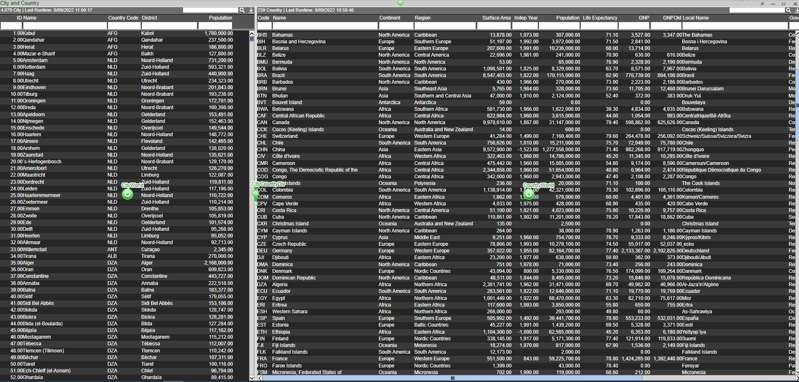
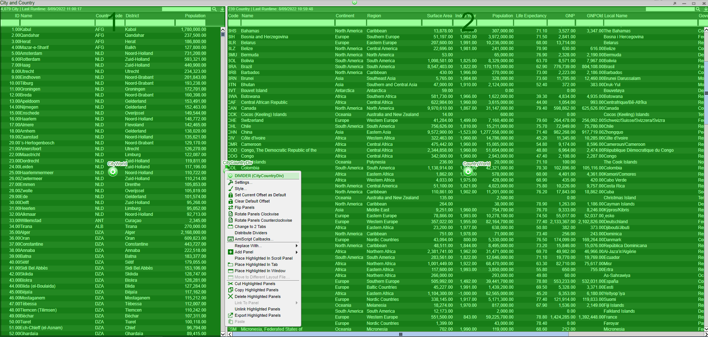
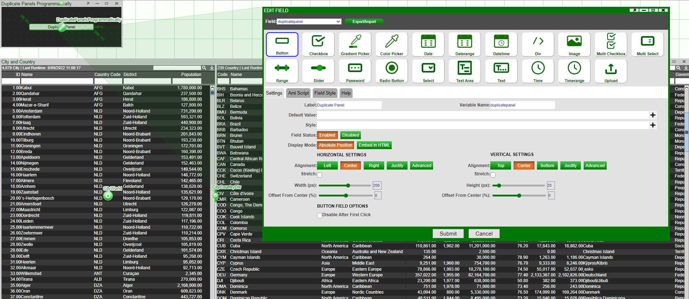

# Transient Objects

## Transient Windows

In this example we will show how to duplicate any panel programmatically instead of importing/exporting the panel manually.

Let's first create panel that we want to duplicate; here we have a window with the City table on the left and Country table on the right. We've named the left panel with the City table as **CityWorld** and the right panel with the Country table as **CountryWorld**. There is also a divider between the two tables which we have named **CityCountryDiv** (to rename this go to green cog of the Divider -\> Settings -\> PanelID).



Note that this divider is how we would access both the left and right panel.



Let's create a HTML Panel with a button that duplicates this window when clicked on. We'll call this button **Duplicate Panel**:



Add the following snippet of code in the Ami Script tab of the button - this code exports the config of the named panel and re-imports it as a new window:

``` amiscript

Map config = layout.getPanel("CityCountryDiv").exportConfig();
session.importWindow("New Window",config);
```

Exit the development mode and click on the *Duplicate Panel* button - this now generates a new window called **New Window** containing the duplicate of the panel.

NB: If you only wish to duplicate the CityWorld panel, replace `#!amiscript getPanel("CityCountryDiv")` with `#!amiscript getPanel("CityWorld")`.

