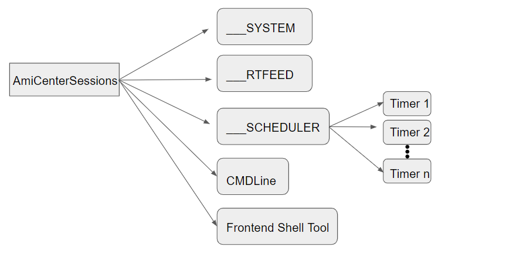
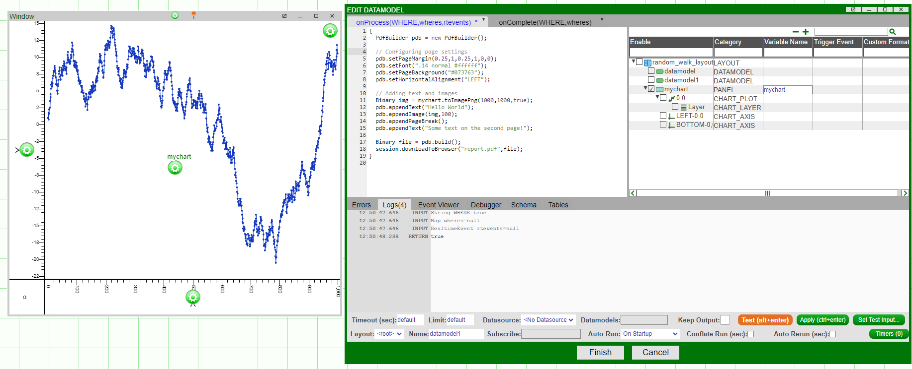

# Users & Sessions

## Users

### Permissions

AMI has its own way of doing permission control over different groups of users so that certain windows are only visible to users with entitlements. Suppose we have two windows named **Restricted** and **Everyone**. The Restricted window should **NOT** be visible to the users whose role is **NOT** Admin. The following screenshot shows how to set up such a scenario.

1. Go to Dashboard -\> Custom Callbacks

	

1. Go to **onStartup** tab and enter the following AMI script commands:

	
	
	``` amiscript
	string role = session.getProperty("ROLE");
	if (role != "Admin"){
	  for (window w: session.getWindows()){
	    if (w.getName()=="Restricted"){
	      w.setType("HIDDEN");
	      w.minimize();
	    }
	  }
	}
	```

  
1. Hit **Submit**

Now the users should be able to see different windows based on their entitlements.


### Preferences 

Dashboards can be shared among several users, however each individual user may have their own preferences they wish to implement on a shared file. This can apply to things like window scaling and position, divider settings, and the visual state of some table.  

If user preferences are not enabled, when navigating to **Accounts->My Developer Settings**, you will see the following options grayed out. 


To set up user preferences, a developer will need to assign a "namespace" to that given layout. 

#### Setup

In developer mode (i.e, a user with developer permissions), navigate to **Dashboard->Dashboard Settings** with the layout that you want to have individual user preferences for. 


Enter a namespace for the dashboard. This namespace will be used to save an individual user's preferences to the folder `amione/data/users` after they've logged in.

{width=80%}

Where previously the preferences selections were grayed out, they should now be clickable. This is how a user can save their preferences. 


#### Save Preferences

To save the dashboard state, navigate to **Account->Save Preferences**. When logging back into AMI with that user, you will be prompted to load the dashboard according to the previous preferences. 

Each user will have their own preferences on the state of a dashboard, but this will *not* impact other users' version of the same dashboard. 

The saved preferences are stored in the users folder, by default located in `amione/data/users` with the format:

```
<username>.ami_prefs_<namespace>
```

These files can also be used to import/export different user preferences.

!!! Note
	Only users with dev permissions can set a namespace for a dashboard. Regular users will not be able to access or see this, but their preferences will be saved to file accordingly. 

### Settings 

There a number of settings that are similar to preferences that can be used to set default behaviors in AMI for different users. 

These settings correspond to a number of things, like time zones, certain developer options, and other formatting options. 

There are a few ways to set this: 

1. Programmatically: 
	- Default settings for an AMI instance which can be set in `local.properties`. 
	- For more information, see [here](../configuration_guide/web.md/#user-settings). 
2. Via `access.txt`: 
	- Supply user settings as pipe-delimited variables. 
	- For example: `timeZone=ACT`. 
3. Via the user `ami_settings` file: 
	- Found under `amione/data/users`.
	- These are JSON files with key-value pairs for specific settings.
	- For example, `#!json "timeZone":"ACT"`.
4. Within AMI itself:
	- Under *Account -> My Settings* for user settings.
	- Under *Account -> Developer Settings* for developer settings (dev users only).

[comment]: # (scm_plugin)
[comment]: # (developer_scm_url)
[comment]: # (developer_scm_client)
[comment]: # (developer_scm_username)
[comment]: # (developer_scm_password)
[comment]: # (developer_scm_save_password_mode)
[comment]: # (developer_scm_options)
[comment]: # (developer_scm_path) 

[comment]: # ()
[comment]: # ()
[comment]: # ()
[comment]: # ()


Below is a table containing the current configurable user settings.

| Setting | Description | Example (`ami_settings` File) |
|---------|-------------|---------|
| `ami_layout_current ` | <ul><li>The current layout file that the user has open</li><li>When AMI is reloaded for that user, this is the file that will launch</li></ul> | `#!json "ami_layout_current":"untitled.ami"` |
| `ami_layout_current_source` | <ul><li>The source directory that the current layout is loaded from</li><li>None supplied by default, but valid options are `ABSOLUTE`,`LOCAL`,`CLOUD`, and `SHARED`</li></ul> | `#!json "ami_layout_current_source":"ABSOLUTE"` | 
| `developer_ami_editor_keyboard` | <ul><li>The editor type for AmiScript windows</li><li>Valid options are `default` and `vi`</li></ul> | `#!json "developer_ami_editor_keyboard":"vi"` |
| `developer_export_setting` | <ul><li>The legibility of the exported JSON file for the developer settings</li><li>Valid options are `compact`, `legible`, and `expanded`</li></ul> | `#!json "developer_export_setting":"compact"` |
| `developer_logout` | <ul><li>Behavior to exhibit on automated logout</li><li>Valid options are `Debug`, `Logout`, and `Ignore`</li> | `#!json "developer_logout":"Debug"` |
| `debug_info_setting_key` | <ul><li>How often to log information</li><li>Valid options are `debug_only` (when editor mode is on), `always`, and `never` </li></ul> | `#!json "debug_info_setting_key":"debug_only"` |
| `debug_warning_setting_key` | <ul><li>How often to log warnings</li><li>Valid options are `debug_only` (when editor mode is on), `always`, and `never`</li> | `#!json "debug_warning_setting_key":"always"` |
| `developer_headers` | <ul><li>Whether the developer headers should be expanded or collapsed</li><li>Valid options are `developer_headers_expand` and `developer_headers_collapse`</li></ul> | `#!json "developer_headers":"developer_headers_expand"` |
| `show_setting_divider` | <ul><li>Whether to show divider settings upon creation</li><li>Valid options are `show_editor` and `hide_editor`</li></ul> | `#!json "show_setting_divider":"show_editor"`|
| `show_style_editor_tabs` | <ul><li>Whether to show tab settings upon creation</li><li>Valid options are `show_editor` and `hide_editor`</li></ul> | `#!json "show_style_editor_tabs":"hide_editor"` |
| `show_autosave_prompt` | <ul><li>Whether the autosave prompt appears</li><li>Valid options are `developer_autosave_show` and `developer_autosave_hide`</li></ul> | `#!json "show_autosave_prompt":"developer_autosave_show"` | 

[comment]: # (Can't find these two in the codebase)
[comment]: #(| `developer_dm_snapsize` | <ul><li></li></ul> | |)
[comment]: #(| `developer_dm_gridsize` | <ul><li></li></ul> | |)

These settings are primarily intended for developers and generally affect the developer experience in AMI. 

For more general user settings which determines things like number formats and other preferences, see the below table.

!!! Note
	The settings in this table are the same as the ones listed in the [configuration guide](../configuration_guide/web.md/#user-settings) and can be programmatically set to assign the default values for that AMI session. 

[comment]: # (I didn't include language since we don't support other languages anyway)

| Setting | Description | Example (`ami_settings` File) |
|---------|-------------|---------|
| `dateFormat` |<ul><li>Format of date</li><li>Default is `M/dd/yyyy`</li></ul> | `#!json "dateFormat":"dd/MM/yyyy"` |
| `timeFormat` | <ul><li>Format of time</li><li>Default is `H:mm`</li></ul> | `#!json "timeFormat":"hh:mm"` |
| `timeZone` | <ul><li>Java-accepted timezone</li><li>Default is `EST5EDT` </li></ul> | `#!json "timeZone":"EST5EDT"` |
| `numberSeparator`         | <ul><li>Determines how a number is formatted </li><li>Default is `1,234,567,890.123` | `ami.default.user.numberSeparator=1,234,567,890` |
| `numberDecimalPrecision`  | <ul><li>The level of decimal precision<li>Valid options are between 0 and 10</li></ul> | `#!json "numberDecimalPrecision":"4"` |
| `sciNotDigitsLeft` | <ul><li>For scientific notation, how many digits should be visible left of the decimal<li>Valid options range between 1-20</li></ul> | `#!json "sciNotDigitsLeft":"2"` |
| `sciNotDigitsRight`| <ul><li>For scientific notation, how many digits should be visible right of the decimal<li>Valid options range between 1-20</li></ul> | `#!json "sciNotDigitsRight":"3"`|
| `numberNegativeFormat`  | <ul><li>Format of negative numbers</li> <li>Valid options are `sign` or `parentheses`</li></ul> | `#!json "numberNegativeFormat":"sign"` |
| `spreadSheetFormatOption` | <ul><li>Spread sheet formatting </li><li>Valid options are `always` or `never`</li></ul> | `#!json "spreadSheetFormatOption":"always"`|
| `autoApplyUserPrefs` | <ul><li> Whether or not to automatically apply user preferences</li><li> Valid options are `always`, `never` or `ask`</li></ul> | `#!json "autoApplyUserPrefs":"ask"` |
| `defaultFileBrowserPath` | <ul><li>Path to files that are loaded into AMI</li></ul> | `#!json "defaultFileBrowserPath":"C:/mypc/ami/amione"` |


### Web Resources

Users can upload files and datasources within AMI Web to a centralized resources hub. This is accessible to those with access to that AMI Web instance and is not limited to the session.

 

In the Resource Manager window, you can view files available to the web instance as well as upload any of your own files. 


These will then be stored in a `web_resources` directory of the AMI Web instance's installation, typically under `amione/web_resources`. 

To change this directory, you will need to change the following property to a directory of your choosing: 

```
ami.web.resources.dir=web_resources
```

## Sessions

Both the AmiWeb and AmiCenter have and manage sessions. Sessions are uniquely identified by a unique session identifier(**\_SESSIONID**).  

### AmiWebSession

An AmiWebSession is created every time a user logs in to the frontend dashboard. The same user name can have multiple logins and a login can have multiple sessions. The below ERD(Entity Relation Diagram) is created to describe the relationship:  


(1). One username can have multiple logins:  
A user logins into a dashboard with two different browsers. We will see two login records,uniquely identified by **\_\_LOGINID**, under the same username:  

  
(2). One login can have multiple sessions: By default each login can have one session. This can be changed by configuring the property: `ami.web.default.MAXSESSIONS`
After updating the max sessions, if we click **Account->Start New Session** we could create a new session under the same login.  
  

### Headless sessions

#### Setup

A headless session is a session that no single user claims ownership of. To create a headless session, edit your `headless.txt` in `amione/data/` which by default contains the following line: 

```
#headless1|headlessdemo|2000x1000|ISDEV=true
```

1. `headless1` 
	- Name of the session 

2. `headlessdemo` 
	- Username of the headless session 

3. `2000x1000` 
	- Screen resolution in width x height of the session

4. `ISDEV=true` 
	- Permissions of the session 

Configure the details accordingly.

#### Ownership

Before any user claims the ownership of a headless session, the `#!amiscript __LOGINID` for the headless session will be null.  

  

  
A user can claim ownership of a headless session by going to *Account-\>Take Ownership of Headless Session -\> \<headless session name\>*
  
  
After ownership is taken, this headless session will be tied to the current login.  


Likewise, the user can release the ownership of the headless session by clicking *Account-\>Release Ownership of Headless Session*.  


### AmiCenterSessions

Just like the notion of AmiWebSession, Ami Center also has the notion of session. One can see what sessions currently exist in the center by typing `SHOW SESSIONS` in the DB console or frontend shell tool.  


### AmiCenterSession Composition  

  
Typically, there are 4 different types of AmiCenterSession:  

1. \_\_SYSTEM is like the master session, sitting on top of the session hierarchy.

1. \_\_RTFEED is another session that manages all the real time feeds.

1. \_\_SCHEDULER sessions are sessions associated with timers. Each timer has one unique session associated with it.

1. Your DB console terminal or frontend shell tool also has one session associated with it.

### Managing sessions with f1 console commands

Sessions can also be managed through the f1 console port. By default, `f1.console.port=3285`
 


In this section we'll review the commands available:

`amiWebServer.showLogins()`

:	Show all logins

	```amiscript
	amiWebServer.showLogins()
	 +----------+--------------------------+---------------------+--------+
	 |__USERNAME|__LOGINID                 |__LOGINTIME(GMT)     |Sessions|
	 +----------+--------------------------+---------------------+--------+
	 |demo      |QIYSASDnM8MW7c0MLH3FEK3jKk|20231108 03:22:45.830|1       |
	 +----------+--------------------------+---------------------+--------+
	```

`amiWebServer.showSessions()`

:	Show all sessions

	```amiscript
	amiWebServer.showSessions()
	```

	

`amiWebServer.killSession(String sessionId)`

:	Kill a user session

	```amiscript
	amiWebServer.killSession("xbqfQ4mmKxODw8f0jz2c")
	 killed
	```

`amiWebServer.createHeadlessSession(String sessionName, String username, String resolution, String attributes)`

:	Creates a headless session, resolution is in format widthXheight, eg 1000x2000, attributes in a comma delimited list

	```amiscript
	amiWebServer.createHeadlessSession("headless1","headlessdemo", "2000x1000","ISDEV=true")
	 headless session created and enabled
	```

`amiWebServer.deleteHeadlessSession(String sessionName)`

:	Delete a headless session

	```amiscript
	amiWebServer.deleteHeadlessSession("headless1")
	 headless session deleted
	```

`amiWebServer.describeHeadlessSession(String sessionName)`

:	Print the headless session details as it is saved in headless.txt

	```amiscript
	amiWebServer.describeHeadlessSession("headless1")
	 headless1|headlessdemo|2000x1000|ISDEV=true
	```

`amiWebServer.disableHeadlessSession(String name)`

:	Disables a headless session

	```amiscript
	amiWebServer.disableHeadlessSession("headless1")
	 headless session disabled
	```

`amiWebServer.enableHeadlessSession(String sessionName)`

:	Enable a headless session

	```amiscript
	amiWebServer.enableHeadlessSession("headless1")
	 headless session enabled
	```

`amiWebServer.killLogin(String uid)`

:	Kill user login

	```amiscript
	amiWebServer.killLogin("vBduBdZzUrjjmsONMhV8nkLiqh")
	 killed user login
	```

`amiWebServer.showPanels(String sessionId)`

:	Show all panels

	```amiscript
	amiWebServer.showPanels("xbqfQ4mmKxODw8f0jz2c")
	 +--------------------+-------------+-------+-------+-----+------+---------+
	 |Structure           |Type         |PanelId|Visible|Width|Height|Transient|
	 +--------------------+-------------+-------+-------+-----+------+---------+
	 |Desktop - 3forge AMI|Main Window  !null   |true   |1920 |911   !null     |
	 | Inner Desktop      |Inner Desktop!null   |true   |1920 |883   !null     |
	 +--------------------+-------------+-------+-------+-----+------+---------+
	```

`amiWebServer.exec(String sessionId, String script)`

:	Execute amiscript

	```amiscript
	amiWebServer.exec("2un2sl88hTcPuDoPhxk9","round(2.3)")
	2
	```

#### CPU Resource Management 

:	To see if a particular user session is using excessive CPU resources, you can run the following commands.

	First, in the console port of the web instance, run the command: `#!amiscript container_amiWeb.showPartitions()`. 

	This will return a table with the active partitions of the web container.

	```amiscript 
	container_amiWeb.showPartitions()
	+--------------------+-----------------+------------+-------+-------+------+-----------+----------+-----------+------------+
	|id                  |startTime        |threadpoolId|states |actions|queued|timeSpentMs|exceptions|writeLocked|inThreadPool|
	|String              |String           |String      |Integer|Integer|Long  |Long       |Integer   |Boolean    |Boolean     |
	+--------------------+-----------------+------------+-------+-------+------+-----------+----------+-----------+------------+
	|I0rIYq1kdRpU9PiptpLX|20250225-16:05:31|F1POOL      |1      |3      |0     |121        |0         |false      |false       |
	|USERLOGIN           |20250225-11:39:24|F1POOL      |1      |3      |0     |22         |0         |false      |false       |
	|SNAPSHOT_PARTITION  |20250225-11:39:18|F1POOL      |1      |738    |80    |68         |0         |false      |true        |
	|PORTLET_BACKEND     |20250225-11:39:18|F1POOL      |1      |745    |0     |27         |0         |false      |false       |
	|AMI_CENTER_CLIENT_1 |20250225-11:39:14|F1POOL      |1      |746    |0     |186        |0         |false      |false       |
	+--------------------+-----------------+------------+-------+-------+------+-----------+----------+-----------+------------+
	```

	To then determine which user corresponds to which ID, use the command: `#!amiscript amiWebServer.showSessions()`:

	```
	>amiWebServer.showSessions()
	+----+----------+--------------------------+--------------------+---------+---------+------------+-----+---------------------+---------------------+-------+
	|Type|__USERNAME|__LOGINID                 |__SESSIONID         |__ADDRESS|__NAME   |Layout      |Label|__LOADTIME(GMT)      |LastAccessTime(GMT)  |Status |
	+----+----------+--------------------------+--------------------+---------+---------+------------+-----+---------------------+---------------------+-------+
	|USER|demo      |fJst8YJhPazddX6Bi56KZRtEsj|I0rIYq1kdRpU9PiptpLX|127.0.0.1|Session 1|untitled.ami!null |20250225 16:05:31.351|20250225 16:09:13.189|ENABLED|
	+----+----------+--------------------------+--------------------+---------+---------+------------+-----+---------------------+---------------------+-------+
	```

	The session ID will match to the ID of that user's partition in the web container. 

	You can then kill any logins that are causing excessive overhead with `#!amiscript amiWebServer.killLogin("<__LOGINID>")`. 

!!! Tip 

	To see a full list of the different methods that can be called in the console for each AMI object, you can run the command `#!amiscript show object <AMI_OBJECT>`. For example: `#!amiscript show object amiWebServer` will return a table of the methods associated with `#!amiscript amiWebServer` and their descriptions. 

### Automated Report Generation (Headless)

Below are the steps for automatically generating reports and sharing them by sending an email, sending to an SFTP server, and saving to a filesystem.

Note that before starting AMI you will need to configure your `headless.txt` in `amione/data/` to create a headless session:

```
headless1|headlessdemo|2000x1000|ISDEV=true
```

To send reports via email, you will need to configure your AMI instance for [email compatibility](./interoperability.md/#sending-emails). Configure your `local.properties` file with the following properties:

```
email.client.host=<SMTP_MAIL_HOST>;
email.client.port=<MAIL_PORT>;
email.client.username=<Sender_username_email>;
email.client.password=<Sender_password_token>;
```

!!! Note
	Different email providers have different requirements. Ensure you have configured your email to use SMTP correctly before using it in AMI.

#### Create the report

The PdfBuilder can be used to construct pdf documents, collating text and images together. First, go to Dashboard \> Data Modeller then right click on the background and select "Add Datamodel", then put in the relevant pdf logic. Below is an example of a pdf with two pages, the first page has some text and a chart from the layout, the second just has text.



``` amiscript
{
  PdfBuilder pdb = new PdfBuilder(); 
  
  // Configuring page settings
  pdb.setPageMargin(0.25,1,0.25,1,0,0);
  pdb.setFont(".14 normal #ffffff");
  pdb.setPageBackground("#073763");
  pdb.setHorizontalAlignment("LEFT");
  
  // Adding text and images
  Binary img = mychart.toImagePng(1000,1000,true);
  pdb.appendText("Hello World");
  pdb.appendImage(img,100);
  pdb.appendPageBreak();
  pdb.appendText("Some text on the second page!");

  Binary file = pdb.build();
}
```

Once generated, the report can be saved and distributed in a number of ways detailed below. 

**Email**

To send via email (given email properties mentioned above were set):

``` amiscript
session.sendEmailSync("test@gmail.com", new List("test@gmail.com"), "Report", false, "Body", new List("report.pdf"), new List(pdf), null, null);
``` 

**Saved to local file system**

The pdf can also be saved to `amione/reports/`, in this case titled with the date it is generated on:

``` amiscript
FileSystem fs = session.getFileSystem();
String dt = formatDate(timestamp(), "yyyy-MM-dd", "UTC");
String saveFile = "reports/charts ${dt}.pdf";
fs.writeBinaryFile(saveFile, pdf, false);
```

**SFTP**

The report can also be shared via a SFTP connection. First, go to Dashboard -\> Data Modeler -\> Attach Datasource...; then select SFTP from the datasources, and input your sftp server details. Click Add Datasource. Once successful, you can upload files to your remote server like so:

``` amiscript
use ds=ServerSFTP insert `reports/report.pdf` from select pdf as text;
```

The above line will upload the pdf to the remote server at the path `reports/report.pdf`.

#### Embed Charts in Email Body (No PDF)

Charts can also be embedded directly into the body of an email using HTML, rather than as a pdf attachment. 

You will need the image of the chart, the binary information of which is directly passed into the attachment parameter of `sendEmail()`, and embed that information into HTML which is then passed as the body of the email. 

```amiscript
ChartPanel vBar = layout.getPanel("vBar");
Binary vBarImg = vBar.toImagePng(1000,1000,true);
String htmlStr = "";
session.sendEmail("test@gmail.com",new List("test@gmail.com"),"Report", true, "${htmlStr}",new List("vBarImg.png"), new List(vBarImg),null,null);
```

Ensure that the `#!amiscript isHtml` parameter is set to `true`. Then, configure the HTML content of the email body parameter to correspond to the embedded chart (in this example this is the string variable `htmlStr`). 

The filename given to the chart on generation is used as the cid in the `#!html ` tag of the email body. 

#### Embed Tables in Email Body (No PDF)

Tables can also be directly embedded into the body of an email. Create a custom method that converts the table into an HTML representation which can then be used in the body of an email.

```amiscript 

String createTableElement(Table t) {
	String tableHtml = "<tr style=\"background-color: #3E4B4F;color:#FFFFFF\">";
	for (String colName: t.getColumnNames()) {
		tableHtml += "<th style=\"width:110px; height:20px; border: 1px solid;\"> ${colName} </th>";
	}
	tableHtml += "</tr>";
	
	for (Row r: t.getRows()){
		tableHtml += "<tr>";
		for (int i = 0; i < r.size(); i++) {
		String cell = r.getValueAt(i);
		tableHtml += "<td style=\" background-color: #3A3A3A;color:#FFFFFF;width:110px; height:20px; border: 1px solid;\"> ${cell} </td>";
		}
		tableHtml += "</tr>";
	}
	return tableHtml;
	};
```

Then call this method on the table you wish to embed:

```amiscript
TablePanel tab = layout.getPanel("Opp");
Table t = tab.asFormattedTable(true,true,true,true,false);
String table = createTableElement(t); //HTML conversion using our custom method
String htmlStr = "<table style=\"border: 1px solid;background-color: #D6EEEE;\"> ${table} </table> ";
session.sendEmail("test@gmail.com",new List("test@gmail.com"),"Report", true, "${htmlStr}",new List("vBarImg.png"), new List(vBarImg),null,null);
```

In this example, both a table and chart are being embedded in the email body, represented by the string variable `htmlStr`. 

#### Automate the datamodel

To automate the datamodel (and pdf generation) we can use the Timer interface, this can be accessed by clicking the Timers (0) button in the bottom right corner of the Edit Datamodel window.


Any standard crontab timer can then be used. For example, `0 */2 * * * * UTC` runs every two minutes. Inputting a time like `14:30:00` would make it run every day at 14:30. Click Test and make sure that the upcoming Runtimes are expected.


Once you've configured everything correctly, submit the timer, finish the datamodel, and save the layout.

#### Creating a headless session

We now have a layout with a datamodel which creates and sends a pdf. However, this is tied to a user session, so when the user logs out the reports will stop generating. To make sure our reports continue to run we'll need to use a headless session.

First, edit `headless.txt` in `amione/data/` as described at the start of this guide. Then start AMI and login as admin or dev user. Under Account -\> Take ownership of headless session, select the headless session you set up in the headless.txt file.


Open the layout you made for constructing the report, then select Account -\> Release ownership of this headless session.


This session will now continuously run and keep sending reports.