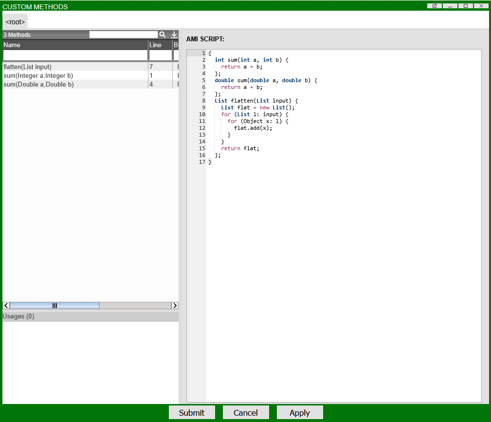
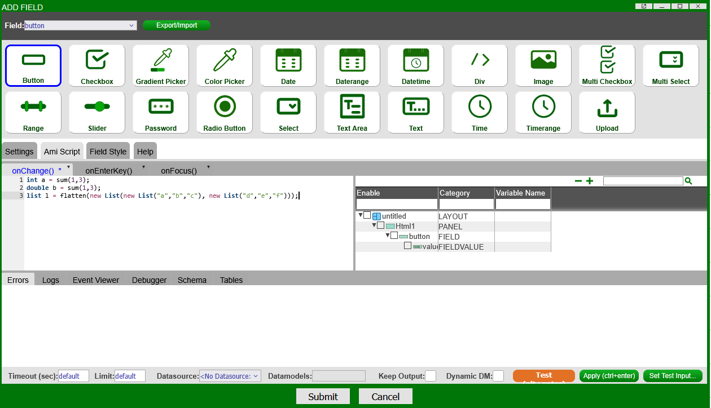
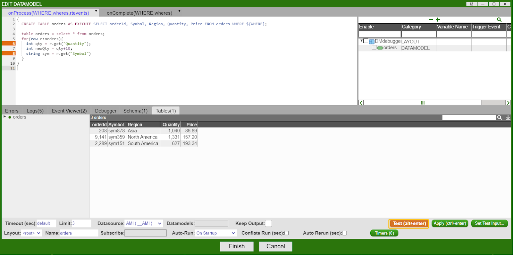
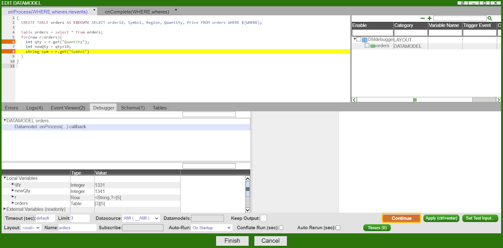

# Using AmiScript

The Web provides several useful tools for using AmiScript.

## Custom Methods

AMI allows for Custom Methods which can be defined once and used anywhere throughout a layout. 

To create a custom method, go to *Dashboard -> Custom Methods* then create your methods. See below for an example. 

!!! Note 
	  1. Each method must have a `;` after its definition. 
	  1. Methods can be overloaded -- the same method name can be used if it has a *different* input definition.
    1. AMIDB methods **cannot** be called from Web. They are distinct from one another. 


### Example 

```amiscript
{
  int sum(int a, int b) {
    return a + b;
  };
  double sum(double a, double b) {
    return a + b;
  };
  List flatten(List input) {
    List flat = new List();
    for (List l: input) {
      for (Object x: l) {
        flat.add(x);
      }
    }
    return flat;
  };
}
``` 

This custom method block declares three methods: 

1. `sum()` 

    - summing two integers

2. `sum()` 

    - an overloaded sum that takes two doubles

3. `flatten()` 

    - flattening a list 

Pasting them into AMI's Custom Methods window will look like this: 



Then, in any window that takes AmiScript, call the methods as you would any standard AmiScript method: 




## Debugging

Any portion of AmiScript can be debugged using breakpoints, see below for a step-by-step guide:

1. **Add a new breakpoint** by clicking on the line number of the line you would like to debug.  

1. **Enter Debug Mode** by pressing the "test" button.

	  

1. **Action** once your breakpoint has been hit, use the Debugger tab at the bottom of the screen to understand the state of your code, when done press "continue" to advance to the next breakpoint

	

## Embedding Python

### How to load Python Modules in AMI Script

To import python modules, place the import statements inside the python extern block.

By default AMI looks for Python Libraries in the lib/Lib directory of amione.

Alternatively, you can also set the JYTHONPATH environmental variable and AMI will load libraries from there.

``` amiscript
{
 CREATE TABLE _TABLE AS USE EXECUTE SELECT TableName, Broadcast, RefreshPeriodMs, SourceTableNames, PersistEngine, OnUndefColumn, DefinedBy FROM __TABLE WHERE ${WHERE};

  double n = 0;
  extern python {{
    import math
    n = math.pow(2,3)
  }};
  session.log(n);
}
```

### How to use Python in AMI Script

Below is an example of how you can pass in variables and tables and modify and return them:

``` amiscript
{
 CREATE TABLE inTable AS USE ds=AMI EXECUTE SELECT * FROM __TABLE;
 //INPUT VARIABLES
 String findEngine="TEXT";
 Table inTable=select * from inTable;
 //OUTPUT VARIABLES
 int foundCount;
 Table outTable=new Table("out","Name String");
 //Loop through each row of inTable and add TableName to outTable for records that have a PersistEngine equal to findEngine Variable
 //foundCount is incremented for each record added to outTable
 extern python{{
   foundCount = 0
   for row in inTable.getRows():
     if(row.get("PersistEngine") == "TEXT"):
       outTable.addRow(row.get("TableName"))
       foundCount+=1
 }};
 create table outTable=outTable;
 session.log("found: "+foundCount);
}
```

